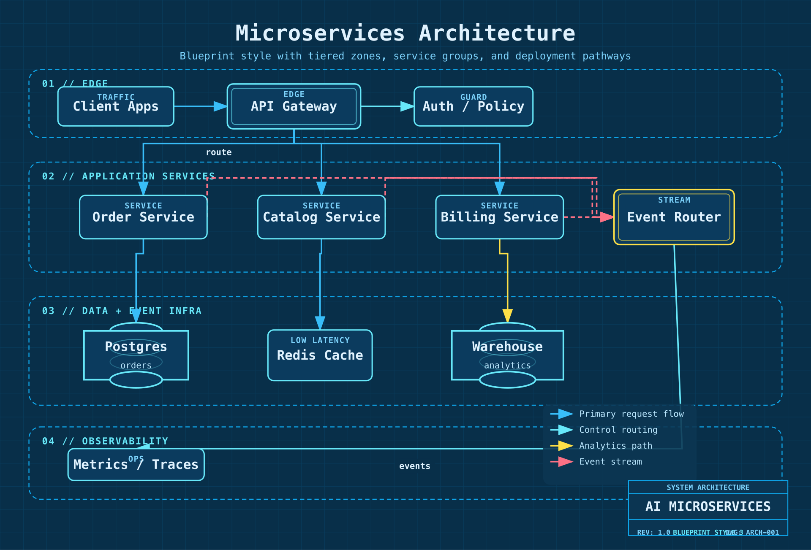
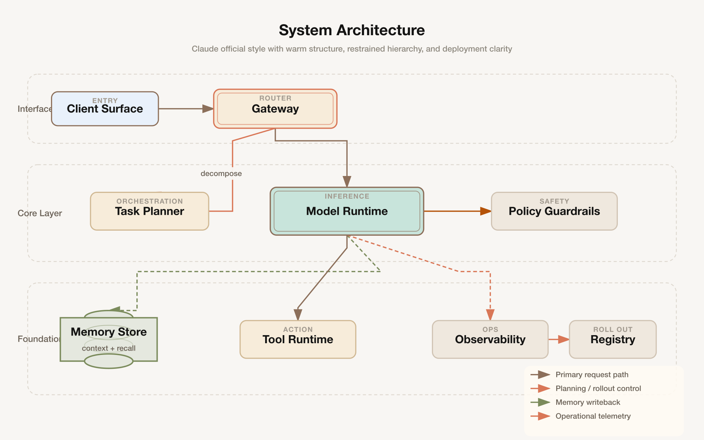

[English](README.md) | [Tiếng Việt](README.zh.md)

# fireworks-tech-graph

> **Không cần vẽ tay nữa.** Mô tả hệ thống của bạn bằng tiếng Anh hoặc tiếng Việt — có ngay biểu đồ kỹ thuật SVG + PNG sắc nét trong vài giây.

[](LICENSE)
[](https://claude.ai/code)
[]()
[]()
[]()

## Tổng quan

`fireworks-tech-graph` chuyển đổi mô tả ngôn ngữ tự nhiên thành các biểu đồ kỹ thuật định dạng SVG đẹp mắt, sau đó xuất ra file PNG độ phân giải cao thông qua `rsvg-convert`. Dự án tích hợp **7 phong cách thiết kế (styles)** và am hiểu sâu sắc các mô hình thiết kế (patterns) trong lĩnh vực AI/Agent (như RAG, Agentic Search, Mem0, Multi-Agent, luồng Tool Call), đồng thời hỗ trợ đầy đủ 14 loại biểu đồ UML.

```
Người dùng: "Vẽ sơ đồ kiến trúc Mem0, style dark"
  → Phân loại kỹ năng: Sơ đồ kiến trúc bộ nhớ, Style 2
  → Sinh SVG với các swimlane, cylinder, mũi tên ngữ nghĩa
  → Xuất ra PNG 1920px
  → Báo cáo kết quả: mem0-architecture.svg / mem0-architecture.png
```

---

## Hiển thị mẫu (Showcase)

> Tất cả các ảnh mẫu được xuất với chiều rộng 1920px (độ phân giải 2x retina) qua `rsvg-convert`. Định dạng PNG là không hao tổn (lossless) và là lựa chọn phù hợp nhất cho biểu đồ kỹ thuật — giúp các đường viền và chữ luôn sắc nét, không bị nhiễu hạt do nén như JPG.

### Style 1 — Flat Icon (Mặc định)
*Kiến trúc bộ nhớ Mem0 — nền trắng, mũi tên ngữ nghĩa, hệ thống bộ nhớ phân tầng*


### Style 2 — Dark Terminal
*Luồng thực thi Tool Call — nền tối, điểm nhấn neon, font chữ monospace*


### Style 3 — Blueprint (Bản vẽ kỹ thuật)
*Kiến trúc Microservices — nền xanh lam đậm, đường lưới grid, đường nét xanh cyan*


### Style 4 — Notion Clean
*Các loại bộ nhớ của Agent — nền trắng tối giản, chỉ sử dụng một màu nhấn*


### Style 5 — Glassmorphism (Kính mờ)
*Luồng cộng tác Multi-Agent — nền tối chuyển sắc gradient, thẻ card kính mờ frosted glass*


### Style 6 — Claude Official
*Sơ đồ kiến trúc hệ thống — nền màu kem ấm (#f8f6f3), sử dụng bảng màu thương hiệu của Anthropic, phong cách tinh tế chuyên nghiệp*


### Style 7 — OpenAI Official
*Luồng tích hợp API — nền trắng tinh khiết, bảng màu thương hiệu OpenAI, thiết kế hiện đại tối giản*


---

## Các mẫu prompt ổn định

Sử dụng các prompt mẫu sau để mô hình sinh ra kết quả tối ưu và ổn định nhất (đã qua kiểm thử regression):

### Style 1 — Flat Icon
```text
Draw a Mem0 memory architecture diagram in style 1 (Flat Icon).
Use four horizontal sections: Input Layer, Memory Manager, Storage Layer, Output / Retrieval.
Include User, AI App / Agent, LLM, mem0 Client, Memory Manager, Vector Store, Graph DB, Key-Value Store, History Store, Context Builder, Ranked Results, Personalized Response.
Use semantic arrows for read, write, control, and data flow. Keep the layout clean and product-doc friendly.
```

### Style 2 — Dark Terminal
```text
Draw a tool call flow diagram in style 2 (Dark Terminal).
Show User query, Retrieve chunks, Generate answer, Knowledge base, Agent, Terminal, Source documents, and Grounded answer.
Use terminal chrome, neon accents, monospace typography, and semantic arrows for retrieval, synthesis, and embedding update.
```

### Style 3 — Blueprint
```text
Draw a microservices architecture diagram in style 3 (Blueprint).
Create numbered engineering sections like 01 // EDGE, 02 // APPLICATION SERVICES, 03 // DATA + EVENT INFRA, 04 // OBSERVABILITY.
Include Client Apps, API Gateway, Auth / Policy, three services, Event Router, Postgres, Redis Cache, Warehouse, and Metrics / Traces.
Use blueprint grid, cyan strokes, and a bottom-right title block.
```

### Style 4 — Notion Clean
```text
Draw an agent memory types diagram in style 4 (Notion Clean).
Compare Sensory Memory, Working Memory, Episodic Memory, Semantic Memory, and Procedural Memory around a central Agent core.
Use a minimal white layout, neutral borders, one accent color for arrows, and short storage tags for each memory type.
```

### Style 5 — Glassmorphism
```text
Draw a multi-agent collaboration diagram in style 5 (Glassmorphism).
Use three sections: Mission Control, Specialist Agents, and Synthesis.
Include User brief, Coordinator Agent, Research Agent, Coding Agent, Review Agent, Shared Memory, Synthesis Engine, and Final response.
Use frosted cards, soft glow, and semantic arrows for delegation, shared memory writes, and synthesis output.
```

### Style 6 — Claude Official
```text
Draw a system architecture diagram in style 6 (Claude Official).
Use left-side layer labels: Interface Layer, Core Layer, Foundation Layer.
Include Client Surface, Gateway, Task Planner, Model Runtime, Policy Guardrails, Memory Store, Tool Runtime, Observability, and Registry.
Use warm cream background, restrained brand-like palette, generous whitespace, and a bottom-right legend.
```

### Style 7 — OpenAI Official
```text
Draw an API integration flow diagram in style 7 (OpenAI Official).
Use three sections: Entry, Model + Tools, and Delivery.
Include Application, OpenAI SDK Layer, Prompt Builder, Model Runtime, Tool Calls, Response Formatter, Observability, and Release Control.
Keep the look minimal, white, precise, and modern with clean green-accented arrows.
```

---

## Tính năng nổi bật

- **7 phong cách thiết kế (styles)** — từ tài liệu trắng tối giản đến phong cách tối neon, kính mờ hay phong cách thương hiệu chính thức.
- **Hệ thống style thực thi trực tiếp** — các quy định về phong cách được mã hóa trực tiếp trong mã nguồn của generator chứ không chỉ được mô tả trong markdown.
- **14 loại biểu đồ** — Hỗ trợ đầy đủ các sơ đồ UML (Class, Component, Deployment, Package, Composite Structure, Object, Use Case, Activity, State Machine, Sequence, Communication, Timing, Interaction Overview, ER Diagram) và các biểu đồ chuyên dụng cho AI/Agent.
- **Am hiểu nghiệp vụ AI/Agent** — Các mô hình thiết kế như RAG, Agentic Search, Mem0, Multi-Agent, luồng Tool Call được tích hợp sẵn.
- **Thư viện hình dạng ngữ nghĩa (shapes)** — LLM = hình chữ nhật viền đôi, Agent = hình lục giác, Vector Store = hình trụ tròn có vòng bên trong.
- **Hệ thống mũi tên ngữ nghĩa** — Màu sắc và kiểu đứt nét của đường nét để biểu đạt ý nghĩa rõ ràng (ghi vs đọc vs bất đồng bộ vs vòng lặp).
- **Thư viện icon sản phẩm** — hơn 40 sản phẩm đi kèm màu sắc thương hiệu: OpenAI, Anthropic, Pinecone, Weaviate, Kafka, PostgreSQL...
- **Phân chia swimlane** — tự động thêm nhãn phân chia layer cho các kiến trúc phức tạp.
- **Đầu ra SVG + PNG** — SVG phục vụ chỉnh sửa, PNG 1920px để nhúng trực tiếp.
- **Tương thích rsvg-convert** — SVG nội bộ thuần khiết, không gọi font ngoài, render ổn định.

---

## Cài đặt

```bash
npx skills add yizhiyanhua-ai/fireworks-tech-graph
```

Nguồn cài đặt qua `skills add` là kho chứa trên GitHub. Trang npm chỉ dùng để hiển thị thông tin và phân phối phiên bản:

```text
https://www.npmjs.com/package/@yizhiyanhua-ai/fireworks-tech-graph
```

Không đưa trực tiếp tên gói npm vào lệnh `skills add`, vì CLI sẽ biên dịch nguồn cài đặt theo đường dẫn GitHub hoặc đường dẫn thư mục cục bộ.

## Cập nhật

```bash
npx skills add yizhiyanhua-ai/fireworks-tech-graph --force -g -y
```

Để nâng cấp, chỉ cần chạy lại lệnh `add --force` để kéo phiên bản mới nhất.

Hoặc clone trực tiếp:

```bash
git clone https://github.com/yizhiyanhua-ai/fireworks-tech-graph.git ~/.claude/skills/fireworks-tech-graph
```

---

## Cài đặt dependencies

```bash
# macOS
brew install librsvg

# Ubuntu/Debian
sudo apt install librsvg2-bin

# Kiểm tra cài đặt
rsvg-convert --version
```

---

## Cách sử dụng

### Từ khóa kích hoạt

Kỹ năng này sẽ tự động được kích hoạt khi gặp các từ khóa sau:

```
Vẽ hình / Vẽ hộ tôi / Tạo biểu đồ / Vẽ sơ đồ / Sơ đồ kiến trúc / Sơ đồ luồng / Trực quan hóa / Xuất biểu đồ
generate diagram / draw diagram / create chart / visualize
```

### Sử dụng cơ bản

```
Vẽ sơ đồ luồng RAG
```

```
Tạo sơ đồ kiến trúc Agentic Search
```

### Chỉ định style

```
Vẽ sơ đồ kiến trúc microservices, style 2 (dark terminal)
```

```
Vẽ sơ đồ cộng tác multi-agent --style glassmorphism
```

### Chỉ định đường dẫn đầu ra

```
Vẽ sơ đồ kiến trúc Mem0, xuất ra ~/Desktop/
```

```
Tạo sơ đồ luồng tool call --output /tmp/diagrams/
```

---

## Các mẫu prompt theo kịch bản nghiệp vụ

### Hệ thống AI/Agent

```
So sánh Agentic RAG và RAG truyền thống bằng một bảng so sánh, dùng style Notion Clean
```
→ Bảng ma trận so sánh: RAG vs Agentic RAG về chiến lược truy xuất, vòng lặp agent, sử dụng tool, chi phí, độ trễ.

```
Tạo sơ đồ kiến trúc bộ nhớ Mem0 bao gồm vector store, graph DB, KV store và memory manager
```
→ Kiến trúc bộ nhớ phân chia swimlane: Input → Memory Manager → Các lớp lưu trữ → Truy xuất.

```
Vẽ sơ đồ Multi-Agent: Orchestrator điều phối 3 SubAgent (search / compute / code execution), tổng hợp kết quả tại Aggregator
```
→ Kiến trúc Agent, sử dụng các nút lục giác + lớp tool + tổng hợp kết quả.

```
Mô tả luồng thực thi Tool Call: LLM → Tool Selector → Execution → Parser → quay lại LLM
```
→ Sơ đồ luồng có vòng lặp quyết định, mô tả vòng đời thực thi của một tool call.

```
Vẽ 5 loại bộ nhớ của Agent: Sensory, Working, Episodic, Semantic, Procedural
```
→ Sơ đồ tư duy hoặc kiến trúc phân tầng biểu diễn các cấp độ bộ nhớ của Agent.

### Cơ sở hạ tầng & Kiến trúc Cloud

```
Vẽ kiến trúc microservices: Client → API Gateway → [User Service / Order Service / Payment Service] → PostgreSQL + Redis
```
→ Kiến trúc phân tầng ngang, mỗi cụm dịch vụ nằm trong một swimlane.

```
Tạo sơ đồ data pipeline: Kafka → Spark xử lý → ghi vào S3 → Athena truy vấn
```
→ Sơ đồ luồng dữ liệu (data flow) với các nhãn trên mũi tên (stream / batch / query).

```
Vẽ deployment Kubernetes: Ingress → Service → [Pod × 3] → ConfigMap + PersistentVolume
```
→ Sơ đồ kiến trúc, sử dụng hộp viền nét đứt cho Namespace, mũi tên nét liền cho luồng traffic.

### API & Luồng tuần tự (Sequence Flows)

```
Vẽ sơ đồ tuần tự luồng OAuth2 Authorization Code: User → Client → Auth Server → Resource Server
```
→ Sơ đồ tuần tự (Sequence diagram), có các lifeline dọc và các hộp kích hoạt (activation boxes).

```
Vẽ sơ đồ tuần tự gọi ChatGPT Plugin
```
→ Tuần tự: User → ChatGPT → Plugin Manifest → API → Chuỗi phản hồi.

### Sơ đồ quy trình & Quyết định

```
Vẽ sơ đồ luồng QA trước khi release ứng dụng AI: Code Review → Security Scan → Performance Test → Phê duyệt thủ công → Deploy
```
→ Sơ đồ luồng (flowchart) với các nút quyết định hình kim cương và các nhánh chạy song song.

```
Tạo bảng so sánh tính năng: RAG vs Fine-tuning vs Prompt Engineering
```
→ Bảng ma trận tính năng, so sánh về chi phí, độ trễ, độ chính xác và tính linh hoạt.

### Bản đồ khái niệm (Concept Maps)

```
Vẽ công nghệ stack của ứng dụng LLM: từ foundation model, SDK, app framework đến lớp deployment
```
→ Sơ đồ phân tầng hoặc sơ đồ tư duy đi từ lớp model đến lớp ứng dụng sản phẩm.

```
Vẽ bản đồ năng lực của AI Agent: Perception / Memory / Reasoning / Action / Learning
```
→ Sơ đồ tư duy dạng tỏa tròn với nút trung tâm "AI Agent" và 5 nhánh năng lực.

---

## 7 Phong cách thiết kế (Styles)

| # | Tên phong cách | Màu nền | Font chữ | Phù hợp nhất cho |
|---|------|-----------|------|----------|
| 1 | **Flat Icon** *(mặc định)* | `#ffffff` | Helvetica | Blog, slide thuyết trình, tài liệu |
| 2 | **Dark Terminal** | `#0f0f1a` | SF Mono / Fira Code | GitHub README, bài viết cho nhà phát triển |
| 3 | **Blueprint** | `#0a1628` | Courier New | Tài liệu kiến trúc, đặc tả kỹ thuật |
| 4 | **Notion Clean** | `#ffffff` | system-ui | Notion, Confluence, trang wiki nội bộ |
| 5 | **Glassmorphism** | `#0d1117` gradient | Inter | Trang giới thiệu sản phẩm, slide thuyết trình |
| 6 | **Claude Official** | `#f8f6f3` | system-ui | Biểu đồ phong cách Anthropic, thẩm mỹ ấm áp |
| 7 | **OpenAI Official** | `#ffffff` | system-ui | Biểu đồ phong cách OpenAI, thiết kế hiện đại |

Mỗi phong cách có một tệp tham khảo riêng trong thư mục `references/` chứa các thông số màu sắc chính xác, mẫu SVG và hướng dẫn cụ thể.
Trình tạo biểu đồ sẽ trực tiếp xử lý các trường cấu trúc tương ứng như `containers`, `nodes[].kind` ngữ nghĩa, `arrows[].flow` và các neo cổng (port anchors) để đảm bảo chất lượng biểu đồ sinh ra tiệm cận nhất với các mẫu vẽ tay.

Một số trường bổ sung hữu ích để tinh chỉnh giao diện:
- `style_overrides` để căn chỉnh lại tiêu đề hoặc màu sắc mà không cần khai báo lại toàn bộ style.
- `containers[].header_prefix` / `containers[].header_text` để tạo tiêu đề vùng có đánh số (ví dụ: `01 // EDGE` trong Style 3).
- `containers[].side_label` để tạo nhãn lớp ở phía bên trái (phổ biến trong Style 6).
- `window_controls`, `meta_left`, `meta_center`, `meta_right` để mô phỏng thanh tiêu đề trình duyệt/terminal chrome.
- `blueprint_title_block` để tạo khung tiêu đề bản vẽ kỹ thuật ở góc dưới bên phải trong Style 3.

### Hướng dẫn chọn Style

**Đối với biểu đồ UML:**
- **Class/Component/Package**: Style 1 (Flat Icon) hoặc Style 4 (Notion Clean) — cấu trúc rõ ràng, trực quan.
- **Sequence/Timing**: Style 2 (Dark Terminal) — font chữ monospace giúp căn chỉnh văn bản rất tốt.
- **State Machine/Activity**: Style 3 (Blueprint) — phong cách kỹ thuật bản vẽ rất hợp với sơ đồ luồng quy trình.
- **Use Case**: Style 1 (Flat Icon) — trực quan, nhiều màu sắc dễ tiếp cận.

**Đối với biểu đồ AI/Agent:**
- **RAG/Agentic Search**: Style 2 (Dark Terminal) hoặc Style 5 (Glassmorphism) — mang tính công nghệ hiện đại.
- **Memory Architecture**: Style 3 (Blueprint) — nhấn mạnh các tầng lưu trữ dữ liệu.
- **Multi-Agent**: Style 5 (Glassmorphism) — thẻ card mờ giúp phân định ranh giới hoạt động của các Agent rất tốt.

**Đối với Tài liệu:**
- **Tài liệu nội bộ**: Style 4 (Notion Clean) — tối giản, thích hợp nhúng vào Wiki.
- **Bài viết Blog**: Style 1 (Flat Icon) — sinh động, nhiều màu sắc thu hút.
- **GitHub README**: Style 2 (Dark Terminal) — phù hợp với giao diện tối (dark theme) của GitHub.
- **Thuyết trình**: Style 5 (Glassmorphism) hoặc Style 6 (Claude Official) — tinh tế, cao cấp.

**Theo Thương hiệu:**
- **Dự án phong cách Anthropic/Claude**: Style 6 (Claude Official) — nền kem ấm áp, màu sắc tinh tế của Anthropic.
- **Dự án phong cách OpenAI**: Style 7 (OpenAI Official) — nền trắng tinh khiết, tối giản hiện đại.

---

## Các loại biểu đồ được hỗ trợ

| Loại biểu đồ | Mô tả | Quy tắc bố cục cốt lõi |
|------|-------------|-----------------|
| **Kiến trúc** | Dịch vụ, thành phần, hạ tầng đám mây | Phân tầng ngang từ trên xuống dưới |
| **Luồng dữ liệu** | Đường đi của dữ liệu trong hệ thống | Đánh nhãn kiểu dữ liệu trên mọi mũi tên |
| **Sơ đồ luồng** | Các bước quy trình, rẽ nhánh quyết định | Hình kim cương = quyết định, đi từ trên xuống |
| **Kiến trúc Agent** | LLM + công cụ + bộ nhớ | Mô hình 5 lớp: Input/Agent/Memory/Tool/Output |
| **Kiến trúc bộ nhớ** | Bộ nhớ kiểu Mem0, MemGPT | Tách biệt luồng Đọc/Ghi, phân cấp bộ nhớ rõ ràng |
| **Tuần tự (Sequence)** | Chuỗi gọi API, tương tác theo thời gian | Lifeline dọc đại diện đối tượng, mũi tên ngang biểu diễn thông điệp |
| **So sánh** | Bảng ma trận so sánh các phương án | Cột = hệ thống, Dòng = thuộc tính so sánh |
| **Sơ đồ tư duy** | Bản đồ khái niệm, tỏa tròn | Nút trung tâm, các nhánh cong tỏa ra |

### Hỗ trợ biểu đồ UML (14 Loại)

| Loại UML | Mô tả | Style khuyến nghị |
|----------|-------------|------------|
| **Sơ đồ lớp (Class)** | Lớp, thuộc tính, phương thức, mối quan hệ | Style 1, 4 |
| **Sơ đồ thành phần (Component)** | Các thành phần phần mềm và sự phụ thuộc | Style 1, 3 |
| **Sơ đồ triển khai (Deployment)** | Các nút phần cứng và triển khai phần mềm | Style 3 |
| **Sơ đồ gói (Package)** | Tổ chức các gói và quan hệ phụ thuộc | Style 1, 4 |
| **Sơ đồ cấu trúc hỗn hợp** | Cấu trúc bên trong lớp hoặc thành phần | Style 1, 3 |
| **Sơ đồ đối tượng (Object)** | Các thực thể đối tượng cụ thể và mối quan hệ | Style 1, 4 |
| **Sơ đồ ca sử dụng (Use Case)** | Tác nhân, ca sử dụng, ranh giới hệ thống | Style 1 |
| **Sơ đồ hoạt động (Activity)** | Luồng công việc, xử lý song song | Style 3 |
| **Sơ đồ trạng thái (State)** | Các trạng thái của thực thể và sự kiện chuyển đổi | Style 2, 3 |
| **Sơ đồ tuần tự (Sequence)** | Trao đổi thông điệp theo thời gian | Style 2 |
| **Sơ đồ giao tiếp (Communication)** | Tương tác giữa các đối tượng và thông điệp | Style 1, 2 |
| **Sơ đồ thời gian (Timing)** | Thay đổi trạng thái theo trục thời gian | Style 2 |
| **Tổng quan tương tác** | Sơ đồ luồng kết hợp các đoạn kịch bản | Style 1, 2 |
| **Sơ đồ ER (Entity-Relationship)** | Mô hình thực thể quan hệ cơ sở dữ liệu | Style 1, 3 |

---

## Kiến thức nghiệp vụ AI/Agent tích hợp sẵn

Kỹ năng hiểu rõ các mô hình kiến trúc phổ biến để tự động sinh bố cục hợp lý:

```
RAG Pipeline         → Query → Embed → VectorSearch → Retrieve → LLM → Response
Agentic RAG          → Thêm vòng lặp Agent + sử dụng Tool ở giữa Query và LLM
Agentic Search       → Query → Planner → [Search Tool / Calculator / Code] → Synthesizer
Bộ nhớ Mem0          → Input → Memory Manager → [Ghi: VectorDB + GraphDB] / [Đọc: Rank] → Context
Loại bộ nhớ Agent    → Cảm giác (Sensory) → Làm việc (Working) → Từng phần (Episodic) → Ngữ nghĩa (Semantic) → Thủ tục (Procedural)
Multi-Agent          → Orchestrator → [Các SubAgent A / B / C] → Aggregator → Output
Luồng gọi Tool       → LLM → Tool Selector → Tool Execution → Result Parser → LLM (Vòng lặp)
```

---

## Từ vựng hình dạng ngữ nghĩa (Shape Vocabulary)

Các hình dạng biểu thị ý nghĩa đồng nhất trên mọi style:

| Khái niệm | Hình dạng | Ghi chú |
|---------|-------|-------|
| User / Con người | Hình tròn + body path | Stick figure hoặc hình đại diện avatar |
| LLM / Model | Hình chữ nhật bo tròn góc, viền đôi, có ký hiệu ⚡ | Thể hiện màu nhấn |
| Agent / Điều phối | Hình lục giác hoặc chữ nhật viền đôi | Biểu thị thành phần điều khiển cốt lõi |
| Bộ nhớ (ngắn hạn) | Hình chữ nhật bo tròn góc, viền nét đứt | Đứt nét biểu thị tính tạm thời |
| Bộ nhớ (dài hạn) | Hình trụ tròn (database) | Nét liền biểu thị tính bền vững |
| Vector Store | Hình trụ tròn có đường lưới bên trong | Thêm 3 đường kẻ ngang |
| Graph DB | Cụm 3 hình tròn chồng nhẹ lên nhau | |
| Tool / Function | Hình chữ nhật kèm biểu tượng bánh răng ⚙ hoặc cờ lê | |
| API / Gateway | Hình lục giác viền đơn | |
| Queue / Stream | Ống trụ ngang (dạng đường ống) | |
| File / Tài liệu | Hình chữ nhật gấp góc | |
| Browser / UI | Hình chữ nhật có thanh 3 nút tiêu đề | |
| Quyết định | Hình kim cương | Chỉ dùng trong sơ đồ luồng (flowchart) |
| Quy trình / Bước | Hình chữ nhật bo tròn góc | Hộp tiêu chuẩn |
| Dịch vụ bên ngoài | Hình chữ nhật viền nét đứt hoặc có biểu tượng đám mây | |
| Dữ liệu / Artifact | Hình bình hành | Đầu vào/đầu ra trong sơ đồ luồng |

---

## Ngữ nghĩa mũi tên (Arrow Semantics)

Cần gán ý nghĩa cụ thể cho từng đường nối mũi tên, không chỉ dùng màu sắc ngẫu nhiên:

| Loại luồng | Màu sắc | Đường nét | Nét đứt | Ý nghĩa |
|-----------|-------|--------|------|---------|
| Luồng dữ liệu chính | Xanh lam `#2563eb` | 2px solid | không | Đường yêu cầu/phản hồi chính |
| Điều khiển / Kích hoạt | Cam `#ea580c` | 1.5px solid | không | Một hệ thống kích hoạt hệ thống khác |
| Đọc bộ nhớ | Xanh lá `#059669` | 1.5px solid | không | Lấy dữ liệu từ bộ lưu trữ |
| Ghi bộ nhớ | Xanh lá `#059669` | 1.5px | `5,3` | Thao tác ghi/lưu trữ dữ liệu |
| Bất đồng bộ / Sự kiện | Xám `#6b7280` | 1.5px | `4,2` | Không nghẽn (non-blocking) |
| Embedding / Chuyển đổi | Tím `#7c3aed` | 1px solid | không | Chuyển đổi cấu trúc dữ liệu |
| Phản hồi / Vòng lặp | Tím `#7c3aed` | 1.5px cong | không | Vòng lặp tư duy lặp đi lặp lại |

*Luôn thêm chú giải (legend) khi sơ đồ sử dụng từ 2 loại mũi tên trở lên.*

---

## Quy tắc bố cục & Xác thực

**Khoảng cách**:
- Các nút cùng tầng: cách nhau tối thiểu 80px ngang, cách biệt 120px dọc giữa các tầng.
- Lề canvas: tối thiểu 40px, cách khoảng 60px từ mép nút đến ranh giới.
- Căn chỉnh lưới 8px: chụp các tọa độ x, y vào bội số của 8px hoặc các mốc 120px.

**Nhãn trên mũi tên** (QUAN TRỌNG):
- BẮT BUỘC có hộp nền: `<rect fill="canvas_bg" opacity="0.95"/>` với padding 4px ngang, 2px dọc.
- Đặt ở điểm giữa mũi tên, độ dài nhãn ≤3 từ, căn lệch 15-20px nếu có nhiều mũi tên hội tụ để tránh chồng đè.
- Giữ khoảng cách an toàn tối thiểu 10px với các nút xung quanh.

**Định tuyến mũi tên (Routing)**:
- Ưu tiên đường vuông góc (orthogonal - dạng chữ L) để giảm thiểu giao cắt chéo.
- Neo mũi tên vào mép cạnh của nút, không neo vào tâm hình học.
- Định tuyến đi vòng qua các cụm nút dày đặc; sử dụng các độ lệch tọa độ y khác nhau cho các mũi tên chạy song song.

**Tránh chồng lấp đường nối** (QUAN TRỌNG):
Khi hai mũi tên bắt buộc phải cắt chéo nhau, BẮT BUỘC sử dụng cung nhảy qua (jump-over arc) để tránh nhầm lẫn luồng:
- Điểm giao cắt: thêm một cung bán nguyệt nhỏ (bán kính 5px, màu nét vẽ trùng màu mũi tên, fill="none") "nhảy qua" đường nối bên dưới.
- Bố trí SVG: vẽ cung màu trắng hoặc trùng màu nền làm lớp đệm dưới, sau đó vẽ cung thực của mũi tên đè lên trên.
- Nhiều giao cắt: điều chỉnh bán kính cung nhảy (5px, 7px, 9px) để chúng không đè lên nhau.
- Không để hai mũi tên cắt nhau trực tiếp bằng các đường thẳng cắt chéo thô thiển.

**Danh sách xác thực** (Kiểm tra trước khi hoàn tất):
1. **Tránh va chạm mũi tên-thành phần**: Mũi tên KHÔNG ĐƯỢC đi xuyên qua nội dung của các nút khác (phải định tuyến vuông góc đi vòng qua).
2. **Tránh tràn chữ (Text Overflow)**: Toàn bộ nhãn chữ phải nằm trọn trong hình dạng, có lề đệm 8px (ước tính: `độ dài chữ × 7px ≤ chiều rộng hình dạng - 16px`).
3. **Căn chỉnh Mũi tên-Văn bản**: Điểm đầu và cuối mũi tên phải tiếp xúc đúng cạnh hình dạng (không lơ lửng); tất cả nhãn chữ trên mũi tên phải có hộp nền che.
4. **Quy tắc thùng chứa (Container)**: Khuyến khích mũi tên đi vào/ra vùng chứa thông qua các khoảng trống giữa các nút, tránh đi cắt ngang qua thân các nút nằm ở biên.

---

## Hướng dẫn kỹ thuật SVG

- ViewBox: Mặc định `0 0 960 600`, nếu sơ đồ cao dùng `0 0 960 800`, nếu rộng dùng `0 0 1200 600`.
- Font chữ: nhúng trực tiếp qua thẻ `<style>font-family: ...</style>` — tuyệt đối không dùng `@import` font bên ngoài (sẽ làm lỗi `rsvg-convert`).
- Thẻ `<defs>`: chứa các định nghĩa marker đầu mũi tên, gradient màu, bộ lọc filter hiệu ứng bóng đổ, clip-path.
- Cỡ chữ: tối thiểu 12px, nhãn chính dùng 13-14px, nhãn phụ dùng 11px, tiêu đề dùng 16-18px.
- Mũi tên: Sử dụng `<marker>` làm đầu mũi tên với thuộc tính `markerEnd`, kích thước tiêu chuẩn `markerWidth="10" markerHeight="7"`.
- Hiệu ứng đổ bóng: Sử dụng bộ lọc `<feDropShadow>` trong `<filter>` một cách tiết chế, chỉ áp dụng cho các nút quan trọng.
- Đường nối cong: Sử dụng đường cong bezier bậc 3 `M x1,y1 C cx1,cy1 cx2,cy2 x2,y2` cho các vòng lặp phản hồi.

---

## Cách sinh SVG ổn định không lỗi cú pháp

**BẮT BUỘC: Sử dụng phương pháp danh sách Python (Python List Method)**:
```python
python3 << 'EOF'
lines = []
lines.append('<svg xmlns="http://www.w3.org/2000/svg" viewBox="0 0 960 700">')
lines.append('  <defs>')
# ... ghi từng dòng độc lập
lines.append('</svg>')

with open('/path/to/output.svg', 'w') as f:
    f.write('\n'.join(lines))
print("SVG generated successfully")
EOF
```

**Tại sao bắt buộc**: Tránh việc nội dung file bị cắt cụt do độ dài ký tự trong terminal, dễ debug, đảm bảo file XML hợp lệ.

**Kiểm tra tính hợp lệ** (chạy sau khi sinh file):
```bash
rsvg-convert file.svg -o /tmp/test.png 2>&1 && echo "✓ Hợp lệ" && rm /tmp/test.png
```

---

## Hướng dẫn khắc phục lỗi thường gặp

| Triệu chứng | Nguyên nhân | Cách khắc phục |
|---------|-------|-----|
| Ảnh PNG bị đen toàn bộ | Sử dụng `@import url()` font ngoài làm `rsvg-convert` bị timeout hoặc lỗi | Xóa `@import`, chuyển sang dùng font stack hệ thống như `system-ui, sans-serif` |
| Không xuất được PNG | Chưa cài đặt `rsvg-convert` | Cài đặt bằng `brew install librsvg` (macOS) hoặc `apt install librsvg2-bin` |
| Sơ đồ bị cắt cụt ở biên dưới | Chiều cao ViewBox quá nhỏ | Tăng giá trị chiều cao trong thuộc tính `viewBox` (ví dụ từ 600 lên 800) |
| Chữ bị tràn ra ngoài khung | Nhãn quá dài | Thêm `text-anchor="middle"`, sử dụng `<clipPath>` hoặc rút ngắn nhãn chữ |
| Icon không hiển thị | Sử dụng link ảnh CDN ngoài | Thay thế bằng các path vẽ SVG inline được liệt kê trong `references/icons.md` |

---

## License

MIT © 2025 các nhà đóng góp phát triển fireworks-tech-graph
