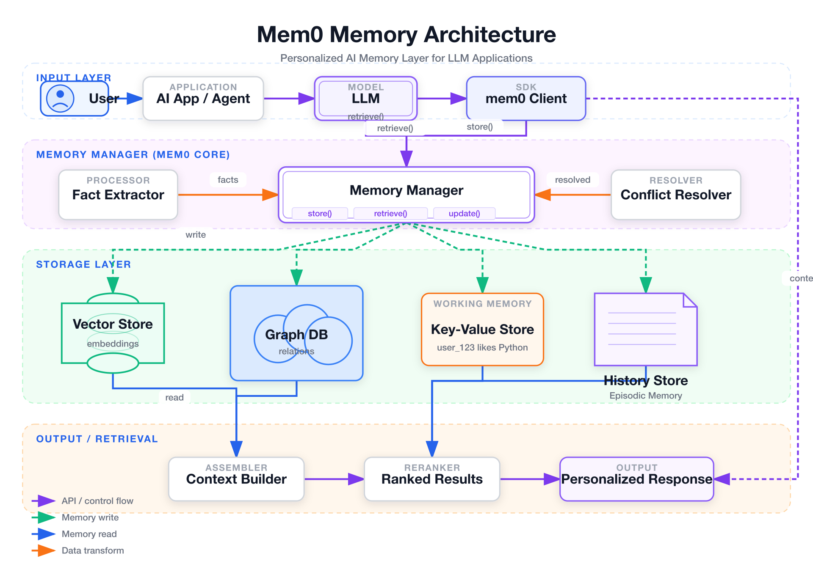
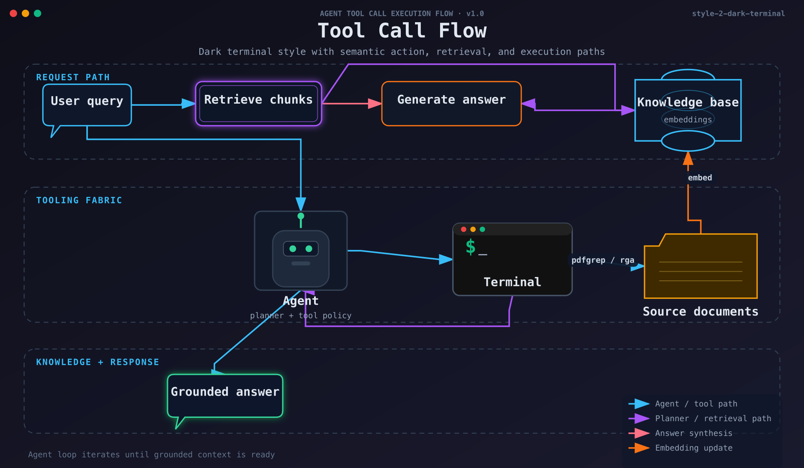
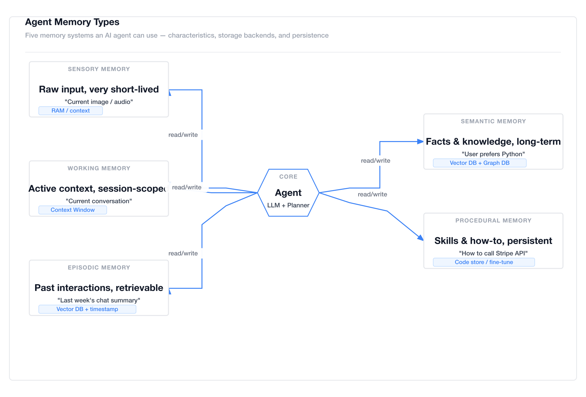
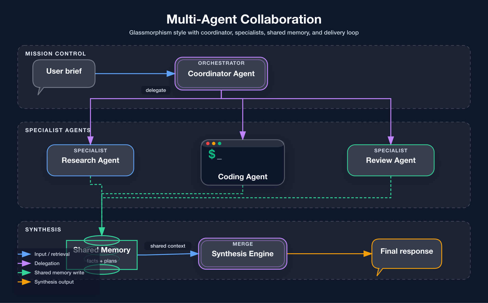
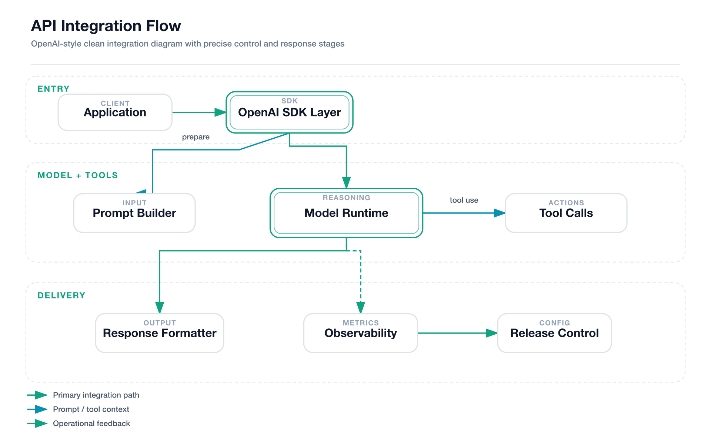

[English](README.md) | [Tiếng Trung](README.zh.md)

# fireworks-tech-graph

> **Ngừng vẽ sơ đồ bằng tay.** Mô tả hệ thống của bạn bằng tiếng Việt, tiếng Anh hoặc tiếng Trung — nhận ngay sơ đồ kỹ thuật dạng SVG + PNG sẵn sàng xuất bản trong vài giây.

[](LICENSE)
[](https://claude.ai/code)
[]()
[]()
[]()

---

## Tổng quan

`fireworks-tech-graph` chuyển đổi các mô tả bằng ngôn ngữ tự nhiên thành sơ đồ SVG đẹp mắt, sau đó xuất chúng dưới dạng PNG độ phân giải cao thông qua `rsvg-convert`. Nó đi kèm với **7 style trực quan** và kiến thức chuyên sâu về các mẫu thiết kế miền AI/Agent (RAG, Agentic Search, Mem0, Multi-Agent, luồng gọi công cụ), cùng hỗ trợ đầy đủ cho tất cả 14 loại sơ đồ UML.

```
User: "Vẽ sơ đồ kiến trúc bộ nhớ Mem0, style dark"
  → Công cụ phân loại: Sơ đồ kiến trúc bộ nhớ, Style 2 (Dark Terminal)
  → Sinh mã SVG có làn bơi (swim lanes), hình trụ, mũi tên ngữ nghĩa
  → Xuất ra ảnh PNG 1920px
  → Báo cáo: mem0-architecture.svg / mem0-architecture.png
```

---

## Trưng bày mẫu

> Tất cả các mẫu được xuất ra với chiều rộng 1920px (2× retina) qua `rsvg-convert`. Định dạng PNG không bị nén mất dữ liệu là lựa chọn phù hợp cho sơ đồ kỹ thuật — giữ cho các cạnh sắc nét, không có hạt nhiễu nén JPEG trên chữ/đường vẽ.

### Style 1 — Flat Icon (mặc định)
*Kiến trúc bộ nhớ Mem0 — nền trắng, mũi tên ngữ nghĩa, hệ thống bộ nhớ phân tầng*


### Style 2 — Dark Terminal
*Luồng gọi công cụ (Tool Call Flow) — nền tối, màu nhấn neon, phông chữ monospace*


### Style 3 — Blueprint
*Kiến trúc Microservices — nền xanh lam đậm, các đường lưới, nét vẽ màu lục lam*


### Style 4 — Notion Clean
*Các loại bộ nhớ của Agent — nền trắng tối giản, chỉ một màu nhấn duy nhất*


### Style 5 — Glassmorphism
*Cộng tác Multi-Agent — nền gradient tối, các thẻ dạng kính mờ*


### Style 6 — Claude Official
*Kiến trúc hệ thống — nền màu kem ấm (#f8f6f3), màu thương hiệu Anthropic, khoảng trắng thoáng đãng, thẩm mỹ chuyên nghiệp*


### Style 7 — OpenAI Official
*Luồng tích hợp API — nền trắng tinh, bảng màu thương hiệu OpenAI, thiết kế tối giản hiện đại*


---

## Công thức Prompt ổn định

Sử dụng các prompt mẫu như bên dưới khi bạn muốn mô hình bám sát các đầu ra đã được kiểm thử ổn định nhất của dự án:

### Style 1 — Flat Icon
```text
Vẽ sơ đồ kiến trúc bộ nhớ Mem0 bằng style 1 (Flat Icon).
Sử dụng 4 phân phần nằm ngang: Lớp Đầu vào (Input Layer), Quản lý Bộ nhớ (Memory Manager), Lớp Lưu trữ (Storage Layer), Đầu ra / Truy xuất (Output / Retrieval).
Bao gồm Người dùng (User), AI App / Agent, LLM, mem0 Client, Quản lý Bộ nhớ, Vector Store, Graph DB, Key-Value Store, History Store, Context Builder, Kết quả được xếp hạng (Ranked Results), Phản hồi cá nhân hóa (Personalized Response).
Sử dụng mũi tên ngữ nghĩa cho các luồng đọc, ghi, điều khiển và dữ liệu. Giữ bố cục sạch sẽ và thân thiện với tài liệu sản phẩm.
```

### Style 2 — Dark Terminal
```text
Vẽ sơ đồ luồng gọi công cụ bằng style 2 (Dark Terminal).
Hiển thị Truy vấn người dùng (User query), Truy xuất phân đoạn (Retrieve chunks), Sinh câu trả lời (Generate answer), Cơ sở tri thức (Knowledge base), Agent, Terminal, Tài liệu nguồn (Source documents), và Câu trả lời có căn cứ (Grounded answer).
Sử dụng giao diện cửa sổ terminal, màu nhấn neon, kiểu chữ monospace và mũi tên ngữ nghĩa cho các thao tác truy xuất, tổng hợp và cập nhật embedding.
```

### Style 3 — Blueprint
```text
Vẽ sơ đồ kiến trúc microservices bằng style 3 (Blueprint).
Tạo các phân phần kỹ thuật được đánh số như 01 // EDGE, 02 // APPLICATION SERVICES, 03 // DATA + EVENT INFRA, 04 // OBSERVABILITY.
Bao gồm Client Apps, API Gateway, Auth / Policy, ba dịch vụ, Event Router, Postgres, Redis Cache, Warehouse, và Metrics / Traces.
Sử dụng lưới blueprint, nét vẽ màu xanh lục lam và hộp tiêu đề ở góc dưới bên phải.
```

### Style 4 — Notion Clean
```text
Vẽ sơ đồ các loại bộ nhớ của agent bằng style 4 (Notion Clean).
So sánh Bộ nhớ giác quan (Sensory Memory), Bộ nhớ làm việc (Working Memory), Bộ nhớ sự kiện (Episodic Memory), Bộ nhớ ngữ nghĩa (Semantic Memory) và Bộ nhớ quy trình (Procedural Memory) xung quanh lõi Agent trung tâm.
Sử dụng bố cục tối giản màu trắng, viền trung tính, một màu nhấn duy nhất cho các mũi tên và nhãn lưu trữ ngắn cho mỗi loại bộ nhớ.
```

### Style 5 — Glassmorphism
```text
Vẽ sơ đồ cộng tác multi-agent bằng style 5 (Glassmorphism).
Sử dụng ba phân phần: Trung tâm điều phối (Mission Control), Agent chuyên trách (Specialist Agents) và Tổng hợp (Synthesis).
Bao gồm Tóm tắt yêu cầu (User brief), Agent điều phối (Coordinator Agent), Agent nghiên cứu (Research Agent), Agent viết code (Coding Agent), Agent soát lỗi (Review Agent), Bộ nhớ dùng chung (Shared Memory), Công cụ tổng hợp (Synthesis Engine), và Phản hồi cuối cùng (Final response).
Sử dụng thẻ kính mờ, hiệu ứng phát sáng nhẹ và mũi tên ngữ nghĩa cho các luồng phân quyền, ghi bộ nhớ chung và đầu ra tổng hợp.
```

### Style 6 — Claude Official
```text
Vẽ sơ đồ kiến trúc hệ thống bằng style 6 (Claude Official).
Sử dụng nhãn lớp ở bên trái: Lớp giao diện (Interface Layer), Lớp lõi (Core Layer), Lớp nền tảng (Foundation Layer).
Bao gồm Client Surface, Gateway, Task Planner, Model Runtime, Policy Guardrails, Memory Store, Tool Runtime, Observability, và Registry.
Sử dụng nền màu kem ấm, bảng màu thương hiệu tiết chế, nhiều khoảng trắng và phần chú giải ở góc dưới bên phải.
```

### Style 7 — OpenAI Official
```text
Vẽ sơ đồ luồng tích hợp API bằng style 7 (OpenAI Official).
Sử dụng ba phân phần: Đầu vào (Entry), Mô hình + Công cụ (Model + Tools), và Phân phối (Delivery).
Bao gồm Application, OpenAI SDK Layer, Prompt Builder, Model Runtime, Tool Calls, Response Formatter, Observability, và Release Control.
Giữ giao diện tối giản, màu trắng tinh, chính xác và hiện đại với các mũi tên màu xanh lá cây làm điểm nhấn.
```

---

## Tính năng

- **7 style trực quan** — từ tài liệu giấy trắng sạch sẽ, đến neon tối, kính mờ hay các phong cách thương hiệu chính thức
- **Hệ thống style thực thi được** — các hướng dẫn style được mã hóa trực tiếp vào bộ sinh, không chỉ được ghi chép trong tài liệu markdown
- **14 loại sơ đồ** — Hỗ trợ đầy đủ các loại sơ đồ UML (Lớp, Thành phần, Triển khai, Gói, Cấu trúc Composite, Đối tượng, Ca sử dụng, Hoạt động, Trạng thái, Tuần tự, Giao tiếp, Định thời, Tổng quan Tương tác, ER Diagram) cộng với các sơ đồ miền AI/Agent
- **Mẫu thiết kế miền AI/Agent** — tích hợp sẵn RAG, Agentic Search, Mem0, Multi-Agent, Tool Call và nhiều mẫu khác
- **Từ vựng hình dạng ngữ nghĩa** — LLM = hình chữ nhật viền kép, Agent = hình lục giác, Vector Store = hình trụ có các vòng tròn đồng tâm
- **Hệ thống mũi tên ngữ nghĩa** — màu sắc + kiểu nét đứt mã hóa ý nghĩa rõ ràng (ghi vs đọc vs bất đồng bộ vs vòng lặp)
- **Biểu tượng sản phẩm** — hơn 40 biểu tượng sản phẩm kèm màu thương hiệu: OpenAI, Anthropic, Pinecone, Weaviate, Kafka, PostgreSQL…
- **Nhóm làn bơi (Swim lanes)** — tự động gắn nhãn phân lớp cho các kiến trúc phức tạp
- **Đầu ra SVG + PNG** — SVG để chỉnh sửa, PNG 1920px để nhúng trực tiếp
- **Tương thích rsvg-convert** — không tải phông chữ bên ngoài, nhúng trực tiếp mã phông chữ vào SVG

---

## Cài đặt

```bash
npx skills add yizhiyanhua-ai/fireworks-tech-graph
```

Kỹ năng này được cài đặt trực tiếp từ kho lưu trữ GitHub. Trang gói npm là trang phân phối/gói công khai:

```text
https://www.npmjs.com/package/@yizhiyanhua-ai/fireworks-tech-graph
```

Không sử dụng tên gói npm với lệnh `skills add`, vì CLI phân giải nguồn cài đặt dưới dạng GitHub hoặc đường dẫn local.

## Cập nhật

```bash
npx skills add yizhiyanhua-ai/fireworks-tech-graph --force -g -y
```

Chạy lại lệnh `add --force` để lấy phiên bản mới nhất của kỹ năng này.

Hoặc clone trực tiếp:

```bash
git clone https://github.com/yizhiyanhua-ai/fireworks-tech-graph.git .claude/skills/fireworks-tech-graph
```

---

## Yêu cầu hệ thống

```bash
# macOS
brew install librsvg

# Ubuntu/Debian
sudo apt install librsvg2-bin

# Kiểm tra xác nhận
rsvg-convert --version
```

---

## Tại sao không phải là Mermaid hay draw.io?

| Tính năng | Mermaid | draw.io | **fireworks-tech-graph** |
|---|---------|---------|--------------------------|
| Nhận đầu vào ngôn ngữ tự nhiên | ✗ | ✗ | ✅ |
| Hỗ trợ các mẫu AI/Agent | ✗ | ✗ | ✅ |
| Nhiều style trực quan có sẵn | ✗ | Thủ công | ✅ 7 style có sẵn |
| Tự động xuất PNG chất lượng cao | ✗ | Thủ công | ✅ Tự động 1920px |
| Màu sắc mũi tên theo ngữ nghĩa | ✗ | Thủ công | ✅ Tự động |
| Không cần công cụ trực tuyến | ✅ | ✗ | ✅ |

Mermaid rất tuyệt vời để nhúng sơ đồ nhanh vào tài liệu markdown. draw.io rất tuyệt để chỉnh sửa thủ công. `fireworks-tech-graph` được tối ưu hóa cho việc **mô tả một hệ thống và nhận ngay sơ đồ đẹp mắt**, không cần viết cú pháp DSL phức tạp hay click chỉnh sửa trên giao diện đồ họa.

---

## Cách sử dụng

### Từ khóa kích hoạt

Kỹ năng tự động kích hoạt khi có:

```
generate diagram / draw diagram / vẽ sơ đồ / vẽ hình / tạo biểu đồ
architecture diagram / sơ đồ kiến trúc / flowchart / sơ đồ luồng / sơ đồ tuần tự
```

### Cách dùng cơ bản

```
Vẽ lưu đồ cho đường ống RAG (RAG pipeline flowchart)
```

```
Tạo sơ đồ kiến trúc Agentic Search
```

### Chỉ định style

```
Vẽ sơ đồ kiến trúc microservices bằng style 2 (dark terminal)
```

```
Vẽ sơ đồ cộng tác multi-agent --style glassmorphism
```

### Chỉ định đường dẫn đầu ra

```
Tạo sơ đồ kiến trúc Mem0, xuất ra ~/Desktop/
```

```
Tạo sơ đồ luồng gọi công cụ --output /tmp/diagrams/
```

---

## Prompt ví dụ theo kịch bản

### Hệ thống AI/Agent

```
So sánh Agentic RAG với RAG tiêu chuẩn trong một ma trận so sánh, style Notion clean
```
→ Ma trận so sánh: RAG vs Agentic RAG, bao gồm chiến lược truy xuất, vòng lặp agent, sử dụng công cụ

```
Tạo sơ đồ kiến trúc bộ nhớ Mem0 với vector store, graph DB, KV store, và bộ quản lý bộ nhớ
```
→ Sơ đồ kiến trúc bộ nhớ với các làn bơi: Input → Memory Manager → Các tầng lưu trữ → Retrieval

```
Vẽ sơ đồ Multi-Agent: Điều phối viên (Orchestrator) gửi việc đến 3 SubAgent (tìm kiếm / tính toán / chạy code), tổng hợp kết quả
```
→ Kiến trúc Agent với hình lục giác, các lớp công cụ và tổng hợp kết quả

```
Trực quan hóa luồng gọi công cụ: LLM → Trình chọn công cụ → Thực thi → Parser → quay lại LLM
```
→ Lưu đồ với các nút quyết định hình thoi thể hiện vòng lặp gọi công cụ

```
Vẽ sơ đồ 5 loại bộ nhớ của agent: Giác quan, Làm việc, Sự kiện, Ngữ nghĩa, Quy trình
```
→ Sơ đồ phân tầng hoặc sơ đồ tư duy thể hiện các cấp độ bộ nhớ từ giác quan đến quy trình

### Cơ sở hạ tầng & Đám mây

```
Vẽ sơ đồ kiến trúc microservices: Client → API Gateway → [User Service / Order Service / Payment Service] → PostgreSQL + Redis
```
→ Sơ đồ kiến trúc với các lớp nằm ngang, các làn bơi cho mỗi cụm dịch vụ

```
Tạo sơ đồ luồng dữ liệu: Kafka → Xử lý Spark → ghi vào S3 → truy vấn Athena
```
→ Sơ đồ luồng dữ liệu với các mũi tên được gắn nhãn (stream / batch / query)

```
Vẽ sơ đồ triển khai Kubernetes: Ingress → Service → [Pod × 3] → ConfigMap + PersistentVolume
```
→ Sơ đồ kiến trúc với các nét đứt container cho mỗi namespace, mũi tên nét liền thể hiện luồng lưu lượng truy cập

### API & Luồng tuần tự

```
Vẽ sơ đồ tuần tự luồng mã xác thực OAuth2: User → Client → Auth Server → Resource Server
```
→ Sơ đồ tuần tự với các lifeline dọc và hộp kích hoạt hoạt động

```
Vẽ sơ đồ tuần tự gọi ChatGPT Plugin
```
→ Sơ đồ tuần tự: User → ChatGPT → Plugin Manifest → API → Chuỗi phản hồi

### Quy trình & Quyết định

```
Vẽ lưu đồ QA trước khi phát hành ứng dụng AI: Review Code → Quét bảo mật → Kiểm thử hiệu năng → Phê duyệt thủ công → Triển khai
```
→ Lưu đồ với các nút quyết định hình thoi và các nhánh chạy song song

```
Tạo ma trận so sánh tính năng: RAG vs Fine-tuning vs Prompt Engineering
```
→ Ma trận so sánh với các ô tích/không tích thể hiện chi phí, độ trễ, độ chính xác, tính linh hoạt

### Sơ đồ khái niệm

```
Trực quan hóa tech stack của ứng dụng LLM: từ mô hình nền tảng đến SDK đến app framework đến triển khai
```
→ Sơ đồ kiến trúc phân tầng hoặc sơ đồ tư duy từ lớp mô hình đến lớp sản phẩm

```
Vẽ sơ đồ năng lực của AI Agent: Nhận thức / Bộ nhớ / Suy luận / Hành động / Học hỏi
```
→ Sơ đồ tư duy với nút trung tâm "AI Agent" và 5 nhánh tỏa ra xung quanh

---

## Các style

| # | Tên | Nền | Phông chữ | Tốt nhất cho |
|---|------|-----------|------|----------|
| 1 | **Flat Icon** *(mặc định)* | `#ffffff` | Helvetica | Blog, slide thuyết trình, tài liệu |
| 2 | **Dark Terminal** | `#0f0f1a` | SF Mono / Fira Code | README trên GitHub, bài viết kỹ thuật |
| 3 | **Blueprint** | `#0a1628` | Courier New | Tài liệu kiến trúc, kỹ thuật |
| 4 | **Notion Clean** | `#ffffff` | system-ui | Notion, Confluence, trang wiki |
| 5 | **Glassmorphism** | Gradient `#0d1117` | Inter | Trang giới thiệu sản phẩm, keynotes |
| 6 | **Claude Official** | `#f8f6f3` | system-ui | Sơ đồ dạng Anthropic, thẩm mỹ ấm áp |
| 7 | **OpenAI Official** | `#ffffff` | system-ui | Sơ đồ dạng OpenAI, phong cách hiện đại sạch sẽ |

Mỗi style có một tệp tham chiếu riêng trong `references/` chứa chi tiết mã màu, mẫu SVG và template mẫu.
Bộ sinh sơ đồ cũng đọc các trường cấu trúc tương ứng như `containers`, ngữ nghĩa `nodes[].kind`, `arrows[].flow`, và các điểm neo cổng rõ ràng để tái tạo bố cục sơ đồ chuẩn xác hơn.

Các trường hữu ích để trau chuốt sơ đồ theo style:
- `style_overrides` để điều chỉnh căn lề tiêu đề hoặc mã màu mà không cần fork toàn bộ style
- `containers[].header_prefix` / `containers[].header_text` cho tiêu đề phân đoạn kỹ thuật được đánh số kiểu blueprint như `01 // EDGE`
- `containers[].side_label` cho các nhãn lớp bên trái dạng Claude
- `window_controls`, `meta_left`, `meta_center`, `meta_right` cho giao diện giả lập terminal/tài liệu
- `blueprint_title_block` cho hộp thông tin kỹ thuật góc dưới bên phải trong style 3

### Hướng dẫn lựa chọn style

**Đối với Sơ đồ UML:**
- **Class/Component/Package**: Style 1 (Flat Icon) hoặc Style 4 (Notion Clean) — cấu trúc rõ ràng, dễ đọc
- **Sequence/Timing**: Style 2 (Dark Terminal) — phông chữ monospace giúp căn chỉnh chuẩn xác hơn
- **State Machine/Activity**: Style 3 (Blueprint) — thẩm mỹ kỹ thuật phù hợp cho luồng quy trình
- **Use Case/Phỏng vấn**: Style 1 (Flat Icon) — nhiều màu sắc, trực quan, dễ tiếp cận

**Đối với Sơ đồ AI/Agent:**
- **RAG/Agentic Search**: Style 2 (Dark Terminal) hoặc Style 5 (Glassmorphism) — thẩm mỹ mang hơi hướng công nghệ tương lai
- **Kiến trúc bộ nhớ**: Style 3 (Blueprint) — làm nổi bật các tầng lưu trữ phân lớp
- **Multi-Agent**: Style 5 (Glassmorphism) — các thẻ kính mờ phân biệt rõ ranh giới các agent

**Đối với tài liệu:**
- **Tài liệu nội bộ**: Style 4 (Notion Clean) — tối giản, thân thiện với wiki
- **Bài viết Blog**: Style 1 (Flat Icon) — sinh động, thu hút người đọc
- **GitHub README**: Style 2 (Dark Terminal) — phù hợp với giao diện tối (dark theme) của GitHub
- **Thuyết trình (Slide/Pitch deck)**: Style 5 (Glassmorphism) hoặc Style 6 (Claude Official) — bóng bẩy, cao cấp

**Đặc thù thương hiệu:**
- **Các dự án liên quan đến Anthropic/Claude**: Style 6 (Claude Official) — nền màu kem ấm áp, màu thương hiệu Anthropic
- **Các dự án liên quan đến OpenAI**: Style 7 (OpenAI Official) — màu trắng tinh tế, bảng màu OpenAI

---

## Các loại sơ đồ

| Loại sơ đồ | Mô tả | Quy tắc bố cục chính |
|------|-------------|-----------------|
| **Architecture** | Dịch vụ, thành phần, hạ tầng đám mây | Các lớp nằm ngang xếp từ trên xuống dưới |
| **Data Flow** | Dữ liệu nào di chuyển đi đâu | Gắn nhãn cho mọi mũi tên thể hiện loại dữ liệu |
| **Flowchart** | Nút quyết định, bước quy trình | Hình thoi = quyết định, luồng từ trên xuống dưới |
| **Agent Architecture** | LLM + công cụ + bộ nhớ | Mô hình 5 lớp: Input/Agent/Memory/Tool/Output |
| **Memory Architecture** | Kiến trúc Mem0, MemGPT | Tách biệt luồng đọc/ghi, các tầng bộ nhớ |
| **Sequence** | Chuỗi gọi API, trình tự thời gian | Lifeline dọc, thông điệp nằm ngang |
| **Comparison** | Ma trận tính năng, so sánh song song | Cột = hệ thống, Hàng = thuộc tính |
| **Mind Map** | Sơ đồ khái niệm, tỏa tròn | Nút trung tâm, các nhánh cong bezier |

### Hỗ trợ sơ đồ UML (14 loại)

| Loại UML | Mô tả | Style tốt nhất |
|----------|-------------|------------|
| **Class Diagram** | Lớp, thuộc tính, phương thức, quan hệ | Style 1, 4 |
| **Component Diagram** | Thành phần phần mềm và các phụ thuộc | Style 1, 3 |
| **Deployment Diagram** | Các nút phần cứng và triển khai phần mềm | Style 3 |
| **Package Diagram** | Tổ chức package và các phụ thuộc | Style 1, 4 |
| **Composite Structure** | Cấu trúc bên trong của lớp/thành phần | Style 1, 3 |
| **Object Diagram** | Các thực thể đối tượng cụ thể và quan hệ | Style 1, 4 |
| **Use Case Diagram** | Tác nhân, ca sử dụng, ranh giới hệ thống | Style 1 |
| **Activity Diagram** | Quy trình công việc, xử lý song song | Style 3 |
| **State Machine** | Các chuyển đổi trạng thái và sự kiện | Style 2, 3 |
| **Sequence Diagram** | Trao đổi thông điệp theo thời gian | Style 2 |
| **Communication Diagram** | Tương tác đối tượng và thông điệp | Style 1, 2 |
| **Timing Diagram** | Các thay đổi trạng thái theo thời gian | Style 2 |
| **Interaction Overview** | Luồng tương tác cấp cao | Style 1, 2 |
| **ER Diagram** | Mô hình dữ liệu quan hệ thực thể | Style 1, 3 |

---

## Các mẫu thiết kế miền AI/Agent

Mẫu thiết kế được tích hợp sẵn:

```
RAG Pipeline         → Query → Embed → VectorSearch → Retrieve → LLM → Response
Agentic RAG          → thêm vòng lặp Agent + sử dụng công cụ
Agentic Search       → Query → Planner → [Search/Calc/Code] → Synthesizer
Mem0 Memory Layer    → Input → Memory Manager → [VectorDB + GraphDB] → Context
Agent Memory Types   → Sensory (Giác quan) → Working (Làm việc) → Episodic (Sự kiện) → Semantic (Ngữ nghĩa) → Procedural (Quy trình)
Multi-Agent          → Orchestrator → [SubAgent×N] → Aggregator → Output
Tool Call Flow       → LLM → Tool Selector → Execution → Parser → LLM (vòng lặp)
```

---

## Từ vựng hình dạng

Hình dạng mã hóa ý nghĩa ngữ nghĩa thống nhất trong mọi style:

| Khái niệm | Hình dạng |
|---------|-------|
| User / Người dùng | Hình tròn + thân |
| LLM / Mô hình | Hình chữ nhật bo góc, viền kép, biểu tượng ⚡ |
| Agent / Điều phối | Hình lục giác |
| Bộ nhớ (ngắn hạn) | Hình chữ nhật bo góc viền nét đứt |
| Bộ nhớ (dài hạn) | Hình trụ nét liền |
| Vector Store | Hình trụ có vòng tròn bên trong |
| Graph DB | Cụm 3 hình tròn |
| Công cụ / Hàm | Hình chữ nhật kèm biểu tượng ⚙ |
| API / Gateway | Hình lục giác (viền đơn) |
| Hàng đợi / Stream | Đường ống nằm ngang |
| Tài liệu / Tệp | Hình chữ nhật gấp góc |
| Browser / Giao diện | Hình chữ nhật kèm thanh tiêu đề 3 chấm |
| Quyết định | Hình thoi |
| Dịch vụ bên ngoài | Hình chữ nhật viền nét đứt |

---

## Ngữ nghĩa của mũi tên

| Loại luồng | Nét vẽ | Nét đứt | Ý nghĩa |
|-----------|--------|------|---------|
| Luồng dữ liệu chính | Nét liền 2px | — | Yêu cầu/Phản hồi chính |
| Điều khiển / Kích hoạt | Nét liền 1.5px | — | Hệ thống A kích hoạt hệ thống B |
| Đọc bộ nhớ | Nét liền 1.5px | — | Lấy dữ liệu từ kho lưu trữ |
| Ghi bộ nhớ | 1.5px | `5,3` | Thao tác ghi/lưu trữ dữ liệu |
| Bất đồng bộ / Sự kiện | 1.5px | `4,2` | Luồng không chặn (non-blocking) |
| Phản hồi / Vòng lặp | Cong 1.5px | — | Vòng lặp suy luận lặp lại |

---

## Cấu trúc thư mục

```
fireworks-tech-graph/
├── SKILL.md                      # Tài liệu kỹ năng chính — các loại sơ đồ, quy tắc bố cục, từ vựng hình dạng
├── README.md                     # Tệp này (tiếng Việt)
├── README.zh.md                  # Phiên bản tiếng Trung
├── references/
│   ├── style-1-flat-icon.md      # Nền trắng, màu nhấn nổi bật
│   ├── style-2-dark-terminal.md  # Nền tối, màu neon, monospace
│   ├── style-3-blueprint.md      # Lưới blueprint, nét màu lục lam
│   ├── style-4-notion-clean.md   # Tối giản, màu trắng, một màu mũi tên nhấn
│   ├── style-5-glassmorphism.md  # Gradient tối, các thẻ kính mờ
│   ├── style-6-claude-official.md # Nền kem ấm, thương hiệu Anthropic
│   ├── style-7-openai.md      # Nền trắng tinh, bảng màu OpenAI
│   └── icons.md                  # Hơn 40 biểu tượng sản phẩm + hình dạng ngữ nghĩa
├── agents/
│   └── openai.yaml              # Metadata của Agent cho runtimes tương thích
├── fixtures/
│   ├── mem0-style1.json         # File mẫu hồi quy Style 1
│   ├── tool-call-style2.json    # File mẫu hồi quy Style 2
│   └── ...                      # Các file mẫu regression tương ứng cho từng style
├── scripts/
│   ├── generate-diagram.sh       # Xác thực SVG + xuất ảnh PNG
│   ├── generate-from-template.py # Tạo SVG ban đầu từ bản mẫu
│   ├── validate-svg.sh           # Xác thực cú pháp SVG
│   └── test-all-styles.sh        # Kiểm thử hàng loạt tất cả style
├── assets/
│   └── samples/                  # Các ảnh PNG sơ đồ mẫu trưng bày
├── templates/
│   ├── architecture.svg         # Template kiến trúc ban đầu
│   ├── data-flow.svg            # Template luồng dữ liệu ban đầu
│   └── ...                      # Các template sơ đồ khác
└── agentloop-core.svg           # File SVG mẫu đi kèm
```

---

## Biểu tượng sản phẩm được hỗ trợ

**AI/ML:** OpenAI, Anthropic/Claude, Google Gemini, Meta LLaMA, Mistral, Cohere, Groq, Hugging Face

**AI Frameworks:** Mem0, LangChain, LlamaIndex, LangGraph, CrewAI, AutoGen, DSPy, Haystack

**Vector DBs:** Pinecone, Weaviate, Qdrant, Chroma, Milvus, pgvector, Faiss

**Cơ sở dữ liệu:** PostgreSQL, MySQL, MongoDB, Redis, Elasticsearch, Neo4j, Cassandra

**Tin nhắn / Stream:** Kafka, RabbitMQ, NATS, Pulsar

**Điện toán đám mây:** AWS, GCP, Azure, Cloudflare, Vercel, Docker, Kubernetes

**Giám sát / Quan sát:** Grafana, Prometheus, Datadog, LangSmith, Langfuse, Arize

---

## Khắc phục sự cố

| Hiện tượng | Nguyên nhân | Khắc phục |
|---------|-------|-----|
| Ảnh PNG trống trơn hoặc đen toàn bộ | Lệnh `@import url()` trong SVG — rsvg-convert không thể tải phông chữ qua mạng | Xóa `@import`, sử dụng các phông chữ hệ thống |
| Không xuất được ảnh PNG | Chưa cài đặt `rsvg-convert` | Chạy `brew install librsvg` (macOS) hoặc `apt install librsvg2-bin` (Ubuntu) |
| Sơ đồ bị cắt ở phía dưới | Chiều cao ViewBox quá ngắn | Tăng `height` trong `viewBox="0 0 960 <height>"` |
| Chữ bị tràn ra ngoài hộp | Nhãn văn bản quá dài | Thêm thuộc tính `text-anchor="middle"` + `<clipPath>` hoặc rút ngắn nhãn |
| Icon không hiển thị | URL CDN bên ngoài bị chặn trong ngữ cảnh rsvg-convert | Sử dụng các đường dẫn SVG inline từ tệp `references/icons.md` |

---

## Giấy phép

Mã nguồn được phân phối theo giấy phép MIT © 2025 các tác giả đóng góp cho fireworks-tech-graph.
