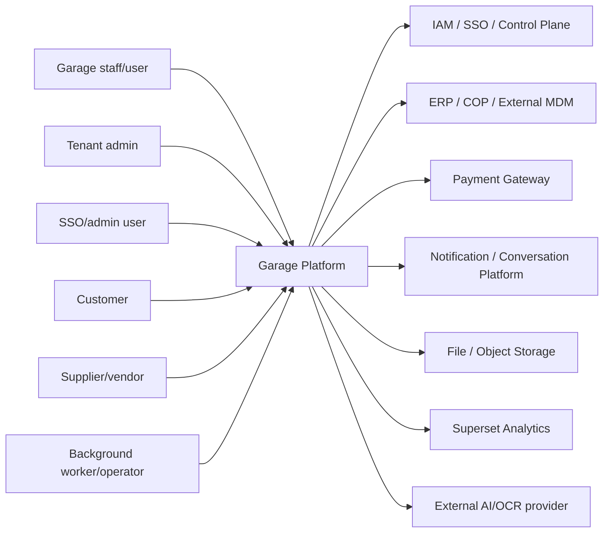
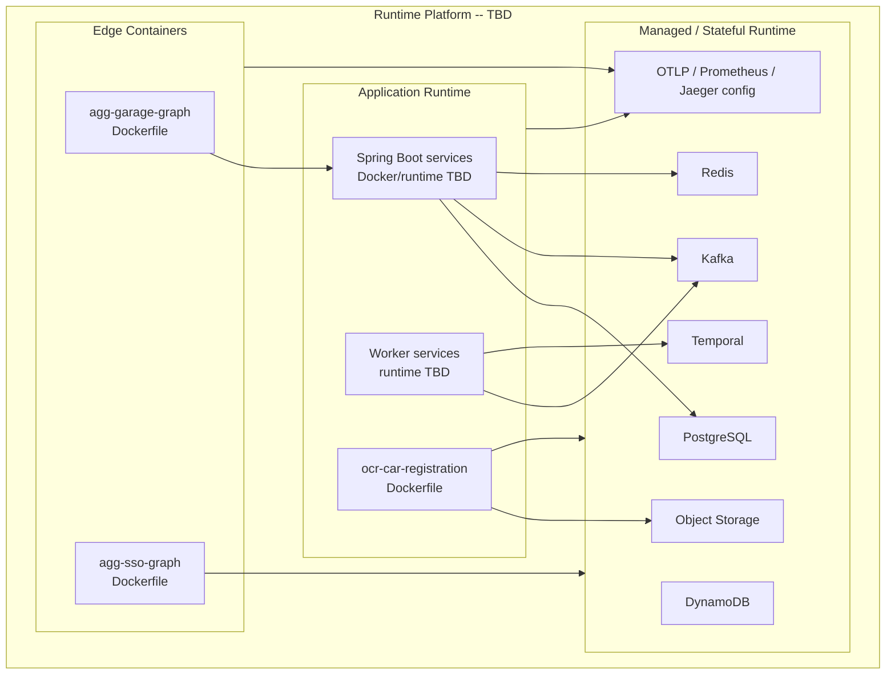

# System Architecture -- Garage

> System-level architecture cho Garage theo ADLC v3. Tai lieu nay tong hop C4 Context, C4 Container, request flow, async/event flow, cross-cutting concerns va deployment topology tu code hien co trong `C:\Users\admin\work\AC\garage`.

---

## 1. System Context

### 1.1 In Scope
Sơ đồ ngữ cảnh mô tả các actor và hệ thống bên ngoài tương tác với hệ thống Garage/GMS.

```
┌──────────────────────────────────────────────────────────────────────────────┐
│                         HỆ THỐNG / NỀN TẢNG BÊN NGOÀI                        │
│                                                                              │
│  ┌──────────────────┐        ┌──────────────────┐        ┌────────────────┐  │
│  │ sec-iam-service  │        │      Ecom4G      │        │    Platform    │  │
│  │    (IAM/SSO)     │        │                  │        │  PostgreSQL    │  │
│  │                  │        │                  │        │  Redis         │  │
│  │                  │        │                  │        │  Event Hubs    │  │
│  │                  │        │                  │        │  AKS           │  │
│  └────────┬─────────┘        └────────┬─────────┘        └────────┬───────┘  │
└───────────┼───────────────────────────┼───────────────────────────┼──────────┘
            │                           │                           │
            ▼                           ▼                           ▼
┌──────────────────────────────────────────────────────────────────────────────┐
│                                  GMS SYSTEM                                  │
│                                                                              │
│       ┌──────────────┐            ┌────────────────┐              ┌───────┐  │
│       │  Chủ garage  │───────────▶│                │◀─────────────│Kế toán│  │
│       │   (Actor)    │            │                │              │(Actor)│  │
│       └──────────────┘            │                │              └───────┘  │
│                                   │                │                         │
│       ┌──────────────┐            │   GMS Core     │              ┌───────┐  │
│       │ Thợ sửa chữa │───────────▶│                │◀─────────────│Cố vấn │  │
│       │              │            │                │              │dịch vụ│  │
│       └──────────────┘            └────────────────┘              └───────┘  │
│                                                                              │
│                                                                              │
│                                                                              │
└──────────────────────────────────────────────────────────────────────────────┘
```
### 1.2 Các Actor

| Actor                            | Mô tả                                                                    | Kênh truy cập                   |
|----------------------------------|--------------------------------------------------------------------------|---------------------------------|
| **Chủ garage**                   | Người dùng chính . Quản lý toàn bộ thông tin của garage.                 | GMS / Garage app                |
| **kế toán**                      | Người dùng chính . Quản lý thao tác liên quan đến kho và tạo quyết toán. | GMS / Garage app                |
| **Thợ sửa chữa/ cố vấn dịch vụ** | Thao tác trên phiếu dịch vụ và lịch hẹn.                                 | GMS / Garage app                |
| **Ecom4G**                       | Nền tảng trung gian liên quan đến phân phối hàng hóa cho arage           | Thông qua kafka -> gf-erp-agent |

### 1.3 Hệ thống Bên ngoài

| Hệ thống            | Vai trò                                                                                                  | Giao thức |
|---------------------|----------------------------------------------------------------------------------------------------------|---|
| **sec-iam-service** | Dùng cognito, IAM — xác thực , username+password, OTP.                                                   |  |
| **Cloudflare R2**   | Object storage cho media (PDF, image, Office). Truy cập qua signed URL.                             | S3-compatible API |
| **PostgreSQL**      | Database chính (Flexible Server, Multi-AZ HA). Pooled Model — shared instance, isolation bằng `tenant_id`. | JDBC / PostgreSQL 16 |
| **Event Hubs**      | Event streaming (Kafka-compatible) cho domain events giữa các microservices.                             | Kafka protocol |
| **Cache for Redis** | Cache cho session, calendar, rate limiting. Enterprise tier, geo-replication.                            | Redis protocol |
| **Lambda**          | Dùng để gửi mail, noti.                                                                                  | AWS SDK / HTTP |
| **DynamoDB**        | Dùng lưu thông tin FCM token.                                                                            | AWS SDK / DynamoDB API |
| **Google Custom Search API** | Spare part image search cho gf-inventory catalog.                                                | HTTPS REST |
| **Azure Vision / OpenAI** | Vehicle registration OCR extraction cho ocr-car-registration.                                       | HTTPS REST |

---

## 2. System Context (C4 Level 1)

Garage is a multi-service garage operations platform. It supports tenant/branch setup, employee provisioning, customer and vehicle management, booking and quotation, service order execution, inventory/procurement, settlement, shipment, campaign/CRM, notification and ERP/OCR integration.



### 2.1 External System Evidence

| External system | Current evidence | Integration role |
|---|---|---|
| IAM / SSO / Control Plane | `agg-sso-graph` maps `API_SERVICE_ENDPOINT` to `sec-iam-service`; Spring services use JWT/security starters | Authentication, user/session context, SSO/admin operations |
| Payment Gateway | `agg-garage-graph` env key `AC_PAYMENT_GATEWAY` | Payment enablement/status handoff |
| Notification / Conversation Platform | `agg-sso-graph` maps notification and conversation endpoints; `gf-notification` local service | Notification and conversation integration |
| File / Object Storage | `CT_FILE_STORAGE` env key, upload module, S3 dependencies in `gf-notification` | File upload/download and document handling |
| Superset Analytics | GraphQL env key `SUPERSET_ENDPOINT` | Dashboard/report embedding or analytics access |
| Azure Vision / OpenAI / Azure OpenAI | OCR `.env.example`, `requirements.txt`, `ocr_pipeline.py` imports | Vehicle registration OCR and structured extraction |

---

## 2.2 Container Architecture (C4 Level 2)

```mermaid
flowchart TB
  subgraph Clients["Clients / Channels"]
    Web["Garage Web / Admin UI"]
    Mobile["Mobile / Customer-facing Client"]
    Partner["Partner / Supplier Client"]
    Ops["Operator Console / Runtime Tools"]
  end

  subgraph Edge["GraphQL Aggregation Layer"]
    GarageGraph["agg-garage-graph\nNode 22 / TypeScript / Apollo"]
    SsoGraph["agg-sso-graph\nNode 22 / TypeScript / Apollo"]
  end

  subgraph Platform["Platform Services"]
    Hrms["gf-hrms"]
    SystemSvc["gf-system"]
    ErpMdm["gf-erp-mdm"]
  end

  subgraph Core["Core Domain Services"]
    Sales["gf-sales"]
    Purchase["gf-purchase"]
    Inventory["gf-inventory"]
    Accounting["gf-accounting"]
    Shipment["gf-shipment"]
  end

  subgraph Engagement["Customer / Engagement Services"]
    CustomerSvc["gf-customer"]
    MarketingSvc["gf-marketing"]
    Notification["gf-notification"]
  end

  subgraph Workers["Workers / Integration / AI"]
    InventoryWorker["gf-inventory-worker"]
    ErpAgent["gf-erp-agent"]
    Worker["gf-worker"]
    Ocr["ocr-car-registration\nPython 3.11 / FastAPI"]
  end

  subgraph Runtime["Shared Runtime / Stateful Dependencies"]
    Postgres["PostgreSQL\nservice-owned schemas"]
    Kafka["Kafka"]
    Temporal["Temporal"]
    Redis["Redis / Redisson"]
    DynamoDB["DynamoDB\nownership TBD"]
    ObjectStore["Object/File Storage"]
    Observability["OTLP / Prometheus / Actuator"]
  end

  subgraph External["External Services"]
    IAM["sec-iam-service"]
    NotifyExt["ct-notihub-notification"]
    Conversation["ct-conversation-client"]
    Payment["ac-payment-gateway"]
    FileStorage["ct-file-storage"]
    Superset["Superset"]
    Ai["Azure Vision / OpenAI / Azure OpenAI"]
  end

  Web --> GarageGraph
  Mobile --> GarageGraph
  Partner --> GarageGraph
  Web --> SsoGraph
  Mobile --> SsoGraph
  Ops --> InventoryWorker
  Ops --> ErpAgent
  Ops --> Worker

  GarageGraph --> Tenant
  GarageGraph --> Hrms
  GarageGraph --> ErpMdm
  GarageGraph --> Sales
  GarageGraph --> Purchase
  GarageGraph --> Inventory
  GarageGraph --> Accounting
  GarageGraph --> Shipment
  GarageGraph --> CustomerSvc
  GarageGraph --> MarketingSvc
  GarageGraph --> Notification
  GarageGraph --> Payment
  GarageGraph --> FileStorage
  GarageGraph --> Superset

  SsoGraph --> IAM
  SsoGraph --> NotifyExt
  SsoGraph --> Conversation
  SsoGraph --> Superset
  SsoGraph --> DynamoDB

  Core --> Postgres
  Platform --> Postgres
  Engagement --> Postgres
  ErpAgent --> Postgres
  Worker --> Postgres

  Sales --> Kafka
  Purchase --> Kafka
  Inventory --> Kafka
  Accounting --> Kafka
  CustomerSvc --> Kafka
  MarketingSvc --> Kafka
  Notification --> Kafka
  Tenant --> Kafka
  SystemSvc --> Kafka
  ErpMdm --> Kafka
  ErpAgent --> Kafka
  InventoryWorker --> Kafka

  Sales --> Temporal
  CustomerSvc --> Temporal
  MarketingSvc --> Temporal
  Inventory --> Temporal
  InventoryWorker --> Temporal

  Tenant --> Redis
  Sales --> Redis
  Purchase --> Redis
  Inventory --> Redis
  Accounting --> Redis
  CustomerSvc --> Redis
  MarketingSvc --> Redis
  Hrms --> Redis

  Notification --> DynamoDB
  Notification --> ObjectStore
  Ocr --> Ai
  Ocr --> ObjectStore

  Edge --> Observability
  Platform --> Observability
  Core --> Observability
  Engagement --> Observability
  Workers --> Observability
```



### 3 Container Responsibilities

| Container | Responsibility | Data ownership | Integration style |
|---|---|---|---|
| `agg-garage-graph` | Garage-facing GraphQL aggregation for sales, purchase, inventory, accounting, customer, marketing, notification, tenant, HRMS, MDM, upload and analytics modules | No confirmed owned relational data | Sync GraphQL to REST/service endpoints |
| `agg-sso-graph` | Auth/SSO-facing GraphQL aggregation for auth, Firebase, notification, conversation and analytics modules | DynamoDB dependency/table env var present; ownership TBD | Sync GraphQL to IAM/notification/conversation endpoints |
| `gf-hrms` | Employee and HR lifecycle support | PostgreSQL via Flyway/JPA | REST + Kafka + Redis (produces 6 topics: TenantUserProvision/Disable/Enable, EmployeeTerminated/RoleChanged/BranchChanged; consumes 4 IAM result topics) |
| `gf-system` | System metadata and bootstrap support | PostgreSQL via Flyway/JPA | REST + Kafka (2 controllers: InternalTenantInvoiceInfoController, TenantTransporterRegistryController; produces BranchCreated + TenantInvoiceInfoUpdated + TransporterRegistry events) |
| `gf-erp-mdm` | Master/reference data service | PostgreSQL via JPA | REST + Kafka + AWS SNS |
| `gf-sales` | Booking, quotation and service order lifecycle | PostgreSQL via Flyway/JPA | REST + Kafka + Redis + Temporal |
| `gf-purchase` | Supplier quotation, purchase request/order, procurement handoff | PostgreSQL via Flyway/JPA | REST + Kafka + Redis; Temporal ownership unconfirmed |
| `gf-inventory` | Stock truth, warehouse operations and inventory state | PostgreSQL via Flyway/JPA | REST + Kafka + Redis/Redisson + Temporal |
| `gf-accounting` | Settlement, invoice/receipt/document output and accounting operations | PostgreSQL via JPA; Flyway dependency but no migrations observed | REST + Kafka + Redis |
| `gf-shipment` | Shipment coordination | PostgreSQL via JPA | REST only (source confirms no Kafka/Temporal/Redis dependency) |
| `gf-customer` | Customer master, vehicle profile and segmentation | PostgreSQL via Flyway/JPA | REST + Kafka + Redis + Temporal |
| `gf-marketing` | Campaign, trigger, voucher and CRM workflow | PostgreSQL via Flyway/JPA | REST + Kafka + Redis + Temporal |
| `gf-notification` | Garage notification domain and dispatch state | PostgreSQL via Flyway/JPA; DynamoDB dependency observed | REST + Kafka + AWS S3/SNS/SQS/DynamoDB (no Temporal — uses @Scheduled cron batch processors) |
| `gf-erp-agent` | ERP/COP/GMS integration bridge and sync agent | PostgreSQL via Flyway/JPA | REST + Kafka + AWS SNS/SQS |
| `gf-inventory-worker` | Inventory workflow worker and long-running fulfillment coordination | No entity/migration observed | Temporal worker + Kafka |
| `gf-worker` | Generic background worker support | PostgreSQL via Flyway/JPA | Worker/controller evidence is limited; Kafka/Temporal/Redis not confirmed |
| `ocr-car-registration` | OCR extraction for vehicle registration documents and VIN/auth endpoints | OCR persistence TBD; asyncpg dependency exists | FastAPI + Azure Vision/OpenAI/Azure OpenAI + optional object/file access |

---


## 4. Mối quan tâm Xuyên suốt (Cross-cutting Concerns)

### 4.1 Tenant Isolation Pattern

```
Request → TenantFilter (Servlet Filter) → Resolve tenant_id từ JWT → TenantContext (ThreadLocal)
                                                                            │
                                                                            ▼
                                                               Repository Layer
                                                        (Hibernate @Filter by tenant_id)
```

- `TenantContext`: ThreadLocal chứa `tenant_id`, được set bởi `TenantFilter` trước khi request vào controller.
- `TenantFilter`: Servlet filter giải mã JWT, trích xuất `tenant_id` từ claims, set vào `TenantContext`.
- Tất cả repository query tự động inject `WHERE tenant_id = :currentTenantId`.

### 4.2 Auth Delegation (edu-saas-control-identity)

- GMS KHÔNG tự xây dựng authentication engine.
- Luồng auth: Hub → Kong → `one-connect-agg-sso-graph` (GraphQL) → `sec-iam-service`.
- Token (JWT) được phát hành bởi sec-iam-service, các  services validate token trực tiếp.

### 4.3 Signed URL Access (Cloudflare R2 / Stream)

- Mọi truy cập file/media PHẢI qua signed URL — KHÔNG direct bucket access.
- Định dạng hỗ trợ: image (jpg/png/gif/webp/svg,HEIC, HEIF), PDF, Office (docx/xlsx/pptx), text/markdown.
- KHÔNG hỗ trợ binary tùy ý (exe, zip chứa binary) — lý do bảo mật.

### 4.4 Event-driven 

- Giao tiếp bất đồng bộ giữa microservices qua  Event Hubs (Kafka-compatible).
- Domain events: `{Entity}{PastTenseVerb}Event` — ví dụ: `TenantRegistered`.
- Event schema phải đăng ký trong knowledge graph trước khi publish.
- In-process events: Spring `ApplicationEventPublisher`. Cross-service events: Event Hubs.

### 4.5 Workflow Orchestration (Temporal)

- Temporal Server cho các long-running workflows: WO lifecycle, enrollment invite, payment reconciliation, roster sync.
- Java SDK (Temporal 1.x) — durable execution, human-in-the-loop signals, saga/compensation, retry policies.
- Hosting: TBD (Temporal Cloud vs self-hosted trên AKS) .

### 4.6 Feature Flags

- Mọi feature mới từ Wave 2 trở đi PHẢI wrap behind feature flag.
- Flag entity owned bởi tems-core, consumed bởi tất cả services qua `FeatureFlagService`.
- Naming: `FF_{BOUNDARY}_{WAVE}_{FEATURE_SHORT_NAME}`.
- Ưu tiên: tenant-specific override > global setting > default (disabled).

### 4.7 No Hardcoding (Environment Variables + Constants)

- Config values (pagination, TTL, limits, SLA) → `application.yml` với `${ENV_VAR:default}`.
- Sensitive values (URLs, credentials) → env var KHÔNG có default.
- Fixed protocol values (error codes, actor prefixes) → Constants class.
- 3-layer pattern: Environment Variable → `application.yml` → `@ConfigurationProperties` → inject vào service.

### 4.8 Backward Compatibility

- KHÔNG modify runnable code từ waves trước trừ khi có change request hoặc bug fix.
- KHÔNG đổi API contracts đã published — chỉ additive changes.
- KHÔNG đổi domain event schemas đã published — chỉ thêm optional fields.
- Existing tests từ waves trước PHẢI tiếp tục pass.

---

## 5. Mẫu Luồng Request (Request Flow Patterns)

### 5.1 Luồng Request Chính

| # | Luồng | Mô tả |
|---|---|---|
| 1 | Garage App → `agg-garage-graph` → Garage Spring Services | Truy vấn/ghi dữ liệu nghiệp vụ garage qua GraphQL aggregation layer. |
| 2 | SSO/Admin App → `agg-sso-graph` → `sec-iam-service` | Đăng nhập, xác thực, OTP, session/admin operation được ủy quyền cho IAM/SSO. |
| 3 | Garage Service → Garage Service | Gọi đồng bộ khi cần command/query tức thời giữa các service boundary. |
| 4 | Garage Service → Event Hubs/Kafka → Garage Service | Phát domain/integration event sau khi commit state để các service khác cập nhật projection hoặc chạy side effect. |
| 5 | Garage Service → Temporal → Worker/Activity | Điều phối long-running workflow, saga/compensation, retry và human-in-the-loop signal. |
| 6 | Garage App/Service → `ocr-car-registration` → AI/OCR Provider | Trích xuất thông tin đăng ký xe từ image/base64/URL, trả dữ liệu có cấu trúc để service sở hữu lưu lại. |
| 7 | Ecom4G → Kafka/ERP Agent → Garage Services | Nhận/tích hợp dữ liệu phân phối hàng hóa, master data hoặc ERP flow qua integration worker/agent. |

### 5.2 Luồng Đồng bộ: Garage App → GraphQL → Spring Service

```
Garage App / Web Client
    │
    │  GraphQL query/mutation
    ▼
agg-garage-graph
    │  Validate request context
    │  Forward tenant_id, branch_id, user_id, trace_id
    │  Gọi downstream REST/HTTP endpoint
    ▼
Garage Spring Service
    │  Enforce authorization
    │  Tenant/branch scoped business logic
    │  Read/write owned data
    ▼
Service PostgreSQL
    │
    └──▶ Event Hubs / Kafka
             └── Publish domain event khi state thay đổi
```

Rules:

- GraphQL gateway chỉ compose API, không sở hữu durable domain state.
- Spring service boundary là nguồn sự thật cho dữ liệu nghiệp vụ thuộc service đó.
- Gateway phải forward tenant/user/trace context; service phải tự validate context trước khi xử lý.

### 5.3 Luồng Auth/Admin: SSO GraphQL → IAM/Notification

```
SSO/Admin Client
    │
    │  Auth/admin GraphQL operation
    ▼
agg-sso-graph
    │  Route auth/session/admin operation
    ├──▶ sec-iam-service
    │        └── Username/password, OTP, IAM/SSO operation
    │
    ├──▶ Notification / Conversation Services
    │        └── Gửi notification hoặc conversation side effect khi cần
    │
    └──▶ DynamoDB
             └── Device token / notification state where used
```

Rules:

- `agg-sso-graph` là gateway cho IAM/notification/conversation, không thay thế local Garage tenant/domain services.
- Ownership của DynamoDB table còn TBD cho đến khi data model phase xác nhận cách dùng device token state.

### 5.4 Luồng Đồng bộ: Service → Service

```
Caller Service
    │  Immediate command/query need
    │  Forward tenant_id, branch_id, user_id, trace_id
    ▼
Callee Service API
    │  Validate caller/context
    │  Enforce own authorization and data ownership
    │  Execute business rule
    ▼
Callee-owned PostgreSQL
    │
    ▼
Synchronous response
```

Rules:

- Service gọi service khác chỉ qua API/contract, không ghi trực tiếp database của service khác.
- Callee luôn là owner của state thuộc boundary của nó.
- Durable state change phải nằm trong transaction/model của service owner.

### 5.5 Luồng Bất đồng bộ: Garage Service → Event Hubs/Kafka → Garage Service

```
Producer Service
    │  Commit owned domain state
    ▼
Producer PostgreSQL
    │
    │  Publish domain/integration event
    ▼
Event Hubs / Kafka
    │
    ├──▶ Consumer Service A
    │        └── Update local projection / trigger side effect
    │
    └──▶ Consumer Service B
             └── Run async business process
```

Rules:

- Producer sở hữu source state; consumer không mutate bảng của producer.
- Event phải mang correlation context và tenant/branch/user context khi áp dụng được.
- Consumer phải replay-safe và chịu được duplicate delivery.

### 5.6 Luồng Workflow: Service → Temporal → Worker

```
Workflow Client Service
    │  Start / signal workflow
    ▼
Temporal
    │  Durable workflow state
    │  Retry policy / timeout / signal
    ▼
Worker / Workflow Implementation
    │  Schedule activity
    ▼
Domain Service Contract
    │  Execute command/query through service API
    ▼
Workflow result / progress
```

Confirmed Temporal owners from Phase 2 dependency/config evidence:

| Boundary | Evidence level |
|---|---|
| `gf-sales` | Temporal starter/config |
| `gf-customer` | Temporal starter/config |
| `gf-marketing` | Temporal starter/config |
| `gf-inventory` | Temporal SDK/starter/config |
| `gf-inventory-worker` | Temporal SDK/starter/config |

`gf-purchase` and `gf-notification` do **NOT** use Temporal (confirmed from source code): `gf-purchase` uses outbox+Kafka pattern; `gf-notification` uses `@Scheduled` cron batch processors (NotificationInAppProcessingJob, NotificationDeliveryJob).

### 5.7 Luồng OCR: Garage → OCR Service → AI/OCR Provider

```
Garage Client / Garage Service
    │  Upload image / base64 / URL
    ▼
ocr-car-registration
    │  Validate file/request
    │  Run OCR pipeline
    ├──▶ Azure Vision
    │        └── Extract raw text
    │
    └──▶ OpenAI / Azure OpenAI
             └── Structure extracted vehicle/customer data
    │
    ▼
Structured OCR response
    │
    ▼
Customer / Vehicle Owner Service
    └── Persist accepted customer/vehicle data
```

Evidence:

- `app/main.py` exposes FastAPI docs and routers under `/api/v1`.
- OCR routes include file upload and base64 processing.
- `.env.example` defines Azure Vision, OpenAI and Azure OpenAI credentials.
- Durable Garage customer/vehicle state should be persisted by the owning Garage service.

### 5.8 Luồng External Integration: Ecom4G → ERP Agent → Garage

```
Ecom4G / External ERP Source
    │  Integration event / data feed
    ▼
Event Hubs / Kafka
    │
    ▼
gf-erp-agent
    │  Validate payload
    │  Map external data to Garage integration model
    │  Trigger downstream service contract or publish internal event
    ▼
Garage Services
    ├── gf-sales
    ├── gf-purchase
    ├── gf-inventory
    └── gf-accounting
```

Rules:

- External payload không được ghi thẳng vào domain tables; phải đi qua integration mapping và service contract/event.
- Mapping lỗi phải được log kèm correlation ID để replay hoặc xử lý thủ công.
- ERP/Ecom4G integration contract cần được xác nhận ở phase API/event contract.

---

## 6. Core Business Flow

Garage end-to-end operations are composed from the following lifecycle chain:

1. Tenant and branch bootstrap through SaaS tenant/system services.
2. Employee provisioning and role context through HRMS and IAM/control-plane integration.
3. Customer and vehicle profile setup through customer, sales and OCR capabilities.
4. Booking and quotation through sales, purchase, customer, notification and MDM references.
5. Service order execution through sales, inventory and technician/warehouse-facing operations.
6. Inventory and procurement fulfillment through inventory, purchase, shipment and inventory worker orchestration.
7. Settlement and documents through accounting, sales and notification.
8. Campaign and customer engagement through marketing, customer and notification.
9. ERP/master-data synchronization through ERP agent and MDM services.

Likely core commercial chain from current boundary evidence:

```text
gf-sales
  -> gf-purchase
  -> gf-inventory / gf-shipment
  -> gf-accounting
  -> gf-notification
```

This flow is a Phase 3 system-level inference from service boundaries, GraphQL modules, and `gf-erp-agent/src/main/resources/flows/complete-sales-flow.md`; concrete events and APIs must be confirmed in later phases.

---

## 7. Data Architecture Principles

| Principle | Requirement |
|---|---|
| Service-owned schema | Each service owns its PostgreSQL schema/entities/migrations |
| No cross-service table writes | Integration must use API/event contracts, not direct DB mutation |
| Tenant isolation | Tenant and branch context must be enforced in domain queries and writes |
| Projection over sharing | Consumers may keep local projections/read models but producer remains source of truth |
| Migration traceability | Flyway migrations are architecture evidence and must be mapped in data docs |
| Non-relational caution | DynamoDB dependency exists in `agg-sso-graph` and `gf-notification`; ownership remains an open gap until source-confirmed |
| OCR data caution | `ocr-car-registration` has `asyncpg` dependency, but durable persistence ownership is TBD |


---

## 8. Deployment Topology

The confirmed evidence supports containerized GraphQL/OCR services and local compose/dev topology. Final runtime platform is not confirmed in Phase 3.



| Area | Status |
|---|---|
| GraphQL packaging | Dockerfile and compose evidence exists for both GraphQL gateways |
| OCR packaging | Dockerfile and compose evidence exists for `ocr-car-registration` |
| Spring service packaging | No root Dockerfiles observed in Phase 2 scan; runtime packaging TBD |
| Local runtime | Compose evidence exists for GraphQL gateways and OCR |
| Cluster/runtime platform | TBD |
| Database deployment | PostgreSQL is confirmed at service tech level; shared vs isolated instance topology TBD |
| Kafka/Redis/Temporal deployment | Runtime dependencies confirmed at stack level; operational topology TBD |
| Observability backend | OTel collector config exports to Jaeger and Prometheus; actual deployed backend TBD |

---


## Change Log

| Ngày       | CR/ADR ID | Tóm tắt | Tác giả |
|------------|---|---|---|
| 2026-05-07 | — | Khởi tạo tài liệu kiến trúc hệ thống — C4 Level 1 & 2, quality attributes, cross-cutting concerns, deployment topology, request flow patterns |  |
| 2026-05-11 | — | Fix vs source code (cross-ref 21 INTEG + 19 KG reviews): (1) §1 External Systems: sửa DynamoDB/Lambda protocol từ "Redis protocol" → AWS SDK; thêm Google Custom Search + Azure Vision/OpenAI; (2) §3 Container: sửa gf-hrms (Kafka confirmed 6 produce + 4 consume), gf-system (2 controllers confirmed), gf-shipment (REST only confirmed), gf-notification (remove "Temporal unconfirmed"); (3) §5.6 Temporal: resolve gf-purchase + gf-notification từ "require follow-up" → "NOT using Temporal" (confirmed from source) |  |
