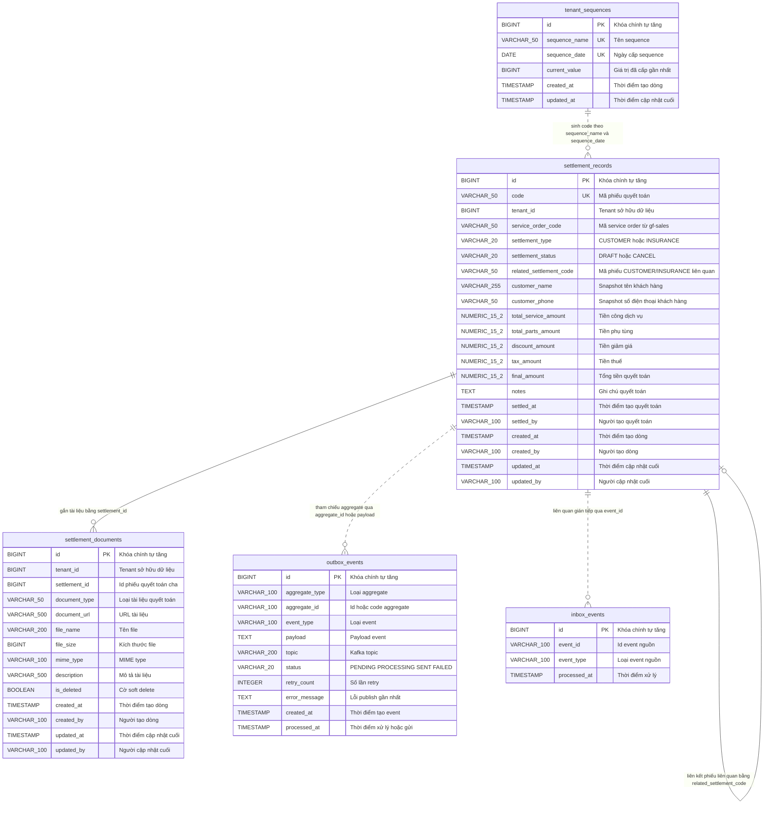

# Data Model — gf-accounting

> PostgreSQL qua Spring Data JPA, schema mặc định `${DB_SCHEMA:gf_accounting}`. Tài liệu này phản ánh code hiện tại của `gf-accounting`: JPA entity, enum, repository, index, constraint và cấu hình migration.

## 1. ERD Overview



> Các quan hệ trong ERD là logical reference. Entity hiện không khai báo `@ManyToOne`, `@OneToMany` hoặc database foreign key.

> **(DESIGN — Accounting Period, ADR-019)**: thêm entity `accounting_period` (15 cols, adjacency-list self-FK qua `parent_id` scalar — ADR-009; KHÔNG có quan hệ vật lý tới 5 baseline tables hay 3 design insurance tables — tách bạch aggregate hoàn toàn). Chi tiết cột + indexes xem §2ter.1; ERD ASCII §2ter.2.

## 2. Entities

### `settlement_records`

| Column | Type | Nullable | Description |
|---|---|---|---|
| `id` | `BIGINT` | NO | Khóa chính tự tăng qua `GenerationType.IDENTITY`. |
| `code` | `VARCHAR(50)` | NO | Mã phiếu quyết toán, unique toàn bảng theo JPA annotation. |
| `tenant_id` | `BIGINT` | NO | Tenant sở hữu phiếu quyết toán. |
| `service_order_code` | `VARCHAR(50)` | NO | Mã service order từ `gf-sales`. |
| `settlement_type` | `VARCHAR(20)` | NO | Enum `SettlementType`, lưu bằng string: `CUSTOMER`, `INSURANCE`. |
| `settlement_status` | `VARCHAR(20)` | NO | Enum `SettlementStatus`, lưu bằng string: `DRAFT`, `CANCEL`; mặc định trong builder là `DRAFT`. |
| `related_settlement_code` | `VARCHAR(50)` | YES | Mã phiếu liên quan khi một service order có cặp CUSTOMER/INSURANCE. |
| `customer_name` | `VARCHAR(255)` | YES | Snapshot tên khách hàng từ `gf-sales`. |
| `customer_phone` | `VARCHAR(50)` | YES | Snapshot số điện thoại khách hàng từ `gf-sales`. |
| `total_service_amount` | `NUMERIC(15,2)` | NO | Tiền công dịch vụ; builder mặc định `0`. |
| `total_parts_amount` | `NUMERIC(15,2)` | NO | Tiền phụ tùng; builder mặc định `0`. |
| `discount_amount` | `NUMERIC(15,2)` | NO | Tiền giảm giá; builder mặc định `0`. |
| `tax_amount` | `NUMERIC(15,2)` | NO | Tiền thuế; builder mặc định `0`. |
| `final_amount` | `NUMERIC(15,2)` | NO | Tổng tiền quyết toán; code hiện tính bằng `total_service_amount + total_parts_amount`. |
| `notes` | `TEXT` | YES | Ghi chú quyết toán. |
| `settled_at` | `TIMESTAMP` | NO | Thời điểm domain tạo phiếu quyết toán. |
| `settled_by` | `VARCHAR(100)` | NO | User id tạo phiếu quyết toán. |
| `created_at` | `TIMESTAMP` | YES | Spring Data auditing `@CreatedDate`; không khai báo `nullable=false`. |
| `created_by` | `VARCHAR(100)` | YES | Spring Data auditing `@CreatedBy`; không khai báo `nullable=false`. |
| `updated_at` | `TIMESTAMP` | YES | Spring Data auditing `@LastModifiedDate`; không khai báo `nullable=false`. |
| `updated_by` | `VARCHAR(100)` | YES | Spring Data auditing `@LastModifiedBy`; không khai báo `nullable=false`. |

**Indexes**: `idx_settlement_settled_at(settled_at)`, `idx_settlement_service_order(service_order_code)`, `idx_settlement_type(settlement_type)`, `idx_settlement_related(related_settlement_code)`, `idx_settlement_code(code)`, `idx_settlement_tenant_id(tenant_id)`.

**Constraints**: Primary key `id`; unique `code`; NOT NULL theo entity cho `code`, `tenant_id`, `service_order_code`, `settlement_type`, `settlement_status`, các cột amount, `settled_at`, `settled_by`. Không có foreign key vật lý tới service order hoặc settlement liên quan.

### `settlement_documents`

| Column | Type | Nullable | Description |
|---|---|---|---|
| `id` | `BIGINT` | NO | Khóa chính tự tăng qua `GenerationType.IDENTITY`. |
| `tenant_id` | `BIGINT` | NO | Tenant sở hữu tài liệu. |
| `settlement_id` | `BIGINT` | NO | Id phiếu quyết toán cha; là logical reference tới `settlement_records.id`. |
| `document_type` | `VARCHAR(50)` | NO | Enum `SettlementDocumentType`, lưu bằng string: `HANDOVER`, `RECEPTION`, `QUOTATION`, `REPAIR_ORDER`, `IMAGE`, `SETTLEMENT`, `OTHER`. |
| `document_url` | `VARCHAR(500)` | NO | URL file hoặc object tài liệu. |
| `file_name` | `VARCHAR(200)` | YES | Tên file hiển thị hoặc file upload. |
| `file_size` | `BIGINT` | YES | Kích thước file theo byte. |
| `mime_type` | `VARCHAR(100)` | YES | MIME type của file. |
| `description` | `VARCHAR(500)` | YES | Mô tả tài liệu. |
| `is_deleted` | `BOOLEAN` | NO | Cờ soft delete; builder/domain mặc định `false`. |
| `created_at` | `TIMESTAMP` | YES | Spring Data auditing `@CreatedDate`; không khai báo `nullable=false`. |
| `created_by` | `VARCHAR(100)` | YES | Spring Data auditing `@CreatedBy`; không khai báo `nullable=false`. |
| `updated_at` | `TIMESTAMP` | YES | Spring Data auditing `@LastModifiedDate`; không khai báo `nullable=false`. |
| `updated_by` | `VARCHAR(100)` | YES | Spring Data auditing `@LastModifiedBy`; không khai báo `nullable=false`. |

**Indexes**: `idx_sd_tenant_id(tenant_id)`, `idx_sd_settlement_id(settlement_id)`, `idx_sd_document_type(document_type)`.

**Constraints**: Primary key `id`; NOT NULL theo entity cho `tenant_id`, `settlement_id`, `document_type`, `document_url`, `is_deleted`. Không có foreign key vật lý tới `settlement_records`.

### `tenant_sequences`

| Column | Type | Nullable | Description |
|---|---|---|---|
| `id` | `BIGINT` | NO | Khóa chính tự tăng qua `GenerationType.IDENTITY`. |
| `sequence_name` | `VARCHAR(50)` | NO | Tên sequence; hiện dùng `SETTLEMENT_CODE`. |
| `sequence_date` | `DATE` | NO | Ngày cấp sequence, lấy theo timezone `Asia/Ho_Chi_Minh`. |
| `current_value` | `BIGINT` | NO | Giá trị đã cấp gần nhất; builder/domain mặc định `0`. |
| `created_at` | `TIMESTAMP` | NO | Thời điểm tạo dòng; builder mặc định `Instant.now()`. |
| `updated_at` | `TIMESTAMP` | NO | Thời điểm cập nhật cuối; cập nhật khi tăng sequence. |

**Indexes**: Không khai báo index riêng; unique constraint tạo index backing cho `(sequence_name, sequence_date)` tùy database.

**Constraints**: Primary key `id`; unique constraint `uk_sequences_name_date(sequence_name, sequence_date)`; NOT NULL theo entity cho `sequence_name`, `sequence_date`, `current_value`, `created_at`, `updated_at`. Bảng hiện không có `tenant_id`.

### `outbox_events`

| Column | Type | Nullable | Description |
|---|---|---|---|
| `id` | `BIGINT` | NO | Khóa chính tự tăng qua `GenerationType.IDENTITY`. |
| `aggregate_type` | `VARCHAR(100)` | NO | Tên loại aggregate phát event. |
| `aggregate_id` | `VARCHAR(100)` | NO | Id hoặc code aggregate theo quy ước payload. |
| `event_type` | `VARCHAR(100)` | NO | Loại event được phát. |
| `payload` | `TEXT` | NO | Payload event dạng chuỗi; batch insert hiện cast parameter `?::jsonb`. |
| `topic` | `VARCHAR(200)` | YES | Kafka topic đích. |
| `status` | `VARCHAR(20)` | NO | Enum `OutboxStatus`, lưu bằng string: `PENDING`, `PROCESSING`, `SENT`, `FAILED`; builder mặc định `PENDING`. |
| `retry_count` | `INTEGER` | YES | Số lần retry; builder mặc định `0` nhưng entity không khai báo `nullable=false`. |
| `error_message` | `TEXT` | YES | Thông báo lỗi publish gần nhất. |
| `created_at` | `TIMESTAMP` | NO | Thời điểm tạo event; builder mặc định `Instant.now()`. |
| `processed_at` | `TIMESTAMP` | YES | Thời điểm xử lý, retry hoặc gửi thành công. |

**Indexes**: Không khai báo `@Index` trên entity.

**Constraints**: Primary key `id`; NOT NULL theo entity cho `aggregate_type`, `aggregate_id`, `event_type`, `payload`, `status`, `created_at`. Không có `tenant_id` và không có foreign key vật lý.

### `inbox_events`

| Column | Type | Nullable | Description |
|---|---|---|---|
| `id` | `BIGINT` | NO | Khóa chính tự tăng qua `GenerationType.IDENTITY`. |
| `event_id` | `VARCHAR(100)` | NO | Id event nguồn để kiểm tra idempotency. |
| `event_type` | `VARCHAR(100)` | NO | Loại event nguồn. |
| `processed_at` | `TIMESTAMP` | YES | Thời điểm xử lý event. |

**Indexes**: Không khai báo `@Index` trên entity.

**Constraints**: Primary key `id`; NOT NULL theo entity cho `id`, `event_id`, `event_type`. Không khai báo unique constraint cho `event_id`, dù repository dùng `existsByEventId`. Repository hiện khai báo `JpaRepository<InboxEntity, String>` trong khi primary key entity là `Long`.

## 2bis. Insurance Settlement Extension (DESIGN — EP-INSURANCE-SETTLEMENT, chưa có trong source)

> ⚠️ Phần này là **thiết kế** cho `EP-INSURANCE-SETTLEMENT` (ADR-014 reuse gf-accounting). Khác với §1–§2 (phản ánh code hiện tại), các entity/cột dưới đây **chưa tồn tại trong source** — sẽ sinh schema qua `ddl-auto=update` khi DEV implement (gf-accounting KHÔNG dùng Flyway DDL — ADR-006 exception, Gotcha #5). Mọi cột mới **additive**, scalar FK only (ADR-009), có `tenant_id` + audit fields.

### 2bis.1 `settlement_records` — additive columns cho hàng INSURANCE

Tái dùng aggregate `settlement_records` cho Phiếu QT BH (`settlement_type=INSURANCE`). Bổ sung (additive, nullable cho hàng CUSTOMER cũ):

| Column | Type | Nullable | Description |
|---|---|---|---|
| `insurance_policy_no` | `VARCHAR(100)` | YES | Snapshot số hợp đồng BH. |

> **Không thêm `insurance_code` / `insurance_company_name`**: gf-accounting lấy thông tin CTBH qua REST `for-settlement` từ gf-sales (đã có `insurance_company` baseline lưu mã CTBH v.d. `INS_BSH`). Không cần snapshot riêng — UI gọi SO data khi cần hiển thị tên DN BH.
| `discount_material_mode` | `VARCHAR(10)` | YES | Snapshot mode CK liên kết vật tư: `PERCENT` hoặc `AMOUNT`. Immutable sau tạo (CB-INS-002). |
| `discount_material_value` | `NUMERIC(15,2)` | YES | Snapshot giá trị CK liên kết vật tư. |
| `discount_labor_mode` | `VARCHAR(10)` | YES | Snapshot mode CK liên kết công DV. |
| `discount_labor_value` | `NUMERIC(15,2)` | YES | Snapshot giá trị CK liên kết công DV. |
| `depreciation_default_percent` | `NUMERIC(5,2)` | YES | Snapshot khấu hao mặc định %. Per-line depreciation lấy từ `for-settlement` snapshot `lines[].depreciationPercent`. |
| `claim_reduction_mode` | `VARCHAR(10)` | YES | Snapshot mode giảm trừ bồi thường. |
| `claim_reduction_value` | `NUMERIC(15,2)` | YES | Snapshot giá trị giảm trừ bồi thường. |
| `insurance_deductible_amount` | `NUMERIC(15,2)` | YES | Snapshot khấu trừ bảo hiểm. |
| `breakdown_service_insurance` | `NUMERIC(15,2)` | YES | Snapshot cộng dịch vụ phía BH (Cộng sau VAT per payer — BR-EP §7.2). |
| `breakdown_service_customer` | `NUMERIC(15,2)` | YES | Snapshot cộng dịch vụ phía KH. |
| `breakdown_parts_insurance` | `NUMERIC(15,2)` | YES | Snapshot cộng phụ tùng phía BH. |
| `breakdown_parts_customer` | `NUMERIC(15,2)` | YES | Snapshot cộng phụ tùng phía KH. |
| `breakdown_vat_insurance` | `NUMERIC(15,2)` | YES | Snapshot thuế phía BH. |
| `breakdown_vat_customer` | `NUMERIC(15,2)` | YES | Snapshot thuế phía KH. |
| `breakdown_total_after_vat_insurance` | `NUMERIC(15,2)` | YES | Snapshot tổng sau VAT phía BH. |
| `breakdown_total_after_vat_customer` | `NUMERIC(15,2)` | YES | Snapshot tổng sau VAT phía KH. |
| `insurance_payable_amount` | `NUMERIC(15,2)` | YES | "BH thanh toán" sau 5 điều chỉnh (nhận từ request gf-sales — KHÔNG tự tính, BR-GF-ACCOUNTING-006). Cơ sở tính "Còn phải thu BH". |

> Trạng thái thanh toán ("Chưa thu" / "Thu một phần" / "Đã thu đủ" + badge "Thừa") là **derived, KHÔNG lưu DB** (BR-EP §3.2) — tính từ `insurance_payable_amount − Σ insurance_settlement_payments`.

### 2bis.2 `insurance_dossiers` (NEW)

Header bộ Hồ sơ BH, versioning immutable sau xuất (BR-EP §3.3).

| Column | Type | Nullable | Description |
|---|---|---|---|
| `id` | `BIGINT` | NO | PK identity. |
| `tenant_id` | `BIGINT` | NO | Tenant sở hữu. |
| `settlement_code` | `VARCHAR(50)` | NO | Scalar FK (no mapping) tới `settlement_records.code` (Phiếu QT BH). |
| `version_no` | `INTEGER` | NO | Số version bộ hồ sơ (v1, v2, …). Unique cùng `(tenant_id, settlement_code)`. |
| `dossier_status` | `VARCHAR(20)` | NO | Enum `DossierStatus`: `DRAFT`, `EXPORTED`, `REPLACED`. Builder mặc định `DRAFT`. |
| `replaced_by_version` | `INTEGER` | YES | Version kế tiếp thay thế (set khi vN+1 EXPORTED). |
| `copied_from_version` | `INTEGER` | YES | Version nguồn nếu tạo bằng "Sao chép từ vN". |
| `exported_at` | `TIMESTAMP` | YES | Thời điểm xuất PDF (immutable mốc). |
| `exported_by` | `VARCHAR(100)` | YES | Người xuất. |
| `created_at`/`created_by`/`updated_at`/`updated_by` | audit | — | Spring Data auditing. |

**Indexes**: `idx_dossier_tenant_settlement(tenant_id, settlement_code)`, `idx_dossier_status(dossier_status)`. **Constraints**: unique `uk_dossier_settlement_version(tenant_id, settlement_code, version_no)`.

### 2bis.3 `insurance_dossier_documents` (NEW)

4 tài liệu chuẩn / version (BR-EP §2.5). Mỗi tài liệu 1 dòng.

| Column | Type | Nullable | Description |
|---|---|---|---|
| `id` | `BIGINT` | NO | PK identity. |
| `tenant_id` | `BIGINT` | NO | Tenant sở hữu. |
| `dossier_id` | `BIGINT` | NO | Scalar FK (no mapping) tới `insurance_dossiers.id`. |
| `document_type` | `VARCHAR(40)` | NO | Enum `InsuranceDossierDocType`: `QUOTATION_SHEET` (①), `SETTLEMENT_SHEET` (②), `ACCEPTANCE_RECORD` (③), `PAYMENT_AUTHORIZATION` (④). |
| `doc_status` | `VARCHAR(20)` | NO | Enum: `READY` (①② auto, ③④ khi hoàn tất), `PENDING` ("Bổ sung"). |
| `is_selected` | `BOOLEAN` | NO | Tích chọn để xuất (export không bắt buộc 4/4 — chốt 2026-05-27, BR-INS-DOSSIER-005). Mặc định `true`. |
| `input_mode` | `VARCHAR(20)` | YES | `AUTO_RENDER` (①②), `FORM_FILL` (③④ template), `UPLOAD` (③ scan). |
| `form_data` | `JSONB` | YES | Dữ liệu điền tay (③ biên bản nghiệm thu, ④ giấy ủy quyền template). |
| `uploaded_file_url` | `VARCHAR(500)` | YES | URL scan upload (③) — S3. |
| `pdf_url` | `VARCHAR(500)` | YES | URL PDF đã xuất — S3 path `{tenant}/insurance-dossiers/{settlementCode}/v{N}/{filename}` (CB-INS-009, ADR-016). |
| `pdf_file_name` | `VARCHAR(200)` | YES | `phieu-bao-gia.pdf` / `phieu-quyet-toan.pdf` / `bien-ban-nghiem-thu.pdf` / `giay-uy-quyen-nhan-tien-boi-thuong.pdf`. |
| `created_at`/`created_by`/`updated_at`/`updated_by` | audit | — | Spring Data auditing. |

**Indexes**: `idx_dossier_doc_dossier_id(dossier_id)`, `idx_dossier_doc_tenant(tenant_id)`. **Constraints**: unique `uk_dossier_doc_type(dossier_id, document_type)`.

### 2bis.4 `insurance_settlement_payments` (NEW)

Đối soát thanh toán BH nhiều đợt (aggregate `SettlementPaymentReconciliation`). Nguồn để gf-accounting tự tính công nợ (CB-INS-008) — KHÔNG query cross-boundary.

| Column | Type | Nullable | Description |
|---|---|---|---|
| `id` | `BIGINT` | NO | PK identity. |
| `tenant_id` | `BIGINT` | NO | Tenant sở hữu. |
| `settlement_code` | `VARCHAR(50)` | NO | Scalar FK tới `settlement_records.code` (Phiếu QT BH INSURANCE). |
| `amount` | `NUMERIC(15,2)` | NO | Số tiền đợt thanh toán BH. |
| `payment_date` | `DATE` | NO | Ngày BH chuyển tiền (dùng cho KPI "Đã thu trong kỳ" — BR-INS-DASH-002). |
| `payment_method` | `VARCHAR(40)` | YES | Hình thức (chuyển khoản…). |
| `reference_code` | `VARCHAR(100)` | YES | Mã tham chiếu giao dịch. |
| `note` | `VARCHAR(500)` | YES | Ghi chú đợt thanh toán. |
| `created_at`/`created_by`/`updated_at`/`updated_by` | audit | — | Spring Data auditing. |

**Indexes**: `idx_isp_settlement(tenant_id, settlement_code)`, `idx_isp_payment_date(tenant_id, payment_date)`. **Constraints**: NOT NULL `tenant_id, settlement_code, amount, payment_date`. No physical FK.

> ✅ **Chốt 2026-05-31 (Delivery Lead) — CB-INS-005 vs BR-GF-ACCOUNTING-013**: dùng **bảng riêng `insurance_settlement_payments` trong gf-accounting** (KHÔNG tái dùng `service_order_payment` của gf-sales — tránh cross-boundary read), vì debt-summary do gf-accounting sở hữu (CB-INS-008) cần Σ payment cục bộ. Câu chữ **CB-INS-005** sẽ được chỉnh thành "tái dùng *pattern* ghi nhận thanh toán baseline ngay trong gf-accounting" (sửa product BR — design-author). Xem [ADR-015](../decisions/ADR-015-insurance-debt-summary-strategy.md).

## 2ter. Accounting Period Extension (DESIGN — EP-INVENTORY-ACCOUNTING-PERIOD, ADR-019)

> ⚠️ Thiết kế (Delivery Authority boundary correction 2026-06-23, CLAUDE override 2026-06-24, ADR-019). Chưa có trong source. Entity hoàn toàn mới — tách bạch hoàn toàn khỏi settlement aggregate. Schema sinh qua `ddl-auto=update` (KHÔNG Flyway — Gotcha #5, đồng nhất với 3 design insurance tables). Scalar FK only (ADR-009). Tenant_id direct.
>
> **Note**: BA frontmatter trên Product files (EP/FEAT/BR) vẫn ghi `boundary: gf-inventory` (chưa fix). Design dùng `gf-accounting` per Delivery Authority correction; BA sẽ tự fix khi reclassify chính thức (OQ1).

### 2ter.1 `accounting_period` (NEW)

Kỳ kế toán master — adjacency-list hierarchy 3 cấp cố định YEAR→QUARTER→MONTH (BR-AP-003).

| Column | Type | Nullable | Description |
|---|---|---|---|
| `id` | `BIGINT` | NO | PK identity (`GenerationType.IDENTITY`). |
| `tenant_id` | `BIGINT` | NO | Tenant sở hữu kỳ (BR-AP-015). |
| `code` | `VARCHAR(50)` | YES | Auto-derived deterministic `AP-{type}-{tenantId}-{slug}` (vd `AP-YEAR-133-2026`, `AP-QUARTER-133-2026Q1`, `AP-MONTH-133-202606`). Defensive cho event partition key + cross-boundary REST reference. KHÔNG user-facing (BR-AP-002 — kỳ không có mã user-facing); OQ6 flag SA confirm scheme. |
| `name` | `VARCHAR(255)` | NO | Tên kỳ kế toán user-facing (BR-AP-002 — bắt buộc, KHÔNG unique constraint). |
| `type` | `VARCHAR(20)` | NO | Enum `AccountingPeriodType` lưu string: `YEAR`, `QUARTER`, `MONTH` (BR-AP-003). |
| `parent_id` | `BIGINT` | YES (NULL for YEAR; NOT NULL for QUARTER/MONTH per BR-AP-004) | Scalar self-FK tới `accounting_period.id` (ADR-009 — no `@ManyToOne`, no physical FK). YEAR → NULL; QUARTER → parent.type=YEAR; MONTH → parent.type=QUARTER. |
| `start_date` | `DATE` | NO | Ngày bắt đầu kỳ (inclusive). BR-AP-005. |
| `end_date` | `DATE` | NO | Ngày kết thúc kỳ (inclusive). `end_date >= start_date` (BR-AP-006). Child range ⊆ parent range (BR-AP-007). Sibling không chồng lấn (BR-AP-008). |
| `year` | `INTEGER` | NO | **v10 add** (per user quannn 2026-07-08 + FEAT-AP-CREATE AC-4 form field "Năm" + AskUserQuestion Option C 2026-07-08). Persisted trên MỌI row (YEAR/QUARTER/MONTH). YEAR row: từ user input request body (`FEAT-AP-CREATE` AC-4). QUARTER/MONTH row: derive từ parent chain (`parent.year` — recursive up qua adjacency-list). Auto-generate children propagate year từ YEAR parent xuống 4 QUARTER + 12 MONTH. Consistency invariant: `year = EXTRACT(YEAR FROM start_date)` (CHECK constraint layer + backend app-layer defensive). |
| `status` | `VARCHAR(20)` | NO | Enum `AccountingPeriodStatus` lưu string: `OPEN`, `CLOSED`. Default `OPEN` tại create (BR-AP-001). Transition đối xứng (BR-AP-010/011 — cho mở lại). |
| `display_order` | `INTEGER` | NO | Default `0` (BR-AP-005). Sort hint UI. |
| `description` | `VARCHAR(500)` | YES | Optional mô tả (BR-AP-005). |
| `created_at` | `TIMESTAMP` | YES | Spring Data auditing `@CreatedDate` (đồng nhất với baseline 5 tables). |
| `created_by` | `VARCHAR(100)` | YES | Spring Data auditing `@CreatedBy`. |
| `updated_at` | `TIMESTAMP` | YES | Spring Data auditing `@LastModifiedDate`. |
| `updated_by` | `VARCHAR(100)` | YES | Spring Data auditing `@LastModifiedBy`. |

**Indexes** (khai báo qua `@Table(indexes={...})`):

| Index | Columns | Purpose |
|---|---|---|
| `idx_ap_tenant_year` | `(tenant_id, year)` | **v10 update** — regular B-tree index trên column `year` (thay expression index `EXTRACT(YEAR FROM start_date)` sau khi add column `year` per user Option C 2026-07-08). Cleaner query planner + faster range scans. Support year filter (BR-AP-015 — default current year). Hibernate `@Index(name="idx_ap_tenant_year", columnList="tenant_id, year")` standard khai báo (không cần native expression syntax). |
| `idx_ap_tenant_status` | `(tenant_id, status)` | Support lock-check (status=CLOSED scan) + display list. |
| `idx_ap_tenant_dates` | `(tenant_id, start_date, end_date)` | Support overlap check (BR-AP-008) + lock-check by date (point-in-range query). |
| `idx_ap_parent` | `(parent_id)` | Support recursive CTE tree traversal (`GET /tree`) + children-existence check (BR-AP-014 delete-guard). |
| `idx_ap_tenant_name` | `(tenant_id, name)` | Support LIKE search (BR-AP-015). |

**Constraints**:

- Primary key `id`.
- NOT NULL theo entity cho `tenant_id`, `name`, `type`, `start_date`, `end_date`, `year` (v10 add), `status`, `display_order`.
- CHECK `end_date >= start_date` defensive (BR-AP-006 — duplicates application validation; safety net).
- **CHECK `year = EXTRACT(YEAR FROM start_date)` (v10 add)** — defensive consistency giữa column `year` (persisted) và `start_date` (derived source). Backend app-layer cũng enforce parallel per §4.4 validation rule. Nếu FE gửi lên `year` mismatch với `start_date` → `ERR-CMN-validation` (hoặc `ERR-AP-002` propose new OQ8).
- Không có foreign key vật lý — `parent_id` scalar self-FK only (ADR-009).
- KHÔNG unique constraint trên `(tenant_id, name)` — BR-AP-002 explicit "không bắt buộc kiểm tra trùng tên".

**Cascade on parent delete**: KHÔNG có CASCADE physical (no FK); BR-AP-014 delete-guard ở application layer enforce "phải xóa hết kỳ con trước".

**Status transition audit**: KHÔNG có separate `closed_at/by` + `reopened_at/by` cols — status transitions (OPEN ⇄ CLOSED) tracked via standard `updated_at` + `updated_by` audit pair (close/reopen = special case of status field update). Events `AccountingPeriodClosed/Reopened` derive transition timestamp từ envelope `occurredAt` + actor từ envelope headers per `_CONVENTIONS.md §2`. Simpler model — no duplicate audit fields.

**Auto-generate children** (BR-AP-009 — atomic transaction):

- Create YEAR + `autoGenerateChildren=true` → insert 1 row YEAR + 4 row QUARTER (Q1: Jan 1–Mar 31, Q2: Apr 1–Jun 30, Q3: Jul 1–Sep 30, Q4: Oct 1–Dec 31, parent=YEAR.id) + 12 row MONTH (parent=corresponding QUARTER.id).
- Create QUARTER + `autoGenerateChildren=true` → insert 1 row QUARTER + 3 row MONTH matching quarter calendar.
- **`year` propagation (v10 add)**: children auto-generated inherit `year` từ YEAR parent — YEAR row có `year=X` → 4 QUARTER + 12 MONTH đều persist `year=X`. Backend không cần user provide riêng cho row con. Với single QUARTER/MONTH create (không auto-gen), backend derive `year` từ parent chain lookup (`parent.year` — recursive up).
- Pre-check skip existing siblings (overlap detection per BR-AP-008) inside same transaction; ghi response `{created: X, skipped: Y, skippedDetails: [...]}`.
- Wrap trong `@Transactional`; rollback all on partial failure (consistency invariant — không tạo nửa cây).
- Defensive lock: `SELECT ... FOR UPDATE` on `parent_id` row trước overlap check để chống race với concurrent POST.

### 2ter.2 ERD (ASCII)

```
┌─────────────────────────────────────┐
│  accounting_period                  │
│  ───────────────────                │
│  id PK                              │◄──┐
│  tenant_id                          │   │ parent_id (scalar self-FK,
│  code (auto-derived)                │   │  no physical FK — ADR-009)
│  name                               │   │
│  type (YEAR|QUARTER|MONTH)          │   │
│  parent_id ─────────────────────────────┘
│  start_date / end_date              │
│  status (OPEN|CLOSED)               │
│  display_order, description         │
│  audit (created/updated _at/_by —   │
│   status transitions tracked via    │
│   updated_at/by, no separate        │
│   close/reopen audit cols)          │
└─────────────────┬───────────────────┘
                  │
                  │ (cross-boundary logical — KHÔNG physical FK; consume qua REST/Kafka)
                  ▼
   Future: gf-inventory RECEIPT-V2 / DELIVERY-V2 / OB / PRC backends
            (lock-check REST advisory + PROPOSED events khi flip ACTIVE — ADR-019 §C)
```


- `settlement_records` và `settlement_documents` có `tenant_id`; các repository/service truy cập bằng tenant hiện tại lấy từ `SecurityUtils.getCurrentTenantIdAsLong()`.
- `SettlementRepositoryImpl.save` và `SettlementDocumentRepositoryImpl.save` set lại `tenant_id` trước khi ghi entity.
- `SettlementSpecifications.withFilters` luôn thêm điều kiện `tenantId = current tenant` khi search settlement.
- `SettlementDocumentJpaRepository` chỉ đọc tài liệu theo `tenant_id` và `is_deleted=false`.
- `tenant_sequences` hiện không có `tenant_id`; sequence mã `SET-yyyyMMdd-00001` là sequence theo ngày và tên, không còn cô lập theo tenant trong schema hiện tại.
- `outbox_events` và `inbox_events` không có `tenant_id`; tenant nếu cần phải nằm trong payload, header hoặc quy ước `aggregate_id`.
- Không có foreign key vật lý giữa các bảng; consistency được giữ ở service/repository và logical reference.
- **(Design — Insurance Settlement)**: `insurance_dossiers`, `insurance_dossier_documents`, `insurance_settlement_payments` đều có `tenant_id`; mọi query/spec phải scope theo `SecurityUtils.getCurrentTenantIdAsLong()` (Critical Rule #4). Event `INSURANCE_*` phải set header `OriginTenantId` == `data.tenantId`. Cross-boundary với gf-sales chỉ qua REST (CB-INS-002/003/008) — không có FK vật lý tới `service_order`.
- **(Design — Accounting Period, ADR-019)**: `accounting_period` có `tenant_id` direct; mọi query/spec phải scope theo `SecurityUtils.getCurrentTenantIdAsLong()` (Critical Rule #4). Recursive CTE cho tree phải include `tenant_id` filter ở mọi level (defensive — tránh cross-tenant leak khi join self). Future events `AccountingPeriodClosed`/`Reopened` (PROPOSED) phải set header `OriginTenantId` == `data.tenantId` khi flip ACTIVE. Cross-boundary với gf-inventory (RECEIPT-V2/DELIVERY-V2/PRC future) chỉ qua REST `lock-check` (advisory) hoặc Kafka events (PROPOSED) — KHÔNG có FK vật lý ra service khác. `parent_id` self-FK scalar (ADR-009 — no `@ManyToOne` mapping).

## 4. Migration

- Dependency Flyway PostgreSQL có trong build và `application.yml` bật Flyway với `locations=classpath:db/migration`, `baseline-version=0`, `validate-on-migrate=true`, schema `${DB_SCHEMA:gf_accounting}`.
- Source hiện không có file SQL migration trong `src/main/resources/db/migration`; không có migration DDL để đối chiếu thêm.
- Hibernate đang chạy với `spring.jpa.hibernate.ddl-auto=update`, nên schema thực tế hiện phụ thuộc vào JPA entity annotation và trạng thái database runtime.
- Index và constraint authoritative trong source hiện đến từ JPA annotation: index của `settlement_records`, index của `settlement_documents`, unique `settlement_records.code`, unique `tenant_sequences(sequence_name, sequence_date)`, primary key identity của 5 bảng.
- `OutboxEventBatchRepository` insert trực tiếp vào `${schema}.outbox_events` và cast `payload` thành `jsonb`, trong khi entity khai báo cột `payload` là `TEXT`; cần migration chính thức nếu muốn khóa kiểu cột production.
- **(Design — Insurance Settlement)**: 3 bảng mới (`insurance_dossiers`, `insurance_dossier_documents`, `insurance_settlement_payments`) + 17 cột scalar additive trên `settlement_records` (8 adjustment + 8 breakdown + 1 insurance_payable_amount) sẽ được Hibernate sinh qua `ddl-auto=update` — **KHÔNG viết Flyway `V{N}__*.sql`** cho gf-accounting (ADR-006 exception, Gotcha #5). Index/constraint mới khai báo qua `@Table(indexes=…)` + `@UniqueConstraint` trên entity. Cột `form_data` trên `insurance_dossier_documents` giữ `JSONB` (`columnDefinition="jsonb"`) — dynamic template data, khác scalar monetary columns.
- **(Design — Accounting Period, ADR-019)**: 1 bảng mới `accounting_period` (**16 columns v10** — thêm `year` INT NOT NULL 2026-07-08 per user Option C; trước v10 là 15 cols) adjacency-list self-FK sẽ được Hibernate sinh qua `ddl-auto=update` — **KHÔNG viết Flyway `V{N}__*.sql`** (đồng nhất ADR-006 exception, Gotcha #5). Indexes (5) + 2 CHECK constraints (`end_date >= start_date` + **v10 add `year = EXTRACT(YEAR FROM start_date)`**) khai báo qua `@Table(indexes={...}, check=...)` trên entity. KHÔNG modify 5 baseline tables hoặc 3 design insurance tables (purely additive — tách bạch aggregate hoàn toàn). **v10 index update**: `idx_ap_tenant_year` chuyển từ expression `(tenant_id, EXTRACT(YEAR FROM start_date))` → regular column `(tenant_id, year)` sau khi add column — Hibernate `@Index` standard khai báo, không cần native fragment nữa. AP DESIGN scope → no existing rows to backfill khi deploy v10 (NOT NULL safe với ddl-auto=update). Nếu future migration cần backfill: trivial `UPDATE accounting_period SET year = EXTRACT(YEAR FROM start_date) WHERE year IS NULL`.

## 5. References

- [gf-accounting-HLD.md](../hld/gf-accounting-HLD.md)
- [gf-accounting-api.md](../api/gf-accounting-api.md)
- [gf-accounting-events.md](../events/gf-accounting-events.md)
- [ADR-014 — Insurance Settlement ownership](../decisions/ADR-014-insurance-settlement-ownership.md)
- [ADR-015 — Insurance debt-summary strategy](../decisions/ADR-015-insurance-debt-summary-strategy.md)
- [ADR-016 — Insurance dossier PDF + S3](../decisions/ADR-016-insurance-dossier-pdf-s3.md)
- [ADR-019 — Accounting Period on gf-accounting](../decisions/ADR-019-accounting-period-on-gf-accounting.md)
- [Product/business-rules/BR-EP-INSURANCE-SETTLEMENT.md](../../Product/business-rules/BR-EP-INSURANCE-SETTLEMENT.md) §2.5, §3, §7
- [Product/business-rules/BR-GF-INVENTORY-ACCOUNTING-PERIOD.md](../../Product/business-rules/BR-GF-INVENTORY-ACCOUNTING-PERIOD.md) §2.1 (BR-AP-001..016) — frontmatter `boundary: gf-inventory` mismatch (OQ1)
- [Tracking/arch-design-inventory-v2-answers-1.md](../../Tracking/arch-design-inventory-v2-answers-1.md) — Q4 SUPERSEDED note (boundary correction history)

## Change Log

| Date | Version | Summary |
|---|---|---|
| 2026-07-08 | v10 | **W04 add — column `year INTEGER NOT NULL` vào `accounting_period` §2ter.1** per user quannn 2026-07-08 "createAccountingPeriod, phần tạo kỳ kế toán đang thiếu trường năm do FE chuyền lên" + "cần update cả gf-accounting-api.md, gf-accounting-data-model.md liên quan đến year khi createAccountingPeriod". AskUserQuestion 2026-07-08 resolve Option C — persisted NOT NULL trên MỌI row (YEAR/QUARTER/MONTH). Root cause: FEAT-AP-CREATE AC-4 form field "Năm" bắt buộc cho type=YEAR + FE gửi lên nhưng data model chưa persist column tương ứng → drift. Cascade 4 sub-edits §2ter.1: **(1) Column table** — add row `year INTEGER NO` sau `end_date` với description cite user Option C + parent chain derive semantic (YEAR row từ user input, QUARTER/MONTH derive parent.year recursive up qua adjacency-list; auto-generate children propagate year từ YEAR parent). **(2) Indexes** — replace expression index `idx_ap_tenant_year (tenant_id, EXTRACT(YEAR FROM start_date))` → regular B-tree `(tenant_id, year)` sau khi add column. Cleaner query planner + faster range scan; Hibernate `@Index` standard khai báo (không cần native fragment PostgreSQL-specific nữa — DEV agent tránh verify syntax). **(3) Constraints** — NOT NULL list add `year`; new CHECK constraint `year = EXTRACT(YEAR FROM start_date)` defensive consistency giữa persisted column và derived source; backend app-layer cũng enforce parallel per §4.4 validation. **(4) Auto-generate children semantic** — extend bullet propagate `year` từ YEAR parent xuống 4 QUARTER + 12 MONTH auto-generated; single QUARTER/MONTH create (không auto-gen) → backend derive từ parent chain lookup. **(5) §Migration paragraph** — column count 15 → **16**; 2 CHECK constraints (thêm `year=EXTRACT` mới); expression index → regular index (Hibernate `@Index` standard); AP DESIGN scope no existing rows to backfill (NOT NULL safe với ddl-auto=update); nếu future backfill: trivial `UPDATE accounting_period SET year = EXTRACT(YEAR FROM start_date) WHERE year IS NULL`. **KHÔNG đụng**: 5 baseline settlement tables + 3 insurance design tables (purely additive, tách bạch aggregate); §2ter.2 ERD ASCII (structure không đổi, chỉ +1 column); §3 Data Isolation; §4 Migration policy (vẫn ddl-auto=update per ADR-006 exception, KHÔNG Flyway); §5 References. Cascade pair với `agg-garage-graph-graphql.md v7.55` SDL `AccountingPeriodCreateInput.year: Int!` + `gf-accounting-api.md §4.4 v15` request body + field table + validation. Design rationale (user Option C): year persisted trên mọi row cho query đồng nhất (không phải chỉ YEAR) + CHECK constraint enforce consistency với start_date; cost redundancy mitigate qua constraint. Alternative bị reject: (A) input-only no column, (B) nullable column chỉ YEAR — user chọn (C) NOT NULL all rows. Follow-up tangential: HLD `gf-accounting-HLD.md` column count 15→16 nếu HLD liệt kê chi tiết (arch-author W04 review khi `/wave-start 04`); error code `ERR-AP-002` propose new cho year mismatch pending BA register OQ8. v9 → v10. |
| 2026-05-07 | v1 | Initial data model cho `gf-accounting`: PostgreSQL schema `${DB_SCHEMA:gf_accounting}` qua Spring Data JPA với 5 bảng `settlement_records`, `settlement_documents`, `tenant_sequences`, `outbox_events`, `inbox_events`, các enum `SettlementType`, `SettlementStatus`, `SettlementDocumentType`, `OutboxStatus`. Pooled multi-tenant qua cột `tenant_id` ở settlement tables; outbox/inbox và sequences là global. Migration chạy bằng Flyway với Hibernate `ddl-auto=update`. Bao gồm ERD overview, entities, data isolation, migration, references. |
| 2026-05-30 | v2 | **Insurance Settlement extension (DESIGN — EP-INSURANCE-SETTLEMENT, CR-1780147390, ADR-014/015/016)**: thêm §2bis — cột additive trên `settlement_records` (insurance_company_id/name, insurance_policy_no, insurance_adjustments JSONB, breakdown_by_payer JSONB, insurance_payable_amount) + 3 entity mới `insurance_dossiers`, `insurance_dossier_documents`, `insurance_settlement_payments`. Tất cả sinh qua `ddl-auto=update` (KHÔNG Flyway — ADR-006 exception), scalar FK only (ADR-009), tenant_id + audit. Derived payment status không lưu DB. Open Question: vị trí bảng payment BH (gf-accounting đề xuất vs reuse gf-sales). Update §3 isolation, §4 migration, §5 references. |
| 2026-05-31 | v3 | **Resolve Open Questions (Delivery Lead)**: (1) `insurance_company_id` = FK tới gf-erp-mdm catalog `mdm_catalog.id` (`directory='INSURANCE_COMPANY'`); (2) bảng payment BH = **bảng riêng `insurance_settlement_payments` trong gf-accounting** (không reuse gf-sales) — câu chữ CB-INS-005 sẽ được chỉnh. |
| 2026-05-31 | v4 | **ADR renumber 4→3** (gộp ADR-015 workflow vào ADR-014): cập nhật tham chiếu — debt-summary = ADR-015, dossier PDF/S3 = ADR-016 (depends_on + §5 references). |
| 2026-06-01 | v5 | **Đổi cột `insurance_company_id` (BIGINT, FK `mdm_catalog.id`) → `insurance_code` (VARCHAR(255), FK `mdm_catalog.code`); `directory='INSURANCE_COMPANY'` → `INSURANCE`** trên `settlement_records` §2bis.1 — khớp convention baseline code-based (ADR-014 v4). `insurance_company_name` snapshot giữ nguyên. |
| 2026-06-02 | v6 | **Bỏ `insurance_code` + `insurance_company_name`** khỏi `settlement_records` §2bis.1: gf-accounting lấy thông tin CTBH qua REST `for-settlement` từ gf-sales (`insurance_company` baseline đã lưu mã CTBH v.d. `INS_BSH`). Không cần snapshot riêng. ADR-014 v5. |
| 2026-06-03 | v7 | **Flatten JSONB → scalar columns**: thay `insurance_adjustments` (JSONB) bằng 8 cột typed (discount_material_mode/value, discount_labor_mode/value, depreciation_default_percent, claim_reduction_mode/value, insurance_deductible_amount); thay `breakdown_by_payer` (JSONB) bằng 8 cột typed (breakdown_service/parts/vat/total_after_vat × insurance/customer). Giữ `form_data` JSONB trên `insurance_dossier_documents` (dynamic template data). §2bis.1 + §4 migration cập nhật. |
| 2026-06-24 | v9 | **R3 audit-col strip — `accounting_period` (per Delivery Authority feedback 2026-06-24)**: §2ter.1 remove 4 cols `closed_at`, `closed_by`, `reopened_at`, `reopened_by` (column count 15→11). §2ter.2 ERD ASCII updated. Added "Status transition audit" note: transitions tracked via standard `updated_at`/`updated_by` pair (close/reopen = special case of status update); events derive timestamp từ envelope `occurredAt` + actor từ envelope headers per `_CONVENTIONS §2`. Simpler model. v8 → v9. |
| 2026-06-24 | v8 | **+§2ter Accounting Period extension (DESIGN — EP-INVENTORY-ACCOUNTING-PERIOD, ADR-019, Delivery Authority boundary correction 2026-06-23)**: 1 entity hoàn toàn mới `accounting_period` (15 columns: id, tenant_id, code auto-derived, name, type enum YEAR/QUARTER/MONTH, parent_id scalar self-FK adjacency-list per ADR-009, start/end_date DATE, status enum OPEN/CLOSED đối xứng, display_order, description, closed/reopened_at/by audit pair, 4 standard audit cols). 5 indexes (tenant_year expression, tenant_status, tenant_dates, parent, tenant_name). CHECK end_date>=start_date defensive. KHÔNG modify 5 baseline tables hoặc 3 design insurance tables (purely additive). §2ter.2 ERD ASCII với cross-boundary logical-only reference tới future RECEIPT-V2/DELIVERY-V2/OB/PRC consumers. §3 Data Isolation +bullet AP. §4 Migration +paragraph AP (ddl-auto, no Flyway — Gotcha #5 + ADR-006 exception). §5 References +ADR-019 + BR-GF-INVENTORY-ACCOUNTING-PERIOD + Tracking. `depends_on` +ADR-019. **Note**: BA frontmatter trên BR file vẫn ghi `boundary: gf-inventory` (chưa fix) — OQ1. v7 → v8. |
