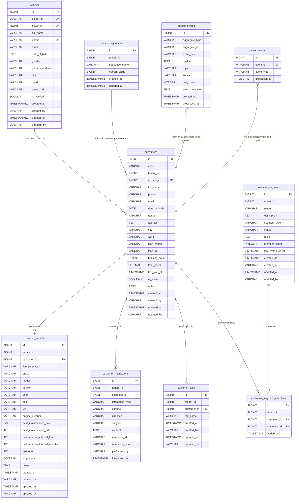

# Data Model — `gf-customer`

> PostgreSQL, schema mặc định `${DB_SCHEMA:gf_customer}`. Flyway là nguồn DDL, JPA chạy với `ddl-auto=validate`.

## 1. ERD Overview

## 2. Entities

### `contacts`

| Column | Type | Nullable | Description |
|---|---|---|---|
| `id` | `BIGSERIAL` | NO | Khóa chính surrogate. |
| `global_id` | `VARCHAR(50)` | NO | Định danh liên tenant của contact, unique toàn cục. |
| `driver_id` | `BIGINT` | YES | Tham chiếu logic 1-1 tới Driver+/identity, unique khi có giá trị. |
| `full_name` | `VARCHAR(200)` | NO | Họ tên contact. |
| `phone` | `VARCHAR(20)` | NO | Số điện thoại contact, unique toàn cục. |
| `email` | `VARCHAR(200)` | YES | Email contact. |
| `date_of_birth` | `DATE` | YES | Ngày sinh, dùng cho tìm kiếm sinh nhật. |
| `gender` | `VARCHAR(10)` | YES | Giới tính; chỉ nhận `MALE`, `FEMALE`, `OTHER`. |
| `primary_address` | `VARCHAR(500)` | YES | Địa chỉ chính. |
| `city` | `VARCHAR(100)` | YES | Tỉnh/thành phố. |
| `ward` | `VARCHAR(100)` | YES | Phường/xã. |
| `avatar_url` | `VARCHAR(500)` | YES | URL ảnh đại diện. |
| `is_verified` | `BOOLEAN` | NO | Trạng thái đã xác minh, mặc định `FALSE`. |
| `created_at` | `TIMESTAMPTZ` | NO | Thời điểm tạo, mặc định `CURRENT_TIMESTAMP`. |
| `created_by` | `VARCHAR(100)` | NO | Người tạo. DDL cho phép NULL nhưng entity annotation `nullable=false`. |
| `updated_at` | `TIMESTAMPTZ` | NO | Thời điểm cập nhật, mặc định `CURRENT_TIMESTAMP`. |
| `updated_by` | `VARCHAR(100)` | YES | Người cập nhật. |

**Indexes**: `idx_contacts_phone(phone)`, `idx_contacts_driver_id(driver_id)`, `idx_contacts_email(email)`, `idx_contacts_birthday(EXTRACT(MONTH FROM date_of_birth), EXTRACT(DAY FROM date_of_birth))`, `idx_contacts_city(city)`.

**Constraints**: PK `id`; unique `uk_contacts_global_id(global_id)`, `uk_contacts_phone(phone)`, `uk_contacts_driver_id(driver_id)`; check `chk_contacts_gender` giới hạn `gender` trong `MALE`, `FEMALE`, `OTHER`.

**Repository/query chính**: tìm theo `phone`, `driver_id`, `global_id`, tập `phone`; kiểm tra tồn tại theo `phone`.

### `customers`

| Column | Type | Nullable | Description |
|---|---|---|---|
| `id` | `BIGSERIAL` | NO | Khóa chính surrogate. |
| `code` | `VARCHAR(50)` | NO | Mã khách hàng theo tenant, sinh qua `tenant_sequences`. Entity annotation `unique=true`, DDL ràng buộc composite `UNIQUE(tenant_id, code)`. |
| `tenant_id` | `BIGINT` | NO | Tenant sở hữu hồ sơ khách hàng. |
| `contact_id` | `BIGINT` | NO | FK tới `contacts.id`. |
| `full_name` | `VARCHAR(255)` | NO | Snapshot họ tên khách hàng trong tenant. DDL `VARCHAR(255)`, entity annotation `length=200`. |
| `phone` | `VARCHAR(20)` | NO | Số điện thoại khách hàng, unique trong tenant. |
| `email` | `VARCHAR(255)` | YES | Email khách hàng. DDL `VARCHAR(255)`, entity annotation `length=200`. |
| `date_of_birth` | `DATE` | YES | Ngày sinh khách hàng. |
| `gender` | `VARCHAR(10)` | YES | Giới tính lưu theo enum `Gender`. |
| `address` | `TEXT` | YES | Địa chỉ khách hàng. DDL `TEXT`, entity annotation `length=500`. |
| `city` | `VARCHAR(100)` | YES | Tỉnh/thành phố. |
| `ward` | `VARCHAR(100)` | YES | Phường/xã. |
| `lead_source` | `VARCHAR(30)` | YES | Nguồn lead; enum `DRIVER_APP`, `WALK_IN`, `IMPORT`, `MANUAL`, `REFERRAL`, `MARKETING_CAMPAIGN`, `QR_SCAN`, `SELF`. |
| `lead_id` | `VARCHAR(100)` | YES | Định danh lead từ hệ thống ngoài. |
| `booking_count` | `INTEGER` | YES | Số lượt booking, mặc định `0`. |
| `total_spent` | `DECIMAL(15,2)` | YES | Tổng chi tiêu, mặc định `0`. |
| `last_visit_at` | `TIMESTAMP` | YES | Lần ghé/visit gần nhất. |
| `is_active` | `BOOLEAN` | YES | Trạng thái hoạt động mềm, mặc định `TRUE`. |
| `notes` | `TEXT` | YES | Ghi chú tự do về khách hàng. |
| `created_at` | `TIMESTAMP` | NO | Thời điểm tạo, mặc định `CURRENT_TIMESTAMP`. |
| `created_by` | `VARCHAR(100)` | NO | Người tạo. DDL cho phép NULL nhưng entity annotation `nullable=false`. |
| `updated_at` | `TIMESTAMP` | NO | Thời điểm cập nhật, mặc định `CURRENT_TIMESTAMP`. |
| `updated_by` | `VARCHAR(100)` | YES | Người cập nhật. |

**Indexes**: `idx_customers_tenant_id(tenant_id)`, `idx_customers_phone(phone)`, `idx_customers_email(email)`, `idx_customers_full_name(full_name)`, `idx_customers_date_of_birth(date_of_birth)`, `idx_customers_lead_source(lead_source)`.

**Constraints**: PK `id`; FK `contact_id` tới `contacts(id)`; unique `uk_customer_tenant_code(tenant_id, code)`, `uk_customer_tenant_phone(tenant_id, phone)`.

**Repository/query chính**: truy cập theo `tenant_id` + `id/code/phone`, lock bi quan khi update, tìm sinh nhật, tìm theo lead id, tìm theo tập id/phone/code, tìm kiếm keyword bằng `unaccent_vi`, gợi ý theo phone/name và plate, truy vấn campaign theo sinh nhật/bảo dưỡng/inactive/segment.

### `customer_vehicles`

| Column | Type | Nullable | Description |
|---|---|---|---|
| `id` | `BIGSERIAL` | NO | Khóa chính surrogate. |
| `tenant_id` | `BIGINT` | NO | Tenant sở hữu xe. |
| `customer_id` | `BIGINT` | NO | FK tới `customers.id`. |
| `license_plate` | `VARCHAR(20)` | YES | Biển số xe; nullable sau migration V5. |
| `brand` | `VARCHAR(100)` | YES | Hãng xe. |
| `model` | `VARCHAR(100)` | YES | Mẫu xe. |
| `version` | `VARCHAR(100)` | YES | Phiên bản xe. |
| `year` | `VARCHAR(100)` | YES | Năm sản xuất hoặc chuỗi linh hoạt; đổi từ `INTEGER` sang `VARCHAR(100)` ở V4. |
| `color` | `VARCHAR(50)` | YES | Màu xe. |
| `vin` | `VARCHAR(50)` | YES | Số VIN. |
| `engine_number` | `VARCHAR(50)` | YES | Số máy. |
| `next_maintenance_date` | `DATE` | YES | Ngày bảo dưỡng tiếp theo. |
| `next_maintenance_odo` | `INT` | YES | ODO bảo dưỡng tiếp theo. |
| `maintenance_interval_km` | `INT` | YES | Chu kỳ bảo dưỡng theo km, mặc định `5000`. |
| `maintenance_interval_months` | `INT` | YES | Chu kỳ bảo dưỡng theo tháng, mặc định `6`. |
| `last_odo` | `INT` | YES | ODO gần nhất. |
| `is_primary` | `BOOLEAN` | NO | Cờ xe chính, mặc định `TRUE`. |
| `notes` | `TEXT` | YES | Ghi chú về xe. |
| `created_at` | `TIMESTAMP` | NO | Thời điểm tạo, mặc định `CURRENT_TIMESTAMP`. |
| `created_by` | `VARCHAR(100)` | NO | Người tạo. DDL cho phép NULL nhưng entity annotation `nullable=false`. |
| `updated_at` | `TIMESTAMP` | NO | Thời điểm cập nhật, mặc định `CURRENT_TIMESTAMP`. |
| `updated_by` | `VARCHAR(100)` | YES | Người cập nhật. |

**Indexes**: `idx_customer_vehicles_customer_id(customer_id)`, `idx_customer_vehicles_tenant_id(tenant_id)`, `idx_customer_vehicles_license_plate(license_plate)`.

**Constraints**: PK `id`; FK `customer_id` tới `customers(id)`.

**Repository/query chính**: truy cập theo `tenant_id` + `id/customer_id/license_plate`, kiểm tra biển số, xóa theo tập id trong tenant, chuyển xe khi merge customer, gợi ý plate, tìm plate + phone, lọc quản trị theo keyword/brand/model bằng `Specification`.

### `customer_segments`

| Column | Type | Nullable | Description |
|---|---|---|---|
| `id` | `BIGSERIAL` | NO | Khóa chính surrogate. |
| `tenant_id` | `BIGINT` | NO | Tenant sở hữu phân khúc. |
| `name` | `VARCHAR(255)` | NO | Tên phân khúc. DDL `VARCHAR(255)`, entity annotation `length=100`. |
| `description` | `TEXT` | YES | Mô tả phân khúc. DDL `TEXT`, entity annotation `length=500`. |
| `segment_type` | `VARCHAR(20)` | NO | Loại phân khúc; enum `STATIC` hoặc `DYNAMIC`. |
| `status` | `VARCHAR(20)` | NO | Trạng thái; enum `ACTIVE`, `EVALUATING`, `ARCHIVED`, mặc định `ACTIVE`. |
| `rules` | `TEXT` | YES | Rule động dạng JSON/text từ `SegmentRules`. |
| `member_count` | `INTEGER` | YES | Số thành viên cache, mặc định `0`. |
| `last_evaluated_at` | `TIMESTAMP` | YES | Lần đánh giá rule gần nhất. |
| `created_at` | `TIMESTAMP` | NO | Thời điểm tạo, mặc định `CURRENT_TIMESTAMP`. |
| `created_by` | `VARCHAR(100)` | NO | Người tạo. DDL cho phép NULL nhưng entity annotation `nullable=false`. |
| `updated_at` | `TIMESTAMP` | NO | Thời điểm cập nhật, mặc định `CURRENT_TIMESTAMP`. |
| `updated_by` | `VARCHAR(100)` | YES | Người cập nhật. |

**Indexes**: `idx_customer_segments_tenant_id(tenant_id)`, `idx_customer_segments_type(segment_type)`, `idx_customer_segments_status(status)`.

**Constraints**: PK `id`.

**Repository/query chính**: truy cập theo `tenant_id` + `id/name`, kiểm tra trùng tên khi update, tìm segment động `DYNAMIC` + `ACTIVE`, liệt kê tenant có segment động, search bằng `Specification`.

### `customer_segment_members`

| Column | Type | Nullable | Description |
|---|---|---|---|
| `id` | `BIGSERIAL` | NO | Khóa chính surrogate. |
| `tenant_id` | `BIGINT` | NO | Tenant sở hữu membership. |
| `segment_id` | `BIGINT` | NO | FK tới `customer_segments.id`. |
| `customer_id` | `BIGINT` | NO | FK tới `customers.id`. |
| `added_at` | `TIMESTAMP` | NO | Thời điểm thêm vào phân khúc, mặc định `CURRENT_TIMESTAMP`. |

**Indexes**: `idx_segment_members_segment_id(segment_id)`, `idx_segment_members_customer_id(customer_id)`, `idx_segment_members_tenant_id(tenant_id)`.

**Constraints**: PK `id`; FK `segment_id` tới `customer_segments(id)`; FK `customer_id` tới `customers(id)`; unique `uk_segment_member(segment_id, customer_id)`.

**Repository/query chính**: truy cập theo `tenant_id` + `segment_id/customer_id`, phân trang customer id theo segment, đếm thành viên, xóa theo segment hoặc segment+customer, chuyển membership khi merge customer, search khách trong segment theo name/phone.

### `customer_interactions`

| Column | Type | Nullable | Description |
|---|---|---|---|
| `id` | `BIGSERIAL` | NO | Khóa chính surrogate. |
| `tenant_id` | `BIGINT` | NO | Tenant sở hữu tương tác. |
| `customer_id` | `BIGINT` | NO | FK tới `customers.id`. |
| `interaction_type` | `VARCHAR(30)` | NO | Loại tương tác; enum `CALL`, `SMS`, `EMAIL`, `NOTE`, `BOOKING`, `SERVICE`, `FEEDBACK`, `PUSH`, `ZALO`, `VISIT`. |
| `channel` | `VARCHAR(50)` | YES | Kênh tương tác; enum `PHONE`, `SMS`, `EMAIL`, `APP`, `IN_PERSON`. |
| `direction` | `VARCHAR(10)` | YES | Hướng tương tác dạng chuỗi. |
| `subject` | `VARCHAR(255)` | YES | Chủ đề tương tác. DDL `VARCHAR(255)`, entity annotation `length=200`. |
| `content` | `TEXT` | YES | Nội dung tương tác. |
| `reference_id` | `VARCHAR(100)` | YES | Định danh nghiệp vụ ngoài được tham chiếu. |
| `reference_type` | `VARCHAR(50)` | YES | Loại tham chiếu; domain enum có `BOOKING`, `CAMPAIGN`, `SERVICE_ORDER`. |
| `performed_by` | `VARCHAR(100)` | YES | Người thực hiện. |
| `interaction_at` | `TIMESTAMP` | NO | Thời điểm tương tác, mặc định `CURRENT_TIMESTAMP`. |

**Indexes**: `idx_customer_interactions_customer_id(customer_id)`, `idx_customer_interactions_tenant_id(tenant_id)`, `idx_customer_interactions_interaction_at(interaction_at)`.

**Constraints**: PK `id`; FK `customer_id` tới `customers(id)`.

**Repository/query chính**: truy cập theo `tenant_id` + `id/customer_id/type/reference`, tìm theo customer sắp xếp mới nhất, search theo type/channel/direction/keyword/reference/performed_by/khoảng thời gian, chuyển tương tác khi merge customer.

### `customer_tags`

| Column | Type | Nullable | Description |
|---|---|---|---|
| `id` | `BIGSERIAL` | NO | Khóa chính surrogate. |
| `tenant_id` | `BIGINT` | NO | Tenant sở hữu tag. |
| `customer_id` | `BIGINT` | NO | FK tới `customers.id`. |
| `tag_name` | `VARCHAR(100)` | NO | Tên tag gắn cho khách hàng. |
| `created_at` | `TIMESTAMP` | NO | Thời điểm tạo, mặc định `CURRENT_TIMESTAMP`. |
| `created_by` | `VARCHAR(100)` | NO | Người tạo. DDL cho phép NULL nhưng entity annotation `nullable=false`. |
| `updated_at` | `TIMESTAMP` | NO | Thời điểm cập nhật, mặc định `CURRENT_TIMESTAMP`. |
| `updated_by` | `VARCHAR(100)` | YES | Người cập nhật. |

**Indexes**: `idx_customer_tags_customer_id(customer_id)`, `idx_customer_tags_tenant_id(tenant_id)`, `idx_customer_tags_tag_name(tag_name)`.

**Constraints**: PK `id`; FK `customer_id` tới `customers(id)`; unique `uk_customer_tag(customer_id, tag_name)`.

**Repository/query chính**: lấy danh sách tag theo customer trong tenant, tìm customer id theo tag, xóa tag theo customer/tag hoặc toàn bộ customer, chuyển tag khi merge customer.

### `tenant_sequences`

| Column | Type | Nullable | Description |
|---|---|---|---|
| `id` | `BIGSERIAL` | NO | Khóa chính surrogate. |
| `tenant_id` | `BIGINT` | NO | Tenant sở hữu sequence. |
| `sequence_name` | `VARCHAR(50)` | NO | Tên sequence, ví dụ `CUSTOMER_CODE`. |
| `current_value` | `BIGINT` | NO | Giá trị đã cấp gần nhất, mặc định `0`. |
| `created_at` | `TIMESTAMPTZ` | NO | Thời điểm tạo, mặc định `CURRENT_TIMESTAMP`. |
| `updated_at` | `TIMESTAMPTZ` | NO | Thời điểm cập nhật, mặc định `CURRENT_TIMESTAMP`. |

**Indexes**: `idx_tenant_sequences_tenant_id(tenant_id)`, `idx_tenant_sequences_name(sequence_name)`.

**Constraints**: PK `id`; unique `uk_tenant_sequence(tenant_id, sequence_name)`.

**Repository/query chính**: tìm theo `tenant_id` + `sequence_name`; bản `findByTenantIdAndSequenceNameWithLock` dùng `PESSIMISTIC_WRITE` để cấp số an toàn khi tăng `current_value`.

### `outbox_events`

| Column | Type | Nullable | Description |
|---|---|---|---|
| `id` | `BIGSERIAL` | NO | Khóa chính surrogate. |
| `aggregate_type` | `VARCHAR(100)` | NO | Loại aggregate phát sinh sự kiện. |
| `aggregate_id` | `VARCHAR(100)` | NO | Định danh aggregate phát sinh sự kiện. |
| `event_type` | `VARCHAR(100)` | NO | Loại sự kiện. |
| `payload` | `TEXT` | NO | Payload sự kiện dạng serialized text. |
| `topic` | `VARCHAR(200)` | YES | Kafka topic đích. |
| `status` | `VARCHAR(20)` | NO | Trạng thái outbox; enum `PENDING`, `PROCESSING`, `SENT`, `FAILED`, mặc định `PENDING`. |
| `retry_count` | `INTEGER` | YES | Số lần retry, mặc định `0`. |
| `error_message` | `TEXT` | YES | Lỗi xử lý gần nhất. |
| `created_at` | `TIMESTAMP` | NO | Thời điểm tạo, mặc định `CURRENT_TIMESTAMP`. |
| `processed_at` | `TIMESTAMP` | YES | Thời điểm xử lý hoặc gửi xong. |

**Indexes**: `idx_outbox_events_status(status)`, `idx_outbox_events_created_at(created_at)`, `idx_outbox_events_aggregate(aggregate_type, aggregate_id)`.

**Constraints**: PK `id`.

**Repository/query chính**: polling sự kiện `PENDING` hoặc `PROCESSING` quá stale bằng `PESSIMISTIC_WRITE` và lock timeout `3000`, giới hạn `retry_count`, xóa event đã xử lý cũ theo `status` và `processed_at`.

### `inbox_events`

| Column | Type | Nullable | Description |
|---|---|---|---|
| `id` | `BIGSERIAL` | NO | Khóa chính surrogate. |
| `event_id` | `VARCHAR(100)` | NO | Idempotency key của sự kiện ngoài, unique. |
| `event_type` | `VARCHAR(100)` | NO | Loại sự kiện ngoài. |
| `processed_at` | `TIMESTAMP` | NO | Thời điểm xử lý, mặc định `CURRENT_TIMESTAMP`. |

**Indexes**: `idx_inbox_events_event_id(event_id)`, `idx_inbox_events_processed_at(processed_at)`.

**Constraints**: PK `id`; unique inline trên `event_id`.

**Repository/query chính**: kiểm tra tồn tại theo `event_id`; cập nhật `processed_at` theo `event_id`. **Known defect**: `JpaInboxRepository` khai báo `JpaRepository<InboxEntity, String>` (id type `String`) trong khi `InboxEntity.id` là `Long` và DDL là `BIGSERIAL`. Các query hiện tại chỉ dùng `eventId` nên chưa gây lỗi runtime, nhưng `findById()`/`deleteById()` sẽ fail nếu gọi trực tiếp.

**Enum và value object được lưu trong cột**

| Nhóm | Giá trị | Nơi lưu |
|---|---|---|
| `Gender` | `MALE`, `FEMALE`, `OTHER` | `contacts.gender`, `customers.gender` |
| `LeadSource` | `DRIVER_APP`, `WALK_IN`, `IMPORT`, `MANUAL`, `REFERRAL`, `MARKETING_CAMPAIGN`, `QR_SCAN`, `SELF` | `customers.lead_source` |
| `InteractionType` | `CALL`, `SMS`, `EMAIL`, `NOTE`, `BOOKING`, `SERVICE`, `FEEDBACK`, `PUSH`, `ZALO`, `VISIT` | `customer_interactions.interaction_type` |
| `InteractionChannel` | `PHONE`, `SMS`, `EMAIL`, `APP`, `IN_PERSON` | `customer_interactions.channel` |
| `ReferenceType` | `BOOKING`, `CAMPAIGN`, `SERVICE_ORDER` | Domain enum (`com.actechx.gf.domain.model.enums.ReferenceType`) cho `customer_interactions.reference_type`. Xác định loại đối tượng nghiệp vụ được tham chiếu bởi tương tác. |
| `SegmentType` | `STATIC`, `DYNAMIC` | `customer_segments.segment_type` |
| `SegmentStatus` | `ACTIVE`, `EVALUATING`, `ARCHIVED` | `customer_segments.status` |
| `CriteriaType` | `TOTAL_SPENT`, `REGISTRATION_DATE`, `CITY`, `VEHICLE_INFO`, `INACTIVE_DAYS`, `BOOKING_COUNT` | Domain enum (`com.actechx.gf.domain.model.enums.CriteriaType`) dùng trong JSON/text `customer_segments.rules`. `TOTAL_SPENT`: total_spent >= value; `REGISTRATION_DATE`: created_at BETWEEN from/to; `CITY`: city IN list; `VEHICLE_INFO`: match brand/model; `INACTIVE_DAYS`: last_visit_at >= NOW() - days; `BOOKING_COUNT`: booking_count >= value. |
| `SegmentRules.CombineOperator` | `AND`, `OR` | JSON/text trong `customer_segments.rules` |
| `OutboxStatus` | `PENDING`, `PROCESSING`, `SENT`, `FAILED` | `outbox_events.status` |

## 3. Data Isolation

`gf-customer` dùng mô hình pooled multi-tenant trong cùng schema. Các bảng tenant-scoped bắt buộc có `tenant_id`: `customers`, `customer_vehicles`, `customer_segments`, `customer_segment_members`, `customer_interactions`, `customer_tags`, `tenant_sequences`.

Các bảng global không có `tenant_id`: `contacts`, `outbox_events`, `inbox_events`. `contacts` là hồ sơ contact liên tenant, được ràng buộc unique toàn cục bằng `global_id`, `phone`, `driver_id`. `outbox_events` và `inbox_events` phải mang ngữ cảnh tenant trong payload/header hoặc khóa sự kiện vì schema vật lý không có cột `tenant_id`.

Repository business cho dữ liệu tenant-scoped đều có đường truy cập chính theo `tenant_id` và id/khóa nghiệp vụ. Unique constraint của customer code/phone và tenant sequence cũng được scope theo `tenant_id`. Các luồng merge customer chuyển `customer_vehicles`, `customer_interactions`, `customer_tags`, và `customer_segment_members` trong cùng tenant.

## 4. Migration

Migration chạy bằng Flyway từ `classpath:db/migration`, schema mặc định `${DB_SCHEMA:gf_customer}`. JPA validate schema thay vì tự sinh DDL.

| Migration | Nội dung |
|---|---|
| `V1__create_customer_tables.sql` | Tạo `contacts`, `customers`, `customer_vehicles`, `customer_segments`, `customer_segment_members`, `customer_interactions`, `customer_tags`, FK, unique constraint, check constraint và index nghiệp vụ. |
| `V2__create_outbox_inbox_tables.sql` | Tạo `outbox_events`, `inbox_events` và các index xử lý event. |
| `V3__create_tenant_sequence_table.sql` | Tạo `tenant_sequences`, unique `(tenant_id, sequence_name)` và index lookup. |
| `V4__alter_vehicle_year_to_varchar.sql` | Đổi `customer_vehicles.year` từ `INTEGER` sang `VARCHAR(100)`. |
| `V5__alter_license_plate_nullable.sql` | Bỏ `NOT NULL` khỏi `customer_vehicles.license_plate`. |
| `V6__enable_unaccent_extension.sql` | Tạo function `unaccent_vi(input TEXT)` để hỗ trợ tìm kiếm tiếng Việt không dấu. |

Ghi nhận khi đối chiếu code hiện tại:

- DDL là nguồn chính cho `Type` trong tài liệu này vì runtime dùng `ddl-auto=validate`.
- 6 cột có entity annotation length hẹp hơn DDL (đã ghi nhận tại từng cột): `customers.full_name` (entity 200, DDL 255), `customers.email` (entity 200, DDL 255), `customers.address` (entity 500, DDL TEXT), `customer_segments.name` (entity 100, DDL 255), `customer_segments.description` (entity 500, DDL TEXT), `customer_interactions.subject` (entity 200, DDL 255).
- `AuditableEntity.createdBy` khai báo `nullable=false` nhưng DDL không có `NOT NULL`. Entity layer sẽ reject NULL tại application level; DDL cho phép NULL tại database level.
- `CustomerEntity.code` khai báo `unique = true` ở annotation, còn DDL ràng buộc unique composite `UNIQUE(tenant_id, code)`. Annotation đơn không phản ánh đúng ràng buộc thực tế.
- **Known defect**: `JpaInboxRepository` khai báo `JpaRepository<InboxEntity, String>` (id type `String`), trong khi `InboxEntity.id` là `Long` và DDL là `BIGSERIAL`. Xem chi tiết tại mục `inbox_events`.

## 5. References

- [gf-customer-HLD.md](../hld/gf-customer-HLD.md)
- [gf-customer-api.md](../api/gf-customer-api.md)
- [example-data-model.md](example-data-model.md)
- [_TEMPLATE-data-model.md](_TEMPLATE-data-model.md)

## Change Log

| Date | Version | Summary |
|---|---|---|
| 2026-05-19 | v2 | Sửa 5 vấn đề từ audit đối chiếu code: (1) ghi nhận 6 column length mismatch giữa entity annotation và DDL tại từng cột (`customers.full_name/email/address`, `customer_segments.name/description`, `customer_interactions.subject`); (2) sửa `AuditableEntity.createdBy` nullable từ YES thành NO cho 5 bảng (`contacts`, `customers`, `customer_vehicles`, `customer_segments`, `customer_tags`) khớp entity annotation `nullable=false`; (3) bổ sung chi tiết known defect `JpaInboxRepository` id type mismatch `String` vs `Long`; (4) bổ sung formal documentation cho enum `ReferenceType` và `CriteriaType` với mô tả giá trị và class path; (5) ghi nhận `CustomerEntity.code` entity annotation `unique=true` vs DDL composite `UNIQUE(tenant_id, code)`. |
| 2026-05-07 | v1 | Initial data model cho `gf-customer`: PostgreSQL schema `${DB_SCHEMA:gf_customer}` với 10 bảng (`contacts`, `customers`, `customer_vehicles`, `customer_segments`, `customer_segment_members`, `customer_interactions`, `customer_tags`, `tenant_sequences`, `outbox_events`, `inbox_events`), các enum `Gender`, `LeadSource`, `InteractionType`, `InteractionChannel`, `SegmentType`, `SegmentStatus`, `OutboxStatus`. Pooled multi-tenant qua `tenant_id`; `contacts` global. Migration bằng Flyway (V1-V6) với JPA `ddl-auto=validate`. Bao gồm ERD overview, entities, data isolation, migration, references.
