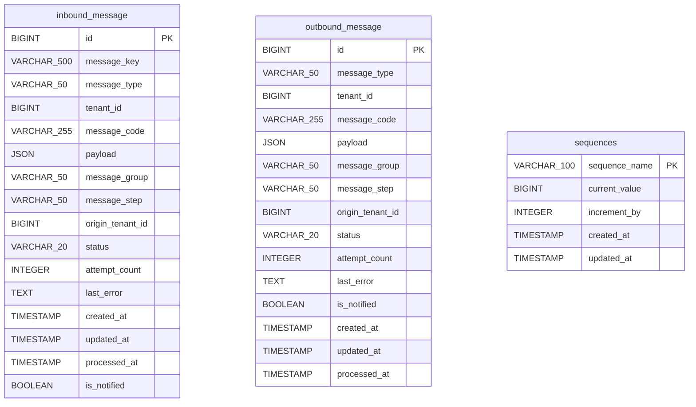

# Data Model — `gf-erp-agent`

> PostgreSQL, schema `${DB_SCHEMA:dev-gf-erp-agent}`. Boundary này chỉ sở hữu dữ liệu durable message relay, retry/notification state và bảng sequence tiện ích; dữ liệu nghiệp vụ gốc nằm ở các service downstream.

## 1. ERD Overview

Không có foreign key vật lý giữa 3 bảng hiện hành. `inbound_message` và `outbound_message` tương quan logic qua `message_code`, `message_group`, `message_step`, `tenant_id` và `origin_tenant_id`; `sequences` là bảng tiện ích theo schema, không được map thành JPA entity.

## 2. Entities

### `inbound_message`

Hàng đợi bền vững cho message nhận từ Kafka/API trước khi gọi downstream service.

| Column | Type | Nullable | Description |
|---|---|---|---|
| `id` | BIGSERIAL | NO | Khóa chính surrogate, sinh bởi PostgreSQL identity/sequence của cột. |
| `message_key` | VARCHAR(500) | NO | Khóa tương quan/idempotency inbound, lấy từ message id; unique constraint ban đầu đã bị drop ở migration `V1.0.7`. |
| `message_type` | VARCHAR(50) | NO | Giá trị enum `InboundMessageType`. |
| `tenant_id` | BIGINT | YES | Tenant hiện tại/đích của message theo contract xử lý. |
| `message_code` | VARCHAR(255) | YES | Mã nghiệp vụ, thường lấy từ header `OriginMessageCode`. |
| `payload` | JSON | YES | Nội dung message dạng JSON, map bằng Hibernate `JsonType` sang Java `String`. |
| `message_group` | VARCHAR(50) | YES | Nhóm routing, ví dụ `QUOTATION`, `PO`, `O`, `PRO`, `PAYMENT`. |
| `message_step` | VARCHAR(50) | YES | Bước nghiệp vụ/routing, ví dụ `BID.1`, `PRICE.2`, `WAIT_TO_CONFIRM.1.1`. |
| `origin_tenant_id` | BIGINT | YES | Tenant nguồn phát sinh luồng, dùng cho flow cross-tenant Garage/Vendor/ERP. |
| `status` | VARCHAR(20) | NO | Trạng thái xử lý; default DB là `PENDING`, domain có `PENDING`, `PRIORITY_PROCESSING`, `COMPLETED`, `FAILED`, `RETRYING`. |
| `attempt_count` | INTEGER | NO | Số lần retry xử lý hoặc notification; default DB/domain là `0`. |
| `last_error` | TEXT | YES | Lỗi xử lý hoặc lỗi notification gần nhất. |
| `is_notified` | BOOLEAN | NO | Cờ đã gửi notification; default DB/domain là `false`. |
| `created_at` | TIMESTAMP | NO | Thời điểm tạo row; default DB là `CURRENT_TIMESTAMP`, domain cũng set khi tạo message. |
| `updated_at` | TIMESTAMP | NO | Thời điểm cập nhật row; default DB là `CURRENT_TIMESTAMP`, repository/domain cập nhật khi save/chuyển trạng thái. |
| `processed_at` | TIMESTAMP | YES | Thời điểm xử lý thành công và chuyển `COMPLETED`. |

**Indexes**: chỉ có primary key trên `id` trong schema hiện hành; unique index tự sinh cho `message_key` đã bị drop ở `V1.0.7`.

**Constraints**: `id` primary key; `message_key`, `message_type`, `status`, `attempt_count`, `is_notified`, `created_at`, `updated_at` là `NOT NULL`; không có foreign key.

### `outbound_message`

Hàng đợi bền vững cho command outbound được protected REST API tạo trước khi publish Kafka.

| Column | Type | Nullable | Description |
|---|---|---|---|
| `id` | BIGSERIAL | NO | Khóa chính surrogate, sinh bởi PostgreSQL identity/sequence của cột. |
| `message_type` | VARCHAR(50) | NO | Giá trị enum `OutboundMessageType`. |
| `tenant_id` | BIGINT | YES | Tenant hiện tại/đích của message theo contract publish. |
| `message_code` | VARCHAR(255) | YES | Mã nghiệp vụ dùng làm `OriginMessageCode` khi publish. |
| `payload` | JSON | YES | Nội dung command dạng JSON, map bằng Hibernate `JsonType` sang Java `String`. |
| `message_group` | VARCHAR(50) | YES | Nhóm routing khi publish, ví dụ `QUOTATION`, `PO`, `O`. |
| `message_step` | VARCHAR(50) | YES | Bước nghiệp vụ/routing khi publish. |
| `origin_tenant_id` | BIGINT | YES | Tenant nguồn của luồng; domain constructor parse từ `String` sang `Long`. |
| `status` | VARCHAR(20) | NO | Trạng thái xử lý; default DB là `PENDING`, domain có `PENDING`, `PRIORITY_PROCESSING`, `COMPLETED`, `FAILED`, `RETRYING`. |
| `attempt_count` | INTEGER | NO | Số lần retry publish hoặc notification; default DB/domain là `0`. |
| `last_error` | TEXT | YES | Lỗi publish hoặc lỗi notification gần nhất. |
| `created_at` | TIMESTAMP | NO | Thời điểm tạo row; default DB là `CURRENT_TIMESTAMP`, domain cũng set khi tạo message. |
| `updated_at` | TIMESTAMP | NO | Thời điểm cập nhật row; default DB là `CURRENT_TIMESTAMP`, repository/domain cập nhật khi save/chuyển trạng thái. |
| `processed_at` | TIMESTAMP | YES | Thời điểm publish thành công và chuyển `COMPLETED`. |
| `is_notified` | BOOLEAN | NO | Cờ đã gửi notification; được thêm ở `V1.0.8`, default DB/domain là `false`. |

**Indexes**: chỉ có primary key trên `id` trong schema hiện hành.

**Constraints**: `id` primary key; `message_type`, `status`, `attempt_count`, `created_at`, `updated_at`, `is_notified` là `NOT NULL`; không có foreign key.

### `sequences`

Bảng tiện ích tồn tại từ migration đầu tiên, dùng để giữ counter theo `sequence_name`.

| Column | Type | Nullable | Description |
|---|---|---|---|
| `sequence_name` | VARCHAR(100) | NO | Khóa sequence; là primary key của bảng. |
| `current_value` | BIGINT | NO | Giá trị hiện tại; default là `0`, function tăng theo `increment_by`. |
| `increment_by` | INTEGER | NO | Bước tăng; default là `1`. |
| `created_at` | TIMESTAMP | NO | Thời điểm tạo row; default là `CURRENT_TIMESTAMP`. |
| `updated_at` | TIMESTAMP | NO | Thời điểm cập nhật row; default là `CURRENT_TIMESTAMP`, function cập nhật khi tăng sequence. |

**Indexes**: primary key trên `sequence_name`; index `idx_sequences_sequence_name` cũng trỏ tới `sequence_name`.

**Constraints**: `sequence_name` primary key; `current_value`, `increment_by`, `created_at`, `updated_at` là `NOT NULL`.

## 3. Data Isolation

| Object | Tenant/scope fields | Cách cô lập dữ liệu |
|---|---|---|
| `inbound_message` | `tenant_id`, `origin_tenant_id` | DB cho phép null; service phải diễn giải tenant hiện tại và tenant nguồn theo `message_type`, `message_group`, `message_step` và headers inbound. |
| `outbound_message` | `tenant_id`, `origin_tenant_id` | DB cho phép null; protected command API và application service truyền tenant theo payload/command trước khi publish. |
| `sequences` | Không có tenant field | Cô lập theo PostgreSQL schema `${DB_SCHEMA:dev-gf-erp-agent}` và khóa `sequence_name`; không cô lập theo row tenant. |

`payload` có thể chứa thêm tenant id, mã đơn, thông tin vận chuyển, thanh toán hoặc notification. Các field tenant trong message table là metadata routing, còn kiểm soát requiredness theo từng message type nằm ở service/handler, không được enforce bằng constraint DB.

## 4. Migration

| Migration | Tác động schema hiện hành |
|---|---|
| `V1.0.0__initialize.sql` | Tạo `sequences`, procedure `get_next_id`, index `idx_sequences_sequence_name` và bảng legacy `quotation_ask`. |
| `V1.0.1__update_sequence_table.sql` | Tạo function `get_next_number(schemaName, sequenceName)` dùng bảng `sequences` theo schema truyền vào. |
| `V1.0.2__create_quotation_bid.sql` | Tạo bảng legacy `quotation_bid`. |
| `V1.0.3__update_origin_id.sql` | Cho phép `original_id` null ở các bảng quotation legacy. |
| `V1.0.4__create_quotation_ask_update.sql` | Drop `original_id` khỏi quotation legacy và tạo bảng legacy `quotation_ask_update`. |
| `V1.0.5__create_pricing_tables.sql` | Tạo bảng legacy `pricing_request` và `pricing_proposal`. |
| `V1.0.6__Create_Simple_Message_Tables.sql` | Tạo `outbound_message` và `inbound_message`; `inbound_message.message_key` ban đầu có unique constraint. |
| `V1.0.7__Clean_old_tables.sql` | Drop unique constraint `inbound_message_message_key_key`; drop các bảng legacy `quotation_ask`, `quotation_bid`, `quotation_ask_update`, `pricing_request`, `pricing_proposal`. |
| `V1.0.8__update_outbound_message_table.sql` | Thêm `outbound_message.is_notified BOOLEAN NOT NULL DEFAULT FALSE`. |

Giải pháp migration đang dùng là Flyway (`spring.flyway.enabled=true`, `validate-on-migrate=true`) với JPA `ddl-auto=none`. Schema mặc định là `${DB_SCHEMA:dev-gf-erp-agent}`. Source runtime gọi function `get_next_number(schemaName, sequenceName)` qua `DBUtils`; migration SQL không drop procedure cũ `get_next_id`, nên procedure này có thể vẫn tồn tại ở database đã chạy từ `V1.0.0` nhưng không thấy code hiện tại gọi.

## 5. References

- [gf-erp-agent-HLD.md](../hld/gf-erp-agent-HLD.md)
- [gf-erp-agent-api.md](../api/gf-erp-agent-api.md)
- [erp-agent-events.md](../events/erp-agent-events.md)
- [erp-agent-message-relay-flow.md](../workflows/erp-agent-message-relay-flow.md)

## Change Log

| Date | Version | Summary |
|---|---|---|
| 2026-05-07 | v1 | Initial data model cho `gf-erp-agent`: PostgreSQL schema `${DB_SCHEMA:dev-gf-erp-agent}` với 3 bảng durable message relay `inbound_message`, `outbound_message`, `sequences`, các enum `InboundMessageType`, `OutboundMessageType` và status `PENDING`/`PROCESSING`/`COMPLETED`/`FAILED`/`RETRYING`. Tenant chỉ được mang qua `tenant_id`/`origin_tenant_id` metadata, không enforce bằng constraint; cô lập theo schema. Migration bằng Flyway (V1.0.0-V1.0.8) với JPA `ddl-auto=none`. Bao gồm ERD overview, entities, data isolation, migration, references.
