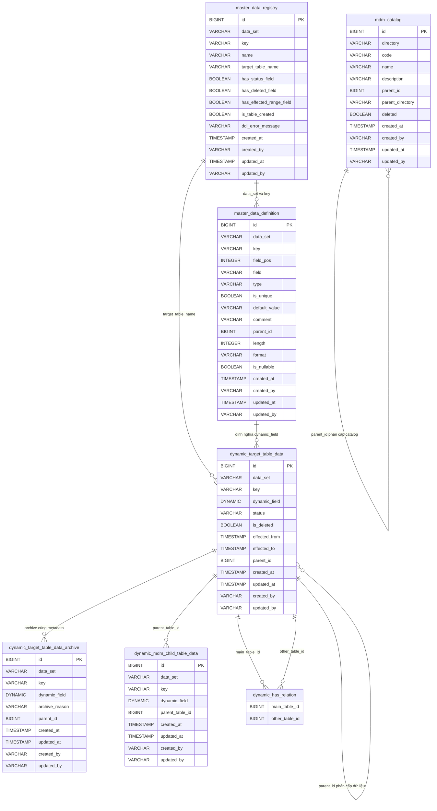

# Data Model — gf-erp-mdm

> PostgreSQL, schema mặc định `${DB_SCHEMA:dev_gf_erp_mdm}`. Service quản lý dữ liệu master toàn cục và tạo bảng master data động theo metadata runtime.

## 1. ERD Overview

## 2. Entities

### `mdm_catalog`

| Column | Type | Nullable | Description |
|---|---|---|---|
| `id` | BIGINT | NO | Primary key sinh bằng `GenerationType.IDENTITY`. |
| `directory` | VARCHAR(255) | YES | Nhóm catalog, ví dụ `CAR_BRAND`, `CAR_MODEL`, `YEAR_OF_MANUFACTURE`, `TRIMS_LEVEL`. |
| `code` | VARCHAR(255) | YES | Mã catalog dùng cho lookup theo `directory`, `parent_id` hoặc danh sách mã. |
| `name` | VARCHAR(255) | YES | Tên hiển thị và tiêu chí tìm kiếm. |
| `description` | VARCHAR(255) | YES | Mô tả catalog. |
| `parent_id` | BIGINT | YES | Khóa cha tự tham chiếu trong cây catalog. |
| `parent_directory` | VARCHAR(255) | YES | Nhóm catalog của bản ghi cha. |
| `deleted` | BOOLEAN | YES | Cờ soft delete; builder trong code đặt mặc định `false`, DB không khai báo default. |
| `created_at` | TIMESTAMP | NO | Thời điểm tạo từ `AuditableEntity`, `updatable=false`. |
| `created_by` | VARCHAR(255) | NO | Người tạo từ `AuditableEntity`, `updatable=false`. |
| `updated_at` | TIMESTAMP | YES | Thời điểm cập nhật từ `AuditableEntity`. |
| `updated_by` | VARCHAR(255) | YES | Người cập nhật từ `AuditableEntity`. |

**Indexes**: Không khai báo explicit index trong entity. Repository truy vấn nhiều theo `directory`, `code`, `parent_id`, `deleted`.
**Constraints**: PK `id`; `created_at` và `created_by` là `NOT NULL`; không khai báo unique constraint trong entity.

### `master_data_registry`

| Column | Type | Nullable | Description |
|---|---|---|---|
| `id` | BIGINT | NO | Primary key sinh bằng `GenerationType.IDENTITY`. |
| `data_set` | VARCHAR(255) | YES | Định danh dataset của master data động. |
| `key` | VARCHAR(255) | YES | Khóa logic của dataset. |
| `name` | VARCHAR(255) | YES | Tên hiển thị của dataset. |
| `target_table_name` | VARCHAR(255) | YES | Tên bảng runtime được lưu là `{targetTableName}_data`. |
| `has_status_field` | BOOLEAN | YES | Cờ yêu cầu thêm cột `status` khi tạo bảng active. |
| `has_deleted_field` | BOOLEAN | YES | Cờ yêu cầu thêm cột `is_deleted` khi tạo bảng active. |
| `has_effected_range_field` | BOOLEAN | YES | Cờ yêu cầu thêm cột `effected_from` và `effected_to` khi tạo bảng active. |
| `is_table_created` | BOOLEAN | YES | Trạng thái tạo bảng; code đặt `false` trước DDL và `true` sau khi DDL thành công. |
| `ddl_error_message` | VARCHAR(255) | YES | Thông báo lỗi khi DDL tạo bảng thất bại. |
| `created_at` | TIMESTAMP | NO | Thời điểm tạo từ `AuditableEntity`, `updatable=false`. |
| `created_by` | VARCHAR(255) | NO | Người tạo từ `AuditableEntity`, `updatable=false`. |
| `updated_at` | TIMESTAMP | YES | Thời điểm cập nhật từ `AuditableEntity`. |
| `updated_by` | VARCHAR(255) | YES | Người cập nhật từ `AuditableEntity`. |

**Indexes**: Không khai báo explicit index trong entity.
**Constraints**: PK `id`; `created_at` và `created_by` là `NOT NULL`; code kiểm tra trùng bảng bằng `information_schema.tables` trước khi tạo.

### `master_data_definition`

| Column | Type | Nullable | Description |
|---|---|---|---|
| `id` | BIGINT | NO | Primary key sinh bằng `GenerationType.IDENTITY`. |
| `data_set` | VARCHAR(255) | YES | Dataset chứa field động. |
| `key` | VARCHAR(255) | YES | Khóa logic đi cùng dataset. |
| `field_pos` | INTEGER | YES | Thứ tự field, tăng từ 1 theo thứ tự request. |
| `field` | VARCHAR(255) | YES | Tên cột động được tạo trong bảng runtime. |
| `type` | VARCHAR(255) | YES | Kiểu logic của cột động. |
| `is_unique` | BOOLEAN | YES | Cờ thêm `UNIQUE` cho cột động khi DDL. |
| `default_value` | VARCHAR(255) | YES | Giá trị mặc định dạng metadata; DDL hiện tại không sinh `DEFAULT` từ cột này. |
| `comment` | VARCHAR(255) | YES | Ghi chú field trong metadata. |
| `parent_id` | BIGINT | YES | Tham chiếu tới definition cha, được resolve từ `parentField`. |
| `length` | INTEGER | YES | Độ dài cho kiểu `STRING`; nếu null thì dùng 255. |
| `format` | VARCHAR(255) | YES | Regex validation runtime theo `data_set`. |
| `is_nullable` | BOOLEAN | YES | Nếu `false`, DDL thêm `NOT NULL` cho cột động. |
| `created_at` | TIMESTAMP | NO | Thời điểm tạo từ `AuditableEntity`, `updatable=false`. |
| `created_by` | VARCHAR(255) | NO | Người tạo từ `AuditableEntity`, `updatable=false`. |
| `updated_at` | TIMESTAMP | YES | Thời điểm cập nhật từ `AuditableEntity`. |
| `updated_by` | VARCHAR(255) | YES | Người cập nhật từ `AuditableEntity`. |

**Indexes**: Không khai báo explicit index trong entity; repository có `findByDataSet`.
**Constraints**: PK `id`; `created_at` và `created_by` là `NOT NULL`; không khai báo FK cho `parent_id`.

### `{target_table_name}_data`

| Column | Type | Nullable | Description |
|---|---|---|---|
| `id` | BIGSERIAL | NO | Primary key do DDL runtime tạo. |
| `data_set` | VARCHAR(255) | YES | Dataset logic của bản ghi runtime. |
| `key` | VARCHAR(255) | YES | Cột được DDL escape dưới dạng `"key"`. |
| `{field}` | Theo `FieldRequest.type` | Theo `FieldRequest.isNullable` | Mỗi `FieldRequest` tạo một cột riêng; có thể thêm `UNIQUE` nếu `isUnique=true`. |
| `status` | VARCHAR(50) | NO | Chỉ có khi `hasStatusField=true` và không phải archive; default DDL là `'INACTIVE'`. |
| `is_deleted` | BOOLEAN | YES | Chỉ có khi `hasDeletedField=true` và không phải archive; default DDL là `FALSE`. |
| `effected_from` | TIMESTAMP | YES | Chỉ có khi `hasEffectedRangeField=true` và không phải archive. |
| `effected_to` | TIMESTAMP | YES | Chỉ có khi `hasEffectedRangeField=true` và không phải archive. |
| `parent_id` | BIGINT | YES | Cột phân cấp cha-con cho dữ liệu động; search dùng recursive CTE khi cột này tồn tại. |
| `created_at` | TIMESTAMP | YES | Audit insert runtime do native repository ghi. |
| `updated_at` | TIMESTAMP | YES | Audit insert/update runtime do native repository ghi. |
| `created_by` | VARCHAR(255) | YES | Người tạo do native repository lấy từ `SecurityUtils.getCurrentUsername()`. |
| `updated_by` | VARCHAR(255) | YES | Người cập nhật do native repository lấy từ `SecurityUtils.getCurrentUsername()`. |

**Indexes**: Không sinh explicit index trong DDL runtime.
**Constraints**: PK `id`; `UNIQUE` và `NOT NULL` chỉ sinh cho từng `{field}` theo metadata; không sinh FK cho `parent_id`.

Type mapping cho `{field}`:

| Logical type | SQL type |
|---|---|
| `NUMERIC` | DECIMAL(18,2) |
| `BIG_DECIMAL` | DECIMAL(38,4) |
| `STRING` | VARCHAR(`length` hoặc 255) |
| `TEXT` | TEXT |
| `TIMESTAMP` | TIMESTAMP |
| `BOOLEAN` | BOOLEAN |
| `BIGINT` | INT8 |
| Khác/null | VARCHAR(`length` hoặc 255) |

### `{target_table_name}_data_archive`

| Column | Type | Nullable | Description |
|---|---|---|---|
| `id` | BIGSERIAL | NO | Primary key do DDL runtime tạo khi `archive=true`. |
| `data_set` | VARCHAR(255) | YES | Dataset logic của bản ghi archive. |
| `key` | VARCHAR(255) | YES | Cột được DDL escape dưới dạng `"key"`. |
| `{field}` | Theo `FieldRequest.type` | Theo `FieldRequest.isNullable` | Mỗi `FieldRequest` tạo một cột riêng; vẫn áp dụng `UNIQUE` và `NOT NULL` theo metadata. |
| `archive_reason` | VARCHAR(50) | YES | Lý do archive, chỉ có ở nhánh archive. |
| `parent_id` | BIGINT | YES | Cột phân cấp cha-con nếu dữ liệu archive cần giữ cấu trúc. |
| `created_at` | TIMESTAMP | YES | Audit runtime. |
| `updated_at` | TIMESTAMP | YES | Audit runtime. |
| `created_by` | VARCHAR(255) | YES | Người tạo runtime. |
| `updated_by` | VARCHAR(255) | YES | Người cập nhật runtime. |

**Indexes**: Không sinh explicit index trong DDL runtime.
**Constraints**: PK `id`; archive không thêm `status`, `is_deleted`, `effected_from`, `effected_to`.

### `{mdm_field_name}_data`

| Column | Type | Nullable | Description |
|---|---|---|---|
| `id` | BIGSERIAL | NO | Primary key nếu bảng chi tiết được tạo bằng cùng DDL runtime. |
| `data_set` | VARCHAR(255) | YES | Dataset được repository tự bổ sung nếu payload chưa có. |
| `key` | VARCHAR(255) | YES | Cột `"key"` nếu bảng chi tiết được tạo bằng cùng DDL runtime. |
| `{field}` | Theo metadata hoặc schema runtime | YES | Các field nghiệp vụ của bảng chi tiết, lấy từ payload. |
| `{parent_table_without_data}_id` | BIGINT | YES | Khóa liên kết về bản ghi cha; code sinh tên bằng `tableName.replace("_data", "_id")`. |
| `created_at` | TIMESTAMP | YES | Audit insert runtime. |
| `updated_at` | TIMESTAMP | YES | Audit insert/update runtime. |
| `created_by` | VARCHAR(255) | YES | Người tạo runtime. |
| `updated_by` | VARCHAR(255) | YES | Người cập nhật runtime. |

**Indexes**: Không thấy code tạo index cho bảng chi tiết.
**Constraints**: Mã nguồn hiện chỉ ghi cột liên kết theo quy ước, không thấy DDL tạo FK trong repo.

### `{table_a}_data_has_{table_b}_data`

| Column | Type | Nullable | Description |
|---|---|---|---|
| `{table_a_without_data}_id` | BIGINT | YES | Cột id phía bảng chính hoặc bảng quan hệ, được code suy ra từ tên bảng runtime. |
| `{table_b_without_data}_id` | BIGINT | YES | Cột id phía bảng còn lại, được code suy ra từ tên bảng runtime. |

**Indexes**: Không thấy code tạo index cho bảng quan hệ.
**Constraints**: Không thấy DDL tạo bảng quan hệ trong repo; repository chỉ phát hiện qua `information_schema.tables` và join theo quy ước `_has_`.

## 3. Data Isolation

Các entity tĩnh không có `tenant_id`. DDL runtime cũng không tự thêm `tenant_id`; dữ liệu của service là master data toàn cục theo mặc định. Phân vùng logic hiện dựa trên `directory` của `mdm_catalog` và cặp `data_set`/`key` của master data động. Nếu cần dữ liệu theo tenant, `tenant_id` phải được khai báo như một dynamic field riêng trong metadata và tự chịu trách nhiệm validation/index ở runtime.

## 4. Migration

Cấu hình ứng dụng đặt `spring.jpa.hibernate.ddl-auto=update` và schema mặc định `${DB_SCHEMA:dev_gf_erp_mdm}`. Mã nguồn hiện không có migration SQL. Ba bảng tĩnh do Hibernate quản lý từ JPA entity. Các bảng runtime được tạo bằng native SQL trong `MDMNativeRepositoryImpl`; metadata được lưu trong `master_data_registry` và `master_data_definition` trước khi chạy DDL.

## 5. References

- [gf-erp-mdm-HLD.md](../hld/gf-erp-mdm-HLD.md)
- [gf-erp-mdm-api.md](../api/gf-erp-mdm-api.md)

## Change Log

| Date | Version | Summary |
|---|---|---|
| 2026-05-07 | v1 | Initial data model cho `gf-erp-mdm`: PostgreSQL schema `${DB_SCHEMA:dev_gf_erp_mdm}` với 3 bảng tĩnh JPA `mdm_catalog`, `master_data_registry`, `master_data_definition`, các bảng runtime động `{target_table_name}_data`, `{target_table_name}_data_archive`, `{mdm_field_name}_data`, `{table_a}_data_has_{table_b}_data` được DDL sinh tự động theo metadata. Master data toàn cục, không có `tenant_id`; phân vùng theo `directory` và `data_set`/`key`. Hibernate `ddl-auto=update` cho bảng tĩnh, native SQL cho runtime. Bao gồm ERD overview, entities, type mapping, data isolation, migration, references.
