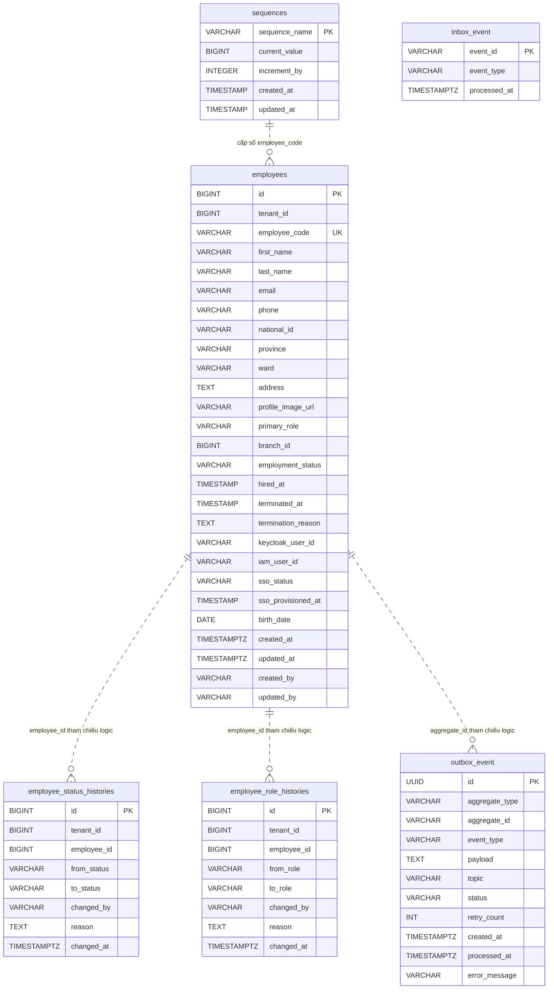

# Data Model -- gf-hrms

> PostgreSQL, schema mặc định `${DB_SCHEMA:gf_hrms}`. Service sở hữu hồ sơ nhân viên theo tenant, lịch sử đổi trạng thái/vai trò, outbox/inbox Kafka, và bảng sequence dùng cấp mã nhân viên.

## 1. ERD Overview

Quan hệ trong ERD là quan hệ logic theo service/repository. Migration hiện không khai báo foreign key vật lý giữa các bảng.

## 2. Entities

### `employees`

Hồ sơ nhân viên thuộc một tenant. Bảng này là aggregate chính cho tra cứu nhân viên, cấp mã nhân viên, trạng thái làm việc, trạng thái SSO và thông tin liên kết IAM/Keycloak.

| Column | Type | Nullable | Description |
|---|---|---|---|
| `id` | `BIGSERIAL` | NO | Khóa chính nhân viên |
| `tenant_id` | `BIGINT` | NO | Tenant sở hữu nhân viên |
| `employee_code` | `VARCHAR(50)` | NO | Mã nhân viên, duy nhất toàn bảng theo DDL hiện tại; service sinh dạng `EMP-{tenantId}-{seq}` |
| `first_name` | `VARCHAR(100)` | NO | Tên nhân viên |
| `last_name` | `VARCHAR(100)` | NO | Họ và tên đệm |
| `email` | `VARCHAR(255)` | YES | Email nhân viên |
| `phone` | `VARCHAR(20)` | NO | Số điện thoại; service kiểm tra trùng theo `tenant_id + phone` |
| `national_id` | `VARCHAR(50)` | YES | CMND/CCCD hoặc định danh cá nhân |
| `province` | `VARCHAR(100)` | YES | Tỉnh/thành phố |
| `ward` | `VARCHAR(100)` | YES | Phường/xã |
| `address` | `TEXT` | YES | Địa chỉ chi tiết |
| `profile_image_url` | `VARCHAR(500)` | YES | URL ảnh đại diện |
| `primary_role` | `VARCHAR(50)` | NO | Vai trò chính của nhân viên, nhận giá trị từ enum ứng dụng `EmployeeRole` |
| `branch_id` | `BIGINT` | YES | Tham chiếu logic tới chi nhánh |
| `employment_status` | `VARCHAR(20)` | NO | Trạng thái làm việc, mặc định `ACTIVE` |
| `hired_at` | `TIMESTAMP` | YES | Ngày vào làm |
| `terminated_at` | `TIMESTAMP` | YES | Ngày nghỉ việc |
| `termination_reason` | `TEXT` | YES | Lý do nghỉ việc |
| `keycloak_user_id` | `VARCHAR(255)` | YES | ID người dùng trong Keycloak |
| `iam_user_id` | `VARCHAR(255)` | YES | ID người dùng trong IAM |
| `sso_status` | `VARCHAR(20)` | NO | Trạng thái cấp tài khoản SSO, mặc định `NONE` |
| `sso_provisioned_at` | `TIMESTAMP` | YES | Thời điểm cấp SSO thành công |
| `birth_date` | `DATE` | YES | Ngày sinh |
| `created_at` | `TIMESTAMPTZ` | NO | Thời điểm tạo, mặc định `CURRENT_TIMESTAMP` |
| `updated_at` | `TIMESTAMPTZ` | NO | Thời điểm cập nhật, mặc định `CURRENT_TIMESTAMP` |
| `created_by` | `VARCHAR(100)` | NO | Actor tạo dữ liệu, mặc định `system` |
| `updated_by` | `VARCHAR(100)` | YES | Actor cập nhật gần nhất |

**Indexes**: `idx_employees_tenant_status(tenant_id, employment_status)`, `idx_employees_tenant_role(tenant_id, primary_role)`, `idx_employees_tenant_branch(tenant_id, branch_id)`, `idx_employees_keycloak(keycloak_user_id)`, `idx_employees_iam(iam_user_id)`, `idx_employees_phone(phone)`, `idx_employees_email(email)`.

**Constraints**: PK `id`; UNIQUE `employee_code`; NOT NULL theo bảng trên; CHECK `employment_status IN ('ACTIVE','SUSPENDED','TERMINATED')`; CHECK `sso_status IN ('NONE','PROVISIONING','ACTIVE','DISABLED','FAILED')`. Không có FK vật lý tới tenant, branch, IAM hoặc Keycloak. Không có unique constraint vật lý cho `(tenant_id, phone)` dù repository kiểm tra trùng theo tenant.

**Repository/query**: `findByTenantIdAndId`, `findByTenantIdAndEmployeeCode`, `findByTenantIdAndPhone`, `existsByTenantIdAndPhone`, `findByIdForUpdate` khóa pessimistic theo `tenant_id + id`, `findByPrimaryRole`, và `EmployeeSpecifications` lọc theo tenant, role, employment status, SSO status, keyword. Keyword search dùng `unaccent_vi` trên `employeeCode`, `phone`, `firstName lastName`, `lastName firstName`.

**Enums/state**: `EmployeeRole` gồm `MECHANIC`, `SERVICE_ADVISOR`, `ACCOUNTANT`, `INVENTORY_CONTROLLER`, `EXPRESS`, `MARKETER`, `CS`, `HR_MANAGER`, `OWNER`. `EmploymentStatus` cho phép chuyển `ACTIVE -> SUSPENDED/TERMINATED`, `SUSPENDED -> ACTIVE/TERMINATED`, `TERMINATED -> ACTIVE`. `SsoStatus` gồm `NONE`, `PROVISIONING`, `ACTIVE`, `DISABLED`, `FAILED`.

### `employee_status_histories`

Lịch sử thay đổi trạng thái làm việc của nhân viên. Bảng được ghi khi tạo nhân viên, suspend, reactivate và terminate.

| Column | Type | Nullable | Description |
|---|---|---|---|
| `id` | `BIGSERIAL` | NO | Khóa chính lịch sử trạng thái |
| `tenant_id` | `BIGINT` | NO | Tenant sở hữu bản ghi lịch sử |
| `employee_id` | `BIGINT` | NO | Tham chiếu logic tới `employees.id` |
| `from_status` | `VARCHAR(20)` | YES | Trạng thái trước khi đổi; null khi tạo nhân viên |
| `to_status` | `VARCHAR(20)` | NO | Trạng thái sau khi đổi |
| `changed_by` | `VARCHAR(100)` | NO | Actor thực hiện thay đổi |
| `reason` | `TEXT` | YES | Lý do thay đổi |
| `changed_at` | `TIMESTAMPTZ` | NO | Thời điểm thay đổi, mặc định `CURRENT_TIMESTAMP` |

**Indexes**: `idx_status_history_tenant(tenant_id)`, `idx_status_history_employee(employee_id)`, `idx_status_history_changed_at(changed_at)`.

**Constraints**: PK `id`; NOT NULL theo bảng trên. Không có FK vật lý tới `employees`; không có CHECK constraint cho `from_status`/`to_status`, giá trị được kiểm soát bởi enum ứng dụng `EmploymentStatus`.

**Repository/query**: `EmployeeStatusHistoryJpaRepository` chỉ khai báo CRUD từ `JpaRepository`; service chỉ ghi mới bằng `EmployeeStatusHistoryRepository.save`.

### `employee_role_histories`

Lịch sử thay đổi vai trò chính của nhân viên. Bảng được ghi khi cập nhật nhân viên có đổi role hoặc gọi API đổi role.

| Column | Type | Nullable | Description |
|---|---|---|---|
| `id` | `BIGSERIAL` | NO | Khóa chính lịch sử vai trò |
| `tenant_id` | `BIGINT` | NO | Tenant sở hữu bản ghi lịch sử |
| `employee_id` | `BIGINT` | NO | Tham chiếu logic tới `employees.id` |
| `from_role` | `VARCHAR(50)` | YES | Vai trò trước khi đổi |
| `to_role` | `VARCHAR(50)` | NO | Vai trò sau khi đổi |
| `changed_by` | `VARCHAR(100)` | NO | Actor thực hiện thay đổi |
| `reason` | `TEXT` | YES | Lý do thay đổi |
| `changed_at` | `TIMESTAMPTZ` | NO | Thời điểm thay đổi, mặc định `CURRENT_TIMESTAMP` |

**Indexes**: `idx_role_history_tenant(tenant_id)`, `idx_role_history_employee(employee_id)`, `idx_role_history_changed_at(changed_at)`.

**Constraints**: PK `id`; NOT NULL theo bảng trên. Không có FK vật lý tới `employees`; không có CHECK constraint cho `from_role`/`to_role`, giá trị được kiểm soát bởi enum ứng dụng `EmployeeRole` ở request/service.

**Repository/query**: `EmployeeRoleHistoryJpaRepository` chỉ khai báo CRUD từ `JpaRepository`; service chỉ ghi mới bằng `EmployeeRoleHistoryRepository.save`.

### `outbox_event`

Outbox cho event Kafka phát sinh từ nghiệp vụ nhân viên/SSO. Bảng dùng để phát sự kiện sau commit và retry các event còn `PENDING`.

| Column | Type | Nullable | Description |
|---|---|---|---|
| `id` | `UUID` | NO | Khóa chính outbox, mặc định `gen_random_uuid()` ở migration và `GenerationType.UUID` ở JPA |
| `aggregate_type` | `VARCHAR(100)` | NO | Loại aggregate; service hiện ghi `EMPLOYEE-GARAGE` |
| `aggregate_id` | `VARCHAR(100)` | NO | ID aggregate dạng chuỗi; với employee là `employees.id` |
| `event_type` | `VARCHAR(100)` | NO | Loại event cần phát |
| `payload` | `TEXT` | NO | Payload JSON dạng text |
| `topic` | `VARCHAR(200)` | NO | Kafka topic đích |
| `status` | `VARCHAR(20)` | NO | Trạng thái gửi event, mặc định `PENDING` |
| `retry_count` | `INT` | NO | Số lần retry, mặc định `0` |
| `created_at` | `TIMESTAMPTZ` | NO | Thời điểm tạo event, mặc định `CURRENT_TIMESTAMP` |
| `processed_at` | `TIMESTAMPTZ` | YES | Thời điểm gửi thành công hoặc lần xử lý gần nhất |
| `error_message` | `VARCHAR(1000)` | YES | Lỗi cuối cùng khi phát event thất bại |

**Indexes**: `idx_outbox_status(status) WHERE status = 'PENDING'`.

**Constraints**: PK `id`; NOT NULL theo bảng trên. Không có CHECK constraint cho `status`; enum domain `OutboxStatus` gồm `PENDING`, `SENT`, `FAILED`. Không có `tenant_id`; tenant nằm trong payload/event convention.

**Repository/query**: `findPendingEvents(maxRetries)` dùng native SQL `status = 'PENDING' AND retry_count < :maxRetries ORDER BY created_at ASC FOR UPDATE SKIP LOCKED`; `findByIdForUpdate` khóa theo `id`. `OutboxEventListener` xử lý sau commit; `OutboxProcessor` retry theo cấu hình `outbox.max-retries`.

### `inbox_event`

Inbox idempotency cho event Kafka nhận từ IAM/tenant-user flow.

| Column | Type | Nullable | Description |
|---|---|---|---|
| `event_id` | `VARCHAR(100)` | NO | Khóa chính, ID event bên ngoài |
| `event_type` | `VARCHAR(100)` | NO | Loại event đã xử lý |
| `processed_at` | `TIMESTAMPTZ` | NO | Thời điểm xử lý, mặc định `CURRENT_TIMESTAMP` |

**Indexes**: `idx_inbox_processed(processed_at)`.

**Constraints**: PK `event_id`; NOT NULL theo bảng trên. Không có `tenant_id`; idempotency là global theo `event_id`.

**Repository/query**: `existsByEventId` hỗ trợ kiểm tra idempotency; các Kafka consumer ghi `InboxEvent.create(eventId, eventType)` trong transaction và bỏ qua duplicate bằng `DataIntegrityViolationException`.

### `sequences`

Bảng sequence tự quản để cấp số nghiệp vụ. HRMS dùng `sequence_name = 'EMPLOYEE-' || tenantId` để sinh phần số trong `employee_code`.

| Column | Type | Nullable | Description |
|---|---|---|---|
| `sequence_name` | `VARCHAR(100)` | NO | Khóa chính sequence |
| `current_value` | `BIGINT` | NO | Giá trị hiện tại, mặc định `0` |
| `increment_by` | `INTEGER` | NO | Bước tăng, mặc định `1` |
| `created_at` | `TIMESTAMP` | NO | Thời điểm tạo sequence, mặc định `CURRENT_TIMESTAMP` |
| `updated_at` | `TIMESTAMP` | NO | Thời điểm cập nhật sequence, mặc định `CURRENT_TIMESTAMP` |

**Indexes**: PK index trên `sequence_name`.

**Constraints**: PK `sequence_name`; NOT NULL theo bảng trên. Không có `tenant_id` riêng; tenant được encode trong `sequence_name`.

**Repository/query**: Không có JPA entity. `SequenceUtils.getNextSequence` gọi function `${schema}.get_next_number(schemaName, sequenceName)` trong transaction `REQUIRES_NEW`.

## 3. Data Isolation

`employees`, `employee_status_histories`, và `employee_role_histories` có `tenant_id` trực tiếp. Đường đọc/ghi chính của employee dùng repository theo `tenant_id`, gồm `findByTenantIdAndId`, `findByTenantIdAndEmployeeCode`, `findByTenantIdAndPhone`, `existsByTenantIdAndPhone`, và search specification bắt buộc predicate tenant.

Hai bảng history cũng có `tenant_id`, nhưng không có foreign key vật lý tới `employees`. Service truyền cùng tenant khi ghi history; truy vấn trực tiếp theo `employee_id` phải chứng minh employee thuộc tenant hiện tại trước khi dùng.

`outbox_event` và `inbox_event` không có `tenant_id`. Tenant được mang trong payload/event hoặc trong `aggregate_id` convention, nên không thể dựa vào database để cô lập tenant cho hai bảng này.

`sequences` không có cột `tenant_id`; tenant được encode trong `sequence_name` theo dạng `EMPLOYEE-{tenantId}`. Quy ước này phải được giữ nhất quán để tránh cấp trùng mã giữa tenant.

## 4. Migration

Flyway đang bật với `validate-on-migrate=true`, `baseline-on-migrate=true`, schema/default schema `${DB_SCHEMA:gf_hrms}`, và `spring.jpa.hibernate.ddl-auto=none`. Vì vậy cấu trúc bảng phải đến từ migration SQL, không dựa vào Hibernate tự cập nhật schema.

Migration hiện tại:

| Migration | Nội dung |
|---|---|
| `V1.0.0` | File khởi tạo rỗng |
| `V1.0.1` | Tạo function `unaccent_vi(input TEXT)` để search không phân biệt dấu tiếng Việt |
| `V1.0.2` | Tạo `employees`, `employee_status_histories`, `employee_role_histories`, các index và CHECK constraint của employee |
| `V1.0.3` | Tạo `outbox_event`, `inbox_event`, partial index outbox pending và index inbox processed |
| `V1.0.4` | Tạo `sequences`, function `get_next_number(schemaName, sequenceName)` để tăng sequence trong schema được truyền vào |

Khác biệt cần lưu ý giữa JPA và migration:

- JPA `EmployeeJpaEntity` khai báo các index employee chính; migration bổ sung thêm `idx_employees_iam(iam_user_id)`.
- JPA outbox/inbox không khai báo index, nhưng migration có `idx_outbox_status` và `idx_inbox_processed`.
- `employee_code` unique ở cả JPA và migration, nhưng là unique toàn bảng, không phải unique theo tenant.
- `EmployeeRole`, `from_role`, `to_role`, và `outbox_event.status` chưa có CHECK constraint trong DB; rule enum nằm ở application/domain.

## 5. References

- [gf-hrms-HLD.md](../hld/gf-hrms-HLD.md)
- [gf-hrms-api.md](../api/gf-hrms-api.md)
- [hrms-employee-lifecycle-flow.md](../workflows/hrms-employee-lifecycle-flow.md)
- [ADR-003-tenant-and-sso-boundary.md](../decisions/ADR-003-tenant-and-sso-boundary.md)
- [ADR-004-kafka-event-driven-integration.md](../decisions/ADR-004-kafka-event-driven-integration.md)
- [ADR-006-flyway-per-service-data-ownership.md](../decisions/ADR-006-flyway-per-service-data-ownership.md)
- [ADR-009-jpa-entity-no-relationship-mapping.md](../decisions/ADR-009-jpa-entity-no-relationship-mapping.md)

## Change Log

| Date | Version | Summary |
|---|---|---|
| 2026-05-07 | v1 | Initial data model cho `gf-hrms`: PostgreSQL schema `${DB_SCHEMA:gf_hrms}` với 6 bảng `employees`, `employee_status_histories`, `employee_role_histories`, `outbox_event`, `inbox_event`, `sequences`, các enum `EmployeeRole`, `EmploymentStatus`, `SsoStatus`, `OutboxStatus`. Pooled multi-tenant qua `tenant_id` ở 3 bảng employee; outbox/inbox không có tenant column. Migration bằng Flyway (V1.0.0-V1.0.4) với JPA `ddl-auto=none`. Bao gồm ERD overview, entities, data isolation, migration, references.
