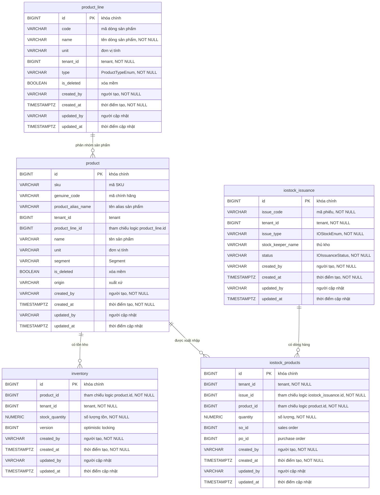
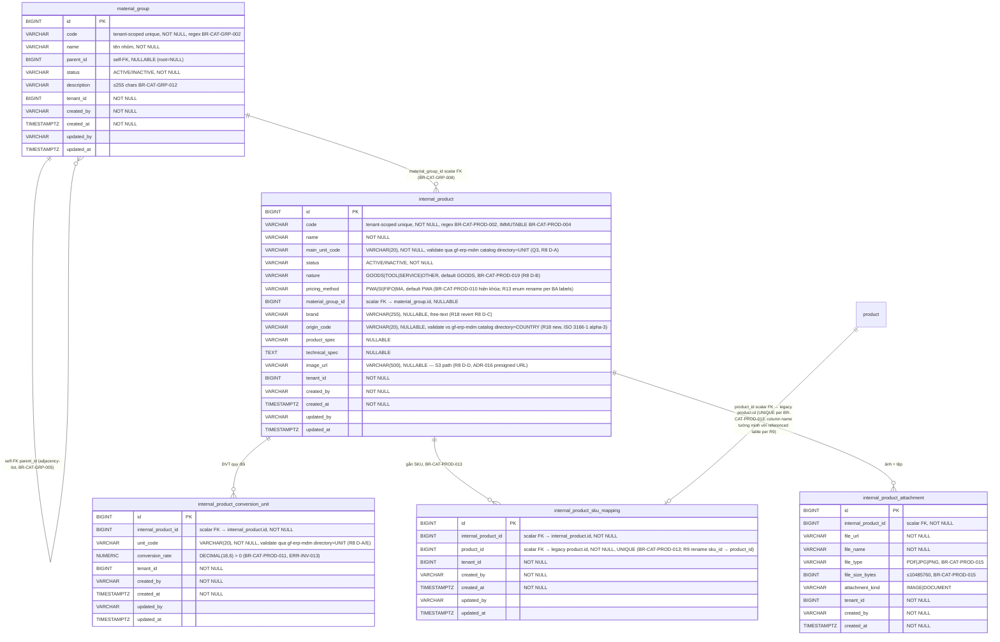
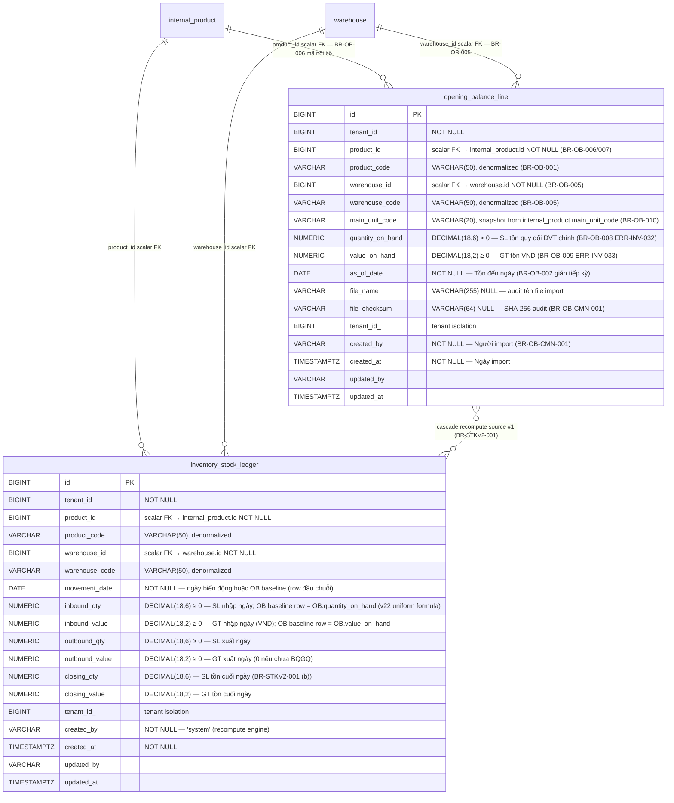

# Data Model - `gf-inventory`

> PostgreSQL qua Spring Data JPA. Schema mặc định là `${DB_SCHEMA:dev_gf_inventory}`. Source hiện tại dùng Hibernate `ddl-auto: update` và Flyway migration SQL (13 file migration từ V1.0.1 đến V20260423100000).

## 1. ERD Overview

Các quan hệ trong ERD là quan hệ logic từ trường id và truy vấn repository. Source hiện tại không khai báo `@ManyToOne`, `@OneToMany`, `@JoinColumn`, hoặc `@ForeignKey` trên các entity này. `ProductEntity` có khai báo `@UniqueConstraint` và `@Index` (xem chi tiết bên dưới).

## 2. Entities

### `product_line`

| Column | Type | Nullable | Description |
|---|---|---|---|
| `id` | BIGINT | NO | Khóa chính, sinh tự động bằng `GenerationType.IDENTITY`. |
| `code` | VARCHAR(255) | YES | Mã dòng sản phẩm. |
| `name` | VARCHAR(255) | NO | Tên dòng sản phẩm. |
| `unit` | VARCHAR(255) | YES | Đơn vị tính. |
| `tenant_id` | BIGINT | NO | Tenant sở hữu dòng sản phẩm. |
| `type` | VARCHAR(255) | NO | Enum `ProductTypeEnum`: `SPARE_PART`, `SPA`, `CARE`, `OTHER`. |
| `is_deleted` | BOOLEAN | YES | Cờ xóa mềm; entity đặt giá trị mặc định Java là `false`. |
| `created_by` | VARCHAR(255) | NO | Người tạo, kế thừa từ `AuditableEntity`. |
| `created_at` | TIMESTAMPTZ | NO | Thời điểm tạo, kế thừa từ `AuditableEntity`. |
| `updated_by` | VARCHAR(255) | YES | Người cập nhật cuối, kế thừa từ `AuditableEntity`. |
| `updated_at` | TIMESTAMPTZ | YES | Thời điểm cập nhật cuối, kế thừa từ `AuditableEntity`. |

**Indexes**: PK trên `id`; không thấy index phụ trong annotation hoặc migration SQL.
**Constraints**: `NOT NULL` trên `id`, `name`, `tenant_id`, `type`, `created_by`, `created_at`; không thấy unique, FK, hoặc check constraint vật lý. Repository có truy vấn tìm theo `name`, `tenant_id`, `type` nhưng không có unique constraint tương ứng.

### `product`

| Column | Type | Nullable | Description |
|---|---|---|---|
| `id` | BIGINT | NO | Khóa chính, sinh tự động bằng `GenerationType.IDENTITY`. |
| `sku` | VARCHAR(255) | YES | Mã SKU. |
| `genuine_code` | VARCHAR(255) | YES | Mã chính hãng (OEM code). |
| `product_alias_name` | VARCHAR(255) | YES | Tên alias sản phẩm. |
| `tenant_id` | BIGINT | YES | Tenant sở hữu sản phẩm. Entity annotation không có `nullable = false`; migration V1.0.3 thêm cột với `BIGINT` không có `NOT NULL`. Dữ liệu cũ được backfill từ `product_line.tenant_id`. |
| `product_line_id` | BIGINT | YES | Tham chiếu logic tới `product_line.id`; không có FK vật lý trong entity. Dự kiến loại bỏ trong tương lai (code comment: "be going to remove in the future"). |
| `name` | VARCHAR(255) | YES | Tên sản phẩm. Migration V1.0.3 backfill từ `product_line.name`. |
| `unit` | VARCHAR(50) | YES | Đơn vị tính. Migration V1.0.3 khai báo `VARCHAR(50)`. |
| `segment` | VARCHAR(255) | YES | Enum `Segment`: `TIER1`, `TIER2`, `TIER3`, `TIER4`, `TIER5`. |
| `is_deleted` | BOOLEAN | YES | Cờ xóa mềm; entity đặt giá trị mặc định Java là `false`. |
| `origin` | VARCHAR(100) | YES | Xuất xứ sản phẩm. Entity annotation: `length = 100`. |
| `created_by` | VARCHAR(255) | NO | Người tạo, kế thừa từ `AuditableEntity`. |
| `created_at` | TIMESTAMPTZ | NO | Thời điểm tạo, kế thừa từ `AuditableEntity`. |
| `updated_by` | VARCHAR(255) | YES | Người cập nhật cuối, kế thừa từ `AuditableEntity`. |
| `updated_at` | TIMESTAMPTZ | YES | Thời điểm cập nhật cuối, kế thừa từ `AuditableEntity`. |

**Indexes**: PK trên `id`; `idx_product_tenant_sku` trên `(tenant_id, sku)` khai báo trong `@Table(indexes = ...)`; `idx_product_sku` trên `(sku)` tạo bởi migration V1.0.4.
**Constraints**: `NOT NULL` trên `id`, `created_by`, `created_at`; unique constraint `uk_product_tenant_sku` trên `(tenant_id, sku)` khai báo trong `@Table(uniqueConstraints = ...)`.

### `inventory`

| Column | Type | Nullable | Description |
|---|---|---|---|
| `id` | BIGINT | NO | Khóa chính, sinh tự động bằng `GenerationType.IDENTITY`. |
| `product_id` | BIGINT | NO | Tham chiếu logic tới `product.id`; không có FK vật lý trong entity. |
| `tenant_id` | BIGINT | NO | Tenant sở hữu bản ghi tồn kho. |
| `stock_quantity` | NUMERIC | NO | Số lượng tồn kho; Java type là `BigDecimal`. **Lưu ý sai lệch precision/scale**: Entity annotation khai báo `precision = 15, scale = 2` nhưng migration V1.0.7 đặt DDL thực tế là `NUMERIC(15,3)`. Giá trị tại database là `NUMERIC(15,3)` (migration chạy sau và ghi đè). |
| `version` | BIGINT | YES | Trường `@Version` JPA dùng cho optimistic locking. Hibernate tự tăng khi update row. |
| `created_by` | VARCHAR(255) | NO | Người tạo, kế thừa từ `AuditableEntity`. |
| `created_at` | TIMESTAMPTZ | NO | Thời điểm tạo, kế thừa từ `AuditableEntity`. |
| `updated_by` | VARCHAR(255) | YES | Người cập nhật cuối, kế thừa từ `AuditableEntity`. |
| `updated_at` | TIMESTAMPTZ | YES | Thời điểm cập nhật cuối, kế thừa từ `AuditableEntity`. |

**Indexes**: PK trên `id`; không thấy index phụ trong annotation hoặc migration SQL.
**Constraints**: `NOT NULL` trên `id`, `product_id`, `tenant_id`, `stock_quantity`, `created_by`, `created_at`; không thấy unique, FK, hoặc check constraint vật lý.

### `iostock_issuance`

| Column | Type | Nullable | Description |
|---|---|---|---|
| `id` | BIGINT | NO | Khóa chính. Entity chỉ khai báo `@Id` mà **không có `@GeneratedValue`** -- id phải được set bởi application code trước khi persist. |
| `issue_code` | VARCHAR(255) | NO | Mã phiếu xuất nhập kho. |
| `tenant_id` | BIGINT | NO | Tenant sở hữu phiếu. |
| `issue_type` | VARCHAR(255) | NO | Enum `IOStockEnum`: `WAREHOUSE_RECEIPT`, `DELIVERY_NOTE`. |
| `stock_keeper_name` | VARCHAR(255) | YES | Tên thủ kho. |
| `status` | VARCHAR(255) | NO | Enum `IOIssuanceStatus`: `OPEN`, `APPROVED`, `CANCELLED`. |
| `created_by` | VARCHAR(255) | NO | Người tạo, kế thừa từ `AuditableEntity`. |
| `created_at` | TIMESTAMPTZ | NO | Thời điểm tạo, kế thừa từ `AuditableEntity`. |
| `updated_by` | VARCHAR(255) | YES | Người cập nhật cuối, kế thừa từ `AuditableEntity`. |
| `updated_at` | TIMESTAMPTZ | YES | Thời điểm cập nhật cuối, kế thừa từ `AuditableEntity`. |

**Indexes**: PK trên `id`; không thấy index phụ trong annotation hoặc migration SQL.
**Constraints**: `NOT NULL` trên `id`, `issue_code`, `tenant_id`, `issue_type`, `status`, `created_by`, `created_at`; không thấy unique, FK, hoặc check constraint vật lý.

### `iostock_products`

| Column | Type | Nullable | Description |
|---|---|---|---|
| `id` | BIGINT | NO | Khóa chính, sinh tự động bằng `GenerationType.IDENTITY`. |
| `tenant_id` | BIGINT | NO | Tenant sở hữu dòng hàng. |
| `issue_id` | BIGINT | NO | Tham chiếu logic tới `iostock_issuance.id`; không có FK vật lý trong entity. |
| `product_id` | BIGINT | NO | Tham chiếu logic tới `product.id`; không có FK vật lý trong entity. |
| `quantity` | NUMERIC | NO | Số lượng trên dòng phiếu; Java type là `BigDecimal`. **Lưu ý sai lệch precision/scale**: Entity annotation khai báo `precision = 15, scale = 2` nhưng migration V1.0.7 đặt DDL thực tế là `NUMERIC(15,3)`. Giá trị tại database là `NUMERIC(15,3)` (migration chạy sau và ghi đè). |
| `so_id` | BIGINT | YES | Id sales order liên quan. |
| `po_id` | BIGINT | YES | Id purchase order liên quan. |
| `created_by` | VARCHAR(255) | NO | Người tạo, kế thừa từ `AuditableEntity`. |
| `created_at` | TIMESTAMPTZ | NO | Thời điểm tạo, kế thừa từ `AuditableEntity`. |
| `updated_by` | VARCHAR(255) | YES | Người cập nhật cuối, kế thừa từ `AuditableEntity`. |
| `updated_at` | TIMESTAMPTZ | YES | Thời điểm cập nhật cuối, kế thừa từ `AuditableEntity`. |

**Indexes**: PK trên `id`; không thấy index phụ trong annotation hoặc migration SQL.
**Constraints**: `NOT NULL` trên `id`, `tenant_id`, `issue_id`, `product_id`, `quantity`, `created_by`, `created_at`; không thấy unique, FK, hoặc check constraint vật lý.

## 3. Data Isolation

`product_line`, `product`, `inventory`, `iostock_issuance`, và `iostock_products` đều có cột `tenant_id`. Tuy nhiên `product.tenant_id` là nullable (migration V1.0.3 thêm cột không có `NOT NULL`) -- dữ liệu cũ được backfill từ `product_line.tenant_id`, nhưng không có ràng buộc NOT NULL đảm bảo mọi row đều có giá trị.

Không thấy filter tenant tự động ở tầng entity hoặc base repository trong source hiện tại. Vì vậy cách ly tenant phụ thuộc vào repository/service luôn thêm điều kiện `tenant_id` khi truy vấn.

## 4. Migration

Source hiện tại có Flyway migration SQL gồm 13 file (từ V1.0.1 đến V20260423100000). Các migration đáng chú ý:

- **V1.0.3**: Thêm 5 cột vào `product` (`genuine_code`, `name`, `product_alias_name`, `tenant_id`, `unit`) và backfill từ `product_line`.
- **V1.0.4**: Chuẩn hoá format SKU và tạo `idx_product_sku`.
- **V1.0.7**: Chuyển `inventory.stock_quantity` và `iostock_products.quantity` sang `NUMERIC(15,3)`.

`application.yml` vẫn cấu hình Hibernate `ddl-auto: update`, nên Hibernate có thể tạo thêm cột/index từ entity annotation ngoài các migration đã có. Unique constraint `uk_product_tenant_sku` và index `idx_product_tenant_sku` trên `product` được khai báo trong `@Table` annotation và sẽ được Hibernate tạo nếu chưa tồn tại.

## 4a. Inventory V2 — Catalog V2 (DESIGN, ADR-017)

> Subsystem **mới ĐỘC LẬP** với legacy product subsystem (§2). Migration **additive Flyway V{N+1}** (Critical Rule §3.2 #17 — KHÔNG rewrite migration cũ). Legacy `product` table giữ nguyên (SKU master per ADR-017). **AP (kỳ kế toán) scope deferred to gf-accounting wave** per Delivery Authority correction 2026-06-23 (R4 strip).

### 4a.1 ERD overview — catalog-v2

### 4a.2 Tables — detailed

#### `material_group` (new, ADR-017)

| Column | Type | Nullable | Description |
|---|---|---|---|
| `id` | BIGINT | NO | PK, `GenerationType.IDENTITY` |
| `code` | VARCHAR(50) | NO | Mã nhóm, tenant-scoped unique (BR-CAT-GRP-003 → `ERR-INV-002`); regex `^[^~!@#$%^&*]+$` (BR-CAT-GRP-002 → `ERR-INV-001`); **immutable** (BR-CAT-GRP-004) |
| `name` | VARCHAR(255) | NO | Tên nhóm |
| `parent_id` | BIGINT | YES | Self-FK adjacency-list (`material_group.id`); NULL = root (BR-CAT-GRP-005); cycle check qua recursive CTE (BR-CAT-GRP-009 → `ERR-INV-003`) |
| `status` | VARCHAR(20) | NO | `ACTIVE` \| `INACTIVE` (BR-CAT-GRP-006); cha INACTIVE → cascade INACTIVE xuống children (BR-CAT-GRP-007) |
| `description` | VARCHAR(255) | YES | ≤255 chars (BR-CAT-GRP-012 → `ERR-INV-016`) |
| `tenant_id` | BIGINT | NO | Tenant isolation (BR-CAT-GRP-013) |
| audit fields | — | — | `created_by`, `created_at`, `updated_by`, `updated_at` từ `AuditableEntity` |

**Indexes**: PK `id`; `uk_material_group_tenant_code (tenant_id, code) UNIQUE`; `idx_material_group_parent (parent_id)`; `idx_material_group_tenant_status (tenant_id, status)`.
**Constraints**: NOT NULL — `id, code, name, status, tenant_id, created_by, created_at`.

#### `internal_product` (new, ADR-017)

| Column | Type | Nullable | Description |
|---|---|---|---|
| `id` | BIGINT | NO | PK, `GenerationType.IDENTITY` |
| `code` | VARCHAR(50) | NO | Mã nội bộ, tenant-scoped unique (BR-CAT-PROD-003 → `ERR-INV-007`); regex (BR-CAT-PROD-002 → `ERR-INV-006`); **immutable** (BR-CAT-PROD-004) |
| `name` | VARCHAR(255) | NO | Tên sản phẩm (BR-CAT-PROD-005) |
| `main_unit_code` | VARCHAR(20) | NO | ĐVT chính — code thuần (pattern match `gf-purchase.unit_of_measure`); validate exists trong gf-erp-mdm catalog `directory=UNIT` (Q3 — REST `/protected/catalog/v1/inquiry`, R8 D-A/E); IMMUTABLE khi đã giao dịch (BR-CAT-PROD-006) |
| `status` | VARCHAR(20) | NO | `ACTIVE` \| `INACTIVE` (BR-CAT-PROD-007/008) |
| `nature` | VARCHAR(30) | NO | Enum (R8 D-B — English keys): `GOODS`(default) \| `TOOL` \| `SERVICE` \| `OTHER` (BR-CAT-PROD-019, vi phạm → `ERR-INV-012`) |
| `pricing_method` | VARCHAR(30) | NO | Enum (R13 rename per BA labels): `PWA`(default + only active hiện tại — Bình quân cuối kỳ / Period Weighted Average) \| `SI` (Đích danh / Specific Identification) \| `FIFO` (Nhập trước xuất trước) \| `MA` (Bình quân tức thời / Moving Average, placeholder) (BR-CAT-PROD-010 — field khóa, import bỏ qua cột) |
| `material_group_id` | BIGINT | YES | Scalar FK → `material_group.id`; dropdown chỉ hiện ACTIVE (BR-CAT-PROD-009) |
| `brand` | VARCHAR(255) | YES | Thương hiệu — **free-text** (R18 revert R8 D-C); người dùng tự nhập, KHÔNG validate catalog. Không BFF enrichment (đã xóa `brandDisplayName` post-R18). |
| `origin_code` | VARCHAR(20) | YES | Xuất xứ — **codified** (R18 new); validate vs gf-erp-mdm catalog `directory=COUNTRY` qua REST `/protected/catalog/v1/inquiry` (cache 5min — pattern mirror UNIT). Format ISO 3166-1 alpha-3 (JPN/USA/VNM/...). BFF enrich `originDisplayName` (BR-AGG-GARAGE-GRAPH-001). |
| `product_spec` | VARCHAR(500) | YES | Quy cách sản phẩm |
| `technical_spec` | TEXT | YES | Thông số kỹ thuật |
| `image_url` | VARCHAR(500) | YES | **Opaque URL string** cho ảnh chính của product (R8 D-D + R25 OQ10 CLOSED 2026-06-25). gf-inventory persist nguyên văn, KHÔNG validate format/prefix, KHÔNG quản lý S3 (mirror V2-18/V2-19 attachment R11 pattern — S3 ownership thuộc ct-file-storage). Upload mechanism: FE upload to S3 qua ct-file-storage presigned URL (ADR-016 reuse) → submit URL string vào V2-10/V2-11. Independent với V2-18 multi-doc attachments. Update/clear = DB-only, S3 orphan acceptable (OQ14 DEV/Ops scope). |
| `tenant_id` | BIGINT | NO | Tenant isolation |
| `description` | VARCHAR(500) | YES | **"Mô tả"** sản phẩm (R11 + R26 OQ13 CLOSED 2026-06-25 — optional, ≤500 chars). FE form label canonical = "Mô tả". |
| `notes` | VARCHAR(500) | YES | **"Ghi chú"** nội bộ admin (R11 + R26 OQ13 CLOSED 2026-06-25 — optional, ≤500 chars; R26 đồng bộ với `description` về 500 chars, drop VARCHAR(1000) cũ). FE form label canonical = "Ghi chú". |
| audit fields | — | — | `created_by`, `created_at`, `updated_by`, `updated_at` |

**Indexes**: PK; `uk_internal_product_tenant_code (tenant_id, code) UNIQUE`; `idx_ip_tenant_status (tenant_id, status)`; `idx_ip_material_group (material_group_id)`; `idx_ip_tenant_name (tenant_id, name)` cho search LIKE.
**Constraints**: NOT NULL — `id, code, name, main_unit_code, status, nature, pricing_method, tenant_id, created_by, created_at`.

> **R8 entity note** — 4 fixes additive: (A) UoM directory `UNIT_OF_MEASURE` → canonical `UNIT` (align with brand pattern); (B) `nature` enum English keys `GOODS/TOOL/SERVICE/OTHER` (cleaner intl + matches existing English DB patterns); (C) `brand` → `brand_code` (VARCHAR(50)) + validate against `directory=BRAND` (consistency với UoM master pattern, eliminates free-text drift); (D) new `image_url VARCHAR(500)` cho ảnh chính (separate flow từ multi-doc attachments V2-18); (E) global rename `uom`→`unit` (table + columns + SDL — see §4a.1 ERD + §`internal_product_conversion_unit` below). Migration: post-R7 deploy chưa rollout → cập nhật `V20260624020000__create_internal_product.sql` + `V20260624030000__create_internal_product_conversion_unit.sql` (rename file) reflect new column names trước first deploy. Nếu R7 đã deploy → phát hành `V20260624080000__rename_uom_to_unit.sql` + `V20260624090000__add_brand_code_image_url.sql` (additive Flyway per §3.2 #17).

> **R18 entity note (2026-06-25 — supersedes R8 D-C)** — BA chốt đảo 2 field: (C') `brand_code` (VARCHAR(50), codified) → `brand` (VARCHAR(255), free-text) — REVERT R8 D-C, KHÔNG validate catalog, không BFF `brandDisplayName` enrichment. (C-new) `origin` (VARCHAR(100), free-text) → `origin_code` (VARCHAR(20), codified) + validate vs gf-erp-mdm `directory=COUNTRY` (ISO 3166-1 alpha-3) + BFF `originDisplayName` enrichment (pattern mirror UNIT). Migration: pre-deploy → update `V20260624020000__create_internal_product.sql` column rename; post-deploy → release `V20260625010000__rename_brand_code_to_brand_and_origin_to_origin_code.sql` (additive: ADD `brand VARCHAR(255)` + ADD `origin_code VARCHAR(20)` + DROP COLUMN `brand_code` + DROP COLUMN `origin` — non-additive single migration acceptable vì pre-DEV, no data loss risk). OQ8 (R8 BRAND seed) CLOSED. OQ9 mới (COUNTRY seed) — BA verified, gf-erp-mdm import API sẽ provision. ADR-017 unchanged (additive — naming swap not load-bearing on aggregate decision).

#### `internal_product_conversion_unit` (new, ADR-017 — R8 D-E rename: `_conversion_uom` → `_conversion_unit`)

| Column | Type | Nullable | Description |
|---|---|---|---|
| `id` | BIGINT | NO | PK |
| `internal_product_id` | BIGINT | NO | Scalar FK → `internal_product.id` |
| `unit_code` | VARCHAR(20) | NO | ĐVT quy đổi ( validate gf-erp-mdm `directory=UNIT`) |
| `conversion_rate` | NUMERIC(18,6) | NO | Tỷ lệ quy đổi về ĐVT chính; > 0 (BR-CAT-PROD-011 → `ERR-INV-013`); **scale ≤6 chữ số thập phân (BR-CAT-PROD-011 v15 BA 2026-06-26 → `ERR-INV-047`) — app-layer guard, xem Constraints block** |
| `tenant_id` | BIGINT | NO | Tenant isolation |
| audit fields | — | — | — |

**Indexes**: PK; `uk_ipcu_product_unit (internal_product_id, unit_code) UNIQUE` (BR-CAT-PROD-011 — không trùng ĐVT → `ERR-INV-014`); `idx_ipcu_product (internal_product_id)`.
**Constraints**: NOT NULL — `id, internal_product_id, unit_code, conversion_rate, tenant_id, created_by, created_at`. CHECK `conversion_rate > 0`.
**Precision guard (R29, BA 2026-06-26)**: scale của `conversion_rate` = 6 (NUMERIC(18,6) — storage envelope). Lưu ý: PostgreSQL **silently rounds** vượt scale (vd input `0.1234567` → lưu `0.123457`), KHÔNG raise lỗi. Vì vậy application layer phải guard `≤6 chữ số thập phân` **trước save** (BR-CAT-PROD-011 v15 → `ERR-INV-047` "Tỷ lệ quy đổi không được có quá 6 chữ số sau dấu phẩy"). DB scale chỉ là storage envelope, KHÔNG phải user-facing validation — BE bắt buộc check + reject 400 trước insert/update tại V2-10 `initialConversionUnits[]`, V2-15 add, V2-16 update.
**Immutability**: row đã phát sinh giao dịch không sửa/xóa (BR-CAT-PROD-012) — enforce ở app layer.

#### `internal_product_sku_mapping` (new, ADR-017)

| Column | Type | Nullable | Description |
|---|---|---|---|
| `id` | BIGINT | NO | PK |
| `internal_product_id` | BIGINT | NO | Scalar FK → `internal_product.id` |
| `product_id` | BIGINT | NO | Scalar FK → **legacy `product.id`** (ADR-009 compliant; R9 rename `sku_id` → `product_id` để tường minh với referenced table); UNIQUE (BR-CAT-PROD-013: 1 SKU thuộc tối đa 1 mã nội bộ → `ERR-INV-015`). Business term "SKU" preserved trong BR/UX/error code — chỉ technical FK column rename. |
| `tenant_id` | BIGINT | NO | Tenant isolation |
| audit fields | — | — | — |

**Indexes**: PK; `uk_ipsm_product UNIQUE (product_id)` (enforce BR-CAT-PROD-013; R9 rename); `uk_ipsm_internal_product UNIQUE (internal_product_id, product_id)` defensive (R9 rename); `idx_ipsm_internal_product (internal_product_id)`.
**Constraints**: NOT NULL — `id, internal_product_id, product_id, tenant_id, created_by, created_at`.
**Note**: bỏ gắn SKU = xóa row mapping; KHÔNG xóa `product` row (BR-CAT-PROD-014).

**R3 F4 flag (inline, no version bump)**: enum value `SkuMappingStatus.MAPPED_SELF` (response của V2-23 `searchSkus`) đang dùng làm UX state cho modal "Gắn SKU" (UNMAPPED / MAPPED_OTHER / MAPPED_SELF). Semantic "MAPPED_SELF" = SKU đang mapping vào CHÍNH mã internal_product đang edit (vs MAPPED_OTHER = mapping vào mã khác). Deferred BA confirm rằng wording + 3-state model phù hợp UX expectation; nếu BA reject → có thể giảm xuống 2-state (UNMAPPED / MAPPED) với hint riêng — không ảnh hưởng schema (chỉ response DTO).

#### `internal_product_attachment` (new, ADR-017)

| Column | Type | Nullable | Description |
|---|---|---|---|
| `id` | BIGINT | NO | PK |
| `internal_product_id` | BIGINT | NO | Scalar FK |
| `file_url` | VARCHAR(1024) | NO | URL object storage |
| `file_name` | VARCHAR(255) | NO | Tên gốc |
| `file_type` | VARCHAR(20) | NO | `PDF` \| `JPG` \| `PNG` (BR-CAT-PROD-015 → `ERR-CMN-005`) |
| `file_size_bytes` | BIGINT | NO | ≤10485760 (10MB, `ERR-CMN-004`) |
| `attachment_kind` | VARCHAR(20) | NO | `IMAGE` (chỉ JPG/PNG) \| `DOCUMENT` |
| `tenant_id` | BIGINT | NO | Tenant isolation |
| audit fields | — | — | `created_by`, `created_at` (immutable rows) |

**Indexes**: PK; `idx_ipa_product (internal_product_id)`.
**App-level rule**: tối đa 5 row per `internal_product_id` (BR-CAT-PROD-015).

> **R10 — `internal_product_history` entity REMOVED** (BA chốt 2026-06-24): KHÔNG track history audit cho internal_product trong batch này. Standard audit cols `created_at/by`, `updated_at/by` trên `internal_product` + child tables (conversion_unit, sku_mapping, attachment) preserved cho basic audit. Product layer đã đồng bộ — FEAT-CAT-PROD-DETAIL v3 (2026-06-16) chốt bỏ tab "Lịch sử"; FEAT-CAT-PROD-EDIT v3 gỡ "ghi lịch sử thao tác" và BR-CAT-CMN-001. Migration `V20260624060000__create_internal_product_history.sql` REMOVED (skip filename — no migration cho entity bị remove).

### 4a.3 Migration sequence (additive Flyway V{N+1})

Migration files mới (V{N+1} từ V20260423100000, additive — KHÔNG rewrite migration cũ):

| File | Purpose |
|---|---|
| `V20260624010000__create_material_group.sql` | CREATE TABLE `material_group` + indexes + UNIQUE constraint |
| `V20260624020000__create_internal_product.sql` | CREATE TABLE `internal_product` + indexes + UNIQUE constraint + CHECK enums |
| `V20260624030000__create_internal_product_conversion_unit.sql` | CREATE TABLE `internal_product_conversion_unit` + UNIQUE (internal_product_id, unit_code) + CHECK conversion_rate > 0 (R8 D-E rename `_uom` → `_unit`) |
| `V20260624040000__create_internal_product_sku_mapping.sql` | CREATE TABLE + UNIQUE (product_id) + scalar FK index (R9 rename — column `sku_id` → `product_id`) |
| `V20260624050000__create_internal_product_attachment.sql` | CREATE TABLE + scalar FK index |
| ~~`V20260624060000__create_internal_product_history.sql`~~ | **R10 REMOVED** — BA chốt no history audit; migration sequence reduces 6 → 5 files cho internal_product subsystem |

> **Coexistence note**: gf-inventory hiện chạy `ddl-auto=update` + Flyway (open HLD-INVENTORY-001/002). New tables declare đầy đủ qua Flyway migration **VÀ** entity annotation — Flyway authoritative cho structure; Hibernate validate/create-if-missing cho indexes/constraints declared bằng `@Table(indexes=...)`. Match pattern existing (e.g. `uk_product_tenant_sku` per data-model §V1.0.4).

### 4a.4 Tenant strategy + relationship policy

- Mọi 6 table mới có `tenant_id BIGINT NOT NULL` + repository spec filter by `tenant_id`.
- **KHÔNG** dùng `@ManyToOne`/`@OneToMany`/`@JoinColumn`/`@ForeignKey` cho cross-aggregate relationships (ADR-009 / Critical Rule §3.2 #5):
  - `internal_product.material_group_id` → scalar Long.
  - `internal_product_sku_mapping.product_id` → scalar Long (legacy `product.id`; R9 rename — column name tường minh).
  - `internal_product_sku_mapping.internal_product_id`, `internal_product_conversion_unit.internal_product_id`, etc → scalar Long; relationship trong cùng aggregate có thể dùng `@OneToMany(fetch=LAZY)` nếu chỉ in-aggregate, nhưng prefer scalar + custom repository query để consistent với existing pattern (xem data-model §1 "không khai báo @ManyToOne, @OneToMany").
- `material_group.parent_id` → scalar Long self-FK; recursive CTE cho hierarchy walk (cycle-check trước UPDATE per BR-CAT-GRP-009).

## 4b. Inventory V2 — Opening Balance + Stock Ledger (DESIGN, W04, ADR-020/021/022)

> Subsystem **mới ĐỘC LẬP** với legacy `inventory_stock` + `inventory_transaction` (§2 — V1 running-qty ledger, giữ nguyên). Migration **additive Flyway V{N+1}** (Critical Rule #17). 2 tables mới:
> - `opening_balance_line` — source-of-truth cho tồn đầu kỳ (OB); **1 row per (tenant + product_code + warehouse_code)** unique (BR-OB-012). Nguồn ghi: FEAT-OB-IMPORT / FEAT-OB-EDIT.
> - `inventory_stock_ledger` — sổ tồn point-in-time projection per BR-STKV2-001; **1 row per (tenant + product_code + warehouse_code + movement_date)** — rebuild-able từ 2 source (OB + slip detail) qua `StockLedgerRecomputeService` (ADR-020 BR-STKV2-005a shared engine).
>
> **Co-exist với V1**: legacy `inventory_stock` tiếp tục serve current-qty query cho V1 stock UI (chưa deprecate — ADR-020 threshold). V2 ledger phục vụ tồn-đến-ngày (FEAT-STK-LIST-V2, W06) + NXT (FEAT-IP-VIEW-V2, W06) + thẻ kho (FEAT-STK-DETAIL-V2, W06) + BQGQ input (FEAT-PRC-*, future).

### 4b.1 ERD overview — OB + Stock Ledger

### 4b.2 Tables — detailed

#### `opening_balance_line` (new, ADR-022)

| Column | Type | Nullable | Description |
|---|---|---|---|
| `id` | BIGINT | NO | PK, `GenerationType.IDENTITY` |
| `tenant_id` | BIGINT | NO | Tenant isolation (BR-OB-014) — mọi index prefix `(tenant_id, ...)` |
| `product_id` | BIGINT | NO | Scalar FK → `internal_product.id` (ADR-009 — NO `@ManyToOne`); NOT NULL; validate active (BR-OB-006/007 → `ERR-INV-009/010`) |
| `product_code` | VARCHAR(50) | NO | Denormalized `internal_product.code` snapshot lúc import (BR-OB-001 Mã sản phẩm nội bộ); duy trì query performance + audit stable khi legacy code rename |
| `warehouse_id` | BIGINT | NO | Scalar FK → `warehouse.id`; NOT NULL (BR-OB-005 → `ERR-INV-020`) |
| `warehouse_code` | VARCHAR(50) | NO | Denormalized `warehouse.code`/`name` snapshot; BR-OB-005 khớp theo tên kho lúc import |
| `main_unit_code` | VARCHAR(20) | NO | Snapshot ĐVT chính từ `internal_product.main_unit_code` (BR-OB-010 → `ERR-INV-019`); mọi SL trong ledger dùng ĐVT chính quy đổi |
| `quantity_on_hand` | NUMERIC(18,6) | NO | SL tồn quy đổi ĐVT chính; **CHECK > 0** (BR-OB-008 → `ERR-INV-032`); precision 6 aligned với `internal_product_conversion_unit.conversion_rate` |
| `value_on_hand` | NUMERIC(18,2) | NO | GT tồn (VND, đồng); **CHECK ≥ 0** (BR-OB-009 → `ERR-INV-033`, cho phép = 0 khi mã "nhập tiền 0") |
| `as_of_date` | DATE | NO | "Tồn đến ngày" (BR-OB-002 → gián tiếp kỳ; BR-OB-013 lock check via ADR-021) |
| `file_name` | VARCHAR(255) | YES | Audit tên file import (BR-OB-CMN-001) |
| `file_checksum` | VARCHAR(64) | YES | SHA-256 audit checksum (BR-OB-CMN-001) — display-only, không dedup |
| audit fields | — | — | `created_by`, `created_at`, `updated_by`, `updated_at` từ `AuditableEntity` |

**Indexes**:
- PK `id`.
- `uk_ob_tenant_product_warehouse (tenant_id, product_id, warehouse_id) UNIQUE` — enforce BR-OB-012 OB duy nhất per (mã+kho) → `ERR-INV-034`.
- `idx_ob_tenant_asof (tenant_id, as_of_date)` — hỗ trợ query "OB rơi vào kỳ đã đóng" (BR-AP-013 delete guard) + FEAT-OB-LIST filter theo ngày.
- `idx_ob_tenant_warehouse_asof (tenant_id, warehouse_id, as_of_date)` — FEAT-OB-LIST filter Kho + Ngày.
- `idx_ob_tenant_created (tenant_id, created_at DESC)` — FEAT-OB-LIST default sort "Ngày import mới nhất lên đầu" (BR-OB-014).
- `idx_ob_tenant_created_by (tenant_id, created_by)` — FEAT-OB-LIST filter Người import.

**Constraints**: NOT NULL — `id, tenant_id, product_id, product_code, warehouse_id, warehouse_code, main_unit_code, quantity_on_hand, value_on_hand, as_of_date, created_by, created_at`. CHECK `quantity_on_hand > 0`; CHECK `value_on_hand >= 0`.

#### `inventory_stock_ledger` (new, ADR-020 sổ tồn projection)

| Column | Type | Nullable | Description |
|---|---|---|---|
| `id` | BIGINT | NO | PK, `GenerationType.IDENTITY` |
| `tenant_id` | BIGINT | NO | Tenant isolation |
| `product_id` | BIGINT | NO | Scalar FK → `internal_product.id` |
| `product_code` | VARCHAR(50) | NO | Denormalized |
| `warehouse_id` | BIGINT | NO | Scalar FK → `warehouse.id` |
| `warehouse_code` | VARCHAR(50) | NO | Denormalized |
| `movement_date` | DATE | NO | Ngày biến động HOẶC OB baseline (row đầu chuỗi per key, BR-STKV2-001). **Row đầu chuỗi** (min `movement_date` per key) = OB baseline row nếu tồn tại — `inbound_qty`/`inbound_value` = `opening_balance_line.quantity_on_hand`/`value_on_hand` (OB là "nhập lần đầu"), `closing_*` = running formula uniform (previous_closing=0). Row sau = biến động phiếu N/X aggregate, `closing_*` running formula (cùng công thức). Engine detect row đầu chuỗi qua `ORDER BY movement_date ASC LIMIT 1` per key khi cần audit/debug (không dùng column tag). |
| `inbound_qty` | NUMERIC(18,6) | NO | SL nhập ngày (SL quy đổi ĐVT chính); **OB baseline row** = `opening_balance_line.quantity_on_hand` (OB là "nhập lần đầu" của mã+kho — v22 override rationale v5 double-count; NXT report BR-STKV2-010 `SUM(inbound_qty)` **bao gồm** OB row). Row phiếu = aggregate SL nhập từ receipt/reversed-delivery match key+date. |
| `inbound_value` | NUMERIC(18,2) | NO | GT nhập ngày (VND); **OB baseline row** = `opening_balance_line.value_on_hand`. Row phiếu = aggregate GT nhập. |
| `outbound_qty` | NUMERIC(18,6) | NO | SL xuất ngày; OB baseline row = 0. Row phiếu = aggregate SL xuất từ delivery/reversed-receipt match key+date. |
| `outbound_value` | NUMERIC(18,2) | NO | GT xuất ngày; = 0 trước khi BQGQ chạy (BR-STKV2-001 (b)); BQGQ update ở đây, SL không đổi (BR-PRC-005). OB baseline row = 0. |
| `closing_qty` | NUMERIC(18,6) | NO | SL tồn cuối ngày; **running formula uniform cho MỌI row** `closing_qty_N = closing_qty_{N-1} + inbound_qty_N − outbound_qty_N` (row đầu: `closing_{N-1}=0` → `closing = inbound`); **CHECK ≥ 0** (BR-STKV2-005a bước 4 → `ERR-INV-036`) — engine enforce, không phải DB constraint (allow intermediate write scan, final invariant checked) |
| `closing_value` | NUMERIC(18,2) | NO | GT tồn cuối ngày; running formula uniform tương tự (row đầu: `closing_value = inbound_value = OB.value_on_hand`) |
| audit fields | — | — | `created_by`=`system` (recompute engine), `created_at`, `updated_at`; `updated_by`=trigger source enum **7 values** per ADR-020 v6 §C3 `OB_IMPORT`\|`OB_EDIT`\|`OB_DELETE`\|`SLIP_POSTED`\|`SLIP_REVERSED`\|`SLIP_EDITED`\|`BQGQ_RECOMPUTE` (audit chain-of-cause) — 3 OB (W04 active) + 3 SLIP (W05 stub) + 1 BQGQ (W06 stub) |

**Indexes**:
- PK `id`.
- `uk_ledger_tenant_product_warehouse_date (tenant_id, product_id, warehouse_id, movement_date) UNIQUE` — 1 row per (key+date); engine upsert semantics.
- `idx_ledger_lookup (tenant_id, product_id, warehouse_id, movement_date DESC)` — CORE index cho point-in-time lookup "gần nhất ≤ D" (ADR-020 core read path); DESC hỗ trợ `ORDER BY movement_date DESC LIMIT 1`.
- `idx_ledger_tenant_date (tenant_id, movement_date)` — NXT range query (FEAT-IP-VIEW-V2, BR-STKV2-010).
- `idx_ledger_warehouse (tenant_id, warehouse_id, movement_date)` — tồn theo kho (BR-STKV2-003 tách dòng theo kho).

**Constraints**: NOT NULL — tất cả trừ `updated_by`, `updated_at`. CHECK `inbound_qty >= 0 AND outbound_qty >= 0 AND inbound_value >= 0 AND outbound_value >= 0`. `closing_qty ≥ 0` enforced ở engine level (BR-STKV2-005a bước 4 → `ERR-INV-036` throw trigger rollback ở caller) — không phải DB CHECK để cho phép intermediate state during native SQL bulk cascade rebuild.

**Row-type semantics (v22 — uniform running formula per user quannn 2026-07-08 override v21 "given" semantic)**: Ledger không lưu column tag phân biệt loại row. Engine áp **1 công thức duy nhất** cho MỌI row — không có special-case:
- **Row đầu chuỗi = OB baseline** (nếu có OB import): `inbound_qty = opening_balance_line.quantity_on_hand`, `inbound_value = opening_balance_line.value_on_hand`, `outbound_qty=0`, `outbound_value=0`, `closing_qty = closing_{N-1} + inbound_N - outbound_N` với `closing_{N-1}=0` (không có row trước) → `closing_qty = inbound_qty = OB.quantity_on_hand`; `closing_value` tương tự = `OB.value_on_hand`. **KHÔNG special-case "given"** — engine cascade áp cùng formula như SLIP row.
- **Row sau (SLIP biến động phiếu)**: aggregate N/X ngày đó, `closing_qty = closing_{N-1} + inbound_N - outbound_N` (cùng công thức).
- **BR-OB-016** invariant OB.as_of_date < mọi slip.date cùng key → đảm bảo row đầu chuỗi = OB nếu OB tồn tại, không collision.
- **NXT report BR-STKV2-010**: `SUM(inbound_qty) / SUM(inbound_value)` trong kỳ **bao gồm** OB baseline row nếu OB.as_of_date thuộc kỳ (BA xem OB là "nhập lần đầu" của mã+kho — v22 override v21 rationale "double-count"). KHÔNG cần filter theo type hoặc date. Engine detect row đầu chuỗi qua `ORDER BY movement_date ASC LIMIT 1 per key` khi cần audit/debug identify baseline (không dùng column tag).

### 4b.3 Migration sequence (additive Flyway V{N+1})

| # | Migration filename | Purpose |
|---|---|---|
| M1 | `V20260707010000__create_opening_balance_line.sql` | Create `opening_balance_line` table + 5 indexes + 2 CHECK |
| M2 | `V20260707020000__create_inventory_stock_ledger.sql` | Create `inventory_stock_ledger` table + 3 indexes + CHECK enum |

Following Critical Rule #17: additive V{N+1} only, KHÔNG rewrite `V1.0.*` hoặc `V20260624*` migration cũ.

### 4b.4 Tenant strategy + relationship policy

- **Tenant isolation**: cả 2 bảng có `tenant_id NOT NULL`; mọi index bắt đầu `(tenant_id, ...)` (correctness — cross-tenant data-leak risk). Repository queries auto-inject `TenantFilter` (existing pattern per gf-inventory-HLD.md §5).
- **Scalar FK only (ADR-009)**: `product_id`, `warehouse_id` là BIGINT scalar; **KHÔNG** `@ManyToOne` — validate existence tại application layer (ProductRepository.findById + WarehouseRepository.findById) trước insert. Denormalized `product_code`/`warehouse_code`/`main_unit_code` snapshot lúc import → stable audit view even if catalog rename.
- **Rebuild-safe**: `inventory_stock_ledger` là projection — engine có thể `DELETE FROM inventory_stock_ledger WHERE tenant_id=? AND product_id=? AND warehouse_id=? AND movement_date >= ?` rồi tính lại từ (opening_balance_line + inventory_receipt_item + inventory_delivery_item detail).
- **NO Kafka publish trong W04** — cascade recompute là intra-service sync call (StockLedgerRecomputeService); no cross-boundary event. Future PROPOSED (W06+): `STOCK_LEDGER_UPDATED` cho projection consumers ngoài boundary.

## 5. References

- [gf-inventory-HLD.md](../hld/gf-inventory-HLD.md)
- [gf-inventory-api.md](../api/gf-inventory-api.md)
- [decisions/ADR-017-inventory-v2-catalog-additive-aggregates.md](../decisions/ADR-017-inventory-v2-catalog-additive-aggregates.md)
- [decisions/ADR-020-stock-ledger-daily-snapshot.md](../decisions/ADR-020-stock-ledger-daily-snapshot.md) — mechanism decision cho `inventory_stock_ledger`
- [decisions/ADR-021-ob-period-lock-cross-boundary.md](../decisions/ADR-021-ob-period-lock-cross-boundary.md) — write-path lock-check integration
- [decisions/ADR-022-ob-import-all-or-nothing-bulk.md](../decisions/ADR-022-ob-import-all-or-nothing-bulk.md) — OB import wizard pattern
- [Product/business-rules/BR-GF-INVENTORY-CATALOG.md](../../Product/business-rules/BR-GF-INVENTORY-CATALOG.md) §BR-CAT-GRP-*, §BR-CAT-PROD-*
- [Product/business-rules/BR-GF-INVENTORY-OPENING-BALANCE.md](../../Product/business-rules/BR-GF-INVENTORY-OPENING-BALANCE.md) §2.1 BR-OB-001..016, §2.2 BR-OB-EDIT-*, §2.3 BR-OB-DEL-*
- [Product/business-rules/BR-GF-INVENTORY-STOCK-V2.md](../../Product/business-rules/BR-GF-INVENTORY-STOCK-V2.md) §2.1 BR-STKV2-001, BR-STKV2-005a

## Change Log

| Date | Version | Summary |
|---|---|---|
| 2026-07-08 | v23 | **W04 fix — Reconcile `inventory_stock_ledger.updated_by` enum: 6 → 7 values** (audit từ /review-wave-04-checklist gf-inventory). ADR-020 v6 §C3 canonical enum có **7 values**: 3 OB (`OB_IMPORT`/`OB_EDIT`/`OB_DELETE`, W04 active) + 3 SLIP (`SLIP_POSTED`/`SLIP_REVERSED`/`SLIP_EDITED`, W05 stub) + 1 BQGQ (`BQGQ_RECOMPUTE`, W06 stub). Data-model v20-v22 changelog notes + §4b.2 column table `updated_by` row liệt kê chỉ 6 values thiếu `SLIP_EDITED` — gây drift design (engine + test coverage). Fix §4b.2 column table row `audit fields` — replace enum enum-inline liệt kê 6 → 7 values, add wave-scope split note. **KHÔNG đụng**: column DDL types (VARCHAR(255) từ AuditableEntity), NOT NULL/CHECK constraints, indexes, `opening_balance_line` schema, other tables, Migration DDL (enum stored as VARCHAR không có CHECK constraint), Product FEAT-OB-**, BR-STKV2-**. Backward-compat: enum value addition đã có sẵn từ ADR-020 v3 §C3 design — data-model chỉ align documentation với ADR canonical. Follow-up: verify `StockLedgerRecomputeService` implementation Day 2-3 W04 handle all 7 values (SLIP_EDITED có thể stub). v22 → v23. |
| 2026-07-08 | v22 | **W04 fix — Uniform running formula cho OB row `inventory_stock_ledger` §4b.2 (reverse v21 "given" semantic)** per user quannn 2026-07-08 "inbound_qty, inbound_value sẽ là số lượng nhập từ import vào, Công thức tính tồn cuối closing_qty/closing_value: Tồn cuối của dòng trên trước đó + Nhập - Xuất" + AskUserQuestion resolve "OB tính như 'Nhập trong kỳ'" (override v21 double-count rationale). Design decision: OB baseline row đặt qty/value vào `inbound_*` (nhập lần đầu), `closing_*` chạy running formula uniform cho MỌI row (previous_closing=0 cho row đầu → `closing = inbound`). NXT report BR-STKV2-010 `SUM(inbound_qty)/SUM(inbound_value)` trong kỳ **bao gồm** OB row — BA xem OB là "nhập lần đầu" nên KHÔNG double-count. Engine cascade đơn giản hơn v21 (1 formula, không branch "given"); engine vẫn detect row đầu chuỗi qua `ORDER BY movement_date ASC LIMIT 1 per key` khi cần audit/debug (không dùng column tag; `movement_kind` giữ drop per v21). Cascade 3 sub-edits §4b.2: **(1) Column table row `movement_date`** — reword từ "closing_qty sync trực tiếp từ opening_balance_line.quantity_on_hand" → "inbound_qty/inbound_value = OB.quantity_on_hand/value_on_hand, closing_* running formula uniform (previous_closing=0)". **(2) Column table rows `inbound_qty`/`inbound_value`** — reword từ "OB baseline row = 0 (đặt vào closing_qty tránh double-count)" → "OB baseline row = OB.quantity_on_hand/value_on_hand (OB là 'nhập lần đầu' — NXT SUM bao gồm OB, override v21)". `closing_qty`/`closing_value` rows extend running formula giải thích row đầu case `closing = inbound`. **(3) Row-type semantics block** — reword v21 "Engine cascade skip row này (closing_qty là given)" → v22 "Engine áp cùng formula như SLIP row — không special-case 'given'. Uniform: `closing_N = closing_{N-1} + inbound_N - outbound_N` cho MỌI row"; NXT bullet reword "OB row có 2 field = 0 → không ảnh hưởng SUM" → "OB row đóng góp vào `SUM(inbound_*)` — BA xem OB là 'nhập lần đầu' của mã+kho". **(4) ERD ASCII block §2ter.1** — reword `inbound_qty` "OB baseline row = 0 (đặt vào closing_qty)" → "OB baseline row = OB.quantity_on_hand (v22 uniform formula)"; extend `inbound_value` OB.value_on_hand comment. **KHÔNG đụng**: (1) Column names + types + NOT NULL + CHECK constraints (`inbound_qty >= 0` vẫn thỏa vì OB.qty ≥ 0 per BR-OB-009); (2) UNIQUE key + 3 indexes giữ nguyên; (3) `updated_by` enum 6 values (audit chain-of-cause); (4) `opening_balance_line` schema; (5) Migration `V20260707020000__create_inventory_stock_ledger.sql` DDL — column names + types + CHECK unchanged, KHÔNG cần touch; (6) `gf-inventory-api.md` (internal ledger semantic, không expose REST); (7) 5 baseline settlement + 3 insurance design tables; (8) Product FEAT-OB-** / BR-OB-** / BR-STKV2-** (BA responsibility; BR-STKV2-010 NXT semantic khớp v22). Cascade pair với `ADR-020 v5→v6` (§Decision reword row đầu chuỗi + Test 1 wording). `gf-inventory-HLD.md` follow-up if references row-level semantic. Design rationale: engine implementation simpler (1 formula ,uniform); BA accept OB as "nhập lần đầu" cho NXT report semantic. Backward-compat: W04 chưa DEV nên semantic change safe at design time (không có prod row cần rewrite). Follow-up: `StockLedgerRecomputeService` implementation áp uniform formula, không skip row nào — DEV agent gf-inventory Day 2-3 W04. v21 → v22. |
| 2026-07-08 | v21 | **W04 fix — Drop `movement_kind` column khỏi `inventory_stock_ledger` §4b.2** per BA feedback via user quannn 2026-07-08 "theo quản lý kho thì chỉ có 1 sản phẩm trong `inventory_stock_ledger`, tất cả các biến động trên sản phẩm đó, sẽ chỉ thao tác trên 1 sản phẩm đó, không quy định type" + AskUserQuestion resolve "sẽ loại bỏ trường movement_kind. lên plan sửa các logic liên quan". Design decision: **Approach A** — giữ OB row trong ledger (row đầu chuỗi per key), engine detect via `ORDER BY movement_date ASC LIMIT 1` per key thay column tag; OB row có `inbound_qty=0`, `outbound_qty=0`, `inbound_value=0`, `outbound_value=0`, `closing_qty=opening_balance_line.quantity_on_hand` (given, sync trực tiếp từ source, không đặt vào inbound để tránh NXT BR-STKV2-010 double-count). SLIP row semantic không đổi (aggregate biến động phiếu ngày đó, running formula `closing_D = closing_{D-1} + inbound_D - outbound_D`). BR-OB-016 invariant `OB.as_of_date < mọi slip.date` đảm bảo row đầu chuỗi = OB nếu tồn tại, không collision. Cascade 3 sub-edits §4b.2: **(1) Column table** — DROP row `movement_kind` VARCHAR(10); extend `movement_date` description ghi rõ "**row đầu chuỗi** (min movement_date per key) = OB baseline row nếu tồn tại — closing_qty sync trực tiếp từ opening_balance_line.quantity_on_hand. Row sau = biến động phiếu N/X aggregate, closing_qty running formula. Engine detect row đầu chuỗi qua ORDER BY movement_date ASC LIMIT 1 per key (không dùng column tag)"; extend `inbound_qty` description "OB baseline row = 0 (baseline snapshot đặt trực tiếp vào closing_qty, không đặt vào inbound để NXT report BR-STKV2-010 không double-count)". Column count 15→14. **(2) §2ter.1 ERD ASCII block** — drop `VARCHAR movement_kind` line trong table definition; reword `movement_date` "NOT NULL — ngày biến động hoặc OB baseline (row đầu chuỗi)"; extend `inbound_qty` "OB baseline row = 0 (đặt vào closing_qty)". **(3) Constraints block** — drop `CHECK movement_kind IN ('OB','SLIP')`; NOT NULL list bỏ `movement_kind`; CHECK inbound/outbound ≥ 0 giữ nguyên; closing_qty ≥ 0 engine-level enforce giữ. Add block mới "**Row-type semantics (v21 — drop movement_kind per BA feedback 2026-07-08)**" giải thích: engine detect row đầu chuỗi via ORDER BY, OB row inbound=outbound=0 closing_qty given, SLIP row running formula, BR-OB-016 invariant, NXT report simpler query pattern (không cần filter type). **KHÔNG đụng**: (1) UNIQUE key `(tenant_id, product_id, warehouse_id, movement_date)` — không có `movement_kind` từ trước; (2) indexes `idx_ledger_lookup DESC` (cover cascade forward query `ORDER BY movement_date DESC LIMIT 1`) + `idx_ledger_tenant_date` (NXT range) + `idx_ledger_warehouse` (BR-STKV2-003 tách kho) — tất cả giữ nguyên, `idx_ledger_lookup` reverse chiều ASC khi detect row đầu chuỗi; (3) `updated_by` enum 6 values (`OB_IMPORT/EDIT/DELETE + SLIP_POSTED/REVERSED + BQGQ_RECOMPUTE`) giữ (audit chain-of-cause đã cover provenance intent, không cần movement_kind duplicate); (4) `opening_balance_line` schema (OB source-of-truth vẫn ở đây, ledger sync from source); (5) 5 baseline settlement + 3 insurance design tables (purely additive scope); (6) Product FEAT-OB-** / BR-OB-** / BR-STKV2-** (BR-STKV2-001 v7 đã align "sổ tồn projection — không cần đánh dấu dòng OB trong sổ tồn", match design mới); (7) UX / Figma. **Migration `V20260707020000__create_inventory_stock_ledger.sql`** — update DDL in-place (drop column definition + drop CHECK constraint definition); W04 chưa DEV nên safe at design time (không có prod row cần backfill). Cascade pair với `ADR-020 v4→v5` (§Decision reword + Test 1 wording) + `gf-inventory-HLD` §Stock Ledger V2 row reword. `gf-inventory-api.md` **không đụng** — movement_kind là internal field, không expose ra REST response `cascadedKeys[]` shape (verified qua grep). Design rationale: BA muốn ledger đơn giản, 1 chuỗi ledger duy nhất per key, không phân biệt loại row. Query pattern change: NXT report BR-STKV2-010 `SUM(inbound_qty) / SUM(outbound_qty)` **không cần filter** `WHERE movement_kind = 'SLIP'` — vì OB row có 2 field = 0 → không ảnh hưởng SUM. Simpler query. Trade-off accept: cascade engine cần 1 index scan thêm (ORDER BY ASC LIMIT 1) khi detect row đầu chuỗi — `idx_ledger_lookup` DESC cover; đổi chiều ASC không degrade perf. Backward-compat: W04 chưa DEV nên schema change safe at design time (không có prod rows cần backfill; nếu future migration cần backfill thì trivial `ALTER TABLE ... DROP COLUMN movement_kind`). Follow-up (không thuộc scope này): `StockLedgerRecomputeService.recompute()` engine implementation update pseudocode detect row đầu chuỗi + skip cascade khi row đầu chuỗi given (DEV agent gf-inventory Day 2-3); test scenarios verify cascade edge cases (OB delete gây tồn âm, slip reversed, BQGQ recompute) — TEST agent Day 4-5. v20 → v21. |
| 2026-07-06 | v20 | **W04 — Add §4b Opening Balance + Stock Ledger (per ADR-020/021/022)**. 2 tables mới additive Flyway V{N+1}: (1) `opening_balance_line` (source-of-truth OB, UNIQUE `(tenant_id, product_id, warehouse_id)` per BR-OB-012 `ERR-INV-034`; `quantity_on_hand > 0` + `value_on_hand >= 0`; audit `file_name` + `file_checksum`); (2) `inventory_stock_ledger` (sổ tồn projection per BR-STKV2-001, UNIQUE `(tenant_id, product_id, warehouse_id, movement_date)`, movement_kind `OB`/`SLIP`, 6 metric cols inbound/outbound/closing SL+GT, indexes `idx_ledger_lookup` DESC cho point-in-time query gần nhất ≤ D, `idx_ledger_tenant_date` NXT range, `idx_ledger_warehouse` tách dòng theo kho per BR-STKV2-003). Migrations M1/M2 additive (V20260707010000, V20260707020000). Co-exist với legacy `inventory_stock` + `inventory_transaction` (§2, V1 baseline WAC) — không mirror, không replace, threshold deprecate future ADR. All scalar FK per ADR-009 (denormalized `product_code`/`warehouse_code`/`main_unit_code` audit stability). Rebuild-safe projection: engine `StockLedgerRecomputeService` (ADR-020) đọc từ opening_balance_line + slip detail để rebuild. v19 → v20. |
| 2026-06-26 | v19 | **R29 — Document app-layer precision guard cho `conversion_rate` (BA 2026-06-26 cascade BR-CAT-PROD-011 v15)**. §4a.2 `internal_product_conversion_unit` constraints block ADD "Precision guard (R29)" paragraph: NUMERIC(18,6) là storage envelope; PostgreSQL silently rounds vượt scale; app-layer phải guard ≤6 chữ số thập phân trước save → `ERR-INV-047` (Product `ERROR-CODE-REGISTRY v16 line 145`). Entity table row `conversion_rate` Description column ADD ref cross-link đến Constraints block. **KHÔNG đụng DDL** — NUMERIC(18,6) đã đúng từ v10 R8 D-E (storage layer correct). **KHÔNG đụng migration files** — guard chỉ ở application layer (Bean Validation hoặc service check). Cascade gf-inventory-api v24 (V2-10/V2-15/V2-16 + error table) + HLD v12 + graphql v7.30 + PKG-W03 v19. v18 → v19. |
| 2026-06-25 | v18 | **R26 — OQ13 CLOSED `description`="Mô tả" + `notes`="Ghi chú", cả 2 max length 500 chars (per BA chốt 2026-06-25)**. DDL `notes` VARCHAR(1000) → **VARCHAR(500)** (đồng bộ với `description`). **Migration strategy**: pre-deploy edit `V20260624020000__create_internal_product.sql` reflect new column size trước first rollout — W03 chưa deploy, acceptable per R8/R18 entity note pattern (Critical Rule #17 Flyway evolution: V{N+1} additive áp dụng post-deploy). FE form labels canonical: `description`="Mô tả" + `notes`="Ghi chú". Cascade: gf-inventory-api v22 + graphql v7.28 + PKG-W03 v15. KHÔNG đụng ERD diagram (chỉ entity table column description text). v17 → v18. |
| 2026-06-25 | v17 | **R25 — OQ10 CLOSED `image_url` opaque URL string, gf-inventory KHÔNG quản lý S3 (per Delivery Authority confirm 2026-06-25)**. User decision: khi xóa ảnh chỉ xóa URL trong DB, KHÔNG đụng S3, KHÔNG quản lý bất kỳ thông tin S3. Pattern mirror precedent **V2-18/V2-19 attachment R11 2026-06-24**. **Sửa**: `internal_product` entity table column `image_url` description (line ~337) — rewrite từ "S3 path string + Convention `{tenant}/internal-products/...` (OQ10 SA confirm) + Upload mechanism" → "Opaque URL string + gf-inventory persist nguyên văn KHÔNG validate format/prefix KHÔNG quản lý S3 + mirror V2-18/V2-19 R11 + S3 ownership ct-file-storage + Update/clear DB-only S3 orphan acceptable OQ14". Cascade: INTEG-EXT-gf-inventory v8 + gf-inventory-api v21 + graphql v7.27 + PKG-W03 v14. ERD diagram column type VARCHAR(500) KHÔNG đổi. KHÔNG đụng V2-18/V2-19 attachment (đã canonical R11). v16 → v17. |
| 2026-06-25 | v16 | **R18 — Brand revert codified→free-text + Origin upgrade free-text→codified (per BA chốt 2026-06-25)** — Sync data-model với gf-inventory-api v18 + graphql v7.21. **Brand**: ERD `internal_product` `brand_code VARCHAR(50)` → `brand VARCHAR(255)` free-text; entity table column rename + remove "validate vs `directory=BRAND`" + remove BFF `brandDisplayName` enrichment note (R18 revert R8 D-C). **Origin**: ERD `origin VARCHAR(100)` (free-text) → `origin_code VARCHAR(20)` (codified); entity table column rename + ADD "validate vs gf-erp-mdm `directory=COUNTRY` (cache 5min, ISO 3166-1 alpha-3)" + ADD BFF `originDisplayName` enrichment. **R18 entity note** thêm sau R8 entity note ghi rõ migration strategy (pre-deploy update file V20260624020000 hoặc post-deploy phát hành V20260625010000__rename_brand_code_to_brand_and_origin_to_origin_code.sql). OQ8 CLOSED; OQ9 mới (COUNTRY seed). ADR-017 unchanged. v15 → v16. |
| 2026-06-24 | v15 | **R17 — Dọn stale Lịch sử note §4a.2 (per Backend review 2026-06-24)** — §4a.2 sau `internal_product_attachment`: note "R10 internal_product_history REMOVED" bỏ ref OQ12 "BA self-handle Product layer" (Product layer đã đồng bộ: FEAT-CAT-PROD-DETAIL v3 chốt bỏ tab Lịch sử 2026-06-16; FEAT-CAT-PROD-EDIT v3 gỡ ghi log + BR-CAT-CMN-001). Nội dung kỹ thuật (entity removed + standard audit cols preserved + migration skipped) unchanged. v14 → v15. |
| 2026-06-24 | v14 | **R13 — Rename `PricingMethod` enum codes per BA labels (per Delivery Authority feedback 2026-06-24)** — Entity `pricing_method` enum rename: `WAC_PERIOD_END` → `PWA` (Bình quân cuối kỳ, default + only active hiện tại), `SPECIFIC_ID` → `SI` (Đích danh), `FIFO` → `FIFO` (Nhập trước xuất trước — unchanged), `WAC_REALTIME` → `MA` (Bình quân tức thời, placeholder). ERD column comment + entity table description updated. Default semantic preserved (PWA only active per BR-CAT-PROD-010 lock). BR-CAT-PROD-010 text Vietnamese labels match — no BR change. Sync api v14 + graphql v7.17 + HLD v11. v13 → v14. |
| 2026-06-24 | v13 | **R11 — add `description` + `notes` cols to `internal_product` entity (per Delivery Authority feedback 2026-06-24)** — Entity table fix: `description VARCHAR(500) NO` → `VARCHAR(500) YES NULL` (optional, Mô tả sản phẩm ≤500 chars); `notes VARCHAR(500) NO` → `VARCHAR(1000) YES NULL` (optional, Ghi chú nội bộ admin ≤1000 chars). Both nullable + additive backward-compat. Migration: edit `V20260624020000__create_internal_product.sql` nếu chưa deploy; nếu deploy rồi → additive `V20260624110000__add_description_notes_to_internal_product.sql`. OQ13: BA confirm Vietnamese labels + max length. Sync api v13 + graphql v7.16 + HLD v10. v12 → v13. |
| 2026-06-24 | v12 | **R10 — REMOVE `internal_product_history` entity (BA chốt no history audit per Delivery Authority feedback 2026-06-24)** — §4a.1 ERD: relationship `internal_product ||--o{ internal_product_history` REMOVED + entity block REMOVED (replaced với comment marker). §4a.2: entity sub-section `#### internal_product_history` REMOVED (replaced với R10 note explaining rationale + Standard audit cols preserved cho basic audit). §4a.3 migration sequence: `V20260624060000__create_internal_product_history.sql` REMOVED + strikethrough; migration sequence reduce 6 → 5 files cho internal_product subsystem. New OQ12 inline note: BR-CAT-CMN-001 + FEAT-CAT-PROD-DETAIL Tab "Lịch sử" — BA self-handle Product layer reflect no-history. Sync gf-inventory-api v12 + graphql v7.15 + INTEG-FE v13 + HLD v9. v11 → v12. |
| 2026-06-24 | v11 | **R9 — Rename `internal_product_sku_mapping.sku_id` → `product_id` (tường minh với data cũ — per Delivery Authority feedback 2026-06-24)** — Entity ERD block + entity table column + 2 UNIQUE constraint names (`uk_ipsm_sku` → `uk_ipsm_product`, `uk_ipsm_internal_sku` → `uk_ipsm_internal_product`) + NOT NULL list + §4a.4 scalar FK note + migration filename note all updated. Rationale: FK technically references legacy `product.id` (per Q2 decision A — SKU master = legacy gf-inventory product table); naming `product_id` rõ với data lineage. Business term "SKU" preserved trong BR-CAT-PROD-013/014 + ERR-INV-015 + V2-23 search path + GraphQL mutation names (`mapSkuToInternalProduct` etc.) — chỉ technical column/field rename. v10 → v11. |
| 2026-06-24 | v10 | **R8 — `internal_product` 4 fixes + global rename `uom` → `unit` (post-ratify additive refinement)** — Apply 5 decisions consistently across §4a entity + ERD + migration: **(A)** UoM catalog directory canonical `UNIT_OF_MEASURE` → `UNIT` (align brand pattern, consistency); **(B)** `nature` enum English keys `VAT_TU_HANG_HOA/CCDC/DICH_VU/KHAC` → `GOODS(default)/TOOL/SERVICE/OTHER`; **(C)** rename `brand` (free-text) → `brand_code VARCHAR(50)` + validate vs gf-erp-mdm catalog `directory=BRAND` (eliminates drift); **(D)** new column `image_url VARCHAR(500) NULL` cho ảnh chính internal_product (S3 path convention `{tenant}/internal-products/{productId}/image/{filename}` — OQ10 SA confirm; client uploads to S3 via ADR-016 presigned URL → PUT V2-11 set field; separate flow from V2-18 multi-doc); **(E)** global rename `uom` → `unit` (table `internal_product_conversion_uom` → `internal_product_conversion_unit`; column `main_uom_code` → `main_unit_code`; column `uom_code` → `unit_code`; constraint `uk_ipcu_product_uom` → `uk_ipcu_product_unit`; migration file `V20260624030000__create_internal_product_conversion_uom.sql` → `..._conversion_unit.sql`). ERD block + entity table + indexes + migration sequence + §4a.4 scalar FK note all updated. New OQ8 BRAND directory seed coverage (BA + gf-erp-mdm) / OQ9 UNIT canonical confirm vs UNIT_OF_MEASURE legacy refs (SA) / OQ10 image_url S3 convention (SA) / OQ11 single primary image vs multi (BA) flagged in INTEG-EXT §13a.6. ADR-017 unchanged (additive — naming/enum keys not load-bearing on ownership/precedent decision). |
| 2026-06-23 | v4 | **R4 — Strip AP scope (Boundary correction — AP moved to gf-accounting wave per Delivery Authority decision 2026-06-23)** — Remove §4a `accounting_period` entity (ERD block, detailed column spec, indexes, delete-guard, auto-generate behavior) + migration `V20260624070000__create_accounting_period.sql` row + §4a.4 self-FK note for accounting_period (replaced with material_group cycle-check). Catalog-v2 6 tables + 6 migrations (V20260624010000..V20260624060000) intact. depends_on remove ADR-019. |
| 2026-06-23 | v3 | **Inventory V2 catalog-v2 + AP slice (DESIGN, ADR-017/019)** — thêm §4a (ERD + 7 tables mới + migration sequence + tenant strategy): `material_group` (adjacency-list hierarchy), `internal_product` (mã chuẩn nội bộ + nature + pricing_method enums), `internal_product_conversion_uom` (UNIQUE per (product, uom)), `internal_product_sku_mapping` (scalar FK→legacy product.id, UNIQUE sku_id per BR-CAT-PROD-013), `internal_product_attachment` (PDF/JPG/PNG ≤10MB), `internal_product_history` (audit ledger immutable), `accounting_period` (3-level hierarchy YEAR→QUARTER→MONTH, parent_id self-FK, status OPEN/CLOSED). 7 migration files Flyway V{N+1} additive (V20260624010000..V20260624070000). Legacy `product` (SKU master) + `inventory_period_stock` giữ nguyên. Tuân ADR-009 scalar FK only. |
| 2026-05-19 | v2 | CRITICAL fix: Sync data model với source code -- thêm 6 cột thiếu cho `product` (`genuine_code`, `product_alias_name`, `tenant_id`, `name`, `unit`, `origin`); sửa sai `product` không có `tenant_id`; thêm unique constraint `uk_product_tenant_sku` và index `idx_product_tenant_sku`, `idx_product_sku`; sửa `iostock_issuance.id` không có `@GeneratedValue` (doc cũ ghi sai là IDENTITY); thêm `@Version` field cho `inventory`; sửa `iostock_products.quantity` type từ `BIGINT` thành `NUMERIC`; ghi nhận sai lệch precision/scale giữa entity annotation (scale=2) và migration V1.0.7 (scale=3) cho `stock_quantity` và `quantity`; cập nhật section Migration phản ánh 13 file Flyway migration thực tế. |
| 2026-05-07 | v1 | Initial data model cho `gf-inventory`: PostgreSQL schema `${DB_SCHEMA:dev_gf_inventory}` với 5 bảng JPA `product_line`, `product`, `inventory`, `iostock_issuance`, `iostock_products`, các enum `ProductTypeEnum`, `Segment`, `IOStockEnum`, `IOIssuanceStatus`. Pooled multi-tenant qua `tenant_id` ở 4 bảng (`product` không có tenant column, lookup qua `product_line`). Hibernate `ddl-auto=update`, không có Flyway migration SQL trong source. Bao gồm ERD overview, entities, data isolation, migration, references.
