# Data Model — `gf-marketing`

> PostgreSQL qua Spring Data JPA, schema mặc định `${DB_SCHEMA:gf_marketing}`. Hibernate `ddl-auto=none`; Flyway là nguồn DDL chính.

## 1. ERD Overview

```mermaid
erDiagram
    campaigns ||--o| campaign_audiences : "campaign_id"
    campaigns ||--o{ campaign_waves : "campaign_id"
    campaigns ||--o{ campaign_messages : "campaign_id"
    campaigns ||--o{ trigger_event_mappings : "campaign_id"
    campaign_waves ||--o{ wave_executions : "wave_id"
    campaign_waves ||--o{ campaign_messages : "wave_id"
    wave_executions ||--o{ campaign_messages : "execution_id"
    message_templates ||--o{ template_channels : "template_id"
    voucher_programs ||--o{ vouchers : "program_id"
    vouchers ||--o{ voucher_redemptions : "voucher_id"
    voucher_programs ||..o{ campaigns : "voucher_program_id logic"
    voucher_programs ||..o{ campaign_waves : "voucher_program_id logic"
    message_templates ||..o{ campaigns : "template_id logic"
    message_templates ||..o{ campaign_waves : "template_id logic"
    campaigns ||..o{ vouchers : "campaign_id logic"

    campaigns {
        BIGSERIAL id PK
        BIGINT tenant_id
        VARCHAR code
        VARCHAR name
        TEXT description
        VARCHAR campaign_type
        VARCHAR status
        VARCHAR trigger_event
        TEXT trigger_config
        VARCHAR cron_expression
        TIMESTAMPTZ scheduled_at
        TIMESTAMPTZ started_at
        TIMESTAMPTZ completed_at
        BIGINT total_waves
        BIGINT completed_waves
        INTEGER total_recipients
        INTEGER sent_count
        INTEGER delivered_count
        INTEGER opened_count
        INTEGER clicked_count
        BIGINT voucher_program_id
        TEXT channels
        BIGINT template_id
        VARCHAR created_by
        VARCHAR updated_by
        TIMESTAMPTZ created_at
        TIMESTAMPTZ updated_at
    }

    campaign_audiences {
        BIGSERIAL id PK
        BIGINT tenant_id
        BIGINT campaign_id FK
        BIGINT segment_id
        INTEGER customer_count
        VARCHAR created_by
        VARCHAR updated_by
        TIMESTAMPTZ created_at
        TIMESTAMPTZ updated_at
    }

    campaign_waves {
        BIGSERIAL id PK
        BIGINT tenant_id
        BIGINT campaign_id FK
        INTEGER wave_number
        VARCHAR name
        TEXT description
        BIGINT template_id
        BIGINT voucher_program_id
        INTEGER delay_days
        INTEGER delay_hours
        VARCHAR status
        TIMESTAMPTZ scheduled_at
        TIMESTAMPTZ started_at
        TIMESTAMPTZ completed_at
        INTEGER target_count
        INTEGER sent_count
        INTEGER delivered_count
        INTEGER opened_count
        INTEGER clicked_count
        VARCHAR created_by
        VARCHAR updated_by
        TIMESTAMPTZ created_at
        TIMESTAMPTZ updated_at
    }

    wave_executions {
        BIGSERIAL id PK
        BIGINT tenant_id
        BIGINT wave_id FK
        INTEGER execution_number
        VARCHAR status
        TIMESTAMPTZ started_at
        TIMESTAMPTZ completed_at
        INTEGER total_messages
        INTEGER sent_count
        INTEGER delivered_count
        INTEGER failed_count
        TEXT error_message
        VARCHAR created_by
        VARCHAR updated_by
        TIMESTAMPTZ created_at
        TIMESTAMPTZ updated_at
    }

    campaign_messages {
        BIGSERIAL id PK
        BIGINT tenant_id
        BIGINT execution_id FK
        BIGINT wave_id FK
        BIGINT campaign_id FK
        BIGINT customer_id
        VARCHAR channel
        VARCHAR recipient
        VARCHAR status
        VARCHAR rendered_subject
        TEXT rendered_content
        VARCHAR external_id
        TEXT error_message
        TIMESTAMPTZ sent_at
        TIMESTAMPTZ delivered_at
        TIMESTAMPTZ opened_at
        TIMESTAMPTZ clicked_at
        VARCHAR created_by
        VARCHAR updated_by
        TIMESTAMPTZ created_at
        TIMESTAMPTZ updated_at
        VARCHAR customer_name
        VARCHAR customer_phone
    }

    trigger_event_mappings {
        BIGSERIAL id PK
        BIGINT tenant_id
        VARCHAR trigger_event
        BIGINT campaign_id FK
        BOOLEAN active
        TIMESTAMPTZ created_at
        VARCHAR created_by
        TIMESTAMPTZ updated_at
        VARCHAR updated_by
    }

    message_templates {
        BIGSERIAL id PK
        BIGINT tenant_id
        VARCHAR name
        TEXT description
        VARCHAR category
        BOOLEAN is_active
        VARCHAR created_by
        VARCHAR updated_by
        TIMESTAMPTZ created_at
        TIMESTAMPTZ updated_at
    }

    template_channels {
        BIGSERIAL id PK
        BIGINT tenant_id
        BIGINT template_id FK
        VARCHAR channel
        VARCHAR subject
        TEXT content
        TEXT variables
        VARCHAR created_by
        VARCHAR updated_by
        TIMESTAMPTZ created_at
        TIMESTAMPTZ updated_at
    }

    voucher_programs {
        BIGSERIAL id PK
        VARCHAR code
        BIGINT tenant_id
        VARCHAR name
        TEXT description
        VARCHAR voucher_type
        DECIMAL discount_value
        INTEGER total_quantity
        INTEGER distributed_quantity
        INTEGER claimed_quantity
        INTEGER redeemed_quantity
        TIMESTAMPTZ valid_from
        TIMESTAMPTZ valid_to
        VARCHAR status
        VARCHAR created_by
        VARCHAR updated_by
        TIMESTAMPTZ created_at
        TIMESTAMPTZ updated_at
        VARCHAR distribution_method
        TEXT distribution_channels
        TIMESTAMPTZ distribution_start_date
        TIMESTAMPTZ distribution_end_date
        TEXT target_segment_ids
        VARCHAR auto_assign_trigger
        INTEGER daily_distribution_limit
        TIMESTAMPTZ claim_start_date
        TIMESTAMPTZ claim_end_date
        VARCHAR claim_cycle
        INTEGER max_claims_per_cycle
        INTEGER max_claims_per_customer
        VARCHAR claim_verification_type
        TEXT customer_eligibility_rules
        TEXT required_segment_ids
        TEXT excluded_customer_ids
        BOOLEAN new_customer_only
        BOOLEAN existing_customer_only
        DECIMAL min_total_spent
        INTEGER min_visit_count
        BOOLEAN require_complete_profile
        INTEGER days_valid_after_claim
        DECIMAL min_order_amount
        DECIMAL max_discount_amount
        TEXT applicable_service_ids
        TEXT excluded_service_ids
        TEXT applicable_category_ids
        TEXT applicable_days
        TIME applicable_time_from
        TIME applicable_time_to
        TEXT blackout_dates
        BOOLEAN is_stackable
        INTEGER max_stack_count
        BOOLEAN combinable_with_promotion
        INTEGER max_usage_per_customer
        INTEGER max_usage_per_order
        BOOLEAN require_booking
        INTEGER min_items_count
        BOOLEAN first_visit_only
        TEXT applicable_vehicle_types
    }

    vouchers {
        BIGSERIAL id PK
        VARCHAR code
        BIGINT tenant_id
        BIGINT program_id FK
        BIGINT customer_id
        BIGINT campaign_id
        VARCHAR status
        VARCHAR claim_source
        TIMESTAMPTZ distributed_at
        TIMESTAMPTZ claimed_at
        TIMESTAMPTZ redeemed_at
        TIMESTAMPTZ expired_at
        VARCHAR created_by
        VARCHAR updated_by
        TIMESTAMPTZ created_at
        TIMESTAMPTZ updated_at
        VARCHAR customer_name
        VARCHAR customer_phone
    }

    voucher_redemptions {
        BIGSERIAL id PK
        BIGINT tenant_id
        BIGINT voucher_id FK
        BIGINT customer_id
        BIGINT booking_id
        BIGINT service_order_id
        DECIMAL original_amount
        DECIMAL discount_amount
        DECIMAL final_amount
        TIMESTAMPTZ redeemed_at
        VARCHAR redeemed_by
        VARCHAR created_by
        VARCHAR updated_by
        TIMESTAMPTZ created_at
        TIMESTAMPTZ updated_at
    }

    outbox {
        VARCHAR id PK
        VARCHAR aggregate_type
        VARCHAR aggregate_id
        VARCHAR event_type
        TEXT payload
        BIGINT tenant_id
        TIMESTAMPTZ created_at
        VARCHAR created_by
        TIMESTAMPTZ updated_at
        VARCHAR updated_by
        TIMESTAMPTZ processed_at
        INTEGER retry_count
        TEXT error_message
    }

    inbox {
        VARCHAR id PK
        VARCHAR event_type
        VARCHAR source_service
        BIGINT tenant_id
        TIMESTAMPTZ received_at
        TIMESTAMPTZ processed_at
        VARCHAR status
        TIMESTAMPTZ created_at
        VARCHAR created_by
        TIMESTAMPTZ updated_at
        VARCHAR updated_by
    }

    sequences {
        BIGSERIAL id PK
        VARCHAR type
        BIGINT current_value
        VARCHAR prefix
        INTEGER min_length
        TIMESTAMP created_at
        TIMESTAMP updated_at
        VARCHAR created_by
        VARCHAR updated_by
    }
```

## 2. Entities

### `campaigns`

Lưu header chiến dịch marketing, lịch chạy, trạng thái, template/voucher liên kết logic và counters tổng hợp.

| Column | Type | Nullable | Description |
|---|---|---|---|
| `id` | `BIGSERIAL` | NO | Primary key của chiến dịch |
| `tenant_id` | `BIGINT` | NO | Tenant sở hữu chiến dịch |
| `code` | `VARCHAR(50)` | NO | Mã chiến dịch, unique toàn bảng |
| `name` | `VARCHAR(255)` | NO | Tên chiến dịch |
| `description` | `TEXT` | YES | Mô tả chiến dịch |
| `campaign_type` | `VARCHAR(20)` | NO | Enum `CampaignType`: `ONE_TIME`, `RECURRING`, `TRIGGERED` |
| `status` | `VARCHAR(20)` | NO | Enum `CampaignStatus`: `DRAFT`, `SCHEDULED`, `RUNNING`, `PAUSED`, `COMPLETED`, `CANCELLED`; default `DRAFT` |
| `trigger_event` | `VARCHAR(50)` | YES | Enum `TriggerEvent` cho chiến dịch kích hoạt bằng event |
| `trigger_config` | `TEXT` | YES | Cấu hình trigger dạng text theo migration hiện tại. **Discrepancy**: entity annotation khai báo `columnDefinition="json"` nhưng migration `V1` tạo cột là `TEXT` |
| `cron_expression` | `VARCHAR(255)` | YES | Cron cho chiến dịch recurring |
| `scheduled_at` | `TIMESTAMPTZ` | YES | Thời điểm dự kiến chạy |
| `started_at` | `TIMESTAMPTZ` | YES | Thời điểm bắt đầu chạy |
| `completed_at` | `TIMESTAMPTZ` | YES | Thời điểm hoàn tất |
| `total_waves` | `BIGINT` | YES | Tổng số wave dự kiến |
| `completed_waves` | `BIGINT` | YES | Số wave đã hoàn tất |
| `total_recipients` | `INTEGER` | YES | Tổng người nhận, default `0` |
| `sent_count` | `INTEGER` | YES | Số message đã gửi, default `0` |
| `delivered_count` | `INTEGER` | YES | Số message đã delivered, default `0` |
| `opened_count` | `INTEGER` | YES | Số message đã opened, default `0` |
| `clicked_count` | `INTEGER` | YES | Số message đã clicked, default `0` |
| `voucher_program_id` | `BIGINT` | YES | Logical reference tới `voucher_programs.id`, không có FK vật lý |
| `channels` | `TEXT` | YES | Danh sách kênh gửi dạng text |
| `template_id` | `BIGINT` | YES | Logical reference tới `message_templates.id`, thêm ở `V7` |
| `created_by` | `VARCHAR(255)` | NO | Actor tạo bản ghi |
| `updated_by` | `VARCHAR(255)` | NO | Actor cập nhật gần nhất |
| `created_at` | `TIMESTAMPTZ` | NO | Thời điểm tạo, default `CURRENT_TIMESTAMP` |
| `updated_at` | `TIMESTAMPTZ` | NO | Thời điểm cập nhật, default `CURRENT_TIMESTAMP` |

**Indexes**: PK `id`; unique index từ `UNIQUE(code)`; `idx_campaigns_tenant_id(tenant_id)`; `idx_campaigns_status(status)`; `idx_campaigns_scheduled_at(scheduled_at)`; `idx_campaigns_template_id(template_id)`.

**Constraints**: `PRIMARY KEY(id)`; `UNIQUE(code)`; các cột bắt buộc theo DDL; không có FK vật lý cho `voucher_program_id` và `template_id`.

### `campaign_audiences`

Lưu audience của campaign, chủ yếu là segment logical reference sang hệ thống customer.

| Column | Type | Nullable | Description |
|---|---|---|---|
| `id` | `BIGSERIAL` | NO | Primary key của audience |
| `tenant_id` | `BIGINT` | NO | Tenant sở hữu audience |
| `campaign_id` | `BIGINT` | NO | FK tới `campaigns.id` |
| `segment_id` | `BIGINT` | YES | Logical reference tới segment của `gf-customer` |
| `customer_count` | `INTEGER` | YES | Số khách hàng thuộc audience, default `0` |
| `created_by` | `VARCHAR(255)` | NO | Actor tạo bản ghi |
| `updated_by` | `VARCHAR(255)` | NO | Actor cập nhật gần nhất |
| `created_at` | `TIMESTAMPTZ` | NO | Thời điểm tạo, default `CURRENT_TIMESTAMP` |
| `updated_at` | `TIMESTAMPTZ` | NO | Thời điểm cập nhật, default `CURRENT_TIMESTAMP` |

**Indexes**: PK `id`; unique index từ `UNIQUE(campaign_id)`; `idx_campaign_audiences_campaign_id(campaign_id)`; `idx_campaign_audiences_tenant_id(tenant_id)`.

**Constraints**: `PRIMARY KEY(id)`; `FOREIGN KEY(campaign_id) REFERENCES campaigns(id) ON DELETE CASCADE`; `UNIQUE(campaign_id)`.

### `campaign_waves`

Lưu từng đợt gửi trong campaign, gồm lịch, template/voucher liên kết logic và counters cấp wave.

| Column | Type | Nullable | Description |
|---|---|---|---|
| `id` | `BIGSERIAL` | NO | Primary key của wave |
| `tenant_id` | `BIGINT` | NO | Tenant sở hữu wave |
| `campaign_id` | `BIGINT` | NO | FK tới `campaigns.id` |
| `wave_number` | `INTEGER` | NO | Thứ tự wave trong campaign |
| `name` | `VARCHAR(255)` | YES | Tên wave |
| `description` | `TEXT` | YES | Mô tả wave |
| `template_id` | `BIGINT` | YES | Logical reference tới `message_templates.id` |
| `voucher_program_id` | `BIGINT` | YES | Logical reference tới `voucher_programs.id` |
| `delay_days` | `INTEGER` | YES | Số ngày delay so với mốc trước |
| `delay_hours` | `INTEGER` | YES | Số giờ delay so với mốc trước |
| `status` | `VARCHAR(20)` | NO | Enum `WaveStatus`: `PENDING`, `SCHEDULED`, `RUNNING`, `COMPLETED`, `PAUSED`, `CANCELLED`, `SKIPPED`; default `PENDING` |
| `scheduled_at` | `TIMESTAMPTZ` | YES | Thời điểm dự kiến chạy wave |
| `started_at` | `TIMESTAMPTZ` | YES | Thời điểm bắt đầu wave |
| `completed_at` | `TIMESTAMPTZ` | YES | Thời điểm hoàn tất wave |
| `target_count` | `INTEGER` | YES | Số người nhận mục tiêu, default `0` |
| `sent_count` | `INTEGER` | YES | Số message đã gửi, default `0` |
| `delivered_count` | `INTEGER` | YES | Số message đã delivered, default `0` |
| `opened_count` | `INTEGER` | YES | Số message đã opened, default `0` |
| `clicked_count` | `INTEGER` | YES | Số message đã clicked, default `0` |
| `created_by` | `VARCHAR(255)` | NO | Actor tạo bản ghi |
| `updated_by` | `VARCHAR(255)` | NO | Actor cập nhật gần nhất |
| `created_at` | `TIMESTAMPTZ` | NO | Thời điểm tạo, default `CURRENT_TIMESTAMP` |
| `updated_at` | `TIMESTAMPTZ` | NO | Thời điểm cập nhật, default `CURRENT_TIMESTAMP` |

**Indexes**: PK `id`; unique index từ `UNIQUE(campaign_id, wave_number)`; `idx_campaign_waves_campaign_id(campaign_id)`; `idx_campaign_waves_status(status)`.

**Constraints**: `PRIMARY KEY(id)`; `FOREIGN KEY(campaign_id) REFERENCES campaigns(id) ON DELETE CASCADE`; `UNIQUE(campaign_id, wave_number)`; không có FK vật lý cho `template_id` và `voucher_program_id`.

### `wave_executions`

Lưu lịch sử chạy thực tế của từng wave.

| Column | Type | Nullable | Description |
|---|---|---|---|
| `id` | `BIGSERIAL` | NO | Primary key của execution |
| `tenant_id` | `BIGINT` | NO | Tenant sở hữu execution |
| `wave_id` | `BIGINT` | NO | FK tới `campaign_waves.id` |
| `execution_number` | `INTEGER` | NO | Số thứ tự lần chạy của wave |
| `status` | `VARCHAR(20)` | NO | Enum `ExecutionStatus`: `PENDING`, `IN_PROGRESS`, `COMPLETED`, `FAILED`; default `PENDING` |
| `started_at` | `TIMESTAMPTZ` | YES | Thời điểm bắt đầu execution |
| `completed_at` | `TIMESTAMPTZ` | YES | Thời điểm hoàn tất execution |
| `total_messages` | `INTEGER` | YES | Tổng message trong execution |
| `sent_count` | `INTEGER` | YES | Số message đã gửi, default `0` |
| `delivered_count` | `INTEGER` | YES | Số message đã delivered, default `0` |
| `failed_count` | `INTEGER` | YES | Số message gửi lỗi, default `0` |
| `error_message` | `TEXT` | YES | Thông tin lỗi execution |
| `created_by` | `VARCHAR(255)` | NO | Actor tạo bản ghi |
| `updated_by` | `VARCHAR(255)` | NO | Actor cập nhật gần nhất |
| `created_at` | `TIMESTAMPTZ` | NO | Thời điểm tạo, default `CURRENT_TIMESTAMP` |
| `updated_at` | `TIMESTAMPTZ` | NO | Thời điểm cập nhật, default `CURRENT_TIMESTAMP` |

**Indexes**: PK `id`; `idx_wave_executions_wave_id(wave_id)`; `idx_wave_executions_status(status)`.

**Constraints**: `PRIMARY KEY(id)`; `FOREIGN KEY(wave_id) REFERENCES campaign_waves(id) ON DELETE CASCADE`.

### `campaign_messages`

Lưu từng message đã render, trạng thái gửi và snapshot thông tin khách hàng.

| Column | Type | Nullable | Description |
|---|---|---|---|
| `id` | `BIGSERIAL` | NO | Primary key của message |
| `tenant_id` | `BIGINT` | NO | Tenant sở hữu message |
| `execution_id` | `BIGINT` | YES | FK tới `wave_executions.id`; `V7` cho phép `NULL` khi message nằm ngoài execution context. **Discrepancy**: entity annotation vẫn khai báo `nullable=false` nhưng DB thực tế là nullable sau migration `V7` |
| `wave_id` | `BIGINT` | YES | FK tới `campaign_waves.id`; `V7` cho phép `NULL` khi message không gắn wave cụ thể. **Discrepancy**: entity annotation vẫn khai báo `nullable=false` nhưng DB thực tế là nullable sau migration `V7` |
| `campaign_id` | `BIGINT` | NO | FK tới `campaigns.id` |
| `customer_id` | `BIGINT` | NO | Logical reference tới customer |
| `channel` | `VARCHAR(20)` | NO | Enum `NotificationChannel`: `SMS`, `EMAIL`, `PUSH`, `ZALO` |
| `recipient` | `VARCHAR(200)` | NO | Email, số điện thoại hoặc định danh recipient |
| `status` | `VARCHAR(20)` | NO | Enum `MessageStatus`: `PENDING`, `SENDING`, `SENT`, `DELIVERED`, `OPENED`, `CLICKED`, `FAILED`, `BOUNCED`; default `PENDING` |
| `rendered_subject` | `VARCHAR(500)` | YES | Subject đã render |
| `rendered_content` | `TEXT` | NO | Nội dung đã render |
| `external_id` | `VARCHAR(100)` | YES | ID từ provider gửi notification |
| `error_message` | `TEXT` | YES | Thông tin lỗi gửi |
| `sent_at` | `TIMESTAMPTZ` | YES | Thời điểm gửi |
| `delivered_at` | `TIMESTAMPTZ` | YES | Thời điểm delivered |
| `opened_at` | `TIMESTAMPTZ` | YES | Thời điểm opened |
| `clicked_at` | `TIMESTAMPTZ` | YES | Thời điểm clicked |
| `created_by` | `VARCHAR(255)` | NO | Actor tạo bản ghi |
| `updated_by` | `VARCHAR(255)` | NO | Actor cập nhật gần nhất |
| `created_at` | `TIMESTAMPTZ` | NO | Thời điểm tạo, default `CURRENT_TIMESTAMP` |
| `updated_at` | `TIMESTAMPTZ` | NO | Thời điểm cập nhật, default `CURRENT_TIMESTAMP` |
| `customer_name` | `VARCHAR(255)` | YES | Snapshot tên khách hàng, thêm ở `V6` |
| `customer_phone` | `VARCHAR(25)` | YES | Snapshot số điện thoại khách hàng, thêm ở `V6` |

**Indexes**: PK `id`; `idx_campaign_messages_status(status)`; `idx_campaign_messages_wave_execution(execution_id)`; `idx_campaign_messages_customer(customer_id, sent_at DESC)`.

**Constraints**: `PRIMARY KEY(id)`; `FOREIGN KEY(execution_id) REFERENCES wave_executions(id) ON DELETE CASCADE`; `FOREIGN KEY(wave_id) REFERENCES campaign_waves(id) ON DELETE CASCADE`; `FOREIGN KEY(campaign_id) REFERENCES campaigns(id) ON DELETE CASCADE`; `execution_id` và `wave_id` nullable theo DDL sau `V7`.

### `trigger_event_mappings`

Lưu mapping event kích hoạt tới campaign.

| Column | Type | Nullable | Description |
|---|---|---|---|
| `id` | `BIGSERIAL` | NO | Primary key của mapping |
| `tenant_id` | `BIGINT` | NO | Tenant sở hữu mapping |
| `trigger_event` | `VARCHAR(50)` | NO | Enum `TriggerEvent`: `CUSTOMER_BIRTHDAY`, `BOOKING_COMPLETED`, `VEHICLE_MAINTENANCE_DUE`, `CUSTOMER_CREATED`, `CUSTOMER_INACTIVE`, `BOOKING_CANCELLED`, `PAYMENT_COMPLETED`, `SERVICE_COMPLETED` |
| `campaign_id` | `BIGINT` | NO | FK tới `campaigns.id` |
| `active` | `BOOLEAN` | NO | Bật/tắt mapping, default `true` |
| `created_at` | `TIMESTAMPTZ` | NO | Thời điểm tạo, default `CURRENT_TIMESTAMP` |
| `created_by` | `VARCHAR(255)` | NO | Actor tạo bản ghi |
| `updated_at` | `TIMESTAMPTZ` | NO | Thời điểm cập nhật, default `CURRENT_TIMESTAMP` |
| `updated_by` | `VARCHAR(255)` | NO | Actor cập nhật gần nhất |

**Indexes**: PK `id`; unique index từ `UNIQUE(tenant_id, trigger_event, campaign_id)`; `idx_trigger_event_mappings_tenant_event(tenant_id, trigger_event)`; `idx_trigger_event_mappings_active(active)`.

**Constraints**: `PRIMARY KEY(id)`; `FOREIGN KEY(campaign_id) REFERENCES campaigns(id) ON DELETE CASCADE`; `UNIQUE(tenant_id, trigger_event, campaign_id)`.

### `message_templates`

Lưu header template notification; migration `V5` seed template mặc định với `tenant_id = -1`.

| Column | Type | Nullable | Description |
|---|---|---|---|
| `id` | `BIGSERIAL` | NO | Primary key của template |
| `tenant_id` | `BIGINT` | NO | Tenant sở hữu template; `-1` là template mặc định được seed |
| `name` | `VARCHAR(255)` | NO | Tên template |
| `description` | `TEXT` | YES | Mô tả template |
| `category` | `VARCHAR(50)` | YES | Nhóm template |
| `is_active` | `BOOLEAN` | NO | Trạng thái hoạt động, default `true` |
| `created_by` | `VARCHAR(255)` | NO | Actor tạo bản ghi |
| `updated_by` | `VARCHAR(255)` | NO | Actor cập nhật gần nhất |
| `created_at` | `TIMESTAMPTZ` | NO | Thời điểm tạo, default `CURRENT_TIMESTAMP` |
| `updated_at` | `TIMESTAMPTZ` | NO | Thời điểm cập nhật, default `CURRENT_TIMESTAMP` |

**Indexes**: PK `id`; `idx_message_templates_tenant_id(tenant_id)`; `idx_message_templates_active(is_active)`; `idx_message_templates_category(category)`.

**Constraints**: `PRIMARY KEY(id)`; không có unique constraint cho `name`.

### `template_channels`

Lưu nội dung template theo từng channel.

| Column | Type | Nullable | Description |
|---|---|---|---|
| `id` | `BIGSERIAL` | NO | Primary key của channel content |
| `tenant_id` | `BIGINT` | NO | Tenant sở hữu channel content |
| `template_id` | `BIGINT` | NO | FK tới `message_templates.id` |
| `channel` | `VARCHAR(20)` | NO | Enum `NotificationChannel`: `SMS`, `EMAIL`, `PUSH`, `ZALO` |
| `subject` | `VARCHAR(500)` | YES | Subject cho channel cần subject |
| `content` | `TEXT` | NO | Nội dung template |
| `variables` | `TEXT` | YES | Danh sách biến dạng text theo migration hiện tại. **Discrepancy**: entity annotation khai báo `columnDefinition="json"` nhưng migration `V1` tạo cột là `TEXT` |
| `created_by` | `VARCHAR(255)` | NO | Actor tạo bản ghi |
| `updated_by` | `VARCHAR(255)` | NO | Actor cập nhật gần nhất |
| `created_at` | `TIMESTAMPTZ` | NO | Thời điểm tạo, default `CURRENT_TIMESTAMP` |
| `updated_at` | `TIMESTAMPTZ` | NO | Thời điểm cập nhật, default `CURRENT_TIMESTAMP` |

**Indexes**: PK `id`; unique index từ `UNIQUE(template_id, channel)`; `idx_template_channels_template_id(template_id)`; `idx_template_channels_channel(channel)`.

**Constraints**: `PRIMARY KEY(id)`; `FOREIGN KEY(template_id) REFERENCES message_templates(id) ON DELETE CASCADE`; `UNIQUE(template_id, channel)`.

### `voucher_programs`

Lưu chương trình voucher, điều kiện claim/redeem, phân phối và giới hạn áp dụng.

| Column | Type | Nullable | Description |
|---|---|---|---|
| `id` | `BIGSERIAL` | NO | Primary key của voucher program |
| `code` | `VARCHAR(50)` | NO | Mã chương trình voucher, unique toàn bảng |
| `tenant_id` | `BIGINT` | NO | Tenant sở hữu chương trình |
| `name` | `VARCHAR(255)` | NO | Tên chương trình |
| `description` | `TEXT` | YES | Mô tả chương trình |
| `voucher_type` | `VARCHAR(20)` | NO | Enum `VoucherType`: `PERCENT_DISCOUNT`, `FIXED_DISCOUNT`, `FREE_SERVICE`, `GIFT` |
| `discount_value` | `DECIMAL(10,2)` | NO | Giá trị giảm giá; `V6` set default `0` và `NOT NULL` |
| `total_quantity` | `INTEGER` | NO | Tổng số lượng voucher; `V6` set `NOT NULL` |
| `distributed_quantity` | `INTEGER` | NO | Số voucher đã phân phối, default `0` |
| `claimed_quantity` | `INTEGER` | NO | Số voucher đã claim, default `0` |
| `redeemed_quantity` | `INTEGER` | NO | Số voucher đã redeem, default `0` |
| `valid_from` | `TIMESTAMPTZ` | YES | Thời điểm bắt đầu hiệu lực |
| `valid_to` | `TIMESTAMPTZ` | YES | Thời điểm hết hiệu lực |
| `status` | `VARCHAR(20)` | NO | Enum `VoucherProgramStatus`: `DRAFT`, `ACTIVE`, `EXPIRED`, `CANCELLED`, `SUSPENDED`; default `DRAFT` |
| `created_by` | `VARCHAR(255)` | NO | Actor tạo bản ghi |
| `updated_by` | `VARCHAR(255)` | NO | Actor cập nhật gần nhất |
| `created_at` | `TIMESTAMPTZ` | NO | Thời điểm tạo, default `CURRENT_TIMESTAMP` |
| `updated_at` | `TIMESTAMPTZ` | NO | Thời điểm cập nhật, default `CURRENT_TIMESTAMP` |
| `distribution_method` | `VARCHAR(30)` | NO | Phương thức phân phối, default `CAMPAIGN` |
| `distribution_channels` | `TEXT` | YES | Danh sách kênh phân phối dạng text |
| `distribution_start_date` | `TIMESTAMPTZ` | YES | Thời điểm bắt đầu phân phối |
| `distribution_end_date` | `TIMESTAMPTZ` | YES | Thời điểm kết thúc phân phối |
| `target_segment_ids` | `TEXT` | YES | Danh sách segment mục tiêu dạng text |
| `auto_assign_trigger` | `VARCHAR(50)` | YES | Trigger tự gán voucher |
| `daily_distribution_limit` | `INTEGER` | YES | Giới hạn phân phối mỗi ngày |
| `claim_start_date` | `TIMESTAMPTZ` | YES | Thời điểm bắt đầu claim |
| `claim_end_date` | `TIMESTAMPTZ` | YES | Thời điểm kết thúc claim |
| `claim_cycle` | `VARCHAR(20)` | YES | Enum `ClaimCycle`: `NONE`, `DAILY`, `WEEKLY`, `MONTHLY`, `YEARLY`; `V6` set default `NONE` |
| `max_claims_per_cycle` | `INTEGER` | YES | Số claim tối đa mỗi chu kỳ, default `1` |
| `max_claims_per_customer` | `INTEGER` | YES | Số claim tối đa mỗi khách hàng, default `1` |
| `claim_verification_type` | `VARCHAR(20)` | YES | Loại xác minh khi claim |
| `customer_eligibility_rules` | `TEXT` | YES | Quy tắc đủ điều kiện khách hàng dạng text/JSON |
| `required_segment_ids` | `TEXT` | YES | Segment bắt buộc dạng text |
| `excluded_customer_ids` | `TEXT` | YES | Customer bị loại trừ dạng text |
| `new_customer_only` | `BOOLEAN` | YES | Chỉ áp dụng khách hàng mới, default `FALSE` |
| `existing_customer_only` | `BOOLEAN` | YES | Chỉ áp dụng khách hàng hiện hữu, default `FALSE` |
| `min_total_spent` | `DECIMAL(15,2)` | YES | Tổng chi tiêu tối thiểu |
| `min_visit_count` | `INTEGER` | YES | Số lượt ghé tối thiểu |
| `require_complete_profile` | `BOOLEAN` | YES | Bắt buộc hồ sơ đầy đủ, default `FALSE` |
| `days_valid_after_claim` | `INTEGER` | YES | Số ngày hiệu lực sau khi claim |
| `min_order_amount` | `DECIMAL(15,2)` | YES | Giá trị đơn tối thiểu |
| `max_discount_amount` | `DECIMAL(15,2)` | YES | Số tiền giảm tối đa |
| `applicable_service_ids` | `TEXT` | YES | Service áp dụng dạng text |
| `excluded_service_ids` | `TEXT` | YES | Service bị loại trừ dạng text |
| `applicable_category_ids` | `TEXT` | YES | Category áp dụng dạng text |
| `applicable_days` | `TEXT` | YES | Ngày áp dụng dạng text |
| `applicable_time_from` | `TIME` | YES | Giờ bắt đầu áp dụng |
| `applicable_time_to` | `TIME` | YES | Giờ kết thúc áp dụng |
| `blackout_dates` | `TEXT` | YES | Ngày không áp dụng dạng text |
| `is_stackable` | `BOOLEAN` | YES | Cho phép stack voucher, default `FALSE` |
| `max_stack_count` | `INTEGER` | YES | Số voucher stack tối đa, default `1` |
| `combinable_with_promotion` | `BOOLEAN` | YES | Cho phép kết hợp promotion, default `TRUE` |
| `max_usage_per_customer` | `INTEGER` | YES | Số lần dùng tối đa mỗi khách hàng, default `1` |
| `max_usage_per_order` | `INTEGER` | YES | Số lần dùng tối đa mỗi đơn, default `1` |
| `require_booking` | `BOOLEAN` | YES | Bắt buộc có booking, default `FALSE` |
| `min_items_count` | `INTEGER` | YES | Số item tối thiểu |
| `first_visit_only` | `BOOLEAN` | YES | Chỉ áp dụng lần ghé đầu, default `FALSE` |
| `applicable_vehicle_types` | `TEXT` | YES | Loại xe áp dụng dạng text |

**Indexes**: PK `id`; unique index từ `UNIQUE(code)`; `idx_voucher_programs_tenant_id(tenant_id)`; `idx_voucher_programs_status(status)`; `idx_voucher_programs_distribution_method(distribution_method)`; `idx_voucher_programs_claim_start(claim_start_date)`; `idx_voucher_programs_claim_end(claim_end_date)`.

**Constraints**: `PRIMARY KEY(id)`; `UNIQUE(code)`; không có FK vật lý từ `voucher_programs` tới bảng khác; enum values do Java enum kiểm soát, chưa có DB check constraint.

### `vouchers`

Lưu từng voucher cụ thể thuộc voucher program, trạng thái claim/redeem và snapshot khách hàng.

| Column | Type | Nullable | Description |
|---|---|---|---|
| `id` | `BIGSERIAL` | NO | Primary key của voucher |
| `code` | `VARCHAR(50)` | NO | Mã voucher, unique toàn bảng |
| `tenant_id` | `BIGINT` | NO | Tenant sở hữu voucher |
| `program_id` | `BIGINT` | NO | FK tới `voucher_programs.id` |
| `customer_id` | `BIGINT` | YES | Logical reference tới customer |
| `campaign_id` | `BIGINT` | YES | Logical reference tới campaign phân phối voucher |
| `status` | `VARCHAR(20)` | NO | Enum `VoucherStatus`: `CREATED`, `CLAIMED`, `DISTRIBUTED`, `REDEEMED`, `EXPIRED`, `CANCELLED`; default `CREATED` |
| `claim_source` | `VARCHAR(20)` | YES | `ClaimSource`: `QR_SCAN`, `CAMPAIGN`, `MANUAL`; entity lưu string |
| `distributed_at` | `TIMESTAMPTZ` | YES | Thời điểm phân phối |
| `claimed_at` | `TIMESTAMPTZ` | YES | Thời điểm claim |
| `redeemed_at` | `TIMESTAMPTZ` | YES | Thời điểm redeem |
| `expired_at` | `TIMESTAMPTZ` | YES | Thời điểm hết hạn |
| `created_by` | `VARCHAR(255)` | NO | Actor tạo bản ghi |
| `updated_by` | `VARCHAR(255)` | NO | Actor cập nhật gần nhất |
| `created_at` | `TIMESTAMPTZ` | NO | Thời điểm tạo, default `CURRENT_TIMESTAMP` |
| `updated_at` | `TIMESTAMPTZ` | NO | Thời điểm cập nhật, default `CURRENT_TIMESTAMP` |
| `customer_name` | `VARCHAR(255)` | YES | Snapshot tên khách hàng, thêm ở `V6` |
| `customer_phone` | `VARCHAR(25)` | YES | Snapshot số điện thoại khách hàng, thêm ở `V6` |

**Indexes**: PK `id`; unique index từ `UNIQUE(code)`; `idx_vouchers_tenant_id(tenant_id)`; `idx_vouchers_voucher_program_id(program_id)`; `idx_vouchers_customer_id(customer_id)`; `idx_vouchers_status(status)`.

**Constraints**: `PRIMARY KEY(id)`; `UNIQUE(code)`; `FOREIGN KEY(program_id) REFERENCES voucher_programs(id)`; không có FK vật lý cho `campaign_id` và `customer_id`.

### `voucher_redemptions`

Lưu lịch sử redeem voucher và số tiền liên quan.

| Column | Type | Nullable | Description |
|---|---|---|---|
| `id` | `BIGSERIAL` | NO | Primary key của redemption |
| `tenant_id` | `BIGINT` | NO | Tenant sở hữu redemption |
| `voucher_id` | `BIGINT` | NO | FK tới `vouchers.id` |
| `customer_id` | `BIGINT` | NO | Logical reference tới customer redeem |
| `booking_id` | `BIGINT` | YES | Logical reference tới booking |
| `service_order_id` | `BIGINT` | YES | Logical reference tới service order |
| `original_amount` | `DECIMAL(15,2)` | NO | Giá trị gốc trước giảm |
| `discount_amount` | `DECIMAL(15,2)` | NO | Giá trị giảm |
| `final_amount` | `DECIMAL(15,2)` | NO | Giá trị sau giảm |
| `redeemed_at` | `TIMESTAMPTZ` | NO | Thời điểm redeem |
| `redeemed_by` | `VARCHAR(255)` | NO | Actor hoặc hệ thống thực hiện redeem |
| `created_by` | `VARCHAR(255)` | NO | Actor tạo bản ghi |
| `updated_by` | `VARCHAR(255)` | NO | Actor cập nhật gần nhất |
| `created_at` | `TIMESTAMPTZ` | NO | Thời điểm tạo, default `CURRENT_TIMESTAMP` |
| `updated_at` | `TIMESTAMPTZ` | NO | Thời điểm cập nhật, default `CURRENT_TIMESTAMP` |

**Indexes**: PK `id`; `idx_voucher_redemptions_voucher_id(voucher_id)`; `idx_voucher_redemptions_customer_id(customer_id)`; `idx_voucher_redemptions_booking_id(booking_id)`; `idx_voucher_redemptions_service_order_id(service_order_id)`.

**Constraints**: `PRIMARY KEY(id)`; `FOREIGN KEY(voucher_id) REFERENCES vouchers(id)`.

### `outbox`

Lưu event outbound để publish đáng tin cậy.

| Column | Type | Nullable | Description |
|---|---|---|---|
| `id` | `VARCHAR(50)` | NO | Primary key của event outbox |
| `aggregate_type` | `VARCHAR(100)` | NO | Loại aggregate phát event |
| `aggregate_id` | `VARCHAR(100)` | NO | ID aggregate phát event |
| `event_type` | `VARCHAR(100)` | NO | Loại event |
| `payload` | `TEXT` | NO | Payload event |
| `tenant_id` | `BIGINT` | NO | Tenant của event |
| `created_at` | `TIMESTAMPTZ` | NO | Thời điểm tạo, default `CURRENT_TIMESTAMP` |
| `created_by` | `VARCHAR(255)` | NO | Actor tạo bản ghi |
| `updated_at` | `TIMESTAMPTZ` | NO | Thời điểm cập nhật, default `CURRENT_TIMESTAMP` |
| `updated_by` | `VARCHAR(255)` | NO | Actor cập nhật gần nhất |
| `processed_at` | `TIMESTAMPTZ` | YES | Thời điểm đã publish thành công |
| `retry_count` | `INTEGER` | YES | Số lần retry, default `0` |
| `error_message` | `TEXT` | YES | Lỗi publish gần nhất |

**Indexes**: PK `id`; `idx_outbox_processed_at(processed_at)`; `idx_outbox_created_at(created_at)`; `idx_outbox_retry_count(retry_count)`; `idx_outbox_aggregate(aggregate_type, aggregate_id)`.

**Constraints**: `PRIMARY KEY(id)`; không có FK vật lý.

### `inbox`

Lưu event inbound để idempotency và tracking xử lý.

| Column | Type | Nullable | Description |
|---|---|---|---|
| `id` | `VARCHAR(50)` | NO | Primary key, thường là ID event inbound |
| `event_type` | `VARCHAR(100)` | NO | Loại event inbound |
| `source_service` | `VARCHAR(100)` | NO | Service phát event |
| `tenant_id` | `BIGINT` | NO | Tenant của event |
| `received_at` | `TIMESTAMPTZ` | NO | Thời điểm nhận event, default `CURRENT_TIMESTAMP` |
| `processed_at` | `TIMESTAMPTZ` | YES | Thời điểm xử lý xong |
| `status` | `VARCHAR(20)` | NO | Trạng thái xử lý dạng string, default `RECEIVED`; repository set `PROCESSED` khi hoàn tất |
| `created_at` | `TIMESTAMPTZ` | NO | Thời điểm tạo, default `CURRENT_TIMESTAMP` |
| `created_by` | `VARCHAR(255)` | NO | Actor tạo bản ghi |
| `updated_at` | `TIMESTAMPTZ` | NO | Thời điểm cập nhật, default `CURRENT_TIMESTAMP` |
| `updated_by` | `VARCHAR(255)` | NO | Actor cập nhật gần nhất |

**Indexes**: PK `id`; `idx_inbox_processed_at(processed_at)`; `idx_inbox_received_at(received_at)`; `idx_inbox_status(status)`.

**Constraints**: `PRIMARY KEY(id)`; không có FK vật lý; `status` là string, chưa có enum hoặc DB check constraint riêng.

### `sequences`

Lưu counter sinh mã nghiệp vụ.

| Column | Type | Nullable | Description |
|---|---|---|---|
| `id` | `BIGSERIAL` | NO | Primary key của sequence |
| `type` | `VARCHAR(50)` | NO | Loại sequence, ví dụ `voucher_programs`; unique toàn bảng |
| `current_value` | `BIGINT` | NO | Giá trị counter hiện tại, default `0` |
| `prefix` | `VARCHAR(10)` | YES | Prefix mã sinh ra |
| `min_length` | `INTEGER` | NO | Độ dài tối thiểu khi padding số, default `5` |
| `created_at` | `TIMESTAMP` | NO | Thời điểm tạo, default `CURRENT_TIMESTAMP` |
| `updated_at` | `TIMESTAMP` | NO | Thời điểm cập nhật, default `CURRENT_TIMESTAMP` |
| `created_by` | `VARCHAR(255)` | YES | Actor tạo bản ghi; seed `V4` dùng `system` |
| `updated_by` | `VARCHAR(255)` | YES | Actor cập nhật gần nhất |

**Indexes**: PK `id`; unique index từ `UNIQUE(type)`; `idx_sequences_type(type)`.

**Constraints**: `PRIMARY KEY(id)`; `UNIQUE(type)`; bảng này không có `tenant_id` vì sequence dùng global theo `type`.

### `campaign_recipients` (domain aggregate, chưa có persistence)

Domain aggregate `CampaignRecipient` đã được định nghĩa trong domain code (`domain/model/aggregate/CampaignRecipient.java`) cùng repository interface (`domain/repository/CampaignRecipientRepository.java`) nhưng **chưa có JPA entity hay migration tạo bảng** -- hiện tại là work-in-progress. Aggregate theo dõi trạng thái gửi message tới từng recipient của campaign/wave, sử dụng enum `RecipientStatus` và `NotificationChannel`.

| Field (domain) | Type | Description |
|---|---|---|
| `id` | `Long` | ID recipient |
| `tenantId` | `Long` | Tenant sở hữu |
| `campaignId` | `Long` | Reference tới campaign |
| `waveId` | `Long` | Reference tới wave |
| `customerId` | `Long` | Reference tới customer |
| `channel` | `NotificationChannel` | Kênh gửi: `SMS`, `EMAIL`, `PUSH`, `ZALO` |
| `recipientAddress` | `String` | Địa chỉ nhận (email, SĐT, ...) |
| `status` | `RecipientStatus` | Trạng thái: `PENDING`, `SENT`, `DELIVERED`, `FAILED`, `OPENED`, `CLICKED` |
| `sentAt` | `Instant` | Thời điểm gửi |
| `deliveredAt` | `Instant` | Thời điểm delivered |
| `openedAt` | `Instant` | Thời điểm opened |
| `clickedAt` | `Instant` | Thời điểm clicked |
| `failedAt` | `Instant` | Thời điểm failed |
| `errorMessage` | `String` | Thông tin lỗi gửi |
| `voucherId` | `Long` | Reference tới voucher gắn kèm |
| `createdAt` | `Instant` | Thời điểm tạo |
| `updatedAt` | `Instant` | Thời điểm cập nhật |

> **Lưu ý**: Khi persistence layer (entity + migration) được triển khai, cần bổ sung bảng `campaign_recipients` vào ERD, entities, indexes, và migration trong tài liệu này.

## 3. Data Isolation

`gf-marketing` dùng pooled multi-tenant theo cột `tenant_id`. Tất cả bảng nghiệp vụ và bảng tích hợp `outbox`/`inbox` đều có `tenant_id`; riêng `sequences` là bảng global để sinh mã theo `type`. Repository public lookup ưu tiên các method có `tenantId` như `findByIdAndTenantId`, `findByCodeAndTenantId`, `findByTenantIdAndStatus`, search message theo `tenant_id`, và các count theo tenant.

Các reference tới `segment_id`, `customer_id`, `booking_id`, `service_order_id`, `template_id` hoặc `voucher_program_id` không phải lúc nào cũng có FK vật lý. Với các reference logic này, isolation phải được giữ ở service/repository bằng lookup theo `tenant_id` và bằng kiểm tra tenant khi gọi các service ngoài boundary như `gf-customer`, `gf-notification` và `ct-saas-tenant`. Template seed với `tenant_id = -1` là dữ liệu mặc định/global, không đại diện cho tenant thật.

Không thấy cấu hình Row-Level Security trong code hoặc migration hiện tại.

## 4. Migration

Migration cấu trúc được quản lý bằng Flyway, chạy trên schema mặc định `${DB_SCHEMA:gf_marketing}` với `baseline-on-migrate=true`, `validate-on-migrate=true` và `out-of-order=false`. `V1` tạo các bảng campaign/wave/voucher/template chính; `V2` thêm outbox/inbox và trigger mapping; `V3` thêm audience, wave execution, message tracking và redemption; `V4` thêm `sequences`; `V5` seed default message templates; `V6` siết một số cột voucher program và thêm snapshot khách hàng; `V7` thêm `campaigns.template_id` và cho `campaign_messages.execution_id`, `campaign_messages.wave_id` nullable; `V8` thêm function `unaccent_vi` cho search không dấu.

Enum hiện được lưu bằng `VARCHAR` và kiểm soát bởi Java enum/JPA, chưa thấy DB check constraint cho các cột enum. Danh sách đầy đủ các enum trong domain: `CampaignType`, `CampaignStatus`, `WaveStatus`, `ExecutionStatus`, `MessageStatus`, `NotificationChannel`, `TriggerEvent`, `VoucherType`, `VoucherProgramStatus`, `VoucherStatus`, `ClaimSource`, `ClaimCycle`, `RecipientStatus` (`PENDING`, `SENT`, `DELIVERED`, `FAILED`, `OPENED`, `CLICKED`), `LeadSource` (`DRIVER_APP`, `WALK_IN`, `IMPORT`, `MANUAL`, `REFERRAL`, `MARKETING_CAMPAIGN`, `QR_SCAN`). Trong đó `RecipientStatus` và `LeadSource` hiện chỉ được dùng ở domain aggregate `CampaignRecipient` (chưa có JPA entity/migration). Các index, unique constraint và FK vật lý được định nghĩa trực tiếp trong migration SQL.

> **Discrepancy ghi nhận**: Cột `campaigns.trigger_config` và `template_channels.variables` được migration `V1` tạo là `TEXT` nhưng entity JPA khai báo `columnDefinition="json"`. Cột `campaign_messages.execution_id` và `campaign_messages.wave_id` được migration `V7` cho nullable (`DROP NOT NULL`) nhưng entity JPA vẫn khai báo `nullable=false`. DB state (Flyway) được coi là nguồn chính thống.

## 5. References

- [gf-marketing-HLD.md](../hld/gf-marketing-HLD.md)
- [gf-marketing-api.md](../api/gf-marketing-api.md)

## Change Log

| Date | Version | Summary |
|---|---|---|
| 2026-05-19 | v2 | Fix discrepancy audit: ghi nhận `CampaignMessageEntity.execution_id`/`wave_id` entity annotation `nullable=false` vs DB nullable sau `V7`; ghi nhận `campaigns.trigger_config` và `template_channels.variables` entity `columnDefinition="json"` vs migration `TEXT`; bổ sung enum `RecipientStatus` và `LeadSource`; bổ sung domain aggregate `CampaignRecipient` (chưa có JPA entity/persistence). |
| 2026-05-07 | v1 | Initial data model cho `gf-marketing`: PostgreSQL schema `${DB_SCHEMA:gf_marketing}` với 13 bảng (`campaigns`, `campaign_audiences`, `campaign_waves`, `wave_executions`, `campaign_messages`, `trigger_event_mappings`, `message_templates`, `template_channels`, `voucher_programs`, `vouchers`, `voucher_redemptions`, `outbox`, `inbox`, `sequences`), các enum `CampaignType`, `CampaignStatus`, `WaveStatus`, `ExecutionStatus`, `MessageStatus`, `NotificationChannel`, `TriggerEvent`, `VoucherType`, `VoucherProgramStatus`, `VoucherStatus`, `ClaimSource`, `ClaimCycle`. Pooled multi-tenant qua `tenant_id` ở mọi bảng nghiệp vụ; `sequences` global. Migration bằng Flyway (V1-V8) với JPA `ddl-auto=none`. Bao gồm ERD overview, entities, data isolation, migration, references.
