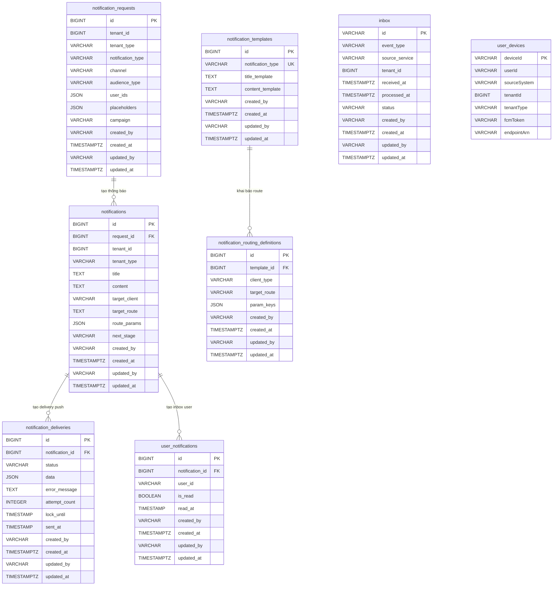

# Data Model — `gf-notification`

## 1. ERD Overview

## 2. Entities

### `notification_requests`

| Column | Type | Nullable | Description |
|---|---|---|---|
| `id` | BIGINT | NO | Khóa chính, sinh bằng `GenerationType.IDENTITY`. |
| `tenant_id` | BIGINT | YES | Tenant scope của request tạo thông báo. |
| `tenant_type` | VARCHAR(255) | YES | `TenantType` từ common library, lưu dạng chuỗi. |
| `notification_type` | VARCHAR(255) | NO | `NotificationType`: `QUOTATION_ASK`, `QUOTATION_BID`, `PRICING_REQUEST`, `PRICING_PROPOSAL`, `PRICING_STRUCTURE`, `QUOTATION_ASK_UPDATE`, `CREATE_PURCHASE_REQUEST`, `SALE_ORDER`, `ORDER_CREATED`, `ORDER_DELIVERING`, `ORDER_DELIVERED`, `INVENTORY_RECEIPT_COMPLETED`, `INVENTORY_RECEIPT_REVERSED`, `INVENTORY_DELIVERY_COMPLETED`, `INVENTORY_DELIVERY_REVERSED`, `PRELIMINARY_QUOTATION_CREATED`, `PRELIMINARY_QUOTATION_UPDATED`, `BOOKING_CREATED`, `BOOKING_CANCELLED_BY_DRIVER`, `BOOKING_AUTO_CANCELLED_UNCONFIRMED`, `BOOKING_AUTO_CANCELLED_NO_SHOW`, `INVENTORY_STOCK_ADJUSTED`, `QUOTATION_CONFIRMED_BY_DRIVER_PLUS`, `QUOTATION_DECLINED_BY_DRIVER_PLUS`, `OTHER`. |
| `channel` | VARCHAR(255) | NO | `NotificationChannel`: `INAPP`, `PUSH`, `BOTH`. |
| `audience_type` | VARCHAR(255) | YES | `TargetClient`: `DRIVER`, `VENDOR`, `GARAGE`, `CARDOCTOR`. |
| `user_ids` | JSON | YES | Chuỗi JSON chứa danh sách user id nhận thông báo khi request nhắm tới user cụ thể. |
| `placeholders` | JSON | YES | Chuỗi JSON chứa dữ liệu render template và route params. |
| `campaign` | VARCHAR(500) | YES | Campaign hoặc nguồn tạo request. |
| `created_by` | VARCHAR(255) | NO | Người tạo từ `AuditableEntity`, `updatable = false`. |
| `created_at` | TIMESTAMPTZ | NO | Thời điểm tạo từ `AuditableEntity`, `updatable = false`. |
| `updated_by` | VARCHAR(255) | YES | Người cập nhật từ `AuditableEntity`. |
| `updated_at` | TIMESTAMPTZ | YES | Thời điểm cập nhật từ `AuditableEntity`. |

**Indexes**: PK trên `id`. Không thấy `@Index` hoặc migration `CREATE INDEX` cho bảng này.
**Constraints**: PK `id`; `notification_type` NOT NULL; `channel` NOT NULL; `created_by` NOT NULL; `created_at` NOT NULL. Migration `V1.0.4` drop constraint `notification_requests_notification_type_check` nếu tồn tại.

### `notifications`

| Column | Type | Nullable | Description |
|---|---|---|---|
| `id` | BIGINT | NO | Khóa chính, sinh bằng `GenerationType.IDENTITY`. |
| `request_id` | BIGINT | NO | FK tới `notification_requests.id`. |
| `tenant_id` | BIGINT | YES | Tenant scope được copy từ request hoặc recipient. |
| `tenant_type` | VARCHAR(255) | YES | `TenantType` từ common library, lưu dạng chuỗi. |
| `title` | TEXT | YES | Tiêu đề đã render từ template. |
| `content` | TEXT | YES | Nội dung đã render từ template. |
| `target_client` | VARCHAR(255) | YES | `TargetClient`: `DRIVER`, `VENDOR`, `GARAGE`, `CARDOCTOR`. |
| `target_route` | TEXT | YES | Route client mở khi người dùng bấm thông báo. |
| `route_params` | JSON | YES | Chuỗi JSON chứa `requestId` và các key từ `param_keys`. |
| `next_stage` | VARCHAR(255) | YES | `NotificationStage`: `INITIAL`, `BUILDING_INAPP`, `PROCESSING`, `PROCESSED`. |
| `created_by` | VARCHAR(255) | NO | Người tạo từ `AuditableEntity`, `updatable = false`. |
| `created_at` | TIMESTAMPTZ | NO | Thời điểm tạo từ `AuditableEntity`, `updatable = false`. |
| `updated_by` | VARCHAR(255) | YES | Người cập nhật từ `AuditableEntity`. |
| `updated_at` | TIMESTAMPTZ | YES | Thời điểm cập nhật từ `AuditableEntity`; native claim query set `updated_at = now()`. |

**Indexes**: PK trên `id`. Không thấy `@Index` hoặc migration `CREATE INDEX`; repository có query claim theo `next_stage`, `id`.
**Constraints**: PK `id`; FK `request_id` -> `notification_requests.id`; `request_id` NOT NULL; `created_by` NOT NULL; `created_at` NOT NULL.

### `notification_deliveries`

| Column | Type | Nullable | Description |
|---|---|---|---|
| `id` | BIGINT | NO | Khóa chính, sinh bằng `GenerationType.IDENTITY`. |
| `notification_id` | BIGINT | NO | FK tới `notifications.id`. |
| `status` | VARCHAR(255) | YES | `DeliveryStatus`: `PENDING`, `SENDING`, `SENT`, `FAILED`; entity khởi tạo `PENDING`. |
| `data` | JSON | YES | Chuỗi JSON của payload `NotificationCreatedDto` để gửi push qua Kafka. |
| `error_message` | TEXT | YES | Thông tin lỗi khi gửi thất bại hoặc vượt retry. |
| `attempt_count` | INTEGER | YES | Số lần claim/gửi; entity khởi tạo `0` qua `@Builder.Default` nhưng column không có `nullable = false` — DB cho phép NULL nếu insert không qua builder. |
| `lock_until` | TIMESTAMP | YES | Thời điểm hết lock khi delivery ở trạng thái `SENDING`. Dùng `LocalDateTime` (TIMESTAMP without timezone), khác với audit fields `Instant` (TIMESTAMPTZ). |
| `sent_at` | TIMESTAMP | YES | Thời điểm gửi Kafka thành công. Dùng `LocalDateTime` (TIMESTAMP without timezone), khác với audit fields `Instant` (TIMESTAMPTZ). |
| `created_by` | VARCHAR(255) | NO | Người tạo từ `AuditableEntity`, `updatable = false`. |
| `created_at` | TIMESTAMPTZ | NO | Thời điểm tạo từ `AuditableEntity`, `updatable = false`. |
| `updated_by` | VARCHAR(255) | YES | Người cập nhật từ `AuditableEntity`. |
| `updated_at` | TIMESTAMPTZ | YES | Thời điểm cập nhật từ `AuditableEntity`. |

**Indexes**: PK trên `id`. Không thấy `@Index` hoặc migration `CREATE INDEX`; repository claim theo `status`, `lock_until`, `id`.
**Constraints**: PK `id`; FK `notification_id` -> `notifications.id`; `notification_id` NOT NULL; `created_by` NOT NULL; `created_at` NOT NULL.

### `notification_templates`

| Column | Type | Nullable | Description |
|---|---|---|---|
| `id` | BIGINT | NO | Khóa chính, sinh bằng `GenerationType.IDENTITY`. |
| `notification_type` | VARCHAR(255) | NO | Loại template; field khai báo `String` thuần (không dùng `@Enumerated`), lưu giá trị chuỗi tự do — không bị ràng buộc bởi enum `NotificationType` ở DB level. |
| `title_template` | TEXT | YES | Template tiêu đề theo Mustache syntax. |
| `content_template` | TEXT | YES | Template nội dung theo Mustache syntax. |
| `created_by` | VARCHAR(255) | NO | Người tạo từ `AuditableEntity`, `updatable = false`. |
| `created_at` | TIMESTAMPTZ | NO | Thời điểm tạo từ `AuditableEntity`, `updatable = false`. |
| `updated_by` | VARCHAR(255) | YES | Người cập nhật từ `AuditableEntity`. |
| `updated_at` | TIMESTAMPTZ | YES | Thời điểm cập nhật từ `AuditableEntity`. |

**Indexes**: PK trên `id`; unique index do `@Column(unique = true)` trên `notification_type`. Không thấy migration `CREATE INDEX` riêng.
**Constraints**: PK `id`; UNIQUE `notification_type`; `notification_type` NOT NULL; `created_by` NOT NULL; `created_at` NOT NULL.

### `notification_routing_definitions`

| Column | Type | Nullable | Description |
|---|---|---|---|
| `id` | BIGINT | NO | Khóa chính, sinh bằng `GenerationType.IDENTITY`. |
| `template_id` | BIGINT | NO | FK tới `notification_templates.id`. |
| `client_type` | VARCHAR(255) | NO | `TargetClient`: `DRIVER`, `VENDOR`, `GARAGE`, `CARDOCTOR`. |
| `target_route` | VARCHAR(500) | YES | Route client áp dụng cho template và client type. |
| `param_keys` | JSON | YES | Chuỗi JSON chứa danh sách placeholder key cần đưa vào `route_params`. |
| `created_by` | VARCHAR(255) | NO | Người tạo từ `AuditableEntity`, `updatable = false`. |
| `created_at` | TIMESTAMPTZ | NO | Thời điểm tạo từ `AuditableEntity`, `updatable = false`. |
| `updated_by` | VARCHAR(255) | YES | Người cập nhật từ `AuditableEntity`. |
| `updated_at` | TIMESTAMPTZ | YES | Thời điểm cập nhật từ `AuditableEntity`. |

**Indexes**: PK trên `id`. Không thấy `@Index` hoặc migration `CREATE INDEX`; repository fetch qua `notification_templates.notification_type` và collection `routingDefinitions`.
**Constraints**: PK `id`; FK `template_id` -> `notification_templates.id`; `template_id` NOT NULL; `client_type` NOT NULL; `created_by` NOT NULL; `created_at` NOT NULL.

### `user_notifications`

| Column | Type | Nullable | Description |
|---|---|---|---|
| `id` | BIGINT | NO | Khóa chính, sinh bằng `GenerationType.IDENTITY`. |
| `notification_id` | BIGINT | NO | FK tới `notifications.id`. |
| `user_id` | VARCHAR(255) | YES | IAM user id nhận in-app notification. |
| `is_read` | BOOLEAN | YES | Trạng thái đã đọc; entity khởi tạo `false`. |
| `read_at` | TIMESTAMP | YES | Thời điểm người dùng đọc thông báo. Dùng `LocalDateTime` (TIMESTAMP without timezone), khác với audit fields `Instant` (TIMESTAMPTZ). |
| `created_by` | VARCHAR(255) | NO | Người tạo từ `AuditableEntity`, `updatable = false`. |
| `created_at` | TIMESTAMPTZ | NO | Thời điểm tạo từ `AuditableEntity`, `updatable = false`; repository sort theo trường này. |
| `updated_by` | VARCHAR(255) | YES | Người cập nhật từ `AuditableEntity`. |
| `updated_at` | TIMESTAMPTZ | YES | Thời điểm cập nhật từ `AuditableEntity`. |

**Indexes**: PK trên `id`. Không thấy `@Index` hoặc migration `CREATE INDEX`; repository query theo `user_id`, `is_read`, `created_at` và join qua `notification.request.id`.
**Constraints**: PK `id`; FK `notification_id` -> `notifications.id`; `notification_id` NOT NULL; `created_by` NOT NULL; `created_at` NOT NULL. Field `source_system` đang bị comment nên không thuộc schema hiện tại.

### `inbox`

| Column | Type | Nullable | Description |
|---|---|---|---|
| `id` | VARCHAR(255) | NO | Khóa chính, dùng làm idempotency key của event/message. |
| `event_type` | VARCHAR(100) | NO | Loại event nhận từ Kafka. |
| `source_service` | VARCHAR(100) | NO | Service phát event. |
| `tenant_id` | BIGINT | NO | Tenant scope của event. |
| `received_at` | TIMESTAMPTZ | YES | Thời điểm nhận event. |
| `processed_at` | TIMESTAMPTZ | YES | Thời điểm xử lý thành công. |
| `status` | VARCHAR(20) | NO | Trạng thái inbox; entity khởi tạo `RECEIVED`, service dùng `PROCESSING` và `PROCESSED`. |
| `created_by` | VARCHAR(255) | NO | Người tạo từ `AuditableEntity`, `updatable = false`. |
| `created_at` | TIMESTAMPTZ | NO | Thời điểm tạo từ `AuditableEntity`, `updatable = false`. |
| `updated_by` | VARCHAR(255) | YES | Người cập nhật từ `AuditableEntity`. |
| `updated_at` | TIMESTAMPTZ | YES | Thời điểm cập nhật từ `AuditableEntity`. |

**Indexes**: PK trên `id`. Không thấy `@Index` hoặc migration `CREATE INDEX`; repository cleanup theo `processed_at`.
**Constraints**: PK `id`; `event_type` NOT NULL; `source_service` NOT NULL; `tenant_id` NOT NULL; `status` NOT NULL; `created_by` NOT NULL; `created_at` NOT NULL.

### DynamoDB `user_devices`

Tên table runtime lấy từ cấu hình `dynamo.table.device-token`, mặc định `nonprod-dev-ac-device-token`. Tên attribute bên dưới giữ theo Java bean property vì source không khai báo `@DynamoDbAttribute` để đổi tên.

| Column | Type | Nullable | Description |
|---|---|---|---|
| `deviceId` | String | NO | DynamoDB partition key, ánh xạ từ getter `getDeviceId()`. |
| `userId` | String | YES | GSI `user_id-index` partition key, dùng cho `findByUserId` và `findByUserIds`. |
| `sourceSystem` | String | YES | GSI `source_system-index` partition key, dùng cho `findBySourceSystem`. |
| `tenantId` | Number | YES | GSI `tenant-index` partition key, dùng cho `findByTenantIdAndTenantType`. |
| `tenantType` | String | YES | GSI `tenant-index` sort key, query bằng `sortBeginsWith`. |
| `fcmToken` | String | YES | Firebase Cloud Messaging token của thiết bị. |
| `endpointArn` | String | YES | AWS SNS endpoint ARN của thiết bị. |

**Indexes**: DynamoDB primary key `deviceId`; GSI `user_id-index` (`userId`); GSI `tenant-index` (`tenantId`, `tenantType`); GSI `source_system-index` (`sourceSystem`).
**Constraints**: Không có FK quan hệ. DynamoDB yêu cầu partition key `deviceId` khi ghi item; các GSI là sparse theo thuộc tính có mặt trên item.

## 3. Data Isolation

Dữ liệu PostgreSQL dùng pooled schema `${DB_SCHEMA:dev-gf-notification}`. Các bảng `notification_requests`, `notifications` và `inbox` có `tenant_id` trực tiếp; `notification_deliveries` và `user_notifications` kế thừa tenant scope qua quan hệ tới `notifications`; `notification_templates` và `notification_routing_definitions` là cấu hình global theo `notification_type` và `client_type`.

API đọc inbox của user dựa vào `user_id` từ JWT và repository filter theo `user_id`. DynamoDB `user_devices` hỗ trợ isolation theo GSI `tenant-index` (`tenantId`, `tenantType`) và lookup theo user/source system. Không có FK vật lý tới tenant hoặc IAM/HRM service.

## 4. Migration

PostgreSQL schema được tạo/cập nhật bằng Hibernate `spring.jpa.hibernate.ddl-auto=update`. Dù `spring.flyway.enabled=false` trong cấu hình Spring Boot, service có `FlywayConfig` tự tạo bean `Flyway` và gọi `flyway.migrate()` khi `ApplicationReadyEvent` chạy sau bước Hibernate update.

`V1.0.0__initialize.sql` đang rỗng. Các migration `V1.0.1` đến `V1.0.9` seed hoặc update dữ liệu trong `notification_templates` và `notification_routing_definitions`; `V1.0.4` drop constraint `notification_requests_notification_type_check` nếu tồn tại. Không thấy migration tạo bảng, tạo FK thủ công, hoặc `CREATE INDEX`. DynamoDB table `${DYNAMO_DEVICE_TOKEN_TABLE:nonprod-dev-ac-device-token}` không có migration trong repo này.

## 5. References

- [gf-notification-HLD.md](../hld/gf-notification-HLD.md)
- [gf-notification-api.md](../api/gf-notification-api.md)

## Change Log

| Date | Version | Summary |
|---|---|---|
| 2026-05-07 | v1 | Initial data model cho `gf-notification`: PostgreSQL schema `${DB_SCHEMA:dev-gf-notification}` với 7 bảng (`notification_requests`, `notifications`, `notification_deliveries`, `notification_templates`, `notification_routing_definitions`, `user_notifications`, `inbox`) và DynamoDB table `user_devices` (default `nonprod-dev-ac-device-token`); các enum `NotificationType`, `NotificationChannel`, `TargetClient`, `NotificationStage`, `DeliveryStatus`. Pooled multi-tenant qua `tenant_id` ở 3 bảng có tenant trực tiếp; templates/routing là global. Hibernate `ddl-auto=update` + Flyway custom seed (V1.0.0-V1.0.9). Bao gồm ERD overview, entities, data isolation, migration, references.
| 2026-05-19 | v2 | Fix temporal type: ghi rõ `lock_until`, `sent_at`, `read_at` dùng `LocalDateTime` (TIMESTAMP) khác audit fields `Instant` (TIMESTAMPTZ). Fix `notification_templates.notification_type`: field là `String` thuần, không dùng `@Enumerated`. Fix `attempt_count`: ghi rõ column nullable ở DB nhưng init 0 qua `@Builder.Default`.
