# Data Model — gf-sales

> PostgreSQL, schema `${DB_SCHEMA:dev_gf_sales}`. Service dùng Spring Data JPA với `ddl-auto=update`, Flyway bật `validate-on-migrate` và `baseline-on-migrate`.
> Mô hình này phản ánh 18 JPA entity/table và 1 SQL table `sequences` trong source hiện tại.

## 1. ERD Overview

```mermaid
erDiagram
    contact ||--o{ customer : "contact_id"
    contact ||--o{ vehicle_registration : "contact_id"
    customer ||--o{ booking : "customer_id"
    customer ||--o{ service_order : "customer_id"
    vehicle ||--o{ booking : "vehicle_id"
    vehicle ||--o{ service_order : "vehicle_id"
    vehicle ||--o{ vehicle_registration : "latest_vehicle_id"
    booking ||--o| booking_details : "booking_id"
    booking ||--o{ booking_status_history : "booking_id"
    booking ||--o{ service_order : "booking_id"
    service_order ||--o{ service_order_item : "service_order_id"
    service_order ||--o{ service_order_part : "service_order_id"
    service_order ||--o{ service_order_payment : "service_order_id"
    service_order ||--o{ service_order_document : "service_order_id"
    service_order ||--o{ service_order_note : "service_order_id"
    service_order ||--o{ quotation_asks : "service_order_id"
    service_order ||--o{ ocr_vehicle_info_history : "service_order_id"
    quotation_asks ||..o{ service_order_part : "quotation_ask_code"
    outbox_event }o..|| booking : "aggregate_id"
    outbox_event }o..|| service_order : "aggregate_id"
    inbox_event }o..|| booking : "event_id"
    inbox_event }o..|| service_order : "event_id"

    booking {
        BIGINT id PK
        VARCHAR_50 code UK
        BIGINT tenant_id
        BIGINT customer_id
        VARCHAR_50 customer_code
        BIGINT vehicle_id
        BIGINT driver_id
        TIMESTAMPTZ booked_at
        VARCHAR_20 status
        VARCHAR_20 service_type
        VARCHAR_20 lead_source
        VARCHAR_50 lead_id
        TIMESTAMPTZ arrived_at
        VARCHAR_255 notes
        JSONB status_transition_data
        VARCHAR_255 created_by
        TIMESTAMPTZ created_at
        VARCHAR_255 updated_by
        TIMESTAMPTZ updated_at
    }

    booking_details {
        BIGINT id PK
        BIGINT tenant_id
        BIGINT booking_id UK
        VARCHAR_255 customer_name
        VARCHAR_255 customer_phone
        VARCHAR_255 customer_email
        VARCHAR_255 vehicle_plate
        VARCHAR_255 vehicle_brand
        VARCHAR_255 vehicle_model
        VARCHAR_255 vehicle_version
        VARCHAR_255 vehicle_year
        VARCHAR_255 vehicle_vin
        INTEGER vehicle_odo
        JSONB vehicle_images
        VARCHAR_1000 vehicle_condition_description
        VARCHAR_1000 customer_note
        VARCHAR_1000 internal_note
        VARCHAR_255 created_by
        TIMESTAMPTZ created_at
        VARCHAR_255 updated_by
        TIMESTAMPTZ updated_at
    }

    booking_status_history {
        BIGINT id PK
        BIGINT tenant_id
        BIGINT booking_id
        VARCHAR_20 from_status
        VARCHAR_20 to_status
        TEXT reason
        TIMESTAMPTZ changed_at
        VARCHAR_100 changed_by
        TEXT metadata
        VARCHAR_255 created_by
        TIMESTAMPTZ created_at
        VARCHAR_255 updated_by
        TIMESTAMPTZ updated_at
    }

    timeslots {
        BIGINT id PK
        BIGINT tenant_id
        BIGINT garage_id
        DATE slot_date
        TIME start_time
        TIME end_time
        INTEGER max_capacity
        INTEGER booked_count
        BOOLEAN is_available
        TIMESTAMPTZ created_at
        TIMESTAMPTZ updated_at
    }

    service_order {
        BIGINT id PK
        VARCHAR_255 code UK
        BIGINT tenant_id
        BIGINT booking_id
        VARCHAR_255 customer_type
        BIGINT customer_id
        VARCHAR_50 customer_code
        VARCHAR_255 customer_name
        VARCHAR_255 customer_phone
        VARCHAR_255 organization_phone
        VARCHAR_255 organization_name
        VARCHAR_255 organization_tax_code
        BIGINT vehicle_id
        VARCHAR_255 vehicle_plate
        VARCHAR_255 vehicle_brand
        VARCHAR_255 vehicle_model
        VARCHAR_255 vehicle_version
        VARCHAR_255 vehicle_year
        VARCHAR_255 vehicle_color
        VARCHAR_255 vehicle_vin
        INTEGER vehicle_odo
        VARCHAR_255 vehicle_fuel_level
        JSONB vehicle_images
        VARCHAR_255 status
        NUMERIC_15_2 total_service_amount
        NUMERIC_15_2 total_parts_amount
        NUMERIC_15_2 discount_amount
        NUMERIC_15_2 tax_amount
        NUMERIC_15_2 final_amount
        NUMERIC_15_2 paid_amount
        NUMERIC_15_2 debt_amount
        VARCHAR_255 payment_status
        TEXT notes
        TIMESTAMPTZ started_at
        TIMESTAMPTZ completed_at
        BOOLEAN has_insurance
        VARCHAR_255 insurance_company
        VARCHAR_255 creator_employee
        BIGINT creator_employee_id
        VARCHAR_255 insurance_policy_number
        DATE insurance_expiry_date
        VARCHAR_255 insurance_contact_phone
        VARCHAR_20 service_type
        TIMESTAMPTZ estimated_complete_at
        VARCHAR_255 order_type
        BOOLEAN is_walk_in_retail
        NUMERIC_15_2 insurance_amount
        NUMERIC_15_2 customer_amount
        VARCHAR_50 settlement_code
        VARCHAR_255 settled_by
        TIMESTAMPTZ settled_at
        VARCHAR_255 assessor_name
        TEXT cancellation_reason
        BOOLEAN delivery_event_sent
        INTEGER quote_sent_count
        VARCHAR_255 created_by
        TIMESTAMPTZ created_at
        VARCHAR_255 updated_by
        TIMESTAMPTZ updated_at
    }

    service_order_item {
        BIGINT id PK
        BIGINT tenant_id
        BIGINT service_order_id
        VARCHAR_255 service_code
        VARCHAR_255 service_name
        TEXT description
        INTEGER quantity
        NUMERIC_15_2 unit_price
        VARCHAR_255 unit
        VARCHAR_255 discount_amount
        NUMERIC_5_2 discount_percent
        NUMERIC_15_2 amount
        NUMERIC_15_2 tax_amount
        NUMERIC_15_2 final_amount
        NUMERIC_5_2 tax_percent
        BIGINT technician_id
        VARCHAR_255 technician_name
        BOOLEAN is_deleted
        VARCHAR_255 payer
        VARCHAR_255 created_by
        TIMESTAMPTZ created_at
        VARCHAR_255 updated_by
        TIMESTAMPTZ updated_at
    }

    service_order_part {
        BIGINT id PK
        BIGINT tenant_id
        BIGINT service_order_id
        BIGINT part_id
        VARCHAR_100 sku
        VARCHAR_100 genuine_code
        VARCHAR_255 part_code
        VARCHAR_255 part_name
        VARCHAR_100 brand
        VARCHAR_20 tier
        VARCHAR_100 origin
        NUMERIC_15_3 quantity
        NUMERIC_15_2 unit_price
        NUMERIC_5_2 discount_percent
        NUMERIC_15_2 discount_amount
        NUMERIC_15_2 amount
        VARCHAR_255 unit
        NUMERIC_5_2 tax_rate
        NUMERIC_15_2 tax_amount
        NUMERIC_15_2 final_amount
        VARCHAR_255 source
        BIGINT technician_id
        VARCHAR_255 technician_name
        VARCHAR_50 quotation_ask_code
        BOOLEAN is_deleted
        VARCHAR_255 payer
        VARCHAR_255 created_by
        TIMESTAMPTZ created_at
        VARCHAR_255 updated_by
        TIMESTAMPTZ updated_at
    }

    service_order_payment {
        BIGINT id PK
        BIGINT tenant_id
        BIGINT service_order_id
        NUMERIC_15_2 amount
        VARCHAR_20 payment_method
        VARCHAR_100 reference_code
        VARCHAR_100 settlement_code
        TEXT notes
        TIMESTAMPTZ paid_at
        VARCHAR_20 payment_status
        VARCHAR_255 created_by
        TIMESTAMPTZ created_at
        VARCHAR_255 updated_by
        TIMESTAMPTZ updated_at
    }

    service_order_document {
        BIGINT id PK
        BIGINT tenant_id
        BIGINT service_order_id
        VARCHAR_50 document_type
        VARCHAR_255 file_name
        VARCHAR_500 file_url
        BIGINT file_size
        VARCHAR_100 mime_type
        TEXT description
        BOOLEAN is_deleted
        VARCHAR_255 created_by
        TIMESTAMPTZ created_at
        VARCHAR_255 updated_by
        TIMESTAMPTZ updated_at
    }

    service_order_note {
        BIGINT id PK
        BIGINT tenant_id
        BIGINT service_order_id
        VARCHAR_20 note_type
        VARCHAR_20 priority
        TEXT content
        BIGINT author_id
        VARCHAR_255 author_name
        VARCHAR_255 created_by
        TIMESTAMPTZ created_at
        VARCHAR_255 updated_by
        TIMESTAMPTZ updated_at
    }

    customer {
        BIGINT id PK
        BIGINT tenant_id
        VARCHAR_255 name
        VARCHAR_20 customer_status
        BIGINT contact_id
        VARCHAR_255 created_by
        TIMESTAMPTZ created_at
        VARCHAR_255 updated_by
        TIMESTAMPTZ updated_at
    }

    contact {
        BIGINT id PK
        BIGINT tenant_id
        VARCHAR_20 phone
        VARCHAR_255 email
        BIGINT latest_customer_id
        VARCHAR_255 created_by
        TIMESTAMPTZ created_at
        VARCHAR_255 updated_by
        TIMESTAMPTZ updated_at
    }

    vehicle {
        BIGINT id PK
        BIGINT tenant_id
        VARCHAR_255 plate
        VARCHAR_255 brand
        VARCHAR_255 model
        VARCHAR_255 version
        VARCHAR_255 year
        VARCHAR_255 vin
        INTEGER odo
        JSONB images
        VARCHAR_255 vehicle_status
        VARCHAR_255 created_by
        TIMESTAMPTZ created_at
        VARCHAR_255 updated_by
        TIMESTAMPTZ updated_at
    }

    vehicle_registration {
        BIGINT id PK
        BIGINT tenant_id
        VARCHAR_20 plate
        BIGINT latest_vehicle_id
        BIGINT contact_id
        VARCHAR_255 created_by
        TIMESTAMPTZ created_at
        VARCHAR_255 updated_by
        TIMESTAMPTZ updated_at
    }

    quotation_asks {
        BIGINT id PK
        VARCHAR_50 code UK
        BIGINT tenant_id
        BIGINT service_order_id
        VARCHAR_50 status
        JSONB requested_parts
        BIGINT quotation_ask_id
        VARCHAR_255 created_by
        TIMESTAMPTZ created_at
        VARCHAR_255 updated_by
        TIMESTAMPTZ updated_at
    }

    ocr_vehicle_info_history {
        BIGINT id PK
        BIGINT service_order_id
        BIGINT tenant_id
        TEXT attachment_url
        VARCHAR_255 status_response
        TEXT json_response
        VARCHAR_255 created_by
        TIMESTAMPTZ created_at
        VARCHAR_255 updated_by
        TIMESTAMPTZ updated_at
    }

    outbox_event {
        UUID id PK
        VARCHAR_100 aggregate_type
        VARCHAR_100 aggregate_id
        VARCHAR_100 event_type
        TEXT payload
        VARCHAR_200 topic
        VARCHAR_20 status
        INTEGER retry_count
        TIMESTAMPTZ created_at
        TIMESTAMPTZ processed_at
        VARCHAR_1000 error_message
        TEXT headers
    }

    inbox_event {
        VARCHAR_100 event_id PK
        VARCHAR_100 event_type
        VARCHAR_100 source_service
        BIGINT tenant_id
        TIMESTAMPTZ received_at
        TIMESTAMPTZ processed_at
        VARCHAR_20 status
    }

    sequences {
        VARCHAR_100 sequence_name PK
        BIGINT current_value
        INTEGER increment_by
        TIMESTAMP created_at
        TIMESTAMP updated_at
    }
```

## 2. Entities

### `booking`

| Column | Type | Nullable | Description |
|---|---|---|---|
| `id` | BIGINT | NO | Khóa chính, identity |
| `code` | VARCHAR(50) | NO | Mã booking nghiệp vụ, unique |
| `tenant_id` | BIGINT | NO | Tenant sở hữu booking |
| `customer_id` | BIGINT | YES | ID customer projection hoặc reference ngoài service |
| `customer_code` | VARCHAR(50) | YES | Mã customer từ boundary customer |
| `vehicle_id` | BIGINT | YES | ID vehicle projection hoặc reference ngoài service |
| `driver_id` | BIGINT (DB) / String (entity) | YES | ID tài xế Driver Plus; migration `V1.0.11` tạo cột `BIGINT NULL` nhưng entity khai báo `String driverId` — Hibernate `ddl-auto=update` có thể đã alter sang `VARCHAR(255)` tùy thứ tự chạy; cần kiểm tra DB thực tế |
| `booked_at` | TIMESTAMPTZ | YES | Thời điểm đặt lịch |
| `status` | ENUM `BookingStatus` | NO | Trạng thái booking |
| `service_type` | ENUM `ServiceType` | YES | Loại dịch vụ |
| `lead_source` | ENUM `LeadSource` | YES | Nguồn lead |
| `lead_id` | VARCHAR(50) | YES | ID lead từ hệ thống nguồn |
| `arrived_at` | TIMESTAMPTZ | YES | Thời điểm xe đến garage |
| `notes` | VARCHAR(255) | YES | Ghi chú booking |
| `status_transition_data` | JSONB | YES | Danh sách `StatusTransition` |
| `created_by` | VARCHAR(255) | NO | Người tạo từ `AuditableEntity` |
| `created_at` | TIMESTAMPTZ | NO | Thời điểm tạo từ `AuditableEntity` |
| `updated_by` | VARCHAR(255) | YES | Người cập nhật cuối |
| `updated_at` | TIMESTAMPTZ | YES | Thời điểm cập nhật cuối |

**Indexes**: `idx_booking_tenant_id(tenant_id)`, `idx_booking_code(code)`, `idx_booking_customer_id(customer_id)`, `idx_booking_vehicle_id(vehicle_id)`, `idx_booking_status(status)`, `idx_booking_booked_at(booked_at)`, `idx_booking_tenant_status_arrived(tenant_id,status) WHERE status='ARRIVED'`, `idx_booking_driver_id(driver_id)`, `idx_booking_lead_source(lead_source)`, `idx_booking_lead_source_not_walk_in(lead_source) WHERE lead_source!='WALK_IN'`.
**Constraints**: PK `id`; unique `code`. Không có FK vật lý trong entity/migration.

### `booking_details`

| Column | Type | Nullable | Description |
|---|---|---|---|
| `id` | BIGINT | NO | Khóa chính, identity |
| `tenant_id` | BIGINT | NO | Tenant sở hữu snapshot |
| `booking_id` | BIGINT | NO | Booking cha, unique để giữ tối đa một details record |
| `customer_name` | VARCHAR(255) | YES | Snapshot tên khách |
| `customer_phone` | VARCHAR(255) | YES | Snapshot số điện thoại khách |
| `customer_email` | VARCHAR(255) | YES | Snapshot email khách |
| `vehicle_plate` | VARCHAR(255) | YES | Snapshot biển số |
| `vehicle_brand` | VARCHAR(255) | YES | Snapshot hãng xe |
| `vehicle_model` | VARCHAR(255) | YES | Snapshot model |
| `vehicle_version` | VARCHAR(255) | YES | Snapshot phiên bản |
| `vehicle_year` | VARCHAR(255) | YES | Snapshot năm xe |
| `vehicle_vin` | VARCHAR(255) | YES | Snapshot VIN |
| `vehicle_odo` | INTEGER | YES | Snapshot số odo |
| `vehicle_images` | JSONB | YES | Danh sách `VehicleImage` |
| `vehicle_condition_description` | VARCHAR(1000) | YES | Mô tả tình trạng xe |
| `customer_note` | VARCHAR(1000) | YES | Ghi chú của khách |
| `internal_note` | VARCHAR(1000) | YES | Ghi chú nội bộ |
| `created_by` | VARCHAR(255) | NO | Người tạo |
| `created_at` | TIMESTAMPTZ | NO | Thời điểm tạo |
| `updated_by` | VARCHAR(255) | YES | Người cập nhật cuối |
| `updated_at` | TIMESTAMPTZ | YES | Thời điểm cập nhật cuối |

**Indexes**: `idx_bd_tenant_id(tenant_id)`, `idx_bd_booking_id(booking_id)`.
**Constraints**: PK `id`; unique `booking_id`. Không có FK vật lý.

### `booking_status_history`

| Column | Type | Nullable | Description |
|---|---|---|---|
| `id` | BIGINT | NO | Khóa chính, identity |
| `tenant_id` | BIGINT | NO | Tenant sở hữu history |
| `booking_id` | BIGINT | NO | Booking cha |
| `from_status` | ENUM `BookingStatus` | YES | Trạng thái trước khi đổi |
| `to_status` | ENUM `BookingStatus` | NO | Trạng thái sau khi đổi |
| `reason` | TEXT | YES | Lý do đổi trạng thái |
| `changed_at` | TIMESTAMPTZ | NO | Thời điểm đổi trạng thái |
| `changed_by` | VARCHAR(100) | YES | Actor thực hiện đổi trạng thái |
| `metadata` | TEXT | YES | Metadata JSON dạng text cho lịch sử hiển thị |
| `created_by` | VARCHAR(255) | NO | Người tạo |
| `created_at` | TIMESTAMPTZ | NO | Thời điểm tạo |
| `updated_by` | VARCHAR(255) | YES | Người cập nhật cuối |
| `updated_at` | TIMESTAMPTZ | YES | Thời điểm cập nhật cuối |

**Indexes**: `idx_bsh_tenant_id(tenant_id)`, `idx_bsh_booking_id(booking_id)`, `idx_bsh_changed_at(changed_at)`.
**Constraints**: PK `id`. Không có FK vật lý.

### `timeslots`

| Column | Type | Nullable | Description |
|---|---|---|---|
| `id` | BIGINT | NO | Khóa chính, identity |
| `tenant_id` | BIGINT | NO | Tenant sở hữu timeslot |
| `garage_id` | BIGINT | NO | Garage có slot |
| `slot_date` | DATE | NO | Ngày của slot |
| `start_time` | TIME | NO | Giờ bắt đầu |
| `end_time` | TIME | NO | Giờ kết thúc |
| `max_capacity` | INTEGER | NO | Sức chứa tối đa, mặc định 5 |
| `booked_count` | INTEGER | NO | Số booking đã chiếm, mặc định 0 |
| `is_available` | BOOLEAN | NO | Slot còn khả dụng, mặc định true |
| `created_at` | TIMESTAMPTZ | NO | Thời điểm tạo qua `@PrePersist` |
| `updated_at` | TIMESTAMPTZ | NO | Thời điểm cập nhật qua `@PreUpdate` |

**Indexes**: `idx_timeslots_garage_date(garage_id,slot_date)`.
**Constraints**: PK `id`; unique `uk_timeslots_garage_date_time(garage_id,slot_date,start_time)`.

### `service_order`

| Column | Type | Nullable | Description |
|---|---|---|---|
| `id` | BIGINT | NO | Khóa chính, identity |
| `code` | VARCHAR(255) | NO | Mã service order, unique |
| `tenant_id` | BIGINT | NO | Tenant sở hữu service order |
| `booking_id` | BIGINT | YES | Booking liên quan nếu tạo từ booking |
| `customer_type` | ENUM `CustomerType` | YES | Loại khách hàng |
| `customer_id` | BIGINT | YES | ID customer projection hoặc reference ngoài service |
| `customer_code` | VARCHAR(50) | YES | Mã customer |
| `customer_name` | VARCHAR(255) | YES | Snapshot tên khách |
| `customer_phone` | VARCHAR(255) | YES | Snapshot số điện thoại khách cá nhân |
| `organization_phone` | VARCHAR(255) | YES | Số điện thoại tổ chức |
| `organization_name` | VARCHAR(255) | YES | Tên tổ chức |
| `organization_tax_code` | VARCHAR(255) | YES | Mã số thuế tổ chức |
| `vehicle_id` | BIGINT | YES | ID vehicle projection hoặc reference ngoài service |
| `vehicle_plate` | VARCHAR(255) | YES | Snapshot biển số |
| `vehicle_brand` | VARCHAR(255) | YES | Snapshot hãng xe |
| `vehicle_model` | VARCHAR(255) | YES | Snapshot model |
| `vehicle_version` | VARCHAR(255) | YES | Snapshot phiên bản |
| `vehicle_year` | VARCHAR(255) | YES | Snapshot năm xe |
| `vehicle_color` | VARCHAR(255) | YES | Snapshot màu xe |
| `vehicle_vin` | VARCHAR(255) | YES | Snapshot VIN |
| `vehicle_odo` | INTEGER | YES | Snapshot odo |
| `vehicle_fuel_level` | VARCHAR(255) | YES | Mức nhiên liệu dạng string |
| `vehicle_images` | JSONB | YES | Danh sách ảnh xe |
| `status` | ENUM `ServiceOrderStatus` | NO | Trạng thái service order |
| `total_service_amount` | NUMERIC(15,2) | YES | Tổng tiền công/dịch vụ |
| `total_parts_amount` | NUMERIC(15,2) | YES | Tổng tiền phụ tùng |
| `discount_amount` | NUMERIC(15,2) | YES | Tổng giảm giá |
| `tax_amount` | NUMERIC(15,2) | YES | Tổng thuế |
| `final_amount` | NUMERIC(15,2) | YES | Tổng tiền cuối cùng |
| `paid_amount` | NUMERIC(15,2) | YES | Số tiền đã thu |
| `debt_amount` | NUMERIC(15,2) | YES | Công nợ còn lại |
| `payment_status` | ENUM `ServiceOrderPaymentStatus` | YES | Trạng thái thanh toán tổng |
| `notes` | TEXT | YES | Ghi chú tổng |
| `started_at` | TIMESTAMPTZ | YES | Thời điểm bắt đầu xử lý |
| `completed_at` | TIMESTAMPTZ | YES | Thời điểm hoàn thành |
| `has_insurance` | BOOLEAN | NO | Có bảo hiểm hay không, mặc định false |
| `insurance_company` | VARCHAR(255) | YES | Công ty bảo hiểm |
| `creator_employee` | VARCHAR(255) | YES | Tên nhân viên tạo |
| `creator_employee_id` | BIGINT | YES | ID nhân viên tạo |
| `insurance_policy_number` | VARCHAR(255) | YES | Số hợp đồng bảo hiểm |
| `insurance_expiry_date` | DATE | YES | Ngày hết hạn bảo hiểm |
| `insurance_contact_phone` | VARCHAR(255) | YES | Số liên hệ bảo hiểm |
| `service_type` | ENUM `ServiceType` | YES | Loại dịch vụ |
| `estimated_complete_at` | TIMESTAMPTZ | YES | Thời điểm dự kiến hoàn thành |
| `order_type` | ENUM `OrderType` | YES | Loại đơn `SERVICE` hoặc `RETAIL` |
| `is_walk_in_retail` | BOOLEAN | YES | Cờ đơn bán lẻ khách vãng lai |
| `insurance_amount` | NUMERIC(15,2) | YES | Phần tiền bảo hiểm chi trả |
| `customer_amount` | NUMERIC(15,2) | YES | Phần tiền khách chi trả |
| `settlement_code` | VARCHAR(50) | YES | Mã đối soát/quyết toán |
| `settled_by` | VARCHAR(255) | YES | Người quyết toán |
| `settled_at` | TIMESTAMPTZ | YES | Thời điểm quyết toán |
| `assessor_name` | VARCHAR(255) | YES | Tên giám định viên |
| `cancellation_reason` | TEXT | YES | Lý do hủy |
| `delivery_event_sent` | BOOLEAN | YES | Cờ đã gửi delivery event; migration đặt NOT NULL DEFAULT FALSE |
| `quote_sent_count` | INTEGER | YES | Số lần gửi báo giá; migration mặc định 0 |
| `created_by` | VARCHAR(255) | NO | Người tạo |
| `created_at` | TIMESTAMPTZ | NO | Thời điểm tạo |
| `updated_by` | VARCHAR(255) | YES | Người cập nhật cuối |
| `updated_at` | TIMESTAMPTZ | YES | Thời điểm cập nhật cuối |

**Indexes**: `idx_so_tenant_id(tenant_id)`, `idx_so_code(code)`, `idx_so_booking_id(booking_id)`, `idx_so_customer_id(customer_id)`, `idx_so_customer_phone(customer_phone)`, `idx_so_vehicle_id(vehicle_id)`, `idx_so_vehicle_plate(vehicle_plate)`, `idx_so_vehicle_vin(vehicle_vin)`, `idx_so_status(status)`, `idx_so_payment_status(payment_status)`, `idx_so_created_at(created_at)`, `idx_so_settlement_code(settlement_code)`, `idx_so_booking_id_tenant(booking_id,tenant_id)`, `idx_so_tenant_status_composite(tenant_id,status)`, `idx_so_delivery_event_sent(delivery_event_sent) WHERE delivery_event_sent=FALSE`.
**Constraints**: PK `id`; unique `code`. `service_order_status_check` được tạo ở `V1.0.9` nhưng bị drop ở `V1.0.12` và không được tạo lại trong migration hiện tại.

### `service_order_item`

| Column | Type | Nullable | Description |
|---|---|---|---|
| `id` | BIGINT | NO | Khóa chính, identity |
| `tenant_id` | BIGINT | NO | Tenant sở hữu item |
| `service_order_id` | BIGINT | NO | Service order cha |
| `service_code` | VARCHAR(255) | YES | Mã dịch vụ/công |
| `service_name` | VARCHAR(255) | YES | Tên dịch vụ/công |
| `description` | TEXT | YES | Mô tả |
| `quantity` | INTEGER | NO | Số lượng công/dịch vụ |
| `unit_price` | NUMERIC(15,2) | NO | Đơn giá |
| `unit` | VARCHAR(255) | YES | Đơn vị tính |
| `discount_amount` | VARCHAR(255) | YES | Giá trị giảm giá; entity khai báo `String` (không có `@Column(precision/scale)`) nên Hibernate tạo VARCHAR(255) qua `ddl-auto=update` — khác pattern NUMERIC của các cột amount khác trong cùng bảng |
| `discount_percent` | NUMERIC(5,2) | YES | Phần trăm giảm giá |
| `amount` | NUMERIC(15,2) | YES | Thành tiền trước thuế/cuối |
| `tax_amount` | NUMERIC(15,2) | YES | Tiền thuế |
| `final_amount` | NUMERIC(15,2) | YES | Thành tiền cuối |
| `tax_percent` | NUMERIC(5,2) | YES | Phần trăm thuế |
| `technician_id` | BIGINT | YES | ID kỹ thuật viên |
| `technician_name` | VARCHAR(255) | YES | Tên kỹ thuật viên |
| `is_deleted` | BOOLEAN | NO | Soft delete, mặc định false |
| `payer` | ENUM `Payer` | YES | Bên chi trả |
| `created_by` | VARCHAR(255) | NO | Người tạo |
| `created_at` | TIMESTAMPTZ | NO | Thời điểm tạo |
| `updated_by` | VARCHAR(255) | YES | Người cập nhật cuối |
| `updated_at` | TIMESTAMPTZ | YES | Thời điểm cập nhật cuối |

**Indexes**: `idx_soi_tenant_id(tenant_id)`, `idx_soi_service_order_id(service_order_id)`, `idx_soi_service_code(service_code)`, `idx_soi_is_deleted(is_deleted)`.
**Constraints**: PK `id`. Không có FK vật lý.

### `service_order_part`

| Column | Type | Nullable | Description |
|---|---|---|---|
| `id` | BIGINT | NO | Khóa chính, identity |
| `tenant_id` | BIGINT | NO | Tenant sở hữu part line |
| `service_order_id` | BIGINT | NO | Service order cha |
| `part_id` | BIGINT | YES | ID phụ tùng từ inventory/MDM |
| `sku` | VARCHAR(100) | YES | SKU phụ tùng |
| `genuine_code` | VARCHAR(100) | YES | Mã genuine |
| `part_code` | VARCHAR(255) | YES | Mã phụ tùng nội bộ |
| `part_name` | VARCHAR(255) | YES | Tên phụ tùng |
| `brand` | VARCHAR(100) | YES | Thương hiệu |
| `tier` | VARCHAR(20) | YES | Hạng phụ tùng |
| `origin` | VARCHAR(100) | YES | Xuất xứ |
| `quantity` | NUMERIC(15,3) | NO | Số lượng; DB thực tế là NUMERIC(15,3) sau migration `V1.0.14`. **Lưu ý:** entity annotation vẫn khai báo `@Column(precision=15, scale=2)` — chưa cập nhật theo DB; Hibernate `ddl-auto=update` không thu hẹp scale nên DB giữ nguyên 3 |
| `unit_price` | NUMERIC(15,2) | NO | Đơn giá |
| `discount_percent` | NUMERIC(5,2) | YES | Phần trăm giảm giá |
| `discount_amount` | NUMERIC(15,2) | YES | Tiền giảm giá |
| `amount` | NUMERIC(15,2) | YES | Thành tiền trước thuế/cuối |
| `unit` | VARCHAR(255) | YES | Đơn vị tính |
| `tax_rate` | NUMERIC(5,2) | YES | Thuế suất |
| `tax_amount` | NUMERIC(15,2) | YES | Tiền thuế |
| `final_amount` | NUMERIC(15,2) | YES | Thành tiền cuối |
| `source` | ENUM `PartSource` | YES | Nguồn phụ tùng |
| `technician_id` | BIGINT | YES | ID kỹ thuật viên |
| `technician_name` | VARCHAR(255) | YES | Tên kỹ thuật viên |
| `quotation_ask_code` | VARCHAR(50) | YES | Mã hỏi giá liên quan |
| `is_deleted` | BOOLEAN | NO | Soft delete, mặc định false |
| `payer` | ENUM `Payer` | YES | Bên chi trả |
| `created_by` | VARCHAR(255) | NO | Người tạo |
| `created_at` | TIMESTAMPTZ | NO | Thời điểm tạo |
| `updated_by` | VARCHAR(255) | YES | Người cập nhật cuối |
| `updated_at` | TIMESTAMPTZ | YES | Thời điểm cập nhật cuối |

**Indexes**: `idx_sop_tenant_id(tenant_id)`, `idx_sop_service_order_id(service_order_id)`, `idx_sop_quotation_ask_code(quotation_ask_code)`, `idx_sop_is_deleted(is_deleted)`, `idx_sop_sku(sku)`, `idx_sop_genuine_code(genuine_code)`, `idx_sop_tier(tier)`, `idx_sop_part_id(part_id)`.
**Constraints**: PK `id`. Không có FK vật lý.

### `service_order_payment`

| Column | Type | Nullable | Description |
|---|---|---|---|
| `id` | BIGINT | NO | Khóa chính, identity |
| `tenant_id` | BIGINT | NO | Tenant sở hữu payment |
| `service_order_id` | BIGINT | NO | Service order cha |
| `amount` | NUMERIC(15,2) | NO | Số tiền thanh toán |
| `payment_method` | ENUM `PaymentMethod` | YES | Phương thức thanh toán |
| `reference_code` | VARCHAR(100) | YES | Mã tham chiếu giao dịch |
| `settlement_code` | VARCHAR(100) | YES | Mã đối soát |
| `notes` | TEXT | YES | Ghi chú thanh toán |
| `paid_at` | TIMESTAMPTZ | NO | Thời điểm thanh toán |
| `payment_status` | ENUM `PaymentTransactionStatus` | YES | Trạng thái giao dịch |
| `created_by` | VARCHAR(255) | NO | Người tạo |
| `created_at` | TIMESTAMPTZ | NO | Thời điểm tạo |
| `updated_by` | VARCHAR(255) | YES | Người cập nhật cuối |
| `updated_at` | TIMESTAMPTZ | YES | Thời điểm cập nhật cuối |

**Indexes**: `idx_sopay_tenant_id(tenant_id)`, `idx_sopay_service_order_id(service_order_id)`, `idx_sopay_paid_at(paid_at)`, `idx_sopay_payment_status(payment_status)`, `idx_sopay_reference_code(reference_code)`.
**Constraints**: PK `id`. Không có FK vật lý.

### `service_order_document`

| Column | Type | Nullable | Description |
|---|---|---|---|
| `id` | BIGINT | NO | Khóa chính, identity |
| `tenant_id` | BIGINT | NO | Tenant sở hữu document |
| `service_order_id` | BIGINT | NO | Service order cha |
| `document_type` | ENUM `DocumentType` | NO | Loại tài liệu |
| `file_name` | VARCHAR(255) | NO | Tên file |
| `file_url` | VARCHAR(500) | NO | URL file |
| `file_size` | BIGINT | YES | Kích thước file |
| `mime_type` | VARCHAR(100) | YES | MIME type |
| `description` | TEXT | YES | Mô tả tài liệu |
| `is_deleted` | BOOLEAN | NO | Soft delete, mặc định false |
| `created_by` | VARCHAR(255) | NO | Người tạo |
| `created_at` | TIMESTAMPTZ | NO | Thời điểm tạo |
| `updated_by` | VARCHAR(255) | YES | Người cập nhật cuối |
| `updated_at` | TIMESTAMPTZ | YES | Thời điểm cập nhật cuối |

**Indexes**: `idx_sod_tenant_id(tenant_id)`, `idx_sod_service_order_id(service_order_id)`, `idx_sod_document_type(document_type)`.
**Constraints**: PK `id`. `service_order_document_document_type_check` bị drop ở `V1.0.8`; không có FK vật lý.

### `service_order_note`

| Column | Type | Nullable | Description |
|---|---|---|---|
| `id` | BIGINT | NO | Khóa chính, identity |
| `tenant_id` | BIGINT | NO | Tenant sở hữu note |
| `service_order_id` | BIGINT | NO | Service order cha |
| `note_type` | ENUM `NoteType` | NO | Loại ghi chú |
| `priority` | ENUM `NotePriority` | YES | Mức ưu tiên |
| `content` | TEXT | NO | Nội dung ghi chú |
| `author_id` | BIGINT | YES | ID người ghi chú |
| `author_name` | VARCHAR(255) | YES | Tên người ghi chú |
| `created_by` | VARCHAR(255) | NO | Người tạo |
| `created_at` | TIMESTAMPTZ | NO | Thời điểm tạo |
| `updated_by` | VARCHAR(255) | YES | Người cập nhật cuối |
| `updated_at` | TIMESTAMPTZ | YES | Thời điểm cập nhật cuối |

**Indexes**: `idx_son_tenant_id(tenant_id)`, `idx_son_service_order_id(service_order_id)`, `idx_son_note_type(note_type)`.
**Constraints**: PK `id`. Không có FK vật lý.

### `customer`

| Column | Type | Nullable | Description |
|---|---|---|---|
| `id` | BIGINT | NO | Khóa chính, identity |
| `tenant_id` | BIGINT | NO | Tenant sở hữu customer projection |
| `name` | VARCHAR(255) | NO | Tên khách hàng |
| `customer_status` | ENUM `CustomerStatus` | NO | Trạng thái customer projection |
| `contact_id` | BIGINT | YES | Contact projection liên quan |
| `created_by` | VARCHAR(255) | NO | Người tạo |
| `created_at` | TIMESTAMPTZ | NO | Thời điểm tạo |
| `updated_by` | VARCHAR(255) | YES | Người cập nhật cuối |
| `updated_at` | TIMESTAMPTZ | YES | Thời điểm cập nhật cuối |

**Indexes**: `idx_cust_tenant_id(tenant_id)`, `idx_cust_contact_id(contact_id)`, `idx_cust_status(customer_status)`, `idx_cust_name(name)`.
**Constraints**: PK `id`. Không có FK vật lý.

### `contact`

| Column | Type | Nullable | Description |
|---|---|---|---|
| `id` | BIGINT | NO | Khóa chính, identity |
| `tenant_id` | BIGINT | NO | Tenant sở hữu contact projection |
| `phone` | VARCHAR(20) | NO | Số điện thoại |
| `email` | VARCHAR(255) | YES | Email |
| `latest_customer_id` | BIGINT | YES | Customer mới nhất liên kết với contact |
| `created_by` | VARCHAR(255) | NO | Người tạo |
| `created_at` | TIMESTAMPTZ | NO | Thời điểm tạo |
| `updated_by` | VARCHAR(255) | YES | Người cập nhật cuối |
| `updated_at` | TIMESTAMPTZ | YES | Thời điểm cập nhật cuối |

**Indexes**: `idx_contact_tenant_id(tenant_id)`, `idx_contact_phone(phone)`, `idx_contact_latest_customer_id(latest_customer_id)`, `idx_contact_email(email)`.
**Constraints**: PK `id`; unique `uk_contact_tenant_phone(tenant_id,phone)`. Không có FK vật lý.

### `vehicle`

| Column | Type | Nullable | Description |
|---|---|---|---|
| `id` | BIGINT | NO | Khóa chính, identity |
| `tenant_id` | BIGINT | NO | Tenant sở hữu vehicle projection |
| `plate` | VARCHAR(255) | NO | Biển số |
| `brand` | VARCHAR(255) | YES | Hãng xe |
| `model` | VARCHAR(255) | YES | Model |
| `version` | VARCHAR(255) | YES | Phiên bản |
| `year` | VARCHAR(255) | YES | Năm xe |
| `vin` | VARCHAR(255) | YES | VIN |
| `odo` | INTEGER | YES | Số odo |
| `images` | JSONB | YES | Danh sách `VehicleImage` |
| `vehicle_status` | ENUM `VehicleStatus` | NO | Trạng thái vehicle projection |
| `created_by` | VARCHAR(255) | NO | Người tạo |
| `created_at` | TIMESTAMPTZ | NO | Thời điểm tạo |
| `updated_by` | VARCHAR(255) | YES | Người cập nhật cuối |
| `updated_at` | TIMESTAMPTZ | YES | Thời điểm cập nhật cuối |

**Indexes**: `idx_veh_tenant_id(tenant_id)`, `idx_veh_plate(plate)`, `idx_veh_vin(vin)`, `idx_veh_status(vehicle_status)`.
**Constraints**: PK `id`. Không có FK vật lý.

### `vehicle_registration`

| Column | Type | Nullable | Description |
|---|---|---|---|
| `id` | BIGINT | NO | Khóa chính, identity |
| `tenant_id` | BIGINT | NO | Tenant sở hữu registration projection |
| `plate` | VARCHAR(20) | NO | Biển số chuẩn hóa |
| `latest_vehicle_id` | BIGINT | YES | Vehicle mới nhất ứng với biển số |
| `contact_id` | BIGINT | YES | Contact liên quan biển số |
| `created_by` | VARCHAR(255) | NO | Người tạo |
| `created_at` | TIMESTAMPTZ | NO | Thời điểm tạo |
| `updated_by` | VARCHAR(255) | YES | Người cập nhật cuối |
| `updated_at` | TIMESTAMPTZ | YES | Thời điểm cập nhật cuối |

**Indexes**: `idx_vr_tenant_id(tenant_id)`, `idx_vr_plate(plate)`, `idx_vr_latest_vehicle_id(latest_vehicle_id)`, `idx_vr_contact_id(contact_id)`.
**Constraints**: PK `id`; unique `uk_vr_tenant_plate(tenant_id,plate)`. Không có FK vật lý.

### `quotation_asks`

| Column | Type | Nullable | Description |
|---|---|---|---|
| `id` | BIGINT | NO | Khóa chính, identity |
| `code` | VARCHAR(50) | NO | Mã hỏi giá, unique |
| `tenant_id` | BIGINT | NO | Tenant sở hữu quotation ask |
| `service_order_id` | BIGINT | NO | Service order cha |
| `status` | VARCHAR(50) | YES | Trạng thái hỏi giá dạng string |
| `requested_parts` | JSONB | YES | Map phụ tùng cần hỏi giá |
| `quotation_ask_id` | BIGINT | YES | ID hỏi giá từ boundary purchase |
| `created_by` | VARCHAR(255) | NO | Người tạo |
| `created_at` | TIMESTAMPTZ | NO | Thời điểm tạo |
| `updated_by` | VARCHAR(255) | YES | Người cập nhật cuối |
| `updated_at` | TIMESTAMPTZ | YES | Thời điểm cập nhật cuối |

**Indexes**: `idx_qa_tenant_id(tenant_id)`, `idx_qa_service_order_id(service_order_id)`, `idx_qa_code(code)`, `idx_qa_quotation_ask_id(quotation_ask_id)`.
**Constraints**: PK `id`; unique `code`. Không có FK vật lý.

### `ocr_vehicle_info_history`

| Column | Type | Nullable | Description |
|---|---|---|---|
| `id` | BIGINT | NO | Khóa chính, identity |
| `service_order_id` | BIGINT | YES | Service order liên quan OCR |
| `tenant_id` | BIGINT | YES | Tenant liên quan OCR |
| `attachment_url` | TEXT | NO | URL attachment đưa vào OCR |
| `status_response` | VARCHAR(255) | YES | Trạng thái response OCR |
| `json_response` | TEXT | NO | Raw JSON response OCR |
| `created_by` | VARCHAR(255) | NO | Người tạo |
| `created_at` | TIMESTAMPTZ | NO | Thời điểm tạo |
| `updated_by` | VARCHAR(255) | YES | Người cập nhật cuối |
| `updated_at` | TIMESTAMPTZ | YES | Thời điểm cập nhật cuối |

**Indexes**: Không khai báo trong entity/migration hiện tại.
**Constraints**: PK `id`. Không có FK vật lý.

### `outbox_event`

| Column | Type | Nullable | Description |
|---|---|---|---|
| `id` | UUID | NO | Khóa chính, sinh bằng `GenerationType.UUID` |
| `aggregate_type` | VARCHAR(100) | NO | Loại aggregate phát event |
| `aggregate_id` | VARCHAR(100) | NO | ID aggregate phát event |
| `event_type` | VARCHAR(100) | NO | Loại event |
| `payload` | TEXT | NO | Payload event |
| `topic` | VARCHAR(200) | NO | Kafka topic đích |
| `status` | ENUM `OutboxStatus` | NO | Trạng thái xử lý outbox, mặc định `PENDING` |
| `retry_count` | INTEGER | NO | Số lần retry, mặc định 0 |
| `created_at` | TIMESTAMPTZ | NO | Thời điểm tạo, set bằng `@PrePersist` nếu null |
| `processed_at` | TIMESTAMPTZ | YES | Thời điểm xử lý xong |
| `error_message` | VARCHAR(1000) | YES | Lỗi xử lý gần nhất |
| `headers` | TEXT | YES | Header event dạng text |

**Indexes**: `idx_oe_status(status)`, `idx_oe_created_at(created_at)`, `idx_oe_status_created(status,created_at)`.
**Constraints**: PK `id`. `outbox_event_status_check` bị drop ở `V1.0.7`; không có `tenant_id` trực tiếp.

### `inbox_event`

| Column | Type | Nullable | Description |
|---|---|---|---|
| `event_id` | VARCHAR(100) | NO | Khóa chính và khóa chống xử lý trùng event |
| `event_type` | VARCHAR(100) | YES | Loại event nhận vào |
| `source_service` | VARCHAR(100) | YES | Service nguồn |
| `tenant_id` | BIGINT | YES | Tenant trong event |
| `received_at` | TIMESTAMPTZ | YES | Thời điểm nhận event |
| `processed_at` | TIMESTAMPTZ | YES | Thời điểm xử lý event |
| `status` | VARCHAR(20) | YES | Trạng thái xử lý, mặc định `RECEIVED` |

**Indexes**: `idx_ie_event_id(event_id)`, `idx_ie_processed_at(processed_at)`, `idx_ie_tenant_id(tenant_id)`.
**Constraints**: PK `event_id`.

### `sequences`

| Column | Type | Nullable | Description |
|---|---|---|---|
| `sequence_name` | VARCHAR(100) | NO | Khóa chính, tên sequence nghiệp vụ |
| `current_value` | BIGINT | NO | Giá trị hiện tại, mặc định 0 |
| `increment_by` | INTEGER | NO | Bước tăng, mặc định 1 |
| `created_at` | TIMESTAMP | NO | Thời điểm tạo, mặc định `CURRENT_TIMESTAMP` |
| `updated_at` | TIMESTAMP | NO | Thời điểm cập nhật, mặc định `CURRENT_TIMESTAMP` |

**Indexes**: PK trên `sequence_name`.
**Constraints**: PK `sequence_name`; function `get_next_number(schemaName, sequenceName)` tăng hoặc khởi tạo sequence theo schema động.

## 2bis. Insurance Settlement Extension (DESIGN — FEAT-INS-SO-ADJUSTMENT, chưa có trong source)

> ⚠️ Thiết kế cho `FEAT-INS-SO-ADJUSTMENT` (ADR-014). Cột mới **additive**, sinh schema qua `ddl-auto=update` (entity thêm field → DB tự sync). gf-sales đã có sẵn `payer` (item+part), `has_insurance`, `insurance_company` (**lưu mã CTBH v.d. `INS_BSH`**, KHÔNG phải free-text), `insurance_policy_number`, `insurance_amount`, `customer_amount`, `settlement_code` — chỉ thiếu lưu **5 khoản điều chỉnh BH** (8 scalar columns) + khấu hao per-line. **KHÔNG** thêm cột `insurance_code` (đã có `insurance_company` baseline).

### 2bis.1 `service_order` — additive columns

5 khoản điều chỉnh BH (BR-EP §7.1, nhập ở SO **Edit/Detail** — KHÔNG Create, BR-INS-SO-PS-006). Khấu hao per-line lưu ở `service_order_part.depreciation_percent`.

| Column | Type | Nullable | Description |
|---|---|---|---|
| `discount_material_mode` | `VARCHAR(10)` | YES | Mode CK liên kết vật tư: `PERCENT` hoặc `AMOUNT`. |
| `discount_material_value` | `NUMERIC(15,2)` | YES | Giá trị CK liên kết vật tư. |
| `discount_labor_mode` | `VARCHAR(10)` | YES | Mode CK liên kết công DV: `PERCENT` hoặc `AMOUNT`. |
| `discount_labor_value` | `NUMERIC(15,2)` | YES | Giá trị CK liên kết công DV. |
| `depreciation_default_percent` | `NUMERIC(5,2)` | YES | Khấu hao mặc định % (header level). Per-line override ở `service_order_part.depreciation_percent`. |
| `claim_reduction_mode` | `VARCHAR(10)` | YES | Mode giảm trừ bồi thường: `PERCENT` hoặc `AMOUNT`. |
| `claim_reduction_value` | `NUMERIC(15,2)` | YES | Giá trị giảm trừ bồi thường. |
| `insurance_deductible_amount` | `NUMERIC(15,2)` | YES | Khấu trừ bảo hiểm (số tiền tuyệt đối). |

> **Không thêm cột `insurance_code`**: `insurance_company` (VARCHAR baseline) đã lưu mã CTBH (v.d. `INS_BSH`) — KHÔNG phải free-text. Dropdown/enrich tên qua `searchCatalog`/`catalog/inquiry`/`find-by-code` sẵn có.

> "BH thanh toán" / "Khách hàng thanh toán" (Cộng sau VAT per payer — BR-EP §7.2) là **derived realtime** từ line items (`payer`) + 8 scalar adjustment columns — KHÔNG lưu cột riêng; chỉ snapshot vào gf-accounting `settlement_records` scalar breakdown columns + `insurance_payable_amount` khi tạo Phiếu QT BH (CB-INS-002).

### 2bis.2 `service_order_part` — additive column

| Column | Type | Nullable | Description |
|---|---|---|---|
| `depreciation_percent` | NUMERIC(5,2) | YES | Khấu hao vật tư/thay mới per dòng phụ tùng (% only — BR-INS-SO-ADJ-005, chỉ áp dụng phụ tùng BH). Nút "Áp dụng tất cả" set đồng loạt vào các dòng. NULL cho dòng không khấu hao. |

> Không thêm cột cho `service_order_item` — khấu hao KHÔNG áp dụng công DV (BR-INS-SO-ADJ-005). `payer` trên item/part đã đủ phân loại BH/KH.

## 3. Data Isolation

`tenant_id` là cột cô lập dữ liệu trực tiếp trên `booking`, `booking_details`, `booking_status_history`, `timeslots`, toàn bộ service order child tables, `customer`, `contact`, `vehicle`, `vehicle_registration`, `quotation_asks`, `ocr_vehicle_info_history` và `inbox_event`.

Các repository chính đều truy vấn theo `tenantId` cho luồng booking, service order, customer/contact/vehicle projection, quotation và inbox. `timeslots` hiện truy vấn chủ yếu theo `garage_id` và ngày; entity vẫn có `tenant_id` để lưu tenant. `outbox_event` không có `tenant_id` trực tiếp, nên tenant phải nằm trong `payload`, `headers` hoặc được suy ra từ aggregate.

Projection `customer`, `contact`, `vehicle`, `vehicle_registration` chỉ là bản sao cục bộ phục vụ booking/service order. Source of truth vẫn nằm ở boundary customer/vehicle bên ngoài; dữ liệu stale phải được xử lý qua API/event đồng bộ.

## 4. Migration

Flyway chạy trên schema `${DB_SCHEMA:dev_gf_sales}` với `baseline-on-migrate=true`. `V1.0.0__initialize.sql` rỗng, nên bảng chính được tạo/cập nhật bởi Hibernate `ddl-auto=update`; các migration sau bổ sung table/function `sequences`, function `unaccent_vi`, index dashboard realtime, cột/index phụ tùng, cờ delivery, driver ID, quote count, lead source index và điều chỉnh quantity của `service_order_part`.

Các migration constraint hiện tại cần hiểu theo thứ tự chạy: `service_order_status_check` được tạo ở `V1.0.9` nhưng bị drop ở `V1.0.12`; `outbox_event_status_check` bị drop ở `V1.0.7`; `service_order_document_document_type_check` bị drop ở `V1.0.8`. Source hiện tại không tạo lại các check constraint này.

**(Design — Insurance Settlement)**: 8 cột scalar mới trên `service_order` + 1 cột `depreciation_percent` trên `service_order_part` — sinh schema qua `ddl-auto=update` (entity thêm field → Hibernate tự `ADD COLUMN` nullable). **KHÔNG cần Flyway migration riêng** — `ddl-auto=update` là cơ chế schema evolution. **KHÔNG** thêm `insurance_code` — `insurance_company` baseline đã lưu mã CTBH.

## 5. References

- HLD [gf-sales-HLD.md](../hld/gf-sales-HLD.md)
- API [gf-sales-api.md](../api/gf-sales-api.md)
- Data model liên quan [gf-customer-data-model.md](gf-customer-data-model.md)
- Data model liên quan [gf-inventory-data-model.md](gf-inventory-data-model.md)
- Data model liên quan [gf-purchase-data-model.md](gf-purchase-data-model.md)

## Change Log

| Date | Version | Summary |
|---|---|---|
| 2026-05-07 | v1 | Initial data model cho `gf-sales`: PostgreSQL schema `${DB_SCHEMA:dev_gf_sales}` với 18 JPA entity/table chính bao quát booking (`booking`, `booking_details`, `booking_status_history`, `timeslots`), service order và child tables, customer/contact/vehicle projection, `vehicle_registration`, `quotation_asks`, `ocr_vehicle_info_history`, outbox/inbox và 1 bảng SQL `sequences`. Pooled multi-tenant qua `tenant_id` ở các bảng nghiệp vụ; `outbox_event` không có tenant column. Hibernate `ddl-auto=update` + Flyway (V1.0.0 trở đi) với `validate-on-migrate` và `baseline-on-migrate`. Bao gồm ERD overview, entities, data isolation, migration, references.
| 2026-05-19 | v1.1 | Fix 3 discrepancy từ audit: (1) `service_order_item.discount_amount` — ghi rõ entity khai báo String/VARCHAR(255), khác pattern NUMERIC của các cột amount khác; (2) `service_order_part.quantity` — ghi rõ DB thực tế NUMERIC(15,3) sau V1.0.14, entity annotation chưa cập nhật scale=2; (3) `booking.driver_id` — ghi rõ migration V1.0.11 tạo BIGINT nhưng entity String, cần kiểm tra DB thực tế do `ddl-auto=update` có thể alter type. |
| 2026-05-30 | v1.2 | **Insurance Settlement extension (DESIGN — FEAT-INS-SO-ADJUSTMENT, CR-1780147390, ADR-014)**: thêm §2bis — cột additive `service_order.insurance_company_id`, `service_order.insurance_adjustments` (JSONB, 5 khoản BR-EP §7.1), `service_order_part.depreciation_percent` (khấu hao per-line, phụ tùng only). Thêm qua Flyway additive `V1.0.15` (KHÔNG rewrite cũ — Gotcha #9). "BH/KH thanh toán" derived realtime, không lưu. Update §4 migration, §5 references. |
| 2026-05-31 | v1.3 | **Resolve Open Question (Delivery Lead)**: `insurance_company_id` = FK tới gf-erp-mdm catalog `mdm_catalog.id` (`directory='INSURANCE_COMPANY'`); dropdown dùng contract `searchCatalog`/`catalog/inquiry` sẵn có — không tạo op mới. |
| 2026-06-01 | v1.4 | **Đổi cột `service_order.insurance_company_id` (BIGINT, FK `mdm_catalog.id`) → `insurance_code` (VARCHAR(255), FK `mdm_catalog.code`); `directory='INSURANCE_COMPANY'` → `INSURANCE`** (§2bis + §4 migration) — khớp convention baseline code-based (ADR-014 v4). Baseline `insurance_company` free-text giữ nguyên. |
| 2026-06-02 | v1.5 | **Bỏ cột `insurance_code`**: `insurance_company` (VARCHAR baseline) đã lưu mã CTBH (v.d. `INS_BSH`) — KHÔNG phải free-text như v1.2 giả định. Xoá `insurance_code` khỏi §2bis.1 + §4 migration. Ghi chú `insurance_company` là code-based trong §2bis intro. ADR-014 v5. |
| 2026-06-03 | v1.6 | **Flatten JSONB → 8 scalar columns**: thay `insurance_adjustments` (JSONB) bằng 8 cột typed (`discount_material_mode/value`, `discount_labor_mode/value`, `depreciation_default_percent`, `claim_reduction_mode/value`, `insurance_deductible_amount`). Xoá Flyway `V1.0.15` — gf-sales dùng `ddl-auto=update`, entity thêm field tự sync DB. §2bis.1 + §4 migration cập nhật. |
