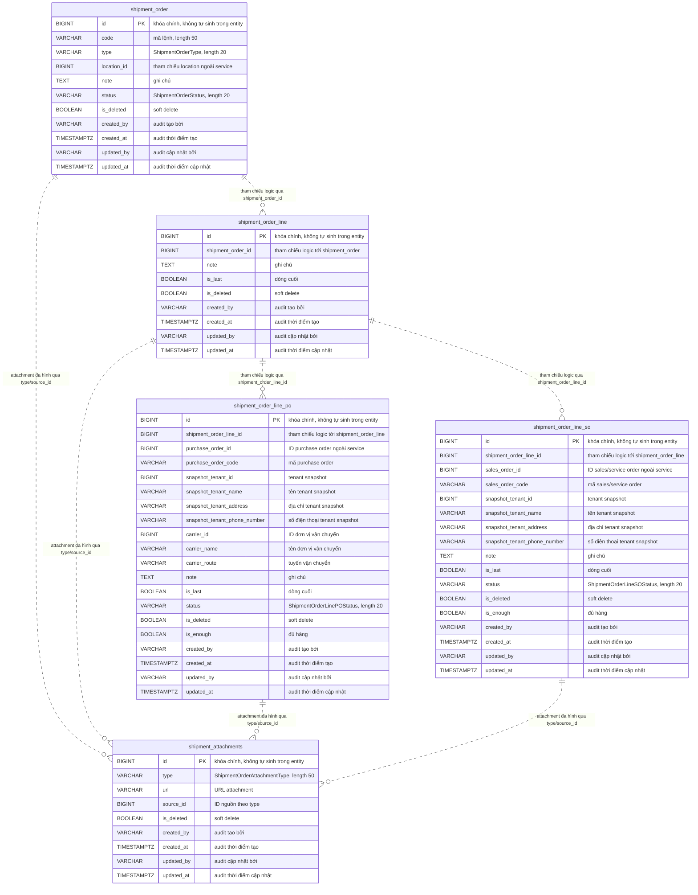

# Data Model — `gf-shipment`

> PostgreSQL qua Spring Data JPA, schema `${DB_SCHEMA:dev_gf_shipment}`. Source hiện dùng `spring.jpa.hibernate.ddl-auto=update`, không có migration SQL trong `src/main/resources`.

## 1. ERD Overview

## 2. Entities

### `shipment_order`

| Column | Type | Nullable | Description |
|---|---|---|---|
| `id` | BIGINT | NO | Khóa chính. Entity khai báo `@Id` nhưng không có `@GeneratedValue`, nên ID do caller/upstream cung cấp. |
| `code` | VARCHAR(50) | YES | Mã lệnh vận chuyển; `JpaShipmentOrderRepository.findByCode` dùng trường này để load aggregate. |
| `type` | VARCHAR(20) | NO | Enum `ShipmentOrderType`: `RECEIPT`, `DELIVERY`. |
| `location_id` | BIGINT | YES | ID location/garage ngoài `gf-shipment`; entity không khai báo FK. |
| `note` | TEXT | YES | Ghi chú của lệnh vận chuyển. |
| `status` | VARCHAR(20) | NO | Enum `ShipmentOrderStatus`: `OPEN`, `CLOSED`, `WAIT_TO_CONFIRM`. |
| `is_deleted` | BOOLEAN | YES | Cờ soft delete. |
| `created_by` | VARCHAR(255) | NO | Audit từ `AuditableEntity`, `nullable=false`, `updatable=false`. |
| `created_at` | TIMESTAMPTZ | NO | Audit từ `AuditableEntity`, `nullable=false`, `updatable=false`. |
| `updated_by` | VARCHAR(255) | YES | Audit từ `AuditableEntity`. |
| `updated_at` | TIMESTAMPTZ | YES | Audit từ `AuditableEntity`. |

**Indexes**: Không khai báo `@Index`, `uniqueConstraints` hoặc migration index trong source. Repository có truy vấn derived theo `code`, nhưng index vật lý nếu tồn tại nằm ngoài source hiện tại.

**Constraints**: PK `id`; NOT NULL trên `type`, `status`, `created_by`, `created_at`; length `code=50`, `type=20`, `status=20`. Không thấy FK, UNIQUE, CHECK enum hoặc ID generation strategy trong migration/source.

### `shipment_order_line`

| Column | Type | Nullable | Description |
|---|---|---|---|
| `id` | BIGINT | NO | Khóa chính. Entity khai báo `@Id` nhưng không có `@GeneratedValue`, nên ID do caller/upstream cung cấp. |
| `shipment_order_id` | BIGINT | NO | Tham chiếu logic tới `shipment_order.id`; repository đọc bằng `findByShipmentOrderId`. |
| `note` | TEXT | YES | Ghi chú của dòng vận chuyển. |
| `is_last` | BOOLEAN | YES | Cờ đánh dấu dòng cuối trong luồng xử lý. |
| `is_deleted` | BOOLEAN | YES | Cờ soft delete. |
| `created_by` | VARCHAR(255) | NO | Audit từ `AuditableEntity`, `nullable=false`, `updatable=false`. |
| `created_at` | TIMESTAMPTZ | NO | Audit từ `AuditableEntity`, `nullable=false`, `updatable=false`. |
| `updated_by` | VARCHAR(255) | YES | Audit từ `AuditableEntity`. |
| `updated_at` | TIMESTAMPTZ | YES | Audit từ `AuditableEntity`. |

**Indexes**: Không khai báo `@Index`, `uniqueConstraints` hoặc migration index trong source. Repository có truy vấn derived theo `shipment_order_id`, nhưng index vật lý nếu tồn tại nằm ngoài source hiện tại.

**Constraints**: PK `id`; NOT NULL trên `shipment_order_id`, `created_by`, `created_at`. Không thấy FK vật lý từ `shipment_order_id` sang `shipment_order.id`.

### `shipment_order_line_po`

| Column | Type | Nullable | Description |
|---|---|---|---|
| `id` | BIGINT | NO | Khóa chính. Entity khai báo `@Id` nhưng không có `@GeneratedValue`, nên ID do caller/upstream cung cấp. |
| `shipment_order_line_id` | BIGINT | NO | Tham chiếu logic tới `shipment_order_line.id`; repository đọc bằng `findByShipmentOrderLineIdIn`. |
| `purchase_order_id` | BIGINT | YES | ID purchase order ngoài `gf-shipment`; entity không khai báo FK. |
| `purchase_order_code` | VARCHAR(255) | NO | Mã purchase order; service gom mã này để gọi `gf-purchase` khi PO line đã đóng, đủ hàng và là dòng cuối. |
| `snapshot_tenant_id` | BIGINT | YES | ID tenant snapshot tại thời điểm tạo dòng PO. |
| `snapshot_tenant_name` | VARCHAR(255) | YES | Tên tenant snapshot tại thời điểm tạo dòng PO. |
| `snapshot_tenant_address` | VARCHAR(255) | YES | Địa chỉ tenant snapshot tại thời điểm tạo dòng PO. |
| `snapshot_tenant_phone_number` | VARCHAR(255) | YES | Số điện thoại tenant snapshot tại thời điểm tạo dòng PO. |
| `carrier_id` | BIGINT | YES | ID đơn vị vận chuyển ngoài `gf-shipment`. |
| `carrier_name` | VARCHAR(255) | YES | Tên đơn vị vận chuyển. |
| `carrier_route` | VARCHAR(255) | YES | Tuyến vận chuyển. |
| `note` | TEXT | YES | Ghi chú của dòng PO. |
| `is_last` | BOOLEAN | YES | Cờ dòng cuối; cùng `status=CLOSED` và `is_enough=true` kích hoạt callback PO delivered. |
| `status` | VARCHAR(20) | NO | Enum `ShipmentOrderLinePOStatus`: `OPEN`, `CLOSED`. |
| `is_deleted` | BOOLEAN | YES | Cờ soft delete; service bỏ qua dòng đã xóa khi cập nhật status. |
| `is_enough` | BOOLEAN | YES | Cờ xác nhận đủ hàng. |
| `created_by` | VARCHAR(255) | NO | Audit từ `AuditableEntity`, `nullable=false`, `updatable=false`. |
| `created_at` | TIMESTAMPTZ | NO | Audit từ `AuditableEntity`, `nullable=false`, `updatable=false`. |
| `updated_by` | VARCHAR(255) | YES | Audit từ `AuditableEntity`. |
| `updated_at` | TIMESTAMPTZ | YES | Audit từ `AuditableEntity`. |

**Indexes**: Không khai báo `@Index`, `uniqueConstraints` hoặc migration index trong source. Repository có truy vấn derived theo `shipment_order_line_id`, nhưng index vật lý nếu tồn tại nằm ngoài source hiện tại.

**Constraints**: PK `id`; NOT NULL trên `shipment_order_line_id`, `purchase_order_code`, `status`, `created_by`, `created_at`; length `status=20`. Không thấy FK vật lý sang `shipment_order_line` hoặc `gf-purchase`; enum value được giới hạn ở Java enum, không thấy migration CHECK trong source.

### `shipment_order_line_so`

| Column | Type | Nullable | Description |
|---|---|---|---|
| `id` | BIGINT | NO | Khóa chính. Entity khai báo `@Id` nhưng không có `@GeneratedValue`, nên ID do caller/upstream cung cấp. |
| `shipment_order_line_id` | BIGINT | NO | Tham chiếu logic tới `shipment_order_line.id`; repository đọc bằng `findByShipmentOrderLineIdIn`. |
| `sales_order_id` | BIGINT | YES | ID sales/service order ngoài `gf-shipment`; entity không khai báo FK. |
| `sales_order_code` | VARCHAR(255) | NO | Mã sales/service order. |
| `snapshot_tenant_id` | BIGINT | YES | ID tenant snapshot tại thời điểm tạo dòng SO. |
| `snapshot_tenant_name` | VARCHAR(255) | YES | Tên tenant snapshot tại thời điểm tạo dòng SO. |
| `snapshot_tenant_address` | VARCHAR(255) | YES | Địa chỉ tenant snapshot tại thời điểm tạo dòng SO. |
| `snapshot_tenant_phone_number` | VARCHAR(255) | YES | Số điện thoại tenant snapshot tại thời điểm tạo dòng SO. |
| `note` | TEXT | YES | Ghi chú của dòng SO. |
| `is_last` | BOOLEAN | YES | Cờ dòng cuối. |
| `status` | VARCHAR(20) | NO | Enum `ShipmentOrderLineSOStatus`: `OPEN`, `CLOSED`. |
| `is_deleted` | BOOLEAN | YES | Cờ soft delete; service bỏ qua dòng đã xóa khi cập nhật status. |
| `is_enough` | BOOLEAN | YES | Cờ xác nhận đủ hàng. |
| `created_by` | VARCHAR(255) | NO | Audit từ `AuditableEntity`, `nullable=false`, `updatable=false`. |
| `created_at` | TIMESTAMPTZ | NO | Audit từ `AuditableEntity`, `nullable=false`, `updatable=false`. |
| `updated_by` | VARCHAR(255) | YES | Audit từ `AuditableEntity`. |
| `updated_at` | TIMESTAMPTZ | YES | Audit từ `AuditableEntity`. |

**Indexes**: Không khai báo `@Index`, `uniqueConstraints` hoặc migration index trong source. Repository có truy vấn derived theo `shipment_order_line_id`, nhưng index vật lý nếu tồn tại nằm ngoài source hiện tại.

**Constraints**: PK `id`; NOT NULL trên `shipment_order_line_id`, `sales_order_code`, `status`, `created_by`, `created_at`; length `status=20`. Không thấy FK vật lý sang `shipment_order_line` hoặc `gf-sales`; enum value được giới hạn ở Java enum, không thấy migration CHECK trong source.

### `shipment_attachments`

| Column | Type | Nullable | Description |
|---|---|---|---|
| `id` | BIGINT | NO | Khóa chính. Entity khai báo `@Id` nhưng không có `@GeneratedValue`, nên ID do caller/upstream cung cấp. |
| `type` | VARCHAR(50) | NO | Enum `ShipmentOrderAttachmentType`: `SHIPMENT_ORDER_ATTACHMENTS`, `SHIPMENT_ORDER_LINE_ATTACHMENTS`, `SHIPMENT_ORDER_LINE_SO_ATTACHMENTS`, `SHIPMENT_ORDER_LINE_PO_ATTACHMENTS`. |
| `url` | VARCHAR(255) | NO | URL file/ảnh/tài liệu attachment. |
| `source_id` | BIGINT | NO | ID nguồn theo `type`; đây là tham chiếu đa hình logic, không phải FK vật lý. |
| `is_deleted` | BOOLEAN | YES | Cờ soft delete. |
| `created_by` | VARCHAR(255) | NO | Audit từ `AuditableEntity`, `nullable=false`, `updatable=false`. |
| `created_at` | TIMESTAMPTZ | NO | Audit từ `AuditableEntity`, `nullable=false`, `updatable=false`. |
| `updated_by` | VARCHAR(255) | YES | Audit từ `AuditableEntity`. |
| `updated_at` | TIMESTAMPTZ | YES | Audit từ `AuditableEntity`. |

**Indexes**: Không khai báo `@Index`, `uniqueConstraints` hoặc migration index trong source. `JpaShipmentAttachmentRepository` chỉ có API `JpaRepository` mặc định, chưa thấy query theo `type/source_id`.

**Constraints**: PK `id`; NOT NULL trên `type`, `url`, `source_id`, `created_by`, `created_at`; length `type=50`. Không thấy FK vật lý từ `source_id`; enum value được giới hạn ở Java enum, không thấy migration CHECK trong source.

## 3. Data Isolation

`gf-shipment` không có cột `tenant_id` chuẩn trên root `shipment_order`, dòng vận chuyển hoặc attachment. Hai bảng PO/SO line chỉ lưu `snapshot_tenant_id`, `snapshot_tenant_name`, `snapshot_tenant_address`, `snapshot_tenant_phone_number` như dữ liệu snapshot nghiệp vụ; các trường này không enforce tenant boundary.

Lookup chính của aggregate là `shipment_order.code` qua `findByCode(String code)` và không kèm tenant context. Vì vậy cô lập tenant ở mức dữ liệu hiện phụ thuộc protected caller, security context, tính duy nhất thực tế của `code`/ID do upstream cấp và schema runtime `${DB_SCHEMA:dev_gf_shipment}`, không được enforce bằng constraint trong các entity hoặc migration hiện tại.

## 4. Migration

Source hiện không có Flyway/Liquibase dependency, không có thư mục migration SQL trong `src/main/resources`, và `application.yml` cấu hình `spring.jpa.hibernate.ddl-auto=update`. Vì vậy thay đổi cấu trúc bảng hiện được Hibernate cập nhật runtime hoặc được quản lý bằng DDL ngoài repo; tài liệu này không ghi nhận migration chính thức nào trong source `gf-shipment`.

Các bảng đều dùng `Long @Id` không có `@GeneratedValue`, nên chiến lược cấp phát ID không nằm trong DB migration hiện tại. Không thấy khai báo FK, unique constraint, check constraint hoặc index vật lý trong JPA entity/migration source.

## 5. References

- [gf-shipment-HLD.md](../hld/gf-shipment-HLD.md)
- [gf-shipment-api.md](../api/gf-shipment-api.md)

## Change Log

| Date | Version | Summary |
|---|---|---|
| 2026-05-07 | v1 | Initial data model cho `gf-shipment`: PostgreSQL schema `${DB_SCHEMA:dev_gf_shipment}` với 5 bảng JPA `shipment_order`, `shipment_order_line`, `shipment_order_line_po`, `shipment_order_line_so`, `shipment_attachments`, các enum `ShipmentOrderType`, `ShipmentOrderStatus`, `ShipmentOrderLinePOStatus`, `ShipmentOrderLineSOStatus`, `ShipmentOrderAttachmentType`. Không có cột `tenant_id` chuẩn; PO/SO line chỉ lưu `snapshot_tenant_*` cho nghiệp vụ; cô lập phụ thuộc protected caller và schema runtime. Hibernate `ddl-auto=update`, không có migration SQL trong source. Bao gồm ERD overview, entities, data isolation, migration, references.
