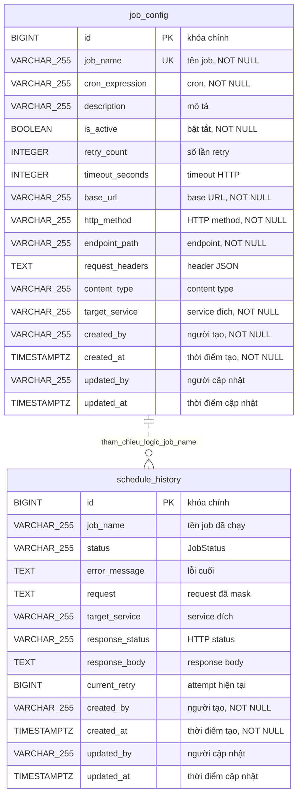

# Data Model — `gf-worker`

> PostgreSQL qua Spring Data JPA. Schema mặc định là `${DB_SCHEMA:dev_gf_worker}`. Source hiện tại dùng Hibernate `ddl-auto: update`; Flyway custom chỉ seed/update dữ liệu `job_config`.

## 1. ERD Overview

Quan hệ trong ERD là quan hệ logic qua `schedule_history.job_name` và `job_config.job_name`. Source hiện tại không khai báo `@ManyToOne`, `@OneToMany`, `@JoinColumn`, FK vật lý, hoặc migration tạo FK.

## 2. Entities

### `job_config`

| Column | Type | Nullable | Description |
|---|---|---|---|
| `id` | BIGINT | NO | Khóa chính, sinh bằng `GenerationType.IDENTITY`. |
| `job_name` | VARCHAR(255) | NO | Tên job duy nhất, dùng để enable/disable, sync scheduler và `ON CONFLICT` trong migration. |
| `cron_expression` | VARCHAR(255) | NO | Cron expression dùng bởi `CronTrigger` với timezone `Asia/Ho_Chi_Minh`. |
| `description` | VARCHAR(255) | YES | Mô tả job từ seed hoặc request API. |
| `is_active` | BOOLEAN | NO | Cờ bật/tắt job; entity đặt mặc định Java là `true`. |
| `retry_count` | INTEGER | YES | Số lần retry nội bộ của worker; entity đặt mặc định Java là `5`, executor fallback `5` nếu null. |
| `timeout_seconds` | INTEGER | YES | Timeout theo giây của HTTP request; entity đặt mặc định Java là `300`. |
| `base_url` | VARCHAR(255) | NO | Base URL service đích, có thể chứa placeholder như `${agent-service.url}` để runtime resolve. |
| `http_method` | VARCHAR(255) | NO | HTTP method; comment source nêu `POST`, `PUT`, `GET`, `DELETE`. |
| `endpoint_path` | VARCHAR(255) | NO | Path endpoint service đích. |
| `request_headers` | TEXT | YES | Header JSON dạng text, thường chứa placeholder `x-api-key`; không có JSONB/check constraint. |
| `content_type` | VARCHAR(255) | YES | Content-Type; entity đặt mặc định Java là `application/json`. |
| `target_service` | VARCHAR(255) | NO | Tên service đích để log/history; entity đặt mặc định Java là `generic-http-service`. |
| `created_by` | VARCHAR(255) | NO | Người tạo, kế thừa từ `AuditableEntity`, `updatable = false`. |
| `created_at` | TIMESTAMPTZ | NO | Thời điểm tạo, kế thừa từ `AuditableEntity`, `updatable = false`. |
| `updated_by` | VARCHAR(255) | YES | Người cập nhật cuối, kế thừa từ `AuditableEntity`. |
| `updated_at` | TIMESTAMPTZ | YES | Thời điểm cập nhật cuối, kế thừa từ `AuditableEntity`. |

**Indexes**: PK trên `id`; unique index/constraint trên `job_name` do `@Column(unique = true)`. Không thấy `@Index` hoặc migration `CREATE INDEX` riêng.
**Constraints**: PK `id`; UNIQUE `job_name`; `job_name`, `cron_expression`, `is_active`, `base_url`, `http_method`, `endpoint_path`, `target_service`, `created_by`, `created_at` NOT NULL. Không thấy FK hoặc check constraint vật lý cho `http_method`.
**Repository**: `JobConfigRepository` có `findByIsActiveTrue()`, `findByIsActiveFalse()`, `findByJobName(String jobName)` và CRUD từ `JpaRepository<JobConfigEntity, Long>`.

### `schedule_history`

| Column | Type | Nullable | Description |
|---|---|---|---|
| `id` | BIGINT | NO | Khóa chính, sinh bằng `GenerationType.IDENTITY`. |
| `job_name` | VARCHAR(255) | YES | Tên job đã chạy; tham chiếu logic tới `job_config.job_name`, không có FK vật lý. |
| `status` | VARCHAR(255) | YES | Trạng thái execution; code dùng enum `JobStatus`: `OPEN`, `PROCESSING`, `PROCESSED`, `ERROR`. |
| `error_message` | TEXT | YES | Lỗi cuối cùng khi hết retry; service truncate tối đa 2000 ký tự. |
| `request` | TEXT | YES | Thông tin request đã build từ `JobConfigEntity`; HTTP client mask header nhạy cảm trước khi lưu. |
| `target_service` | VARCHAR(255) | YES | Service đích tại thời điểm tạo history. |
| `response_status` | VARCHAR(255) | YES | HTTP status thành công hoặc status suy luận từ exception. |
| `response_body` | TEXT | YES | Response body khi thành công; service truncate tối đa 5000 ký tự. |
| `current_retry` | BIGINT | YES | Attempt hiện tại; record ban đầu được tạo với `0`. |
| `created_by` | VARCHAR(255) | NO | Người tạo, kế thừa từ `AuditableEntity`, `updatable = false`. |
| `created_at` | TIMESTAMPTZ | NO | Thời điểm tạo, kế thừa từ `AuditableEntity`, `updatable = false`. |
| `updated_by` | VARCHAR(255) | YES | Người cập nhật cuối, kế thừa từ `AuditableEntity`; executor set `"SYSTEM"` khi cập nhật status. |
| `updated_at` | TIMESTAMPTZ | YES | Thời điểm cập nhật cuối, kế thừa từ `AuditableEntity`. |

**Indexes**: PK trên `id`. Không thấy unique index, `@Index`, hoặc migration `CREATE INDEX` cho bảng này.
**Constraints**: PK `id`; `created_by`, `created_at` NOT NULL từ `AuditableEntity`. Không thấy FK tới `job_config`, check constraint cho `status`, hoặc NOT NULL trên các field history nghiệp vụ.
**Repository**: `ScheduleHistoryRepository` chỉ kế thừa CRUD từ `JpaRepository<ScheduleHistoryEntity, Long>`; service dùng `save()` và `findById()` để tạo/cập nhật một record cho mỗi lần chạy job.

## 3. Data Isolation

`gf-worker` không có cột `tenant_id` trong `job_config` hoặc `schedule_history`. Dữ liệu được scope ở mức platform/operator: `job_config` điều khiển scheduled HTTP jobs toàn service, còn `schedule_history` ghi lịch sử theo job/service đích.

Cách ly tenant không được enforce ở tầng bảng của service này. Nếu job gọi endpoint đa tenant, tenant/security phụ thuộc vào contract của service đích và giá trị `request_headers`. `request_headers` có thể chứa placeholder secret; source hiện tại không có bảng allow-list cho `base_url` hoặc `target_service`.

## 4. Migration

Hibernate tạo/cập nhật cấu trúc bảng bằng `spring.jpa.hibernate.ddl-auto=update` trên schema `${DB_SCHEMA:dev_gf_worker}`. `spring.flyway.enabled=false` tắt auto-config, nhưng `FlywayConfig` tự tạo bean `Flyway` và gọi `migrate()` khi `ApplicationReadyEvent` chạy. Flyway dùng `baselineOnMigrate(true)`, `validateOnMigrate(false)`, `outOfOrder(true)`, `baselineVersion("0")`, `defaultSchema/schemas` theo DB schema, và `placeholderReplacement(false)`.

Migration SQL hiện tại không tạo bảng, FK, check constraint, hoặc index thủ công; chỉ seed/update dữ liệu `job_config`:

| Migration | Tác động dữ liệu |
|---|---|
| `V1.0.1__insert_init_data_JobConfig.sql` | Seed `BATCH_INBOUND`, `BATCH_OUTBOUND`, `BATCH_INBOUND_NOTIFICATION`, `BATCH_OUTBOUND_NOTIFICATION` với `target_service = 'gf-erp-agent'`, retry ban đầu `5`, timeout `300`, `ON CONFLICT (job_name) DO NOTHING`. |
| `V1.0.2__insert_JobConfig_policy_agent.sql` | Seed `BATCH_INBOUND_POLICY` với `target_service = 'gf-policy-agent'`, retry ban đầu `5`, timeout `300`, `ON CONFLICT (job_name) DO NOTHING`. |
| `V1.0.3__insert_JobConfig_gf_sales_booking_timeout.sql` | Disable `BATCH_INBOUND_POLICY`; seed `GF_SALES_BOOKING_AUTO_CANCEL` với `target_service = 'gf-sales'`, retry `1`, timeout `20`, `ON CONFLICT (job_name) DO NOTHING`. |
| `V1.0.4__optimize_retry_counts.sql` | Update retry count còn `1` cho bốn job high-frequency của `gf-erp-agent`; update retry count `2` cho `BATCH_INBOUND_POLICY`. |

Seed hiện tại dựa vào unique constraint trên `job_name` do JPA tạo. Vì các insert dùng `ON CONFLICT DO NOTHING`, thay đổi seed sau lần đầu cần migration `UPDATE` riêng như `V1.0.3` và `V1.0.4`.

## 5. References

- [gf-worker-HLD.md](../hld/gf-worker-HLD.md)
- [gf-worker-api.md](../api/gf-worker-api.md)

## Change Log

| Date | Version | Summary |
|---|---|---|
| 2026-05-07 | v1 | Initial data model cho `gf-worker`: PostgreSQL schema `${DB_SCHEMA:dev_gf_worker}` với 2 bảng JPA `job_config`, `schedule_history`, enum `JobStatus` (`OPEN`, `PROCESSING`, `PROCESSED`, `ERROR`). Không có `tenant_id`; dữ liệu scope ở mức platform/operator, tenant phụ thuộc service đích. Hibernate `ddl-auto=update` + Flyway custom (V1.0.1-V1.0.4) chỉ seed/update `job_config`, không tạo bảng/FK/index. Bao gồm ERD overview, entities, data isolation, migration, references.
