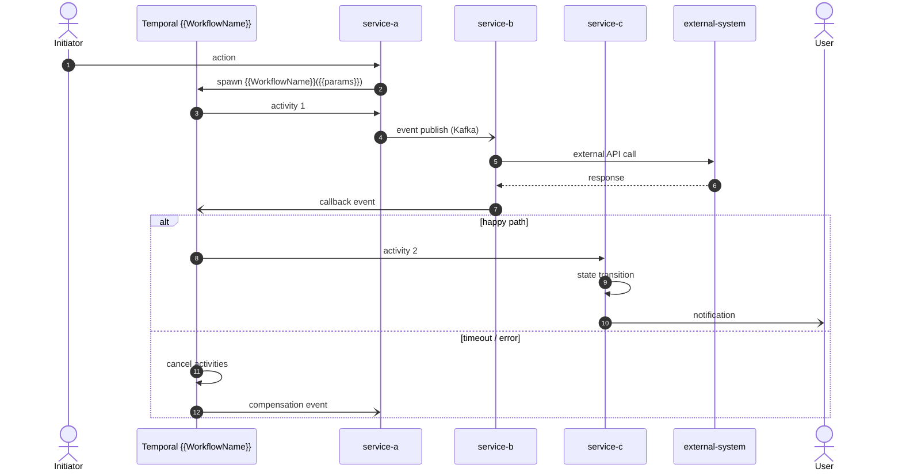
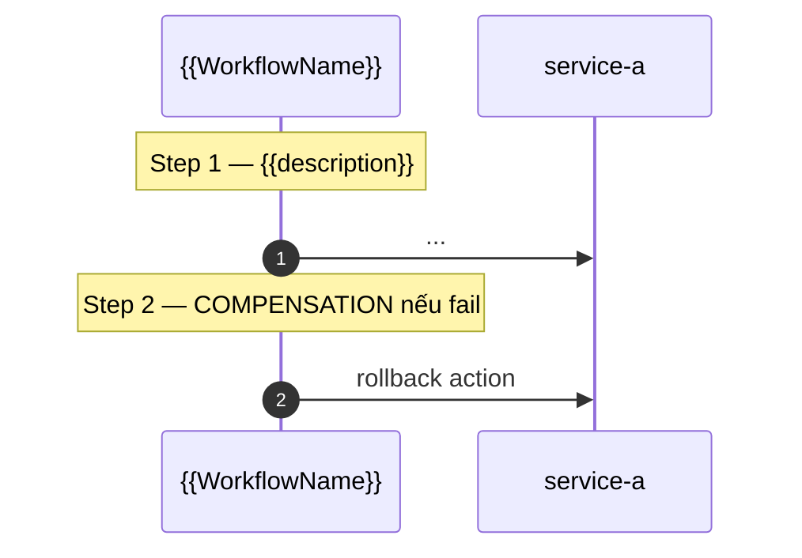

<!--
WORKFLOW WRITING RULES — đọc trước khi điền template:

SA criteria — workflow phải thoả 2 điều kiện:
1. **Có Temporal workflow + worker** rõ ràng (named class, vd `WoConfirmationWorkflow`)
2. **≥ 3 actors + 1 coordinator** (Temporal workflow chính là coordinator)

Nếu KHÔNG thoả → đây không phải workflow → reclassify sang `Architecture/flows/` hoặc bỏ.

Quy tắc nội dung:
1. KHÔNG copy paste API endpoint từ HLD — link HLD trong §8 References
2. KHÔNG vẽ class/DTO detail — đó là LLD job
3. Mermaid bắt buộc cho §3 Sequence (sequenceDiagram hoặc flowchart)
4. Tên Temporal workflow cụ thể `<DomainNoun>Workflow` trong §2
5. Async vs sync ký hiệu rõ trong mermaid:
   - `->>` = sync REST request
   - `-->>` = sync REST response
   - `-)`  = async event publish (Kafka)
   - `--)` = external notification (push, FCM)
6. End user actor dùng `actor` keyword (icon người)
7. Service participant dùng `participant`
8. Saga compensation → mermaid sub-diagram + explicit `else` branch
9. Mục tiêu độ dài: ≤ 150 lines (sss avg 130)
10. boundary: cross-boundary (FIXED) — workflow span nhiều service
11. tier T1 cho cornerstone (BR-CORNER ref); T2 secondary
12. ADR-007 Temporal MANDATORY trong §8 References
-->

# Workflow — {{Workflow Name}}

> {{Optional callout}} Match `Product/ux/UX-FLOW-{{name}}.md`. {{Cornerstone BR ref nếu có, vd BR-CORNER-014}}.

## 1. Trigger

{{Mô tả khi nào workflow start: cron schedule, Kafka event, manual API, signal từ external system}}

Ví dụ:
- Cron schedule (default monthly ngày 1 lúc 02:00 VN time, configurable per tenant) HOẶC manual via Portal `POST /...`.
- Event `s3.payment-client.charge-completed` consume.
- API `POST /api/v1/.../trigger`.

## 2. Actors

> Bắt buộc ≥ 3 actor + 1 Temporal workflow coordinator. Liệt kê **rõ tên** service + workflow class.

- {{Initiator}} (caller / event source)
- `{{service-a}}` service
- **Temporal `{{WorkflowName}}`** ← coordinator
- `{{service-b}}` service
- `{{service-c}}` service
- {{External system}} ({{Zoom / Teachly / sf-payment-gateway / Google}}) — _nếu có_
- {{End user actor}} ({{Parent / Teacher / Operator / CSKH}}) — _nếu có_

> _(optional)_ Note đặc biệt về platform (vd "Zoom là live class platform, không phải Learn") nếu có nhầm lẫn.

## 3. Sequence

> Quy tắc mermaid:
> - `autonumber` để dễ reference step
> - `actor` cho human (Parent/Teacher/Operator); `participant` cho service
> - `->>` sync REST request; `-->>` sync response; `-)` async event publish; `--)` external notification
> - `par...and...end` cho parallel fetch
> - `alt...else...end` cho branch (happy path vs error/timeout)

## 4. State machine intersection

> Bảng entity nào bị thay đổi state khi workflow chạy.

| Service | Entity | Transition trigger |
|---|---|---|
| `{{service-a}}` | {{EntityName}} | {{STATE_FROM}} → {{STATE_TO}} ({{event/signal}}) |
| `{{service-b}}` | {{EntityName}} | {{STATE_FROM}} → {{STATE_TO}} |

## 5. _(optional)_ Sub-flow / Saga steps / Compensation

> Chỉ thêm khi workflow có:
> - Saga compensation (rollback path)
> - Long-running multi-step (vd billing cycle close 7 step)
> - Sister service interaction phức tạp cần tách diagram riêng

## 6. Error paths

| Error | Handling |
|---|---|
| {{Error 1}} | {{Retry / Compensation / Block / Manual escalation}} |
| {{Error 2}} | {{...}} |
| {{Timeout (vd 24h)}} | Workflow cancel + cascade {{po-cancelled / refund saga}} |
| {{External system 5xx}} | Retry max N attempts + alert + manual reconcile |
| {{Validation fail}} | Block với error code `{{S3.{boundary}.{CODE}}}` |

## 7. Idempotency

> List explicit dedup mechanism / key invariant.

- {{Event consumer dedup theo `eventId`}}
- {{Workflow signal dedup theo `workflowId` (Temporal native)}}
- {{DB unique constraint `(entity_id, ...)` chống duplicate state}}
- {{State transition guard: DB CHECK constraint hoặc service-side enum}}
- {{Idempotency-Key header cho external API call (vd sf-payment-gateway)}}

## 8. References

- **UX flow**: `Product/ux/UX-FLOW-{{name}}.md`
- **HLD**: `{{boundary-a}}`, `{{boundary-b}}`, `{{boundary-c}}` _(list mọi service tham gia)_
- **ADR**: ADR-007 Temporal _(mandatory)_, {{other ADRs}}
- **Business rules**: BR-CORNER-{{NNN}} _(cornerstone nếu có)_, BR-{{boundary}}-{{NNN}}
- **Events**: [{{boundary}}-events.md](../events/...) _(events liên quan)_
- **Product features**: {{FEAT-NNN..MMM}}, {{EP-MKT-XXX}}
- **External integrations**: {{INTEG-EXT-... nếu có}}

## Change Log

| Date | Version | Summary |
|---|---|---|
| 2026-05-05 | v1 | Initial workflow |
