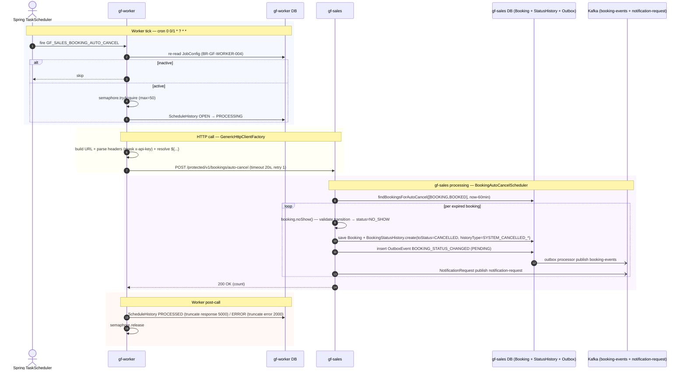

# Workflow — Sales Booking Auto-Cancel (Worker Cron)

> Cron-driven HTTP job 1m tick: gf-worker → gf-sales `POST /protected/v1/bookings/auto-cancel` để cancel booking quá hạn 60 phút (`status IN [BOOKING, BOOKED]`). gf-sales chuyển `Booking.status` sang `NO_SHOW`, ghi StatusHistory với `toStatus=CANCELLED` + historyType `SYSTEM_CANCELLED_*`, publish outbox `BOOKING_STATUS_CHANGED` và notification request. Companion của `sales-booking-lifecycle-flow.md` Path 4. Cornerstone của BR-GF-WORKER-001..008; open item `HLD-SALES-007`.

## 1. Trigger

- **Seed config** (Flyway `V1.0.3` + `V1.0.4`) JobConfig record `GF_SALES_BOOKING_AUTO_CANCEL`:
  - `cron_expression = "0 0/1 * ? * *"` — tick mỗi 1 phút, giây 0 (TZ `Asia/Ho_Chi_Minh`).
  - `http_method = POST`, `base_url = ${gf-sales.url}`, `endpoint_path = /protected/v1/bookings/auto-cancel`, `target_service = gf-sales`.
  - `retry_count = 1` (1 attempt only), `timeout_seconds = 20` (ngắn hơn ERP jobs vì batch nhỏ + idempotent).
  - `request_headers = {"Content-Type":"application/json", "x-api-key":"${internal-service.api-key}"}`.
- `DynamicJobProcessor` (VirtualThreadTaskScheduler) reload JobConfig mỗi 30s từ startup; virtual-thread per `job_name`; semaphore `worker.job.max-concurrent-jobs:50`.

## 2. Actors

- `gf-worker` — `DynamicJobProcessor` + `GenericHttpJobExecutorServiceImpl` + `GenericHttpClientFactory`.
- `gf-sales` — `InternalBookingController` (`adapter/controller/InternalBookingController.java` L21–41, auth `x-api-key`) → `BookingAutoCancelScheduler` (`infrastructure/scheduler/BookingAutoCancelScheduler.java`).
- PostgreSQL gf-worker DB (`ScheduleHistory`, `JobConfig`) + gf-sales DB (`Booking`, `BookingStatusHistory`, `OutboxEvent`).
- Kafka topics `${kafka.topics.booking-events}` + `notification-request`.
- Outbox processor singleton (Redis lock `gf-sales-outbox-processor`).

## 3. Sequence

## 4. State machine intersection

| Service | Entity | Transition |
|---|---|---|
| `gf-worker` | ScheduleHistory | `OPEN` → `PROCESSING` → `PROCESSED` / `ERROR` |
| `gf-worker` | JobConfig | re-read mỗi tick; `active=false` → skip |
| `gf-sales` | Booking | `BOOKING` \| `BOOKED` → `NO_SHOW` (qua `booking.noShow()` + `canTransitionTo` validate) |
| `gf-sales` | BookingStatusHistory | insert row `toStatus=CANCELLED` + `historyType=SYSTEM_CANCELLED_GARAGE_DID_NOT_CONFIRM` (từ `BOOKING`) \| `SYSTEM_CANCELLED_CUSTOMER_NOSHOW` (từ `BOOKED`), `actor=SYSTEM` |
| `gf-sales` | OutboxEvent | insert `BOOKING_STATUS_CHANGED` → `PENDING` → `SENT` / `FAILED` (max-retries=5) |

## 5. Idempotency

- Query filter `WHERE status IN ('BOOKING','BOOKED') AND booked_at < now() - 60min` — sau update sang `NO_SHOW`, row không match query lần sau.
- `booking.noShow()` validate transition; nếu booking đã ở terminal state (`CANCELLED`/`COMPLETED`/etc.) → `InvalidStatusTransitionException` per row → log + skip, batch tiếp tục.
- Cron 1m tick × window 60m: 2 tick liên tiếp gặp cùng booking → tick 2 thấy `NO_SHOW` và skip.
- Outbox processor multi-replica safe qua Redis lock singleton `gf-sales-outbox-processor`.

## 6. Error paths

| Error | Handling |
|---|---|
| HTTP 503 từ gf-sales | `ServiceUnavailableException` → Resilience4j CB record → cạn retry → ScheduleHistory `ERROR` |
| Read timeout (>20s) | `SocketTimeoutException` → CB record → ScheduleHistory `ERROR`; tick kế tiếp độc lập |
| Connection timeout (>5s) | `ConnectException` → CB record |
| `InvalidStatusTransitionException` per row (race với concurrent action) | log + skip row, batch tiếp tục |
| Outbox publish failure | Retry max 5 (`outbox.max-retries`) → `FAILED` |
| Semaphore `worker.job.max-concurrent-jobs:50` full | skip tick + log warning |
| JobConfig inactive giữa tick và execute | re-read (BR-GF-WORKER-004) → skip |
| `Booking.status=NO_SHOW` vs `BookingStatusHistory.toStatus=CANCELLED` mismatch | open `HLD-SALES-007` — cần align aggregate vs history |

## 7. References

- **Companion workflow**: [sales-booking-lifecycle-flow.md](./sales-booking-lifecycle-flow.md) — Path 4 "Auto-cancel cron" mô tả flow này từ góc nhìn gf-sales.
- **UX flow**: [UX-FLOW-BOOKING.md](../../Product/ux-flows/UX-FLOW-BOOKING.md)
- **HLD**: [gf-worker-HLD.md](../hld/gf-worker-HLD.md), [gf-sales-HLD.md](../hld/gf-sales-HLD.md), [gf-notification-HLD.md](../hld/gf-notification-HLD.md)
- **API**: [gf-worker-api.md](../api/gf-worker-api.md), [gf-sales-api.md](../api/gf-sales-api.md)
- **Events**: [gf-sales-events.md](../events/gf-sales-events.md) (`BOOKING_STATUS_CHANGED`)
- **ADR**: [ADR-005 Temporal Workflow Orchestration](../decisions/ADR-005-temporal-workflow-orchestration.md) _(workflow này dùng Spring TaskScheduler chứ không phải Temporal — link để tham khảo context tổng)_
- **Business rules**: [BR-GF-SALES.md](../../Product/business-rules/BR-GF-SALES.md)
- **Product features**: [FEAT-BOOK-CANCEL.md](../../Product/features/FEAT-BOOK-CANCEL.md)
- **Open items**: `HLD-SALES-007` — status mismatch `NO_SHOW` (aggregate) vs `CANCELLED` (history) — đã tracked trong `sales-booking-lifecycle-flow.md`.

## Change Log

| Date | Version | Summary |
|---|---|---|
| 2026-05-11 | v1 | Initial workflow spec cho `gf-sales-booking-auto-cancel` — companion của `sales-booking-lifecycle-flow.md` Path 4. JobConfig seed `GF_SALES_BOOKING_AUTO_CANCEL` (cron `0 0/1 * ? * *`, POST `/protected/v1/bookings/auto-cancel`, timeout 20s, retry 1, TZ `Asia/Ho_Chi_Minh`). gf-worker chain: `DynamicJobProcessor` → `GenericHttpJobExecutorServiceImpl` (ScheduleHistory `OPEN→PROCESSING→PROCESSED/ERROR`) → `GenericHttpClientFactory` (URL+header mask). gf-sales chain: `InternalBookingController` → `BookingAutoCancelScheduler` → `findBookingsForAutoCancel([BOOKING,BOOKED], now-60min)` → per booking `booking.noShow()` → `Booking.status=NO_SHOW` + `BookingStatusHistory{toStatus=CANCELLED, historyType=SYSTEM_CANCELLED_GARAGE_DID_NOT_CONFIRM | SYSTEM_CANCELLED_CUSTOMER_NOSHOW}` + Outbox `BOOKING_STATUS_CHANGED` (Redis lock singleton `gf-sales-outbox-processor`) + notification request Kafka. Idempotent qua query filter (post-update không match) + transition validation; multi-replica safe. Cornerstone `BR-GF-WORKER-001..008`. Phản ánh trung thực bất đồng bộ aggregate `NO_SHOW` vs history `CANCELLED` — open `HLD-SALES-007`. Timeslot KHÔNG release trong scheduler này. |
