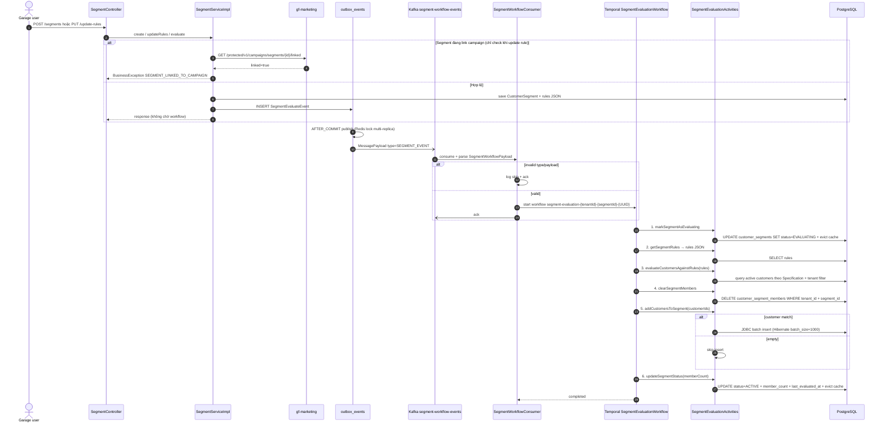

# Workflow — Customer Segment Evaluation

> Async segment membership evaluation xuyên `gf-customer` + `gf-marketing` (linked check) + Temporal. _(N/A — backend flow, không có UX trực tiếp)_

## 1. Trigger

Segment được tạo mới hoặc cập nhật rule qua `SegmentServiceImpl`:
- **REST**: `POST /api/v1/segments`, `PUT /api/v1/segments/{id}/update-rules`, `POST /api/v1/segments/{id}/evaluate`.
- **Outbox event**: service ghi `SegmentEvaluateEvent` với payload `{ tenantId, segmentId }` → Kafka topic `${kafka.topics.segment-workflow-events:DEV-SEGMENT-WORKFLOW-EVENTS}`.
- **Consumer**: `SegmentWorkflowConsumer` parse `MessagePayload` (chỉ xử lý type `SEGMENT_EVENT`) → start Temporal workflow.

HTTP request không chờ kết quả — trả response ngay sau commit outbox.

## 2. Actors

- **Garage portal / API client** (initiator, qua REST)
- `gf-customer` `SegmentServiceImpl` (producer outbox event)
- `gf-marketing` (linked campaign check trước update rule)
- `OutboxEventListener/Processor` (relay sau commit)
- Kafka topic `segment-workflow-events`
- `SegmentWorkflowConsumer` (workflow starter)
- **Temporal `SegmentEvaluationWorkflow`** ← coordinator (6 activities sequential)
- `SegmentEvaluationActivities` (activity boundary — `gf-customer` DB)

## 3. Sequence

## 4. State machine intersection

| Service | Entity | Transition |
|---|---|---|
| `gf-customer` | `customer_segments.status` | `ACTIVE` → `EVALUATING` (markEvaluating) → `ACTIVE` (updateStatus) hoặc kẹt `EVALUATING` nếu workflow fail |
| `gf-customer` | `customer_segments.member_count` | updated theo `customerIds.size()` |
| `gf-customer` | `customer_segments.last_evaluated_at` | updated với workflow completion time |
| `gf-customer` | `customer_segment_members` | full rebuild (DELETE + batch INSERT) per segment |
| `gf-customer` | `outbox_events` | `PENDING` → `SENT` (sau publish Kafka) |
| Redis cache | `segment:byId:{tenantId}:{segmentId}` | evict khi markEvaluating + updateStatus |

## 5. Error paths

| Error | Handling |
|---|---|
| Event không phải `SEGMENT_EVENT` | Consumer log debug + ack + skip |
| Payload null hoặc thiếu `tenantId/segmentId` | Consumer log warning + ack |
| Consumer xử lý lỗi (JSON parse, Temporal client) | Catch exception trong `try`, ack trong `finally` (open HLD-CUSTOMER-003 — risk mất event nếu không có DLQ) |
| Workflow start trùng `WorkflowExecutionAlreadyStarted` | Log warning + skip (UUID trong workflow ID giảm rủi ro tự nhiên) |
| Segment không tồn tại | Activity throw `BusinessException(SEGMENT_NOT_FOUND)` → Temporal retry → fail |
| Rule JSON parse lỗi | `JsonUtils.toObject(SegmentRules)` fail → activity retry → fail (no fallback default rule) |
| Query customer quá lớn | `findAll(spec)` trả toàn bộ ID trong memory — chưa pagination (open HLD-CUSTOMER-010 — risk timeout/heap với segment lớn) |
| Batch insert lỗi (DB constraint, connection, batch size) | Activity retry; unique `uk_segment_member(segment_id, customer_id)` giảm duplicate |
| Segment linked campaign khi update rule | `gf-marketing` linked check throw `SEGMENT_LINKED_TO_CAMPAIGN` → block trước khi vào outbox |
| Workflow fail giữa chừng (sau markEvaluating) | Segment kẹt status `EVALUATING` — chưa có rollback activity (open: cần manual re-evaluate hoặc rollback path) |

## 6. Idempotency

- **Outbox publish**: `OutboxProcessor` Redis lock singleton `gf-customer-locks` multi-replica safe.
- **Workflow ID** `segment-evaluation-{tenantId}-{segmentId}-{UUID}` — UUID cho phép concurrent re-evaluate (lần ghi sau cùng thắng).
- **Workflow reuse policy** `WORKFLOW_ID_REUSE_POLICY_ALLOW_DUPLICATE` — không coalesce theo segmentId.
- **Membership rebuild**: DELETE + INSERT trong cùng workflow → không có membership state intermediate được publish.
- **DB unique constraint** `uk_segment_member(segment_id, customer_id)` → batch insert idempotent về duplicate.
- **Segment status guard**: workflow load segment, gọi `CustomerSegment.startEvaluation()` (state machine transition validate).

## 7. References

- **UX flow**: _(N/A — backend evaluation flow, không có UX trực tiếp)_
- **HLD**: [gf-customer-HLD.md](../hld/gf-customer-HLD.md), [gf-marketing-HLD.md](../hld/gf-marketing-HLD.md)
- **ADR**: [ADR-005 Temporal Workflow Orchestration](../decisions/ADR-005-temporal-workflow-orchestration.md) _(mandatory)_
- **API spec**: [gf-customer-api.md](../api/gf-customer-api.md) (segment endpoints + criteria DTO)
- **Events spec**: [gf-customer-events.md](../events/gf-customer-events.md) — `segment-workflow-events` (in/out), `segment-evaluated-events` (out, chưa wire)
- **Data model**: [gf-customer-data-model.md](../data/gf-customer-data-model.md) — `customer_segments`, `customer_segment_members`, rule schema, criteria types
- **Business rules**: [BR-GF-CUSTOMER.md](../../Product/business-rules/BR-GF-CUSTOMER.md), [BR-GF-MARKETING.md](../../Product/business-rules/BR-GF-MARKETING.md)
- **Product features**: [FEAT-MKT-SEG-CREATE.md](../../Product/features/FEAT-MKT-SEG-CREATE.md)
- **Open items**:
  - HLD-CUSTOMER-003 Kafka consumer DLQ policy (consumer ack trong finally)
  - HLD-CUSTOMER-004 marketing linked check fallback (timeout/circuit breaker)
  - HLD-CUSTOMER-010 Temporal evaluation pagination cho large segment

## Change Log

| Date | Version | Summary |
|---|---|---|
| 2026-05-11 | v2 | Fix broken §References: ADR-007 → ADR-005 (Temporal Workflow Orchestration), event-spec filename given `gf-` prefix (`customer-events.md` → `gf-customer-events.md`), UX-FLOW path → `{{RELATED-UX-FLOW}}` placeholder, undefined BR-/FEAT- IDs → `{{RELATED-BUSINESS-RULES}}` / `{{RELATED-PRODUCT-FEATURES}}` placeholders. |
| 2026-05-07 | v1 | Initial workflow spec cho `customer-segment-evaluation`: trigger qua REST `SegmentServiceImpl` + outbox `SegmentEvaluateEvent` → Kafka `segment-workflow-events` → `SegmentWorkflowConsumer` start Temporal `SegmentEvaluationWorkflow` (6 activities sequential: markEvaluating → getRules → evaluateCustomers → clearMembers → addMembers → updateStatus). Services involved: `gf-customer` (orchestrator + DB SoT) + `gf-marketing` (linked campaign check). Invariants: workflow ID `segment-evaluation-{tenantId}-{segmentId}-{UUID}` cho phép concurrent re-evaluate, DB unique `uk_segment_member` chống duplicate, full DELETE+INSERT rebuild membership atomic per workflow, Redis lock outbox publish multi-replica safe. Bao gồm Trigger, Actors, Sequence, State machine intersection, Error paths, Idempotency, References. |
