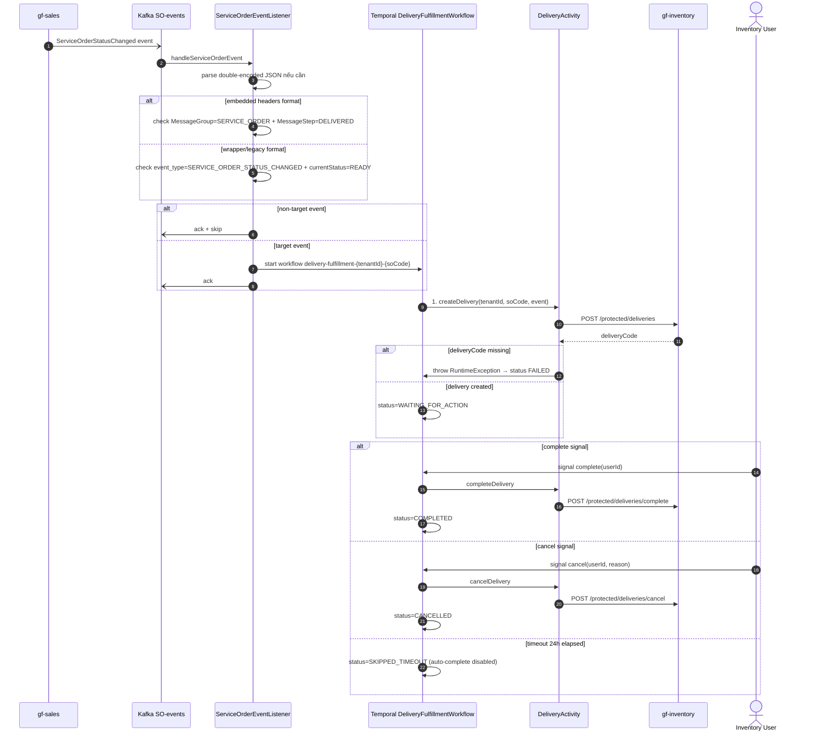

# Workflow — Inventory Delivery Fulfillment

> Match [UX-FLOW-INVENTORY-DELIVERY](../../Product/ux-flows/UX-FLOW-INVENTORY-DELIVERY.md). Cornerstone delivery xuất kho cho service order — xuyên `gf-sales` (event source) + `gf-inventory-worker` (orchestrator) + `gf-inventory` (state SoT).

## 1. Trigger

Kafka topic `${KAFKA_TOPIC_SO_EVENTS:dev-inventory-service-order-events}` với 3 format support trong `ServiceOrderEventListener`:
- **Wrapper format** (`rawData` field): event_type `SERVICE_ORDER_STATUS_CHANGED` + `currentStatus=READY`.
- **Legacy event JSON**: cùng filter logic.
- **Embedded headers**: `MessageGroup=SERVICE_ORDER` + `MessageStep=DELIVERED`.

Workflow chỉ start khi event match một trong các filter trên — non-target → ack + skip.

## 2. Actors

- `gf-sales` (producer SO status event)
- Kafka topic `service-order-events`
- `gf-inventory-worker` `ServiceOrderEventListener` (workflow starter, multi-format parser)
- **Temporal `DeliveryFulfillmentWorkflow`** ← coordinator (signal-driven)
- `DeliveryActivity` (activity boundary cho `gf-inventory` REST)
- `gf-inventory` service (delivery + reservation + stock SoT)
- Inventory operator/user (signal complete/cancel)

## 3. Sequence

## 4. State machine intersection

| Service | Entity | Transition |
|---|---|---|
| `gf-inventory-worker` | Workflow status | `INITIALIZING` → `CREATING_DELIVERY` → `WAITING_FOR_ACTION` → `COMPLETING/CANCELLING/SKIPPED_TIMEOUT` → `COMPLETED/CANCELLED/COMPLETION_FAILED/CANCELLATION_FAILED/FAILED` |
| `gf-inventory` | `inventory_delivery` | `PENDING` → `RESERVED` (stock reserve) → `COMPLETED` / `CANCELLED` / `REVERSED` |
| `gf-inventory` | `inventory_delivery_item` | tạo cùng delivery; cost_price update sau period closure |
| `gf-inventory` | `inventory_reservation` | tạo cùng delivery; release khi cancel hoặc fulfill khi complete |
| `gf-inventory` | `inventory_stock` | `reservedQuantity++` khi create; `quantity--` + `reservedQuantity--` khi complete; `reservedQuantity--` khi cancel |
| `gf-inventory` | `inventory_transaction` | append `RESERVATION_HOLD` / `DELIVERY` / `RESERVATION_RELEASE` ledger entry |

## 5. Error paths

| Error | Handling |
|---|---|
| Unknown message format (no rawData/embedded/event_type) | Listener log error + ack + skip |
| Non-target event (status không phải READY hoặc step ≠ DELIVERED) | Listener ack + skip |
| Parse payload lỗi (thiếu tenantId/soCode) | Listener không ack → Kafka retry |
| Duplicate workflow start | Catch `WorkflowExecutionAlreadyStarted` → log + skip |
| Missing `deliveryCode` trong response | Activity throw RuntimeException → workflow `FAILED` sau retry |
| `createDelivery` API fail (4xx/5xx/timeout) | Temporal retry 5 attempts (1s → 1m, backoff 2.0) → workflow `FAILED` |
| `completeDelivery`/`cancelDelivery` activity fail | Workflow status `COMPLETION_FAILED` / `CANCELLATION_FAILED` + lưu `lastError` → rethrow để Temporal retry signal activity |
| Signal lặp (complete/cancel multiple times) | Workflow ignore nếu `completed=true` hoặc `cancelled=true` |
| Timeout 24h không có signal | Workflow `SKIPPED_TIMEOUT` (auto-complete disabled) |

## 6. Idempotency

- **Workflow ID** deterministic `delivery-fulfillment-{tenantId}-{serviceOrderCode}` → Temporal native dedup; replay Kafka event không tạo workflow trùng.
- **Signal idempotent**: workflow guard `if (completed || cancelled) return` → multiple complete/cancel signal an toàn.
- **createDelivery idempotency**: `gf-inventory` enforce qua `serviceOrderCode + warehouseCode` (chống tạo delivery trùng cùng SO).
- **Activity retry**: 5 attempts với exponential backoff — Temporal native retry, mỗi attempt activity input không đổi.
- **Stock mutation atomicity**: `gf-inventory` `InventoryStockService` pessimistic lock + transaction (ngoài workflow scope).

## 7. References

- **UX flow**: [UX-FLOW-INVENTORY-DELIVERY.md](../../Product/ux-flows/UX-FLOW-INVENTORY-DELIVERY.md)
- **HLD**: [gf-inventory-worker-HLD.md](../hld/gf-inventory-worker-HLD.md), [gf-inventory-HLD.md](../hld/gf-inventory-HLD.md), [gf-sales-HLD.md](../hld/gf-sales-HLD.md)
- **ADR**: [ADR-005 Temporal Workflow Orchestration](../decisions/ADR-005-temporal-workflow-orchestration.md) _(mandatory)_
- **API spec**: [gf-inventory-worker-api.md](../api/gf-inventory-worker-api.md), [gf-inventory-api.md](../api/gf-inventory-api.md) (deliveries protected endpoints)
- **Events spec**: [gf-sales-events.md](../events/gf-sales-events.md) — `ServiceOrderStatusChanged` event source
- **Data model**: [gf-inventory-data-model.md](../data/gf-inventory-data-model.md) — delivery + reservation + stock + transaction tables
- **Business rules**: [BR-GF-INVENTORY.md](../../Product/business-rules/BR-GF-INVENTORY.md)
- **Product features**: [FEAT-ID-CREATE.md](../../Product/features/FEAT-ID-CREATE.md), [FEAT-ID-COMPLETE.md](../../Product/features/FEAT-ID-COMPLETE.md), [FEAT-ID-CANCEL.md](../../Product/features/FEAT-ID-CANCEL.md)
- **Open items**:
  - HLD-INV-WORKER-006 receipt vs delivery signal semantic (delivery gọi activity, receipt không)
  - HLD-INV-WORKER-008 Kafka event schema versioning (3 format support legacy)

## Change Log

| Date | Version | Summary |
|---|---|---|
| 2026-05-11 | v2 | Fix broken §References: ADR-007 → ADR-005 (Temporal Workflow Orchestration), event-spec filename given `gf-` prefix (`sales-events.md` → `gf-sales-events.md`), UX-FLOW path → `{{RELATED-UX-FLOW}}` placeholder, undefined BR-/FEAT- IDs → `{{RELATED-BUSINESS-RULES}}` / `{{RELATED-PRODUCT-FEATURES}}` placeholders. |
| 2026-05-07 | v1 | Initial workflow spec cho `inventory-delivery-fulfillment`: trigger qua Kafka `service-order-events` (3 format support: wrapper/legacy/embedded headers) filter `READY`/`DELIVERED` → `ServiceOrderEventListener` start Temporal `DeliveryFulfillmentWorkflow` signal-driven (createDelivery activity → WAITING_FOR_ACTION → complete/cancel signal gọi activity hoặc 24h timeout SKIPPED_TIMEOUT). Services involved: `gf-sales` (event source) + `gf-inventory-worker` (orchestrator) + `gf-inventory` (delivery + reservation + stock SoT). Invariants: workflow ID deterministic `delivery-fulfillment-{tenantId}-{serviceOrderCode}` Temporal native dedup, signal idempotent qua completed/cancelled guard, createDelivery idempotent qua `serviceOrderCode + warehouseCode`, activity retry 5 attempts exponential backoff, stock mutation atomic pessimistic lock trong `gf-inventory`. Bao gồm Trigger, Actors, Sequence, State machine intersection, Error paths, Idempotency, References. |
