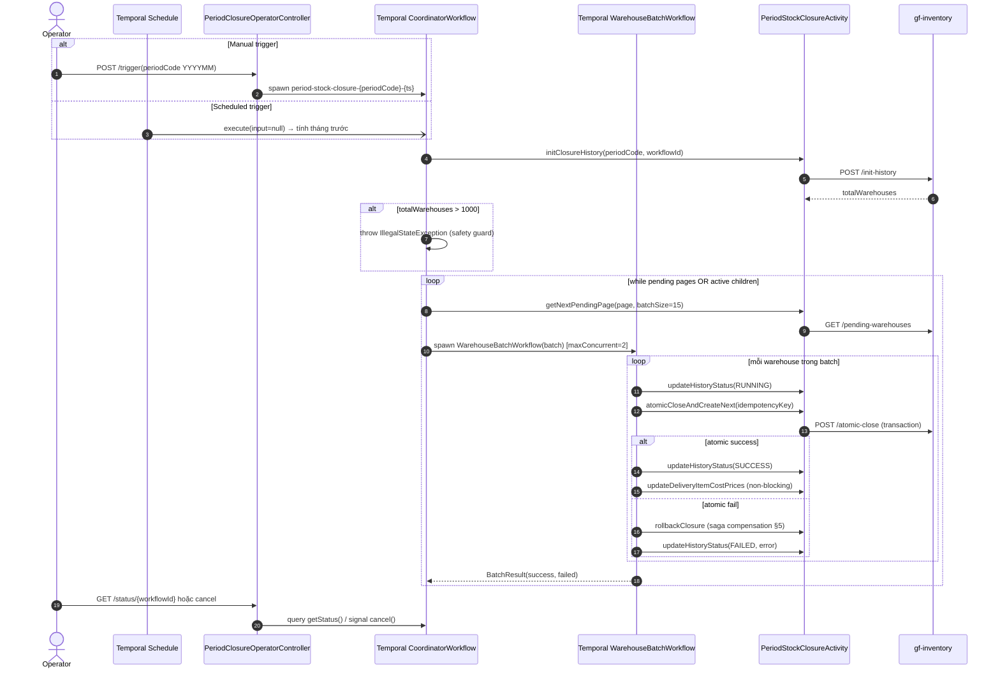
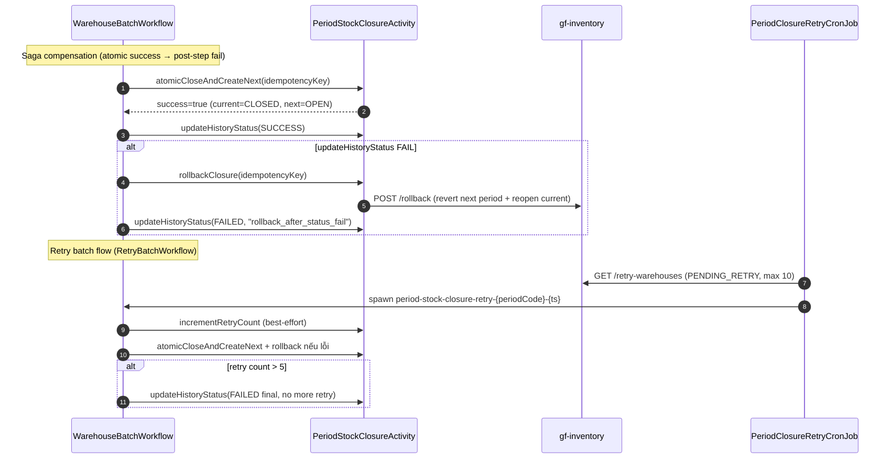

# Workflow — Inventory Period Closure

> Match [UX-FLOW-INVENTORY-COUNT](../../Product/ux-flows/UX-FLOW-INVENTORY-COUNT.md). Cornerstone period stock closure xuyên `gf-inventory-worker` + `gf-inventory`. **Saga workflow** với rollback compensation.

## 1. Trigger

3 entry path:
- **Temporal schedule** `period-stock-closure-scheduler` cron `0 0 1 * *` (1st của tháng 00:00 timezone Asia/Ho_Chi_Minh) — auto tính period tháng trước nếu input `null`.
- **Operator API** `POST /protected/v2/period-closure/operator/trigger(periodCode)` — manual với validation `YYYYMM`.
- **Retry cron** `PeriodClosureRetryCronJob` mỗi 5 phút (`0 */5 * * * *`) — fetch warehouse `PENDING_RETRY`, skip nếu coordinator đang chạy (tránh conflict).

## 2. Actors

- Operator / Temporal schedule (initiator)
- `gf-inventory-worker` `PeriodClosureOperatorController` + `PeriodClosureRetryCronJob`
- **Temporal `PeriodClosureCoordinatorWorkflow`** ← coordinator chính (semaphore + child spawn)
- **Temporal `WarehouseBatchWorkflow`** ← child workflow per batch (15 warehouses)
- **Temporal `RetryBatchWorkflow`** ← retry warehouse `PENDING_RETRY`
- `PeriodStockClosureActivity` + `InventoryDeliveryActivity` (activity boundary)
- `gf-inventory` service (period stock SoT + closure history + atomic close + rollback)

## 3. Sequence

## 4. State machine intersection

| Service | Entity | Transition |
|---|---|---|
| `gf-inventory-worker` | Coordinator workflow | `INIT` → `PULL` → `PROCESS` → `COMPLETING` → `COMPLETED` / `CANCELLED` / `FAILED` |
| `gf-inventory-worker` | Warehouse batch (per warehouse) | `PENDING` → `RUNNING` → `SUCCESS` / `FAILED_WAREHOUSE` → (saga) `COMPENSATING` → `FAILED` |
| `gf-inventory` | `period_closure_history` | `PENDING` → `RUNNING` → `SUCCESS` / `FAILED` / `PENDING_RETRY` |
| `gf-inventory` | `inventory_period_stock` (current) | `OPEN` → `CLOSING` → `CLOSED` (atomic) hoặc rollback về `OPEN` (saga) |
| `gf-inventory` | `inventory_period_stock` (next period) | tạo mới với `OPEN` opening_quantity = closing của period trước |

## 5. Sub-flow — Saga compensation (rollback) + Retry batch

| Idempotency key (atomic close) | `closure-{periodCode}-{tenantId}-{warehouseCode}-{workflowId}` |

## 6. Error paths

| Error | Handling |
|---|---|
| `periodCode` sai format `YYYYMM` | `IllegalArgumentException` từ controller validation |
| Schedule config thiếu | `PeriodClosureScheduleConfig` log warning, không auto-create schedule |
| `totalWarehouses > 1000` | Coordinator throw `IllegalStateException` (safety guard) → split master/sub coordinator |
| Activity init/page fail | Temporal retry 3 attempts (initial 5s, max 2m, backoff 2.0); fail → workflow fail |
| Child batch fail | Coordinator tăng `failedBatches`, tiếp tục batch khác (không fail-fast) |
| Atomic closure `success=false` hoặc exception | Saga rollback `rollbackClosure` → status `FAILED` |
| `updateHistoryStatus` fail | Best-effort, log error, không throw (status là metadata, không phá invariant) |
| Delivery cost price update fail | Non-blocking — log error, không fail closure |
| Retry cron khi coordinator đang chạy | Skip retry để tránh conflict |
| Duplicate retry workflow ID | Catch `WorkflowExecutionAlreadyStarted` → skip |
| Retry count > 5 (`PERIOD_CLOSURE_MAX_RETRY_ATTEMPTS`) | Final `FAILED`, không retry tiếp |

## 7. Idempotency

- **Atomic close** dùng `closure-{periodCode}-{tenantId}-{warehouseCode}-{workflowId}` key (DB unique constraint trong `gf-inventory`).
- **Coordinator workflow ID** deterministic `period-stock-closure-{periodCode}-{timestamp}` → Temporal native dedup.
- **Retry workflow ID** `period-stock-closure-retry-{periodCode}-{timestamp}` → catch `WorkflowExecutionAlreadyStarted` skip duplicate.
- **isClosureCompleted** activity check key trước khi execute (idempotent replay-safe).
- **Coordinator concurrency** semaphore `maxConcurrent=2` child workflow (config `PERIOD_CLOSURE_MAX_CONCURRENT`).
- **Retry cron skip** nếu coordinator đang chạy (Temporal list open workflows by prefix).

## 8. References

- **UX flow**: [UX-FLOW-INVENTORY-COUNT.md](../../Product/ux-flows/UX-FLOW-INVENTORY-COUNT.md)
- **HLD**: [gf-inventory-worker-HLD.md](../hld/gf-inventory-worker-HLD.md), [gf-inventory-HLD.md](../hld/gf-inventory-HLD.md)
- **ADR**: [ADR-005 Temporal Workflow Orchestration](../decisions/ADR-005-temporal-workflow-orchestration.md) _(mandatory)_
- **API spec**: [gf-inventory-worker-api.md](../api/gf-inventory-worker-api.md) (operator + worker callback), [gf-inventory-api.md](../api/gf-inventory-api.md) (period-closure protected endpoints)
- **Business rules**: [BR-GF-INVENTORY.md](../../Product/business-rules/BR-GF-INVENTORY.md)
- **Events**: [gf-inventory-events.md](../events/gf-inventory-events.md) — closure không publish event (state-only)
- **Product features**: [FEAT-IP-VIEW.md](../../Product/features/FEAT-IP-VIEW.md), [FEAT-IP-HISTORY.md](../../Product/features/FEAT-IP-HISTORY.md)
- **Open items**:
  - HLD-INV-WORKER-002 result/{workflowId} blocking
  - HLD-INV-WORKER-003 retry cron distributed lock multi-replica
  - HLD-INV-WORKER-004 isCoordinatorWorkflowRunning catch defaults false

## Change Log

| Date | Version | Summary |
|---|---|---|
| 2026-05-11 | v2 | Fix broken §References: ADR-007 → ADR-005 (Temporal Workflow Orchestration), event-spec filename given `gf-` prefix (`inventory-events.md` → `gf-inventory-events.md`), UX-FLOW path → `{{RELATED-UX-FLOW}}` placeholder, undefined BR-/FEAT- IDs → `{{RELATED-BUSINESS-RULES}}` / `{{RELATED-PRODUCT-FEATURES}}` placeholders. |
| 2026-05-07 | v1 | Initial workflow spec cho `inventory-period-closure`: 3 trigger path (Temporal schedule cron `0 0 1 * *` Asia/Ho_Chi_Minh + operator API `POST /trigger` + retry cron 5 phút), Saga workflow với rollback compensation. State machine: coordinator `INIT → PULL → PROCESS → COMPLETING → COMPLETED/CANCELLED/FAILED`; warehouse batch `PENDING → RUNNING → SUCCESS/FAILED → COMPENSATING`; period stock `OPEN → CLOSING → CLOSED`. Services involved: `gf-inventory-worker` (CoordinatorWorkflow + WarehouseBatchWorkflow + RetryBatchWorkflow + activities) + `gf-inventory` (period stock SoT + atomic close + rollback). Invariants: idempotency key `closure-{periodCode}-{tenantId}-{warehouseCode}-{workflowId}` DB unique, semaphore maxConcurrent=2 child workflow, retry max 5 attempts, totalWarehouses>1000 safety guard, retry cron skip nếu coordinator đang chạy. Bao gồm Trigger, Actors, Sequence, State machine intersection, Sub-flow saga compensation + retry batch, Error paths, Idempotency, References. |
