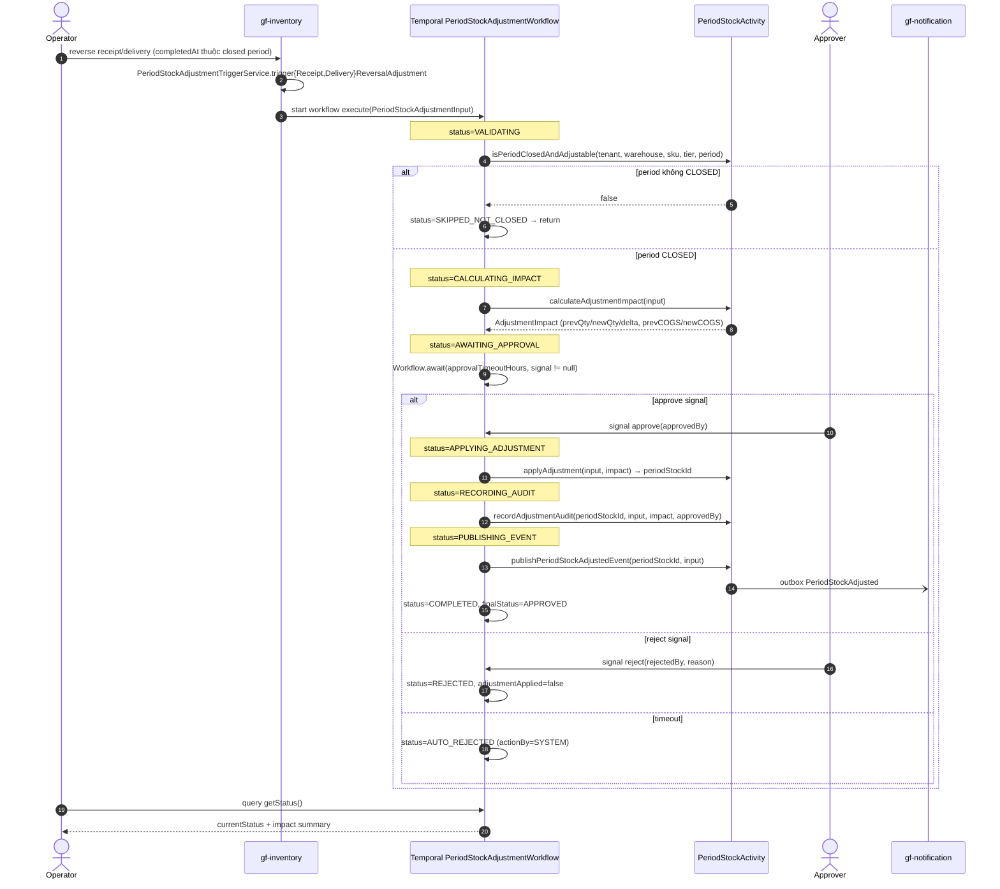

# Workflow — Inventory Period Stock Adjustment

> Manual approval workflow khi reverse `inventory_receipt` / `inventory_delivery` rơi vào period đã `CLOSED` — xuyên `gf-inventory` (initiator + period stock SoT + workflow impl host) + Approver (operator/CSKH) + `gf-notification` (downstream consumer). Signal-driven với 24h auto-reject timeout. **Đặc biệt**: workflow class chạy in-process trong `gf-inventory` chứ không tách `gf-inventory-worker`.

## 1. Trigger

`PeriodStockAdjustmentTriggerService.triggerReceiptReversalAdjustment(...)` hoặc `triggerDeliveryReversalAdjustment(...)` được gọi từ reverse handler trong `gf-inventory` khi:
- Receipt/Delivery có `completedAt` thuộc một `YearMonth` **trước** `YearMonth.now()` (period đã đóng), VÀ
- `inventory_period_stock.status` của period đó là `CLOSED` hoặc `ADJUSTED` (không OPEN).

Trigger build `PeriodStockAdjustmentInput` (tenant + warehouseCode + sku + tier + periodCode + reversalType `RECEIPT_REVERSED` / `DELIVERY_REVERSED` + referenceCode + reversedBy + `approvalTimeoutHours`) và start workflow qua Temporal client với workflow ID deterministic theo composite key.

> **Open `HLD-INVENTORY-011`**: Trong source hiện tại `PeriodStockAdjustmentTriggerService.applyAdjustmentDirectly(...)` bỏ qua workflow và mutate `inventory_period_stock` trực tiếp + ghi outbox `PeriodStockAdjusted` (xem note ở line 51–52 source). Workflow class `PeriodStockAdjustmentWorkflowImpl` tồn tại nhưng chưa được production code start. Tài liệu này mô tả **intended design** (KG-defined) — chính là target để reconcile code khi cần approval gate.

## 2. Actors

- Operator (initiator: thao tác reverse receipt/delivery qua `gf-inventory` REST)
- `gf-inventory` `PeriodStockAdjustmentTriggerService` (entry point + workflow starter)
- **Temporal `PeriodStockAdjustmentWorkflow`** ← coordinator (impl ở `gf-inventory` — KHÔNG tách `gf-inventory-worker` như các workflow khác)
- `PeriodStockActivity` (activity boundary: `isPeriodClosedAndAdjustable`, `calculateAdjustmentImpact`, `applyAdjustment`, `recordAdjustmentAudit`, `publishPeriodStockAdjustedEvent`)
- `InventoryEventActivity` (outbox publisher activity)
- Approver (operator/CSKH — gửi `approve(...)` / `reject(...)` signal qua portal API)
- `gf-notification` (downstream consume `PeriodStockAdjusted` outbox event)
- PostgreSQL trong `gf-inventory` (`inventory_period_stock`, `period_closure_history` audit, `outbox_event`)

## 3. Sequence

## 4. State machine intersection

| Service | Entity | Transition |
|---|---|---|
| `gf-inventory` | Workflow status | `INITIALIZING` → `VALIDATING` → `CALCULATING_IMPACT` → `AWAITING_APPROVAL` → `{APPLYING_ADJUSTMENT → RECORDING_AUDIT → PUBLISHING_EVENT → COMPLETED}` / `REJECTED` / `AUTO_REJECTED` / `SKIPPED_NOT_CLOSED` / `FAILED` |
| `gf-inventory` | `inventory_period_stock` | `CLOSED` → `ADJUSTED` (status field); `closing_quantity` + `cogs` mutate khi APPROVED branch — **không** thoát `CLOSED` về `OPEN` |
| `gf-inventory` | `period_closure_history` | INSERT audit row mới (approver, reversalType, prev/new qty + COGS) khi APPROVED |
| `gf-inventory` | `outbox_event` | INSERT `PeriodStockAdjusted` khi APPROVED → Kafka publish qua `OutboxEventPublisher` |

## 5. Error paths

| Error | Handling |
|---|---|
| Period status `OPEN` (current/future) | Trigger service early-return trước khi start workflow (xem source line 132–138) — không tốn workflow run |
| Period stock không tồn tại (closure job chưa chạy) | Trigger service `createMissingPeriodStock` (`@Transactional REQUIRES_NEW`) tự tạo row CLOSED rồi adjust — race-safe qua propagation |
| `isPeriodClosedAndAdjustable` trả false | Workflow set `SKIPPED_NOT_CLOSED` + return không-apply |
| `calculateAdjustmentImpact` throw | Workflow set `FAILED` + return failed output |
| Approval timeout (default 24h, configurable qua `approvalTimeoutHours`) | Workflow auto-reject với `actionBy=SYSTEM`, `rejectionReason="Timeout after Nh"` |
| Signal `approve` / `reject` sau `completed=true` | Guard `if (completed) return` → ignored, không double-apply |
| `applyAdjustment` activity fail | Temporal retry theo `ActivityOptionsFactory` default → exhaust → workflow `FAILED` |
| `publishPeriodStockAdjustedEvent` activity fail | Outbox row PENDING; trigger service catch không throw (xem source line 467–473) — adjustment đã save, event publish later qua `OutboxEventPublisher` |
| Workflow ID duplicate cùng composite key | Temporal `WorkflowExecutionAlreadyStarted` → caller phải tự handle (signal vào instance đang chạy nếu cần) |

## 6. Idempotency

- **Workflow ID deterministic** theo composite `{tenantId, warehouseCode, sku, tier, periodCode, reversalType, referenceCode}` → Temporal native dedup; cùng reverse start nhiều lần → throw `WorkflowExecutionAlreadyStarted`.
- **Signal guard** `if (completed) return` ở `approve()` / `reject()` (xem [PeriodStockAdjustmentWorkflowImpl.java:188–211](../../../../garage-functions/gf-inventory/src/main/java/com/actechx/gf/workflow/workflow/impl/PeriodStockAdjustmentWorkflowImpl.java#L188-L211)) — chống double-apply khi signal đến muộn.
- **`applyAdjustment` activity** dùng `recalculateForAdjustment` từ `previousPeriodStock` + re-aggregate transactions → idempotent về kết quả (recompute không phụ thuộc state cũ).
- **`recordAdjustmentAudit`** insert row mới vào `period_closure_history` — multiple approval cùng period stock = multiple audit row (intentional, không UNIQUE).
- **Outbox event** unique theo `eventId` UUID; Kafka consumer dedup qua `inbox_event` ở downstream service.
- **Query `getStatus()`** không side effect — safe để poll.

## 7. References

- **HLD**: [gf-inventory-HLD.md](../hld/gf-inventory-HLD.md) §2 (Temporal interface block line 95–125), §3 (Period closure idempotency decision)
- **ADR**: [ADR-005 Temporal Workflow Orchestration](../decisions/ADR-005-temporal-workflow-orchestration.md) _(mandatory)_
- **Knowledge graph**: [gf-inventory.knowledge-graph.yaml](../../Execution/knowledge-graphs/gf-inventory.knowledge-graph.yaml) — `PeriodStockAdjustmentWorkflow` entry (line 1246–1259)
- **Sister workflow**: [inventory-period-closure-flow.md](inventory-period-closure-flow.md) — period closure path ngược (đóng period, không phải adjust)
- **API spec**: [gf-inventory-api.md](../api/gf-inventory-api.md) — reverse receipt / delivery endpoints (entry point)
- **Data model**: [gf-inventory-data-model.md](../data/gf-inventory-data-model.md) — `inventory_period_stock`, `period_closure_history`, `outbox_event`
- **Events**: [gf-inventory-events.md](../events/gf-inventory-events.md) — `PeriodStockAdjusted` outbox event (currently **chưa có entry** — gap song song, xem `HLD-INVENTORY-011`)
- **Source**:
  - `PeriodStockAdjustmentWorkflow(Impl).java` — workflow contract + state machine
  - `PeriodStockAdjustmentTriggerService.java` — trigger entry (currently bypass workflow, see `HLD-INVENTORY-011`)
  - `PeriodStockActivity(Impl).java` — activity boundary
- **Business rules**: [BR-GF-INVENTORY.md](../../Product/business-rules/BR-GF-INVENTORY.md)
- **Product features**: [FEAT-IP-ADJUST.md](../../Product/features/FEAT-IP-ADJUST.md), [FEAT-IR-REVERSE.md](../../Product/features/FEAT-IR-REVERSE.md), [FEAT-ID-REVERSE.md](../../Product/features/FEAT-ID-REVERSE.md)
- **Open items**:
  - `HLD-INVENTORY-011` — `PeriodStockAdjustmentTriggerService.applyAdjustmentDirectly` bỏ qua workflow + approval gate; cần reconcile (start workflow thật) hoặc cập nhật KG về flow direct.

## Change Log

| Date | Version | Summary |
|---|---|---|
| 2026-05-11 | v2 | Fix broken §References: ADR-007 → ADR-005 (Temporal Workflow Orchestration); xóa nhãn sai "ADR-005 Period closure governance" (ADR-005 thực ra là Temporal, không phải period closure). Undefined BR-/FEAT- IDs → `{{RELATED-BUSINESS-RULES}}` / `{{RELATED-PRODUCT-FEATURES}}` placeholders. Events bullet (`gf-inventory-events.md`) đã đúng nên không đổi. |
| 2026-05-07 | v1 | Initial workflow spec cho `inventory-period-stock-adjustment`: trigger từ `PeriodStockAdjustmentTriggerService.trigger{Receipt,Delivery}ReversalAdjustment` khi reverse rơi vào closed period → Temporal `PeriodStockAdjustmentWorkflow` (impl in-process gf-inventory, không tách worker) với 1 timer (`approvalTimeoutHours` default 24h) + 2 signal (`approve`/`reject`) + 1 query (`getStatus`). State machine: `INITIALIZING → VALIDATING → CALCULATING_IMPACT → AWAITING_APPROVAL → {APPLYING_ADJUSTMENT → RECORDING_AUDIT → PUBLISHING_EVENT → COMPLETED} | REJECTED | AUTO_REJECTED | SKIPPED_NOT_CLOSED | FAILED`. Activity boundary `PeriodStockActivity.{isPeriodClosedAndAdjustable, calculateAdjustmentImpact, applyAdjustment, recordAdjustmentAudit, publishPeriodStockAdjustedEvent}`. Idempotency: workflow ID composite key Temporal native dedup, signal guard `if (completed) return` chống double-apply, `recalculateForAdjustment` re-aggregate → idempotent kết quả, outbox eventId UUID + downstream `inbox_event` dedup. Open: `HLD-INVENTORY-011` — production trigger service hiện bypass workflow, cần reconcile. Bao gồm Trigger, Actors, Sequence, State machine intersection, Error paths, Idempotency, References. |
