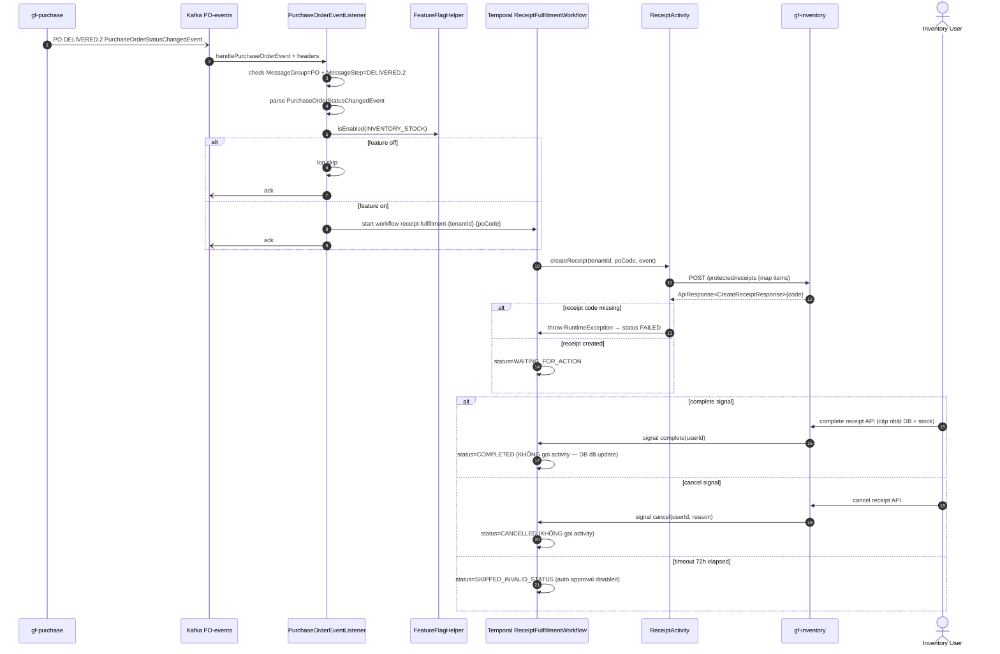

# Workflow — Inventory Receipt Fulfillment

> Match [UX-FLOW-INVENTORY-RECEIPT](../../Product/ux-flows/UX-FLOW-INVENTORY-RECEIPT.md). Cornerstone receipt nhập kho từ purchase order — xuyên `gf-purchase` (event source) + `gf-inventory-worker` (orchestrator) + `gf-inventory` (state SoT).

## 1. Trigger

Kafka topic `${KAFKA_TOPIC_PO_EVENTS:dev-inventory-purchase-order-events}` consume bởi `PurchaseOrderEventListener`. Filter:
- Header `MessageGroup=PO` + `MessageStep=DELIVERED.2`.
- Parse `MessagePayload.data` → `PurchaseOrderStatusChangedEvent`.
- Feature flag `INVENTORY_STOCK` enabled (gate hard).

Workflow start với deterministic ID `receipt-fulfillment-{tenantId}-{purchaseOrderCode}`.

## 2. Actors

- `gf-purchase` (producer PO DELIVERED event)
- Kafka topic `purchase-order-events`
- `gf-inventory-worker` `PurchaseOrderEventListener` + `FeatureFlagHelper`
- **Temporal `ReceiptFulfillmentWorkflow`** ← coordinator (signal-driven, 72h TTL)
- `ReceiptActivity` (activity boundary cho `gf-inventory` REST)
- `gf-inventory` service (receipt + stock + transaction SoT)
- Inventory operator/user (complete/cancel qua `gf-inventory` API → trigger signal workflow)

## 3. Sequence

> **Note semantic mismatch với delivery workflow** (open HLD-INV-WORKER-006): receipt signal KHÔNG gọi activity vì `gf-inventory` API complete/cancel đã mutate DB + stock trước khi gửi signal — workflow chỉ đóng để tránh double mutation. Delivery thì ngược lại — workflow signal gọi activity.

## 4. State machine intersection

| Service | Entity | Transition |
|---|---|---|
| `gf-inventory-worker` | Workflow status | `INITIALIZING` → `CREATING_RECEIPT` → `WAITING_FOR_ACTION` → `COMPLETED` / `CANCELLED` / `SKIPPED_INVALID_STATUS` / `FAILED` |
| `gf-inventory` | `inventory_receipt` | `PENDING` → `COMPLETED` / `CANCELLED` / `REVERSED` |
| `gf-inventory` | `inventory_receipt_item` | tạo cùng receipt từ PO event items (sku/quantity/costPrice) |
| `gf-inventory` | `inventory_stock` | `quantity++` khi complete (operator API mutate trực tiếp, ngoài workflow scope) |
| `gf-inventory` | `inventory_transaction` | append `RECEIPT` ledger entry khi complete |

## 5. Error paths

| Error | Handling |
|---|---|
| Feature `INVENTORY_STOCK` off | Listener log skip + ack (không start workflow) |
| Event không đúng group/step (≠ PO/DELIVERED.2) | Listener bỏ qua + ack |
| Parse `PurchaseOrderStatusChangedEvent` lỗi | Listener throw exception trong `handleMessage` → Kafka retry theo container config |
| Duplicate workflow start | Catch `WorkflowExecutionAlreadyStarted` → log + skip (event replay safe) |
| Missing `receiptCode` trong response | Activity throw RuntimeException → workflow `FAILED` sau Temporal retry |
| `createReceipt` API fail (4xx/5xx/timeout) | Temporal retry 10 attempts (2s → 5m, backoff 2.0) → workflow `FAILED` + `lastError` |
| Signal lặp (complete sau cancel) | Workflow log warning + ignore (guard `if completed/cancelled return`) |
| Timeout 72h không có signal | `SKIPPED_INVALID_STATUS` (auto approval disabled — open: cần ADR nếu muốn bật) |

## 6. Idempotency

- **Workflow ID** deterministic `receipt-fulfillment-{tenantId}-{purchaseOrderCode}` → Temporal native dedup; PO replay event không tạo workflow trùng.
- **Signal idempotent**: workflow guard `completed/cancelled` flag → multiple complete/cancel signal an toàn.
- **createReceipt idempotency**: `gf-inventory` enforce qua `purchaseOrderCode` (chống tạo receipt trùng cùng PO).
- **Receipt completion atomic**: `gf-inventory` `InventoryReceiptService` lock + transaction (stock += quantity, transaction append) — ngoài workflow scope.
- **Activity retry**: 10 attempts với exponential backoff — input không đổi mỗi attempt.
- **Feature flag gate**: cùng tenant chưa enable INVENTORY_STOCK sẽ skip workflow.

## 7. References

- **UX flow**: [UX-FLOW-INVENTORY-RECEIPT.md](../../Product/ux-flows/UX-FLOW-INVENTORY-RECEIPT.md)
- **HLD**: [gf-inventory-worker-HLD.md](../hld/gf-inventory-worker-HLD.md), [gf-inventory-HLD.md](../hld/gf-inventory-HLD.md), [gf-purchase-HLD.md](../hld/gf-purchase-HLD.md)
- **ADR**: [ADR-005 Temporal Workflow Orchestration](../decisions/ADR-005-temporal-workflow-orchestration.md) _(mandatory)_
- **API spec**: [gf-inventory-worker-api.md](../api/gf-inventory-worker-api.md), [gf-inventory-api.md](../api/gf-inventory-api.md) (receipts protected endpoints)
- **Events spec**: [gf-purchase-events.md](../events/gf-purchase-events.md) — `PurchaseOrderStatusChangedEvent` (DELIVERED.2)
- **Data model**: [gf-inventory-data-model.md](../data/gf-inventory-data-model.md) — receipt + stock + transaction tables
- **Business rules**: [BR-GF-INVENTORY.md](../../Product/business-rules/BR-GF-INVENTORY.md), [BR-GF-PURCHASE.md](../../Product/business-rules/BR-GF-PURCHASE.md)
- **Product features**: [FEAT-IR-CREATE.md](../../Product/features/FEAT-IR-CREATE.md), [FEAT-IR-COMPLETE.md](../../Product/features/FEAT-IR-COMPLETE.md), [FEAT-IR-CANCEL.md](../../Product/features/FEAT-IR-CANCEL.md), [FEAT-PUR-PO-RECEIVE.md](../../Product/features/FEAT-PUR-PO-RECEIVE.md)
- **Open items**:
  - HLD-INV-WORKER-006 receipt vs delivery signal semantic mismatch (receipt không gọi activity, delivery gọi)
  - HLD-INV-WORKER-008 Kafka event schema versioning

## Change Log

| Date | Version | Summary |
|---|---|---|
| 2026-05-11 | v2 | Fix broken §References: ADR-007 → ADR-005 (Temporal Workflow Orchestration), event-spec filename given `gf-` prefix (`purchase-events.md` → `gf-purchase-events.md`), UX-FLOW path → `{{RELATED-UX-FLOW}}` placeholder, undefined BR-/FEAT- IDs → `{{RELATED-BUSINESS-RULES}}` / `{{RELATED-PRODUCT-FEATURES}}` placeholders. |
| 2026-05-07 | v1 | Initial workflow spec cho `inventory-receipt-fulfillment`: trigger qua Kafka `purchase-order-events` filter `MessageGroup=PO + MessageStep=DELIVERED.2` + feature flag `INVENTORY_STOCK` → `PurchaseOrderEventListener` start Temporal `ReceiptFulfillmentWorkflow` signal-driven 72h TTL (createReceipt activity → WAITING_FOR_ACTION → complete/cancel signal KHÔNG gọi activity vì `gf-inventory` API đã mutate DB trước, hoặc 72h timeout SKIPPED_INVALID_STATUS). Services involved: `gf-purchase` (event source) + `gf-inventory-worker` (orchestrator) + `gf-inventory` (receipt + stock + transaction SoT). Invariants: workflow ID deterministic `receipt-fulfillment-{tenantId}-{purchaseOrderCode}` Temporal native dedup, signal idempotent qua completed/cancelled guard, createReceipt idempotent qua `purchaseOrderCode`, activity retry 10 attempts exponential backoff, feature flag gate per tenant. Bao gồm Trigger, Actors, Sequence, State machine intersection, Error paths, Idempotency, References. |
