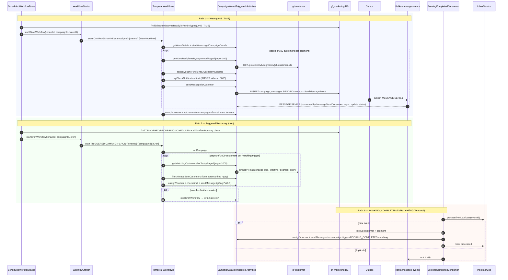

# Workflow — Marketing Campaign Wave Execution

> Campaign execution xuyên `gf-marketing` (orchestrator) + `gf-customer` (segment/cohort) + `gf-notification` (delivery) + `gf-sales` (booking-completed event source). _(N/A — backend orchestration, không có UX trực tiếp)_

## 1. Trigger

3 entry path:
- **Wave scheduler**: `ScheduledWorkflowTasks.checkScheduledWaves` quét mỗi 60s (`marketing.scheduler.wave-check-interval-ms`) — start `WaveWorkflow` cho campaign `ONE_TIME`.
- **Triggered cron**: `ScheduledWorkflowTasks.checkTriggeredCampaigns` quét campaign `TRIGGERED`/`RECURRING` đang `SCHEDULED` — start `TriggeredCampaignCronWorkflow` với Temporal cron `campaign.cronExpression` (fallback `0 1 * * *`).
- **Booking completed event**: `BookingCompletedConsumer` consume Kafka topic `${kafka.topics.booking-completed}` cho trigger `BOOKING_COMPLETED` — không phải Temporal workflow start, mà processor handle trực tiếp với inbox dedup.

## 2. Actors

- `ScheduledWorkflowTasks` (60s scheduler) + `WorkflowStarter` + `TriggeredCampaignWorkflowService`
- **Temporal `WaveWorkflow`** ← coordinator cho `ONE_TIME` campaign theo wave
- **Temporal `TriggeredCampaignCronWorkflow`** ← coordinator cho `TRIGGERED`/`RECURRING` (cron schedule)
- _(Note: `CampaignWorkflow` interface tồn tại nhưng `executeCampaign` rỗng — open HLD-MARKETING-005)_
- `CampaignActivities` + `WaveActivities` + `TriggeredCampaignActivities`
- `gf-customer` (segment + birthday/maintenance/inactive cohort + customer detail)
- `gf-notification` (consume `MESSAGE.SEND.1` và publish `MESSAGE.SEND.2` status)
- `gf-sales` (Kafka producer `booking-completed`)
- `BookingCompletedConsumer` + `InboxService` (booking event path, inbox dedup)
- Outbox + Kafka (`message-events`, `voucher-events`, `campaign-events`)

## 3. Sequence

## 4. State machine intersection

| Service | Entity | Transition |
|---|---|---|
| `gf-marketing` | `campaigns.status` | `DRAFT` → `SCHEDULED` → `RUNNING` → `COMPLETED` (all waves terminal/exhaustion) / `PAUSED` ↔ `RUNNING` / `CANCELLED` |
| `gf-marketing` | `campaign_waves.status` | `PENDING` → `SCHEDULED` → `RUNNING` → `COMPLETED` / `PAUSED` / `CANCELLED` / `SKIPPED` |
| `gf-marketing` | `wave_executions` | created mỗi run; track sentCount/deliveredCount/failedCount |
| `gf-marketing` | `campaign_messages.status` | `SENDING` (workflow ghi outbox) → `SENT/DELIVERED/OPENED/CLICKED/FAILED` (async qua `MESSAGE.SEND.2` consumer) |
| `gf-marketing` | `vouchers.status` | `CREATED` → `DISTRIBUTED` (campaign assign) |
| `gf-customer` | `customer_segment_members` | read-only (workflow chỉ query) |
| `gf-marketing` | `outbox_events` | `PENDING` → `SENT` |

## 5. Error paths

| Error | Handling |
|---|---|
| Activity Temporal fail | Retry theo `WorkflowConstants` (wave 3 attempts 1s→1m, campaign/triggered 3 attempts 2s→2m, backoff 2.0); exhaust → workflow fail |
| Customer lookup fail (per customer) | Catch ở cấp customer + tăng `failedCount`, workflow tiếp tục customer kế tiếp |
| Hết voucher trong wave/triggered | Dừng batch + complete wave/campaign (không gửi thêm message) |
| Hết notification limit theo channel/template | Complete wave/campaign tương tự voucher exhaustion |
| Campaign/wave/template/segment không tìm thấy | Workflow log + return/complete tùy điểm lỗi (không có DLQ workflow) |
| `BookingCompletedConsumer` lỗi xử lý | Ack Kafka sau `handleRawMessage`; processor catch ở cấp campaign/customer (không drop toàn batch) |
| `MessageSendConsumer` ack event ≠ `MESSAGE.SEND.2` | Ack + skip để tránh retry vô hạn |
| `TriggeredCampaignWorkflowService.isWorkflowRunning` describe lỗi | Coi như chưa chạy → có thể start duplicate workflow (open HLD-INV-WORKER-004 sister issue) |
| `CAMPAIGN-WAVE-{campaignId}-{waveId}` duplicate start | Workflow ID trùng → Temporal chặn (multi-replica scheduler) |
| `CampaignWorkflow.executeCampaign` rỗng | open HLD-MARKETING-005 — operator có thể nhầm là entrypoint chính |

## 6. Idempotency

- **Workflow ID deterministic**:
  - `CAMPAIGN-WAVE-{campaignId}-{waveId}` (Wave) → multi-replica scheduler safe.
  - `TRIGGERED-CAMPAIGN-CRON-{tenantId}-{campaignId}` + `isWorkflowRunning` describe check.
- **Triggered campaign idempotency theo ngày**: `filterAlreadySentCustomers` query `campaign_messages` để skip customer đã gửi trong cùng ngày.
- **BOOKING_COMPLETED inbox dedup**: `InboxService.processIfNotDuplicate(eventId)` cho Kafka consumer.
- **Outbox publish**: `OutboxProcessor` Redis lock singleton multi-replica safe.
- **Voucher assignment**: `gf-marketing` `VoucherService` enforce unique `(campaignId, customerId)` để chống double assign cùng customer.
- **Notification limit check**: `tryCheckNotificationLimit` atomic trước mỗi send (open HLD-MARKETING-008 — race condition vẫn có thể vượt nếu nhiều workflow gửi cùng lúc).

## 7. References

- **UX flow**: _(N/A — campaign wave là backend orchestration, không có UX trực tiếp)_
- **HLD**: [gf-marketing-HLD.md](../hld/gf-marketing-HLD.md), [gf-customer-HLD.md](../hld/gf-customer-HLD.md), [gf-notification-HLD.md](../hld/gf-notification-HLD.md), [gf-sales-HLD.md](../hld/gf-sales-HLD.md)
- **ADR**: [ADR-005 Temporal Workflow Orchestration](../decisions/ADR-005-temporal-workflow-orchestration.md) _(mandatory)_
- **API spec**: [gf-marketing-api.md](../api/gf-marketing-api.md) (campaigns + waves + message-templates + notification-limits endpoints)
- **Events spec**: [gf-marketing-events.md](../events/gf-marketing-events.md) — campaign-events (6 type) + message-events (4 type) + booking-completed (in)
- **Data model**: [gf-marketing-data-model.md](../data/gf-marketing-data-model.md) — `campaigns`, `campaign_waves`, `wave_executions`, `campaign_messages`, `trigger_event_mappings`
- **Business rules**: [BR-GF-MARKETING.md](../../Product/business-rules/BR-GF-MARKETING.md)
- **Sister workflow**: [voucher-program-lifecycle-flow.md](voucher-program-lifecycle-flow.md) — voucher source cho campaign assignment
- **Product features**: [FEAT-MKT-CAMP-CREATE.md](../../Product/features/FEAT-MKT-CAMP-CREATE.md), [FEAT-MKT-CAMP-EDIT.md](../../Product/features/FEAT-MKT-CAMP-EDIT.md), [FEAT-MKT-CAMP-PAUSE.md](../../Product/features/FEAT-MKT-CAMP-PAUSE.md), [FEAT-MKT-CAMP-DELETE.md](../../Product/features/FEAT-MKT-CAMP-DELETE.md)
- **Open items**:
  - HLD-MARKETING-005 `CampaignWorkflow.executeCampaign` rỗng
  - HLD-MARKETING-007 Kafka DLQ + backoff policy
  - HLD-MARKETING-008 notification limit race condition multi-workflow
  - HLD-MARKETING-009 PII masking trong campaign_messages.renderedContent

## Change Log

| Date | Version | Summary |
|---|---|---|
| 2026-05-11 | v2 | Fix broken §References: ADR-007 → ADR-005 (Temporal Workflow Orchestration), event-spec filename given `gf-` prefix (`marketing-events.md` → `gf-marketing-events.md`), UX-FLOW path → `{{RELATED-UX-FLOW}}` placeholder, undefined BR-/FEAT- IDs → `{{RELATED-BUSINESS-RULES}}` / `{{RELATED-PRODUCT-FEATURES}}` placeholders. |
| 2026-05-07 | v1 | Initial workflow spec cho `marketing-campaign-wave-execution`: 3 trigger path (wave scheduler 60s cho `ONE_TIME` start `WaveWorkflow`, triggered cron cho `TRIGGERED/RECURRING` start `TriggeredCampaignCronWorkflow`, Kafka `booking-completed` consumer xử lý trực tiếp với inbox dedup KHÔNG Temporal). Main steps: getWaveDetails → page customers (100/segment hoặc 1000/trigger) → assignVoucher → tryCheckNotificationLimit → sendMessageToCustomer → outbox `MESSAGE.SEND.1` → consume `MESSAGE.SEND.2` async update status → completeWave + auto-complete campaign. Services involved: `gf-marketing` (orchestrator) + `gf-customer` (segment/cohort) + `gf-notification` (delivery) + `gf-sales` (booking-completed source). Invariants: workflow ID deterministic `CAMPAIGN-WAVE-{campaignId}-{waveId}` + `TRIGGERED-CAMPAIGN-CRON-{tenantId}-{campaignId}`, triggered idempotency theo ngày qua `filterAlreadySentCustomers`, BOOKING_COMPLETED inbox dedup, outbox Redis lock multi-replica, voucher unique `(campaignId, customerId)`. Bao gồm Trigger, Actors, Sequence (3 path), State machine intersection, Error paths, Idempotency, References. |
