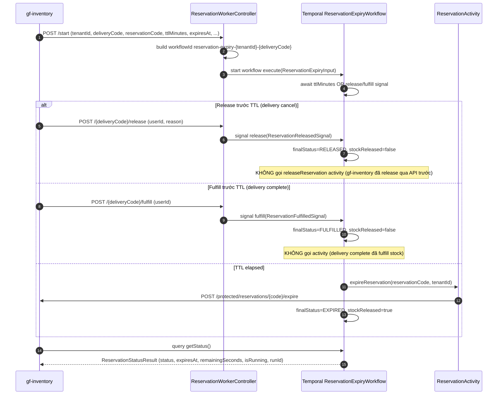

# Workflow — Reservation Expiry

> Match [UX-FLOW-INVENTORY-DELIVERY](../../Product/ux-flows/UX-FLOW-INVENTORY-DELIVERY.md) _(reservation gắn liền delivery)_. Cornerstone TTL workflow giữ stock cho delivery — xuyên `gf-inventory` (initiator + state SoT) + `gf-inventory-worker` (Temporal orchestrator). Timer workflow với signal-driven early termination.

## 1. Trigger

`gf-inventory` gọi protected API `POST /protected/workflows/reservation-expiry/start` của `gf-inventory-worker` với payload `StartReservationExpiryRequest` gồm `tenantId`, `reservationCode`, `deliveryCode`, `warehouseCode`, `sourceType`, `ttlMinutes`, `expiresAt`, `salesOrderCode`, `serviceOrderCode`.

Workflow ID deterministic `reservation-expiry-{tenantId}-{deliveryCode}` chống duplicate start.

## 2. Actors

- `gf-inventory` (initiator + business owner; reservation/stock SoT)
- `gf-inventory-worker` `ReservationWorkerController` (3 endpoints: start + release + fulfill)
- **Temporal `ReservationExpiryWorkflow`** ← coordinator (timer + 2 signals + 1 query)
- `ReservationActivity` (activity boundary cho `gf-inventory` REST)
- Delivery flow downstream caller (signal source khi delivery cancel/complete)
- PostgreSQL trong `gf-inventory` (reservation + reservation_item + stock state)

## 3. Sequence

> **Signal semantic**: release + fulfill signal **không gọi activity** (open HLD-INV-WORKER-007 — verify gf-inventory state). Chỉ timeout branch gọi `expireReservation` activity để giải phóng stock.

## 4. State machine intersection

| Service | Entity | Transition |
|---|---|---|
| `gf-inventory-worker` | Workflow status | `INITIALIZING` → `WAITING` → `FULFILLED` / `RELEASED` / `EXPIRED` → `COMPLETED` (hoặc `FAILED` nếu expire activity exhaust retry) |
| `gf-inventory` | `inventory_reservation.status` | `PENDING` → `EXPIRED` (qua workflow timeout activity) hoặc `RELEASED` / `FULFILLED` (qua delivery flow trước, signal chỉ đóng workflow) |
| `gf-inventory` | `inventory_stock.reservedQuantity` | `--` khi expire (workflow gọi activity) hoặc khi release/fulfill (delivery flow gọi trực tiếp, ngoài workflow scope) |
| `gf-inventory` | `inventory_transaction` | append `RESERVATION_RELEASE` ledger entry khi expire |

## 5. Error paths

| Error | Handling |
|---|---|
| Start request thiếu field (`tenantId`, `deliveryCode`, `ttlMinutes`, `expiresAt`) | Controller không có bean validation — runtime exception khi build input (caller phải đảm bảo contract) |
| Duplicate workflow start | Cùng `tenantId+deliveryCode` → Temporal throw `WorkflowExecutionAlreadyStarted` (controller không catch riêng) |
| Release/fulfill signal sau timeout | Controller catch exception (workflow đã expire/completed) → log warning + trả `ApiResponse.success(true)` (best-effort) |
| `expireReservation` API fail | Activity Temporal retry 3 attempts (1s → 1m, backoff 2.0) → workflow `FAILED` nếu exhaust |
| TTL không khớp `expiresAt` | Workflow await theo `ttlMinutes`; `getStatus()` query `remainingSeconds` từ `expiresAt` — caller phải set nhất quán |
| Signal race với timeout | Temporal native event order quyết định; nếu timer fired trước signal → activity `expireReservation` chạy |
| `gf-inventory` đã release/fulfill nhưng quên gửi signal | Workflow vẫn timeout + gọi expire → có thể double-expire nếu `gf-inventory` chưa idempotent (open HLD-INV-WORKER-007) |

## 6. Idempotency

- **Workflow ID** deterministic `reservation-expiry-{tenantId}-{deliveryCode}` → Temporal native dedup; cùng delivery start nhiều lần → throw exception.
- **Signal best-effort**: controller catch exception → trả success kể cả khi workflow đã đóng (signal idempotent về caller).
- **Signal không gọi activity**: tránh double release/fulfill stock (vì `gf-inventory` đã thực hiện qua delivery API trước khi gửi signal).
- **`expireReservation` activity** idempotent qua `gf-inventory` enforce (`reservation.status` guard — đã EXPIRED không re-expire).
- **Activity retry 3 attempts** với input không đổi.
- **Query `getStatus()`** không có side effect — safe để gọi nhiều lần.

## 7. References

- **UX flow**: [UX-FLOW-INVENTORY-DELIVERY.md](../../Product/ux-flows/UX-FLOW-INVENTORY-DELIVERY.md) _(reservation gắn liền delivery fulfillment)_
- **HLD**: [gf-inventory-worker-HLD.md](../hld/gf-inventory-worker-HLD.md), [gf-inventory-HLD.md](../hld/gf-inventory-HLD.md)
- **ADR**: [ADR-005 Temporal Workflow Orchestration](../decisions/ADR-005-temporal-workflow-orchestration.md) _(mandatory)_
- **API spec**: [gf-inventory-worker-api.md](../api/gf-inventory-worker-api.md) (3 reservation endpoints), [gf-inventory-api.md](../api/gf-inventory-api.md) (reservations protected: expire/release/fulfill)
- **Data model**: [gf-inventory-data-model.md](../data/gf-inventory-data-model.md) — `inventory_reservation`, `inventory_reservation_item`, stock state
- **Business rules**: [BR-GF-INVENTORY.md](../../Product/business-rules/BR-GF-INVENTORY.md)
- **Product features**: [FEAT-ID-CREATE.md](../../Product/features/FEAT-ID-CREATE.md), [FEAT-ID-COMPLETE.md](../../Product/features/FEAT-ID-COMPLETE.md), [FEAT-ID-CANCEL.md](../../Product/features/FEAT-ID-CANCEL.md)
- **Reservation TTL config** (xem HLD §6 Quality Attributes):
  - E-commerce: 30 min (`reservation.ttl.ecommerce-minutes`)
  - Direct: 3 min (`reservation.ttl.direct-minutes`)
- **Open items**:
  - HLD-INV-WORKER-007 reservation release signal không gọi activity (cần verify `gf-inventory` state)

## Change Log

| Date | Version | Summary |
|---|---|---|
| 2026-05-11 | v2 | Fix broken §References: ADR-007 → ADR-005 (Temporal Workflow Orchestration), UX-FLOW path → `{{RELATED-UX-FLOW}}` placeholder, undefined BR-/FEAT- IDs → `{{RELATED-BUSINESS-RULES}}` / `{{RELATED-PRODUCT-FEATURES}}` placeholders. |
| 2026-05-07 | v1 | Initial workflow spec cho `reservation-expiry`: trigger qua protected API `POST /protected/workflows/reservation-expiry/start` từ `gf-inventory` → Temporal `ReservationExpiryWorkflow` timer-based với 2 signal (release/fulfill) + 1 query (getStatus). Main states: `INITIALIZING → WAITING → FULFILLED/RELEASED/EXPIRED → COMPLETED`. Timeout branch gọi `expireReservation` activity giải phóng stock; signal branch KHÔNG gọi activity vì `gf-inventory` đã mutate state trước qua delivery flow. Services involved: `gf-inventory` (initiator + reservation/stock SoT) + `gf-inventory-worker` (Temporal orchestrator). TTL config: e-commerce 30 min, direct 3 min. Invariants: workflow ID deterministic `reservation-expiry-{tenantId}-{deliveryCode}` Temporal native dedup, signal best-effort catch exception trả success, expire activity idempotent qua `reservation.status` guard trong `gf-inventory`, retry 3 attempts. Bao gồm Trigger, Actors, Sequence, State machine intersection, Error paths, Idempotency, References. |
