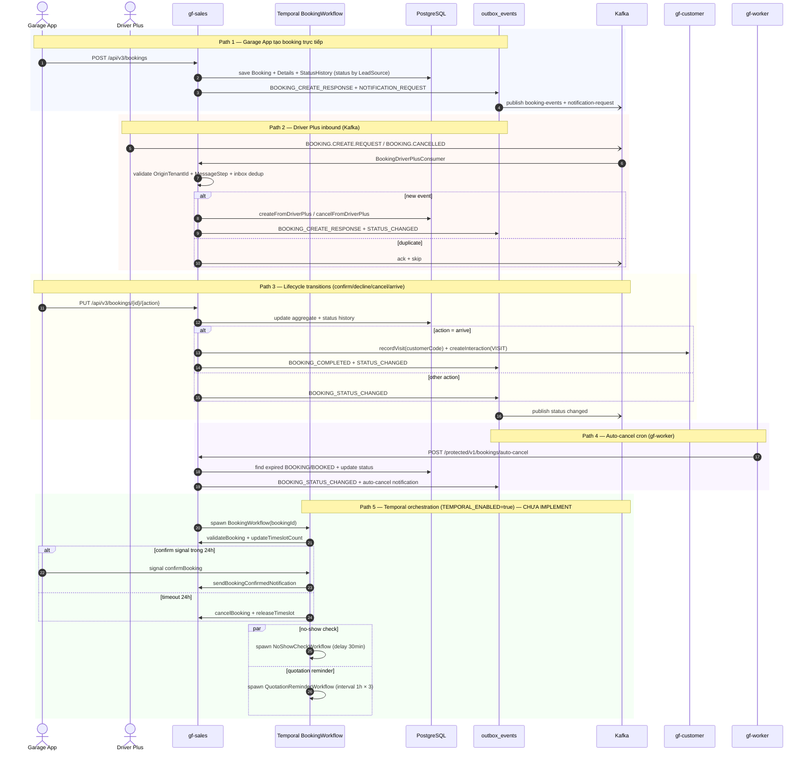

# Workflow — Sales Booking Lifecycle

> Match [UX-FLOW-BOOKING](../../Product/ux-flows/UX-FLOW-BOOKING.md). Cornerstone booking flow xuyên `gf-sales` + `gf-customer` + `gf-notification` + `gf-worker` + Driver Plus + Garage App.

## 1. Trigger

3 entry path:
- **REST V3** từ Garage App: `POST /api/v3/bookings`, `PUT /api/v3/bookings/{id}/{confirm,cancel,arrive,decline}`.
- **Auto-create từ service order** khi `POST /api/v3/service-orders` không có `bookingId` và `orderType=SERVICE`.
- **Kafka inbound** `booking-events` từ Driver Plus (`CREATE_REQUEST` / `CANCELLED`).
- **Internal cron** `POST /protected/v1/bookings/auto-cancel` do `gf-worker` trigger (1 phút) cho booking quá hạn 60 phút.

Temporal workers chạy trên task queue `GF-SALES-BOOKING-QUEUE` khi `TEMPORAL_ENABLED=true`.

## 2. Actors

- **Garage App / Driver Plus** (initiator)
- `gf-sales` service (`BookingV3Service`)
- **Temporal `BookingWorkflow`** ← coordinator chính (process(bookingId) + 6 signals)
- **Temporal `NoShowCheckWorkflow`** ← timer no-show 30 phút
- **Temporal `QuotationReminderWorkflow`** ← interval reminder 1h × 3
- `gf-customer` service (recordVisit + interaction VISIT khi arrive)
- `gf-notification` service (consume `notification-request` topic)
- `gf-worker` service (cron auto-cancel HTTP trigger)
- Kafka (`booking-events` + `notification-request` topics)

## 3. Sequence

## 4. State machine intersection

| Service | Entity | Transition |
|---|---|---|
| `gf-sales` | Booking | `BOOKING` → `BOOKED` (confirm) / `CANCELLED` (cancel) / `DECLINED` (decline) → `ARRIVED` → `CHECKING/CHECKED/PRICING/CONFIRMED/READY/IN_PROGRESS/COMPLETED` (service flow bridge) |
| `gf-sales` | Booking (terminal) | `NO_SHOW` (auto-cancel) / `ABORTED` (during service) |
| `gf-sales` | OutboxEvent | `PENDING` → `SENT` / `FAILED` (after max-retries=5) |
| `gf-customer` | Customer | `lastVisitAt` updated + `bookingCount++` (khi `/arrive`) |
| `gf-customer` | CustomerInteraction | created (`type=VISIT`, `referenceType=BOOKING`) |

## 5. Sub-flow — 3 Temporal workflows

| Workflow | Method | Signals | Query | Lifecycle |
|---|---|---|---|---|
| `BookingWorkflow` | `process(bookingId)` | `confirmBooking`, `cancelBooking`, `customerArrived`, `quotationConfirmed`, `quotationDeclined`, `serviceCompleted` | `getStatus()` | Coordinator chính — booking từ tạo đến complete |
| `NoShowCheckWorkflow` | `checkNoShow(bookingId)` | — | `getStatus()` returns `NO_SHOW` / `ARRIVED` | Timer 30 phút sau scheduled time → `markAsNoShow` + `releaseTimeslot` |
| `QuotationReminderWorkflow` | `sendReminders(bookingId)` | `customerResponded` | `getStatus()` returns `RESPONDED` / `HANDLED` / `TIMEOUT` | Interval 1h × max 3 reminder; dừng khi customer respond |

> Activity retry max 3 attempts, timeout 5 phút. Detail config + activity list xem [gf-sales-HLD §6 Quality Attributes](../hld/gf-sales-HLD.md).

## 6. Error paths

| Error | Handling |
|---|---|
| Driver Plus event thiếu `OriginTenantId` | Consumer log + ack + skip |
| Driver Plus event duplicate | Inbox dedup theo `(eventId, type)` → ack + skip |
| Driver Plus consumer lỗi | Throw `RuntimeException` → no-ack → Kafka redelivery |
| Booking transition không hợp lệ | Domain `InvalidStatusTransitionException` |
| Confirmation timeout 24h | Workflow timer fires → `cancelBooking` + `releaseTimeslot` + cancel notification |
| No-show 30 phút sau scheduled | `markAsNoShow` + `releaseTimeslot` + no-show notification |
| Quotation reminder hết 3 lần | Workflow status `TIMEOUT` (không compensation auto) |
| Outbox publish lỗi | Retry max 5 (config `outbox.max-retries`) → mark `FAILED` |
| Auto-cancel status conflict (`NO_SHOW` vs `CANCELLED`) | open HLD-SALES-007 — cần align aggregate vs history |

## 7. Idempotency

- Driver Plus inbound: `inbox_events` unique `(event_id, type)` → duplicate → ack + skip.
- Outbox publish: Redis lock singleton `gf-sales-outbox-processor` (multi-replica safe).
- Auto-cancel: idempotent qua status check `WHERE status IN ('BOOKING', 'BOOKED') AND created_at < now() - 60min`.
- Customer arrive: `recordVisit` idempotent qua `customerCode` lookup; interaction unique theo `(referenceType, referenceId)` + `referenceType=BOOKING`.

## 8. References

- **UX flow**: [UX-FLOW-BOOKING.md](../../Product/ux-flows/UX-FLOW-BOOKING.md)
- **HLD**: [gf-sales-HLD.md](../hld/gf-sales-HLD.md), [gf-customer-HLD.md](../hld/gf-customer-HLD.md), [gf-notification-HLD.md](../hld/gf-notification-HLD.md), [gf-worker-HLD.md](../hld/gf-worker-HLD.md)
- **ADR**: [ADR-005 Temporal Workflow Orchestration](../decisions/ADR-005-temporal-workflow-orchestration.md) _(mandatory)_
- **Business rules**: [BR-GF-SALES.md](../../Product/business-rules/BR-GF-SALES.md), [BR-GF-CUSTOMER.md](../../Product/business-rules/BR-GF-CUSTOMER.md)
- **Events**: [gf-sales-events.md](../events/gf-sales-events.md) (BOOKING_CREATE_RESPONSE, BOOKING_STATUS_CHANGED, BOOKING_COMPLETED), [gf-notification-events.md](../events/gf-notification-events.md)
- **Product features**: [FEAT-BOOK-CREATE.md](../../Product/features/FEAT-BOOK-CREATE.md), [FEAT-BOOK-EDIT.md](../../Product/features/FEAT-BOOK-EDIT.md), [FEAT-BOOK-CONFIRM.md](../../Product/features/FEAT-BOOK-CONFIRM.md), [FEAT-BOOK-ARRIVE.md](../../Product/features/FEAT-BOOK-ARRIVE.md), [FEAT-BOOK-CANCEL.md](../../Product/features/FEAT-BOOK-CANCEL.md), [FEAT-BOOK-DECLINE.md](../../Product/features/FEAT-BOOK-DECLINE.md), [FEAT-BOOK-DRIVERPLUS-INBOUND.md](../../Product/features/FEAT-BOOK-DRIVERPLUS-INBOUND.md)
- **Open items**:
  - HLD-SALES-006 Temporal worker rollout (`TEMPORAL_ENABLED=false` default)
  - HLD-SALES-007 auto-cancel `NO_SHOW` vs `CANCELLED` history mismatch
  - HLD-SALES-008 Driver Plus consumer ack on missing header (event mất thay vì DLQ)

## Change Log

| Date | Version | Summary |
|---|---|---|
| 2026-05-11 | v2 | Fix broken §References: ADR-007 → ADR-005 (Temporal Workflow Orchestration), event-spec filenames given `gf-` prefix (`sales-events.md` → `gf-sales-events.md`, `notification-events.md` → `gf-notification-events.md`), UX-FLOW path → `{{RELATED-UX-FLOW}}` placeholder, undefined BR-/FEAT- IDs → `{{RELATED-BUSINESS-RULES}}` / `{{RELATED-PRODUCT-FEATURES}}` placeholders. |
| 2026-05-07 | v1 | Initial workflow spec cho `sales-booking-lifecycle`: 4 trigger path (REST V3 từ Garage App, auto-create từ service order, Kafka `booking-events` từ Driver Plus, internal cron `auto-cancel` từ `gf-worker` 1 phút). Booking state: `BOOKING → BOOKED/CANCELLED/DECLINED → ARRIVED → CHECKING/CHECKED/PRICING/CONFIRMED/READY/IN_PROGRESS/COMPLETED` + terminal `NO_SHOW/ABORTED`. 3 Temporal workflows trên `GF-SALES-BOOKING-QUEUE`: `BookingWorkflow` (coordinator + 6 signals), `NoShowCheckWorkflow` (timer 30 phút), `QuotationReminderWorkflow` (interval 1h × 3). Services involved: `gf-sales` (orchestrator) + `gf-customer` (recordVisit + interaction VISIT) + `gf-notification` + `gf-worker` (cron) + Driver Plus + Garage App. Invariants: Driver Plus inbox unique `(eventId, type)` dedup, outbox Redis lock singleton multi-replica, auto-cancel idempotent qua status check, recordVisit idempotent qua `customerCode`, max-retries=5 outbox publish. Bao gồm Trigger, Actors, Sequence (5 path), State machine intersection, Sub-flow 3 Temporal workflows, Error paths, Idempotency, References. |
