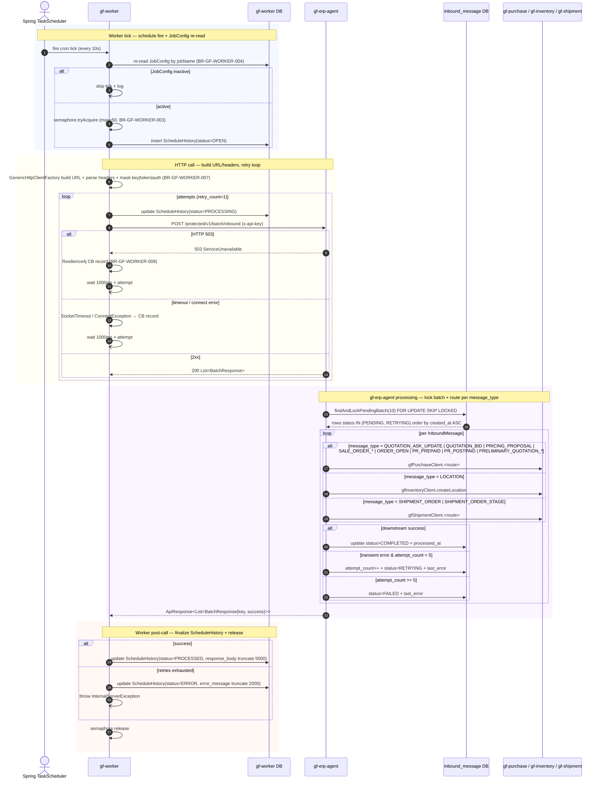

# Workflow — Batch Inbound (ERP → Garage Sync)

> Cron-driven HTTP job 10s tick: `gf-worker` → `gf-erp-agent` `POST /protected/v1/batch/inbound` để dispatch `InboundMessage` đã ack từ ERP Kafka tới `gf-purchase` / `gf-inventory` / `gf-shipment`. Cornerstone của BR-GF-WORKER-001..008.

## 1. Trigger

- **Spring `TaskScheduler`** (bean `"dynamicScheduler"`, `VirtualThreadTaskScheduler`) fire cron `0/10 * * ? * *` (mỗi 10s, giây 0) timezone `Asia/Ho_Chi_Minh`.
- Job seed bởi Flyway `V1.0.1` + downgrade retry `V1.0.4`; `DynamicJobProcessor.initializeScheduledJobs()` load lúc startup, `checkAndSyncJobs()` re-sync mỗi 30s (`worker.schedule.check-interval`).
- Không entry path khác — job thuần internal cron, không expose REST/Kafka trigger.
- JobConfig seed: `job_name=BATCH_INBOUND`, `http_method=POST`, `base_url=${agent-service.url}`, `endpoint_path=/protected/v1/batch/inbound`, `target_service=gf-erp-agent`, `retry_count=1` (V1.0.4 downgrade từ 5), `timeout_seconds=300`, `request_headers={"Content-Type":"application/json","x-api-key":"${internal-service.api-key}"}`.

## 2. Actors

- **Spring `TaskScheduler`** (cron engine của `gf-worker`)
- `gf-worker` service (`DynamicJobProcessor`, `GenericHttpJobExecutorServiceImpl`, `GenericHttpClientFactory`)
- `gf-worker` DB (`job_config`, `schedule_history`)
- `gf-erp-agent` service (`InternalBatchController.createInboundRequests`, `InboundMessageService.processMessages`)
- `inbound_message` DB của `gf-erp-agent`
- **Downstream targets** — `gf-purchase`, `gf-inventory`, `gf-shipment` (Feign clients)

## 3. Sequence

## 4. State machine intersection

| Service | Entity | Transition |
|---|---|---|
| `gf-worker` | `ScheduleHistory` | `OPEN` → `PROCESSING` (× attempts) → `PROCESSED` / `ERROR` (BR-GF-WORKER-005) |
| `gf-worker` | `JobConfig` | re-read mỗi tick; `inactive` → skip execute (BR-GF-WORKER-004) |
| `gf-erp-agent` | `InboundMessage` | initial insert: Kafka `AC-DEV-*` → `PENDING` \| `PRIORITY_PROCESSING` (TransactionalEventListener AFTER_COMMIT) |
| `gf-erp-agent` | `InboundMessage` | `PENDING` \| `RETRYING` → `COMPLETED` (success) / `RETRYING` (transient + `attempt_count++`) / `FAILED` (khi `attempt_count >= 5`) |

## 5. Sub-flow — gf-worker cron engine

| Component | Responsibility |
|---|---|
| `DynamicJobProcessor` | Startup `initializeScheduledJobs()` + `checkAndSyncJobs()` 30s; semaphore `max-concurrent-jobs:50`; virtual-thread per job serialize cùng `job_name`. |
| `executeJobSafely()` | Re-read `JobConfig` trước execute; skip nếu inactive (BR-GF-WORKER-004). |
| `GenericHttpJobExecutorServiceImpl` | `ScheduleHistory(OPEN)` → `executeWithRetry()` loop `PROCESSING` → wait `1000ms × attempt` → retry; success → `PROCESSED` + body truncate 5000; cạn → `ERROR` + truncate 2000 + throw `InternalServerException`. |
| `GenericHttpClientFactory` | Build URL = `baseUrl + endpointPath`; parse headers JSON; resolve `${...}` qua Spring `Environment`; mask `key\|token\|auth`; Apache HttpClient pool. |
| Resilience4j | CB `generic-http-client` trip 503/timeout (70% failure / 80% slow, OPEN 30s); Bulkhead `maxConcurrentCalls=100`. |

## 6. Error paths

| Error | Handling |
|---|---|
| HTTP 503 từ `gf-erp-agent` | `ServiceUnavailableException` → CircuitBreaker record (BR-GF-WORKER-008); retry per JobConfig; cạn → `ERROR` |
| Read timeout (>300s) | `SocketTimeoutException` → CB record + retry per JobConfig (retry=1 → 1 attempt → `ERROR`) |
| Connection timeout (>5s) | `ConnectException` → CB record + retry |
| Bulkhead full (>100 concurrent) | `BulkheadFullException` → `ERROR` (không retry CB-trip) |
| Semaphore `max-concurrent-jobs` full | log warning + skip tick (không retry) |
| `JobConfig` inactive giữa cron trigger và execute | `executeJobSafely` skip + log (BR-GF-WORKER-004) |
| Downstream HTTP 4xx/5xx (non-503) | rethrow → `ERROR` sau cạn retry; KHÔNG trip CircuitBreaker |
| Business error trên `InboundMessage` cụ thể | message mark `RETRYING`; response vẫn `200 OK` với `success=false`; ScheduleHistory vẫn `PROCESSED` |
| `InboundMessage` cạn retry (`attempt_count >= 5`) | status `FAILED` + `last_error`; cần manual replay (không có auto compensation) |

## 7. Idempotency

- `inbound_message.message_key` UNIQUE — duplicate Kafka delivery insert `DataIntegrityViolationException` → catch + fallback `findByMessageKey()`.
- `FOR UPDATE SKIP LOCKED` trong `findAndLockPendingBatch(10)` → multi-replica `gf-erp-agent` không double-process cùng row.
- `gf-worker` mỗi tick là independent transaction; `ScheduleHistory` ghi nhận từng attempt riêng.
- Cron tick chồng lấn cùng `job_name` được serialize bởi virtual-thread per-job (BR-GF-WORKER-003).
- Status filter `IN (PENDING, RETRYING)` đảm bảo `COMPLETED` / `FAILED` rows không bị pick lại.

## 8. References

- **UX flow**: _(N/A — system cron job, không có UX trực tiếp)_
- **HLD**: [gf-worker-HLD.md](../hld/gf-worker-HLD.md), [gf-erp-agent-HLD.md](../hld/gf-erp-agent-HLD.md), [gf-purchase-HLD.md](../hld/gf-purchase-HLD.md), [gf-inventory-HLD.md](../hld/gf-inventory-HLD.md), [gf-shipment-HLD.md](../hld/gf-shipment-HLD.md)
- **API**: [gf-worker-api.md](../api/gf-worker-api.md), [gf-erp-agent-api.md](../api/gf-erp-agent-api.md)
- **Events**: [gf-erp-agent-events.md](../events/gf-erp-agent-events.md) — Kafka `AC-DEV-*` inbound topics seed `InboundMessage`
- **Business rules**: [BR-GF-PURCHASE.md](../../Product/business-rules/BR-GF-PURCHASE.md), [BR-GF-INVENTORY.md](../../Product/business-rules/BR-GF-INVENTORY.md)
- **Product features**: _(N/A — ERP integration layer, không map trực tiếp tới product feature)_

## Change Log

| Date | Version | Summary |
|---|---|---|
| 2026-05-11 | v1 | Initial workflow spec `batch-inbound-flow`: cron-driven HTTP job `BATCH_INBOUND` (Flyway V1.0.1 + V1.0.4 seed) tick 10s từ `gf-worker` Spring `TaskScheduler` → `POST /protected/v1/batch/inbound` của `gf-erp-agent` → dispatch `InboundMessage` (status `PENDING`/`RETRYING`, lock `FOR UPDATE SKIP LOCKED` batch=10) tới `gf-purchase` / `gf-inventory` / `gf-shipment` theo `message_type` routing (QUOTATION_*, SALE_ORDER_*, PR_PREPAID/POSTPAID, LOCATION, SHIPMENT_ORDER, PRELIMINARY_QUOTATION_*). gf-worker chain: `DynamicJobProcessor` (semaphore 50 + virtual-thread per job-name, sync 30s) → `executeJobSafely` re-read JobConfig → `GenericHttpJobExecutorServiceImpl` ScheduleHistory `OPEN → PROCESSING × attempts → PROCESSED/ERROR` (retry=1, timeout=300s, wait `1000ms × attempt`) → `GenericHttpClientFactory` build URL + parse headers + resolve `${...}` + mask `key\|token\|auth` + Apache HttpClient pool; Resilience4j CB `generic-http-client` trip 503/timeout, Bulkhead 100. State: `InboundMessage` `PENDING\|RETRYING → COMPLETED` (success) / `RETRYING` (transient + `attempt_count++`) / `FAILED` (`>=5`). Idempotency: `message_key` UNIQUE + `SKIP LOCKED` + ScheduleHistory per-attempt + virtual-thread serialize cùng job_name. Cornerstone BR-GF-WORKER-001..008. |
