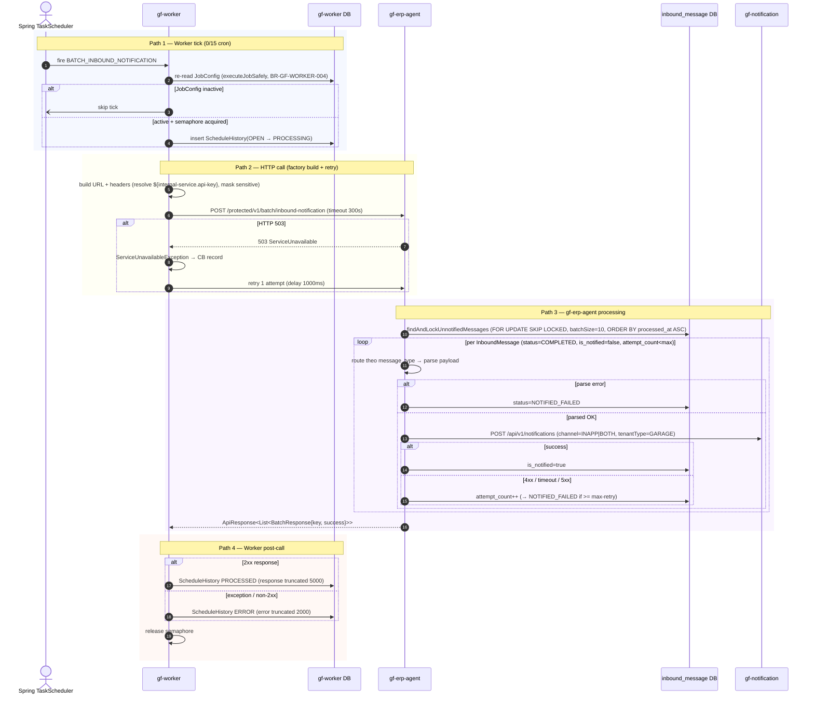

# Workflow — Batch Inbound Notification (ERP Inbound → User Notification)

> Cron-driven HTTP job 15s tick: gf-worker → gf-erp-agent `POST /protected/v1/batch/inbound-notification` để dispatch in-app notification cho InboundMessage đã `COMPLETED` nhưng `is_notified=false`. gf-erp-agent gọi gf-notification REST API (`POST /api/v1/notifications`) per row. Cornerstone của BR-GF-WORKER-001..008.

## 1. Trigger

- **Spring TaskScheduler tick** `cron=0/15 * * ? * *` (mỗi 15s, offset 0, TZ `Asia/Ho_Chi_Minh`) trên `DynamicJobProcessor` (`VirtualThreadTaskScheduler`).
- Job seed từ Flyway `V1.0.1` + `V1.0.4` — `job_name=BATCH_INBOUND_NOTIFICATION`, `target_service=gf-erp-agent`, `http_method=POST`, `endpoint_path=/protected/v1/batch/inbound-notification`, `base_url=${agent-service.url}`, `retry_count=1`, `timeout_seconds=300`.
- Startup load + sync 30s; semaphore `worker.job.max-concurrent-jobs=50`; per `job_name` virtual-thread serialize (tick mới skip nếu tick cũ chưa xong).

## 2. Actors

- **Spring TaskScheduler** (cron driver) + `gf-worker` (`DynamicJobProcessor`, `GenericHttpJobExecutorServiceImpl`, `GenericHttpClientFactory` — URL build + header parse + placeholder resolve + mask sensitive)
- `gf-worker DB` — `JobConfig`, `ScheduleHistory`
- `gf-erp-agent` — `InternalBatchController.createInboundNotificationRequests()`, `InboundMessageService.processNotifications()`, `NotificationMessageService`, `GfNotificationClient`
- `gf-erp-agent DB` — `inbound_message` (notification axis: `status`, `is_notified`, `attempt_count`)
- `gf-notification` — `POST /api/v1/notifications` (connect 3s, read 5s); **Resilience4j** CB `generic-http-client`

## 3. Sequence

## 4. State machine intersection

| Service | Entity | Transition |
|---|---|---|
| `gf-worker` | `ScheduleHistory` | `OPEN` → `PROCESSING` → `PROCESSED` / `ERROR` |
| `gf-worker` | `JobConfig` | re-read mỗi tick (BR-GF-WORKER-004) — `active=false` → skip |
| `gf-erp-agent` | `InboundMessage` (notification axis) | `(COMPLETED, is_notified=false)` → `(COMPLETED, is_notified=true)` on success |
| `gf-erp-agent` | `InboundMessage` (notification axis) | `(COMPLETED, is_notified=false, attempt_count<max)` → `(COMPLETED, is_notified=false, attempt_count++)` on retry-able failure |
| `gf-erp-agent` | `InboundMessage` (notification axis) | `attempt_count >= max-retry` → `(NOTIFIED_FAILED, is_notified=false)` (terminal — cần operator intervene) |

> Notification track riêng so với poll track — `attempt_count` share giữa 2 axis nhưng `is_notified` flag là idempotency key cho notification dispatch. Notification types: `QUOTATION_BID`, `QUOTATION_ASK_UPDATE`, `SALE_ORDER`, `ORDER_OPEN`, `DELIVERING_PO`, `DELIVERED_PO`, `PR_PREPAID`, `PR_POSTPAID`, `PRELIMINARY_QUOTATION_*`.

## 5. Error paths

| Error | Handling |
|---|---|
| HTTP 503 từ gf-erp-agent | `ServiceUnavailableException` → Resilience4j CB `generic-http-client` record → retry 1 attempt (1000ms × attempt) → mark `ScheduleHistory.ERROR` nếu vẫn fail |
| gf-notification read timeout (>5s) | Caught trong `NotificationMessageService` → `success=false` → `attempt_count++` → row giữ `is_notified=false` để retry tick sau |
| gf-notification 4xx (invalid payload / missing tenant) | `success=false` → cùng path `attempt_count++` |
| Payload JSON parse error | Caught sớm → row mark `NOTIFIED_FAILED` (không count vào retry budget) |
| Bulkhead `generic-http-client` full | `BulkheadFullException` → `ScheduleHistory.ERROR` |
| Semaphore `worker.job.max-concurrent-jobs` full | Skip tick (per `job_name` serialize qua virtual-thread) |
| `JobConfig` inactive giữa tick và execute | `executeJobSafely` re-read → skip ngay (BR-GF-WORKER-004) |
| Max-retry exhausted | Row `status=NOTIFIED_FAILED`, `is_notified=false` — operator phải manual reset attempt_count hoặc replay |

## 6. Idempotency

- `is_notified=true` flag là idempotency key chính — row chuyển `true` thì query `findAndLockUnnotifiedMessages` subsequent skip ngay (filter `is_notified=false`).
- `FOR UPDATE SKIP LOCKED` trên `inbound_message` đảm bảo multi-replica gf-erp-agent không double-notify cùng row trong cùng tick.
- Worker side per `job_name` virtual-thread serialize đảm bảo tick mới skip nếu tick cũ chưa xong → không double-trigger HTTP call.
- gf-notification side có dedup riêng theo notification id (out of scope cho workflow này).

## 7. References

- **UX flow**: _(N/A — system cron job, không có UX trực tiếp)_
- **HLD**: [gf-worker-HLD.md](../hld/gf-worker-HLD.md), [gf-erp-agent-HLD.md](../hld/gf-erp-agent-HLD.md), [gf-notification-HLD.md](../hld/gf-notification-HLD.md)
- **API**: [gf-worker-api.md](../api/gf-worker-api.md), [gf-erp-agent-api.md](../api/gf-erp-agent-api.md), [gf-notification-api.md](../api/gf-notification-api.md)
- **Events**: [gf-notification-events.md](../events/gf-notification-events.md)
- **Business rules**: [BR-GF-PURCHASE.md](../../Product/business-rules/BR-GF-PURCHASE.md)
- **Product features**: _(N/A — ERP notification layer, không map trực tiếp tới product feature)_

## Change Log

| Date | Version | Summary |
|---|---|---|
| 2026-05-11 | v1 | Initial workflow spec cho `batch-inbound-notification`: cron 15s tick (`0/15 * * ? * *`, seed Flyway V1.0.1 + V1.0.4), gf-worker → POST `/protected/v1/batch/inbound-notification` → gf-erp-agent `findAndLockUnnotifiedMessages` (FOR UPDATE SKIP LOCKED, batch=10) → per row `gfNotificationClient.createNotification`. State notification axis: `(COMPLETED, is_notified=false)` → `is_notified=true` success / `attempt_count++` retry / `NOTIFIED_FAILED` terminal. Idempotency qua `is_notified` flag + SKIP LOCKED + per `job_name` virtual-thread serialize. Cornerstone BR-GF-WORKER-001, 003..008. |
