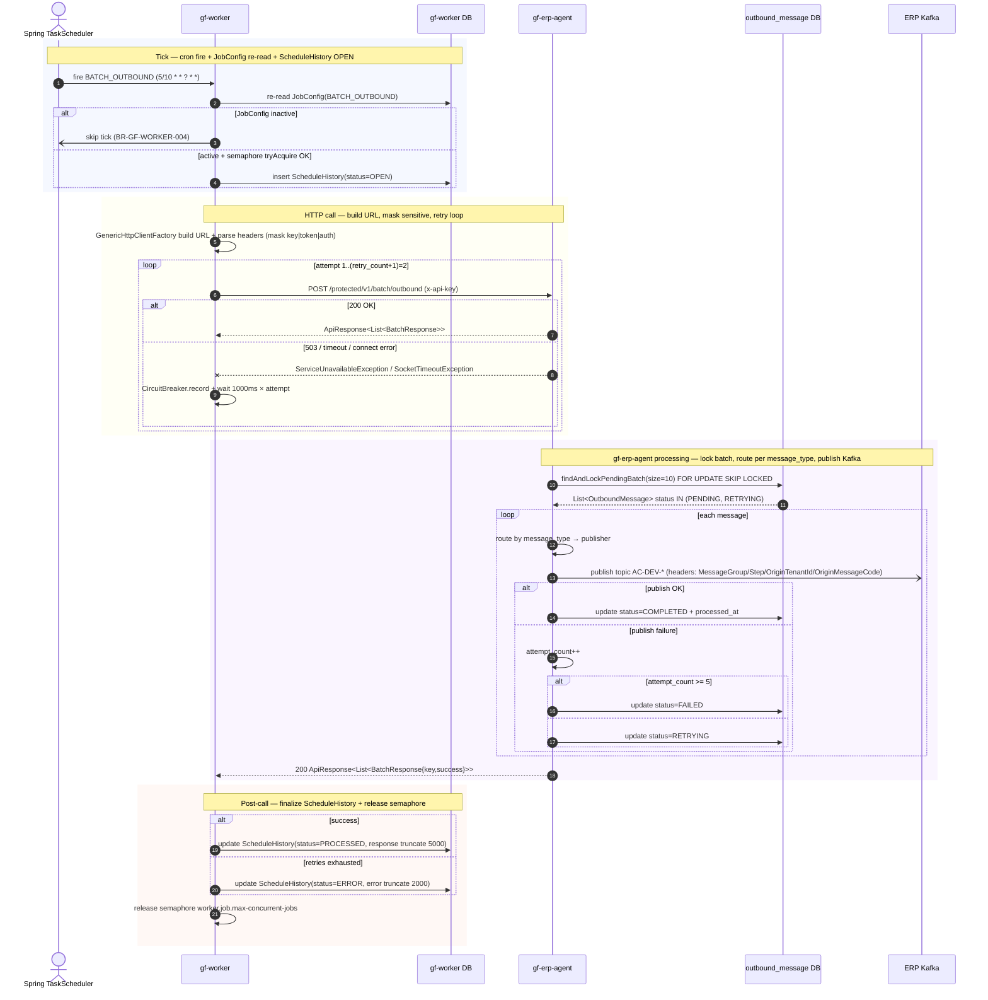

# Workflow — Batch Outbound (Garage → ERP Publish)

> Cron-driven HTTP job 10s tick (offset 5s, staggered vs BATCH_INBOUND): gf-worker → gf-erp-agent `POST /protected/v1/batch/outbound` để publish OutboundMessage PENDING lên ERP Kafka topics (AC-DEV-QUOTATION-ASK, AC-DEV-PURCHASE-REQUEST, AC-DEV-PRICING, AC-DEV-ORDER-STAGE-UPDATE, AC-NONPROD-DEV-O-STAGE). Cornerstone của BR-GF-WORKER-001..008.

## 1. Trigger

- **Seeded JobConfig** (Flyway V1.0.1 + V1.0.4) `job_name=BATCH_OUTBOUND`, `cron_expression=5/10 * * ? * *` (mỗi 10 giây, offset giây thứ 5 để staggered với BATCH_INBOUND giảm collision), timezone `Asia/Ho_Chi_Minh`.
- **HTTP target**: `POST ${agent-service.url}/protected/v1/batch/outbound`, headers `Content-Type: application/json` + `x-api-key: ${internal-service.api-key}`, `timeout=300s`, `retry_count=1`.
- **Schedule registration** xảy ra trong `DynamicJobProcessor.initializeScheduledJobs()` lúc startup + sync loop 30s pick up mọi thay đổi JobConfig.
- **Tick gate**: semaphore `worker.job.max-concurrent-jobs:50` + virtual-thread per `job_name` (serialize cùng job, song song khác job).

## 2. Actors

- **Spring `TaskScheduler`** (VirtualThreadTaskScheduler bean) — cron fire engine.
- `gf-worker` service: `DynamicJobProcessor`, `GenericHttpJobExecutorServiceImpl`, `GenericHttpClientFactory`.
- gf-worker DB: `job_config`, `schedule_history` tables.
- `gf-erp-agent` service: `InternalBatchController.createOutboundRequests()` → `OutboundMessageService.processMessages()` → 6 publisher (`QuotationAsk`, `PricingRequest`, `CreatePurchaseRequest`, `UpdateOrderStage`, `CancelPurchaseRequest`, `DeliveredOrderRequest`).
- gf-erp-agent DB: `outbound_message` table (lock qua `FOR UPDATE SKIP LOCKED`).
- ERP Kafka cluster: topic `AC-DEV-QUOTATION-ASK`, `AC-DEV-PRICING`, `AC-DEV-PURCHASE-REQUEST`, `AC-DEV-ORDER-STAGE-UPDATE`, `AC-NONPROD-DEV-O-STAGE`.
- Resilience4j: CircuitBreaker `generic-http-client` (failure 70%, slow 80%, wait 30s) + Bulkhead 100.

## 3. Sequence

## 4. State machine intersection

| Service | Entity | Transition |
|---|---|---|
| `gf-worker` | ScheduleHistory | `OPEN` → `PROCESSING` (per attempt) → `PROCESSED` (HTTP 2xx) / `ERROR` (retries exhausted) — BR-GF-WORKER-005 |
| `gf-worker` | JobConfig | re-read mỗi tick; `is_active=false` → skip; thay đổi cron → sync loop 30s reload — BR-GF-WORKER-004 |
| `gf-erp-agent` | OutboundMessage | `PENDING\|RETRYING` → `COMPLETED` (Kafka publish OK) / `RETRYING` (attempt_count++) / `FAILED` (attempt_count ≥ 5) |
| `gf-erp-agent` | OutboundMessage (priority) | `PRIORITY_PROCESSING` → `COMPLETED` (publish OK trong cùng batch) |

## 5. Error paths

| Error | Handling |
|---|---|
| gf-erp-agent HTTP 503 | `ServiceUnavailableException` → Resilience4j CircuitBreaker `generic-http-client` record (BR-GF-WORKER-008) |
| Read timeout > 300s | `SocketTimeoutException` → CB record → cạn retry → ScheduleHistory `ERROR` |
| Connect timeout > 5s | `ConnectException` → CB record → retry theo BR-GF-WORKER-006 |
| Kafka publish failure (network/auth/topic missing) | caught trong `OutboundMessageService` → row `RETRYING`; HTTP response 200 với per-row `success=false` |
| Max-retry exhausted (attempt ≥ 5) | OutboundMessage `FAILED` — operator intervention cần thiết |
| Bulkhead full | `BulkheadFullException` → ScheduleHistory `ERROR` |
| Semaphore `worker.job.max-concurrent-jobs` full | skip tick + log warning (BR-GF-WORKER-003) |
| JobConfig inactive giữa fire và execute | `executeJobSafely` skip — không insert ScheduleHistory (BR-GF-WORKER-004) |

## 6. Idempotency

- `outbound_message` KHÔNG có UNIQUE constraint trên `message_key` — phụ thuộc Kafka producer idempotence (enabled trong `KafkaConfig`) + downstream consumer idempotent.
- `FOR UPDATE SKIP LOCKED` đảm bảo multi-replica gf-erp-agent không double-publish cùng row trong cùng batch.
- gf-purchase upstream tạo `OutboundMessage` đúng một lần per business event (outbox pattern) — không có path tạo trùng.
- gf-worker tick collision: semaphore + virtual-thread per `job_name` serialize cùng `BATCH_OUTBOUND` → không có hai execution chồng nhau cùng instance; multi-instance cluster vẫn dựa SKIP LOCKED ở downstream.
- HTTP retry safe: cùng batch lock 10 row → nếu network drop sau publish OK nhưng trước update DB, Kafka có thể nhận duplicate → consumer phải dedup theo `OriginMessageCode`.

## 7. Configuration & Observability

Seed `job_config.BATCH_OUTBOUND` Flyway V1.0.1 + V1.0.4 (cron tune `5/10`); env resolve `${agent-service.url}`, `${internal-service.api-key}` (BR-GF-WORKER-007). Metrics: ScheduleHistory per-tick audit + CB `generic-http-client` state + Bulkhead saturation; tuning `batchSize` (hiện 10) cân Kafka producer throughput vs DB lock contention.

## 8. References

- **UX flow**: _(N/A — system cron job, không có UX trực tiếp)_
- **HLD**: [gf-worker-HLD.md](../hld/gf-worker-HLD.md), [gf-erp-agent-HLD.md](../hld/gf-erp-agent-HLD.md), [gf-purchase-HLD.md](../hld/gf-purchase-HLD.md)
- **API**: [gf-worker-api.md](../api/gf-worker-api.md), [gf-erp-agent-api.md](../api/gf-erp-agent-api.md)
- **Events**: [gf-erp-agent-events.md](../events/gf-erp-agent-events.md)
- **Business rules**: [BR-GF-PURCHASE.md](../../Product/business-rules/BR-GF-PURCHASE.md)
- **Product features**: _(N/A — ERP integration layer, không map trực tiếp tới product feature)_

## Change Log

| Date | Version | Summary |
|---|---|---|
| 2026-05-11 | v1 | Initial workflow spec cho `BATCH_OUTBOUND` cron-driven HTTP job: gf-worker tick `5/10 * * ? * *` (offset 5s vs BATCH_INBOUND, `Asia/Ho_Chi_Minh`) → `POST /protected/v1/batch/outbound` gf-erp-agent (`retry_count=1`, `timeout=300s`, mask `x-api-key`). gf-worker chain `DynamicJobProcessor` + `GenericHttpJobExecutorServiceImpl` (ScheduleHistory `OPEN→PROCESSED/ERROR`, wait `1000ms × attempt`) + `GenericHttpClientFactory` (Resilience4j CB 70/80/30s + Bulkhead 100). gf-erp-agent lock 10-row batch `FOR UPDATE SKIP LOCKED`, route 6 message_type tới 5 ERP Kafka topic `AC-DEV-*` + `AC-NONPROD-DEV-O-STAGE`. OutboundMessage `PENDING\|RETRYING → COMPLETED/RETRYING/FAILED` (max-retry 5). Idempotency dựa Kafka producer idempotence + outbox upstream + SKIP LOCKED; KHÔNG có UNIQUE trên `message_key`. Cornerstone BR-GF-WORKER-001..008. |
