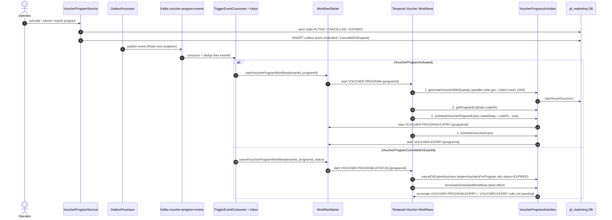
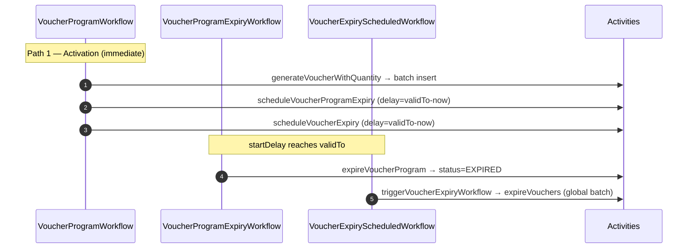

# Workflow — Voucher Program Lifecycle

> Voucher program lifecycle (sinh voucher + schedule expiry + cancel/expire sớm) — xuyên `gf-marketing` (orchestrator) + `gf-customer` (assignment downstream) + Campaign flow (consumer). _(N/A — backend orchestration, không có UX trực tiếp)_

## 1. Trigger

`VoucherProgramServiceImpl` publish 1 trong 2 outbox event:
- **`VoucherProgramActivated`** khi operator activate program → start `VoucherProgramWorkflow`.
- **`VoucherProgramCancelledOrExpired`** khi cancel/expire sớm → start `VoucherProgramUpdateExpiredWorkflow`.

`OutboxProcessor` đẩy event lên `${kafka.topics.voucher-program-events}`. `TriggerEventConsumer` consume → `InboxService.processIfNotDuplicate(eventId)` → `WorkflowStarter` start workflow tương ứng.

## 2. Actors

- Operator / Marketing user (qua `gf-marketing` API)
- `gf-marketing` `VoucherProgramServiceImpl` (producer outbox)
- `OutboxProcessor` (Redis lock multi-replica) → Kafka topic `voucher-program-events`
- `TriggerEventConsumer` + `InboxService` + `WorkflowStarter`
- **Temporal `VoucherProgramWorkflow`** ← coordinator chính (Activated path: sinh voucher + schedule)
- **Temporal `VoucherProgramExpiryWorkflow`** ← timer (startDelay = validTo - now)
- **Temporal `VoucherExpiryScheduledWorkflow`** ← timer (batch expire vouchers quá hạn)
- **Temporal `VoucherProgramUpdateExpiredWorkflow`** ← cancel/expire sớm
- `VoucherProgramActivities` + `VoucherService` (activity boundary)
- Campaign flow (consumer voucher cho assignment)

## 3. Sequence

## 4. State machine intersection

| Service | Entity | Transition |
|---|---|---|
| `gf-marketing` | `voucher_programs.status` | `DRAFT` → `ACTIVE` (activate) → `EXPIRED` (validTo) / `CANCELLED` / `SUSPENDED` ↔ `ACTIVE` (resume) |
| `gf-marketing` | `vouchers.status` | `CREATED` (sinh khi program activate) → `DISTRIBUTED` (campaign assign) → `REDEEMED` / `EXPIRED` / `CANCELLED` |
| `gf-marketing` | `outbox_events` | `PENDING` → `SENT` |
| `gf-marketing` | `inbox_events` | unique `eventId` → `PROCESSED` |

## 5. Sub-flow — 4 Temporal workflows + timing

| Workflow | Workflow ID | startDelay | Timeout | Hành vi chính |
|---|---|---|---|---|
| `VoucherProgramWorkflow` | `VOUCHER-PROGRAM-{programId}` | none (immediate) | 2 giờ | Sinh voucher + spawn 2 expiry workflow scheduled |
| `VoucherProgramExpiryWorkflow` | `VOUCHER-PROGRAM-EXPIRY-{programId}` | `validTo - now` | 2 giờ | Chuyển program `EXPIRED` qua `program.expire()` + save |
| `VoucherExpiryScheduledWorkflow` | `VOUCHER-EXPIRY-{programId}` | `validTo - now` | 2 giờ | Gọi `voucherService.expireVouchers()` — ⚠️ batch global, không filter theo programId (xem Error paths) |
| `VoucherProgramUpdateExpiredWorkflow` | `VOUCHER-PROGRAM-{STATUS}-{programId}` | none | 2 giờ | Expire voucher còn hiệu lực + terminate 2 scheduled workflow trên |

> **Skip schedule** nếu `validTo <= now` (program activate trễ).

## 6. Error paths

| Error | Handling |
|---|---|
| Outbox publish lỗi | OutboxProcessor retry max 3 (config `marketing.outbox.max-retries`) |
| `extractEventType` không nhận diện được event | Payload thiếu field đặc trưng (`isActivated`, `isCancelledOrExpired`, `totalQuantity`...) → `Unknown` → không start workflow |
| Inbox duplicate | `processIfNotDuplicate(eventId)` → ack + skip |
| `createVouchersForProgram` không đủ unique code | Retry 3 vòng song song; vẫn thiếu → `IllegalStateException` → workflow fail |
| `validTo <= now` khi schedule | `WorkflowStarter` skip schedule (warning log) — program EXPIRED path không có scheduled workflow |
| Schedule expiry workflow fail sau khi đã batch insert voucher | KHÔNG rollback voucher đã tạo; Temporal retry workflow |
| Activity timeout | 30 phút mỗi activity; retry 3 attempts (5s → 5m, backoff 2.0) |
| Terminate scheduled workflow fail | Best-effort log warning (workflow có thể đã completed/không tồn tại) |
| `VoucherExpiryScheduledWorkflow` expire global | ⚠️ Source hiện gọi `expireVouchers()` toàn bộ thay vì chỉ theo `programId` — design intent cần verify |
| `expireVouchersForProgram(status≠EXPIRED)` | Source vẫn save list nhưng không đổi voucher status — chỉ status=EXPIRED mới expire `CREATED/DISTRIBUTED` voucher |

## 7. Idempotency

- **Outbox publish**: `OutboxProcessor` Redis lock singleton `gf-marketing-outbox-processor` multi-replica safe.
- **Inbox dedup** theo `eventId` qua `InboxService.processIfNotDuplicate`.
- **Workflow ID deterministic**: `VOUCHER-PROGRAM-{programId}` + `VOUCHER-PROGRAM-EXPIRY-{programId}` + `VOUCHER-EXPIRY-{programId}` → Temporal native dedup.
- **Voucher code unique**: parallel generation + retry max 3 vòng; throw nếu vẫn thiếu unique.
- **Skip schedule logic**: `WorkflowStarter` check `validTo > now` trước khi spawn → tránh tạo workflow đã expire.
- **Terminate best-effort**: catch exception khi terminate workflow đã completed → log warning.
- **`expireVouchersForProgram` filter status=EXPIRED**: chỉ voucher `CREATED/DISTRIBUTED` bị expire, không touch `REDEEMED/CANCELLED`.

## 8. References

- **UX flow**: _(N/A — voucher lifecycle là backend orchestration, không có UX trực tiếp)_
- **HLD**: [gf-marketing-HLD.md](../hld/gf-marketing-HLD.md), [gf-customer-HLD.md](../hld/gf-customer-HLD.md), [gf-notification-HLD.md](../hld/gf-notification-HLD.md)
- **ADR**: [ADR-005 Temporal Workflow Orchestration](../decisions/ADR-005-temporal-workflow-orchestration.md) _(mandatory)_
- **API spec**: [gf-marketing-api.md](../api/gf-marketing-api.md) (voucher-programs + vouchers endpoints)
- **Events spec**: [gf-marketing-events.md](../events/gf-marketing-events.md) — voucher-program-events (3 type), voucher-events (4 type)
- **Data model**: [gf-marketing-data-model.md](../data/gf-marketing-data-model.md) — `voucher_programs`, `vouchers`, `voucher_redemptions`
- **Business rules**: [BR-GF-MARKETING.md](../../Product/business-rules/BR-GF-MARKETING.md)
- **Product features**: [FEAT-MKT-VOUCH-CREATE.md](../../Product/features/FEAT-MKT-VOUCH-CREATE.md), [FEAT-MKT-VOUCH-EDIT.md](../../Product/features/FEAT-MKT-VOUCH-EDIT.md), [FEAT-MKT-VOUCH-DELETE.md](../../Product/features/FEAT-MKT-VOUCH-DELETE.md)
- **Open items**:
  - HLD-MARKETING-005 `CampaignWorkflow.executeCampaign` rỗng (cùng package)
  - HLD-MARKETING-007 Kafka DLQ + backoff policy
  - VoucherExpiryScheduledWorkflow expire global (cần verify intent)

## Change Log

| Date | Version | Summary |
|---|---|---|
| 2026-05-11 | v2 | Fix broken §References: ADR-007 → ADR-005 (Temporal Workflow Orchestration), event-spec filename given `gf-` prefix (`marketing-events.md` → `gf-marketing-events.md`), UX-FLOW path → `{{RELATED-UX-FLOW}}` placeholder, undefined BR-/FEAT- IDs → `{{RELATED-BUSINESS-RULES}}` / `{{RELATED-PRODUCT-FEATURES}}` placeholders. |
| 2026-05-07 | v1 | Initial workflow spec cho `voucher-program-lifecycle`: trigger qua outbox event (`VoucherProgramActivated` hoặc `VoucherProgramCancelledOrExpired`) → Kafka `voucher-program-events` → `TriggerEventConsumer` + `InboxService` dedup → `WorkflowStarter` start 1 trong 4 Temporal workflow. Main states: program `DRAFT → ACTIVE → EXPIRED/CANCELLED/SUSPENDED ↔ ACTIVE`; voucher `CREATED → DISTRIBUTED → REDEEMED/EXPIRED/CANCELLED`. 4 Temporal workflows: `VoucherProgramWorkflow` (sinh voucher batch 1000 + spawn 2 expiry scheduled), `VoucherProgramExpiryWorkflow` (timer validTo-now → program EXPIRED), `VoucherExpiryScheduledWorkflow` (timer batch expire), `VoucherProgramUpdateExpiredWorkflow` (cancel/expire sớm + terminate scheduled best-effort). Services involved: `gf-marketing` (orchestrator + voucher SoT) + `gf-customer` (assignment downstream) + Campaign flow (consumer). Invariants: outbox Redis lock singleton multi-replica, inbox dedup theo `eventId`, workflow ID deterministic `VOUCHER-PROGRAM-{programId}` + variants Temporal native dedup, voucher code unique parallel gen + retry 3 vòng, skip schedule nếu `validTo <= now`, terminate best-effort, activity timeout 30 phút retry 3 attempts. Bao gồm Trigger, Actors, Sequence, State machine intersection, Sub-flow 4 Temporal workflows, Error paths, Idempotency, References. |
