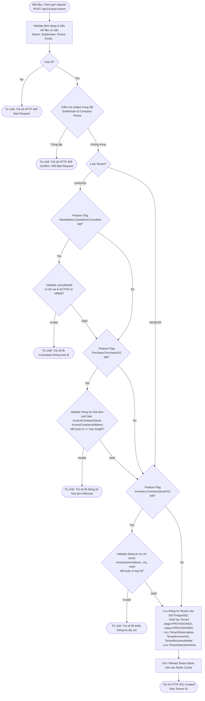

# Tenant Onboarding Activity Diagram

Sơ đồ mô tả chi tiết luồng xử lý và kiểm tra logic (gồm cả các Feature Flags) khi onboard một Tenant mới:

```mermaid
flowchart TD
    Start([Bắt đầu: Client gửi request POST /api/v1/saas-tenant]) --> Validation[Validate định dạng & kiểu dữ liệu cơ bản\nName, Subdomain, Phone, Email...]
    
    Validation --> IsValid{Hợp lệ?}
    IsValid -- No --> Reject400([Từ chối: Trả về HTTP 400 Bad Request])
    
    IsValid -- Yes --> CheckUnique{Kiểm tra unique trong DB\nSubdomain & Company Phone}
    CheckUnique -- Trùng lặp --> Reject409([Từ chối: Trả về HTTP 409 Conflict / 400 Bad Request])
    
    CheckUnique -- Không trùng --> CheckType{Loại Tenant?}
    
    %% Garage Flow
    CheckType -- GARAGE --> CheckConsultantFF{Feature Flag\nMarketplace:QuotationConsultant\nbật?}
    CheckConsultantFF -- Yes --> ValConsultant{Validate consultantId\ncó tồn tại & ACTIVE từ HRMS?}
    ValConsultant -- Invalid --> RejectConsultant([Từ chối: Trả về lỗi Consultant không hợp lệ])
    ValConsultant -- Valid --> CheckPurchaseFF
    CheckConsultantFF -- No --> CheckPurchaseFF{Feature Flag\nPurchase:PurchaseV02\nbật?}
    
    CheckPurchaseFF -- Yes --> ValInvoice{Validate thông tin hóa đơn:\ntaxCode, invoiceCompanyName,\ninvoiceCompanyAddress\nbắt buộc & <= max length?}
    ValInvoice -- Invalid --> RejectInvoice([Từ chối: Trả về lỗi thông tin hóa đơn thiếu/sai])
    ValInvoice -- Valid --> CheckInventoryFF
    CheckPurchaseFF -- No --> CheckInventoryFF
    
    %% Vendor Flow
    CheckType -- VENDOR --> CheckInventoryFF{Feature Flag\nInventory:InventoryStockV01\nbật?}
    
    %% Inventory Check
    CheckInventoryFF -- Yes --> ValInventory{Validate thông tin trụ sở chính:\ncompanyHoAddress, city, ward\nbắt buộc & hợp lệ?}
    ValInventory -- Invalid --> RejectInventoryLoc([Từ chối: Trả về lỗi thiếu thông tin địa chỉ])
    ValInventory -- Valid --> PersistDB
    CheckInventoryFF -- No --> PersistDB
    
    %% Persist and Cache
    PersistDB[Lưu thông tin Tenant vào DB PostgreSQL\n- Khởi tạo Tenant stage=PROVISIONED, status=PROVISIONED\n- Lưu TenantSubscription, TenantInvoiceInfo, TenantBusinessModel\n- Lưu TenantOperationArea] --> CacheRedis[Ghi / Reload Tenant Basic Info vào Redis Cache]
    CacheRedis --> ReturnSuccess([Trả về HTTP 201 Created\nkèm Tenant ID])
```
