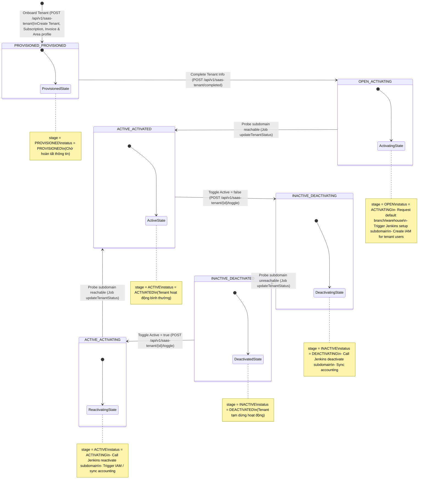

# Tenant Onboarding State Diagram

Sơ đồ mô tả chi tiết vòng đời và sự chuyển dịch trạng thái (`stage` và `status`) của Tenant:

```mermaid
stateDiagram-v2
    [*] --> PROVISIONED_PROVISIONED : Onboard Tenant (POST /api/v1/saas-tenant)\nCreate Tenant, Subscription, Invoice & Area profile

    state PROVISIONED_PROVISIONED {
        [*] --> ProvisionedState
        Note right of ProvisionedState: stage = PROVISIONED\nstatus = PROVISIONED\n(Chờ hoàn tất thông tin)
    }

    PROVISIONED_PROVISIONED --> OPEN_ACTIVATING : Complete Tenant Info (POST /api/v1/saas-tenant/completed)

    state OPEN_ACTIVATING {
        [*] --> ActivatingState
        Note right of ActivatingState: stage = OPEN\nstatus = ACTIVATING\n- Request default branch/warehouse\n- Trigger Jenkins setup subdomain\n- Create IAM for tenant users
    }

    OPEN_ACTIVATING --> ACTIVE_ACTIVATED : Probe subdomain reachable (Job updateTenantStatus)

    state ACTIVE_ACTIVATED {
        [*] --> ActiveState
        Note right of ActiveState: stage = ACTIVE\nstatus = ACTIVATED\n(Tenant hoạt động bình thường)
    }

    ACTIVE_ACTIVATED --> INACTIVE_DEACTIVATING : Toggle Active = false (POST /api/v1/saas-tenant/{id}/toggle)

    state INACTIVE_DEACTIVATING {
        [*] --> DeactivatingState
        Note right of DeactivatingState: stage = INACTIVE\nstatus = DEACTIVATING\n- Call Jenkins deactivate subdomain\n- Sync accounting
    }

    INACTIVE_DEACTIVATING --> INACTIVE_DEACTIVATED : Probe subdomain unreachable (Job updateTenantStatus)

    state INACTIVE_DEACTIVATED {
        [*] --> DeactivatedState
        Note right of DeactivatedState: stage = INACTIVE\nstatus = DEACTIVATED\n(Tenant tạm dừng hoạt động)
    }

    INACTIVE_DEACTIVATED --> ACTIVE_ACTIVATING : Toggle Active = true (POST /api/v1/saas-tenant/{id}/toggle)

    state ACTIVE_ACTIVATING {
        [*] --> ReactivatingState
        Note right of ReactivatingState: stage = ACTIVE\nstatus = ACTIVATING\n- Call Jenkins reactivate subdomain\n- Trigger IAM / sync accounting
    }

    ACTIVE_ACTIVATING --> ACTIVE_ACTIVATED : Probe subdomain reachable (Job updateTenantStatus)
```
