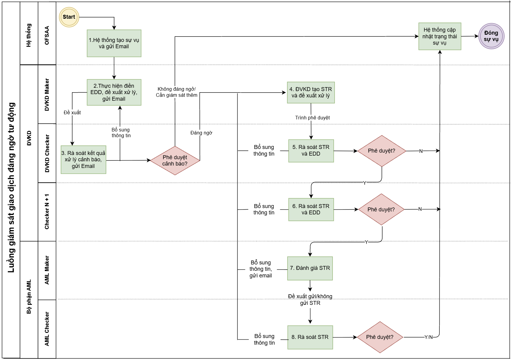
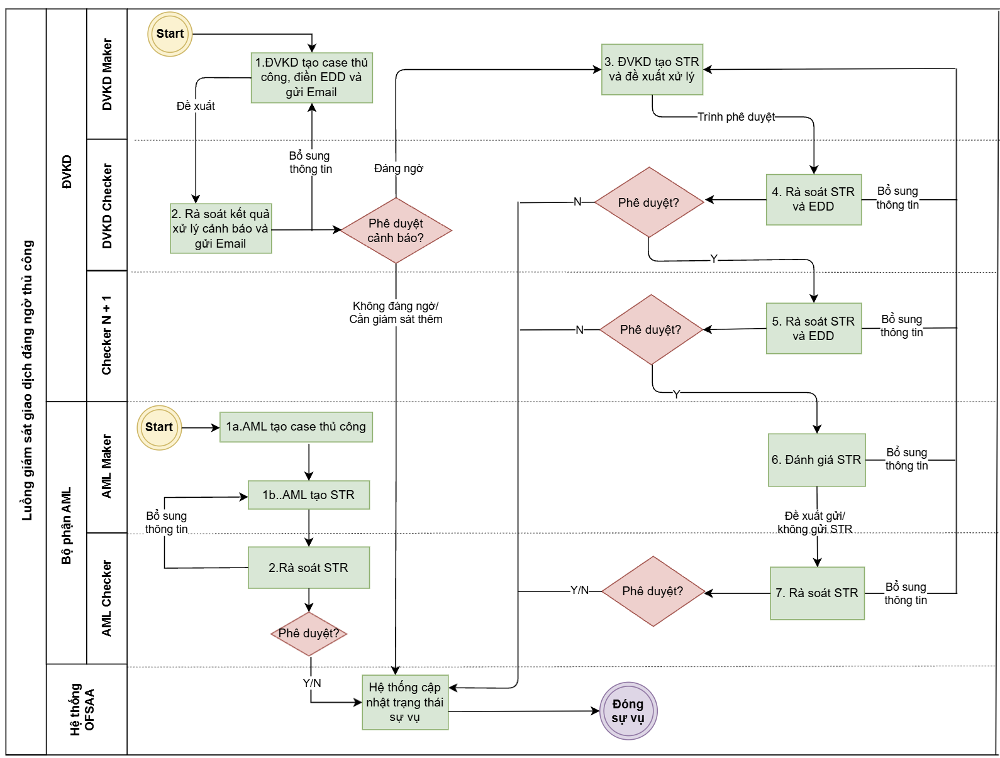
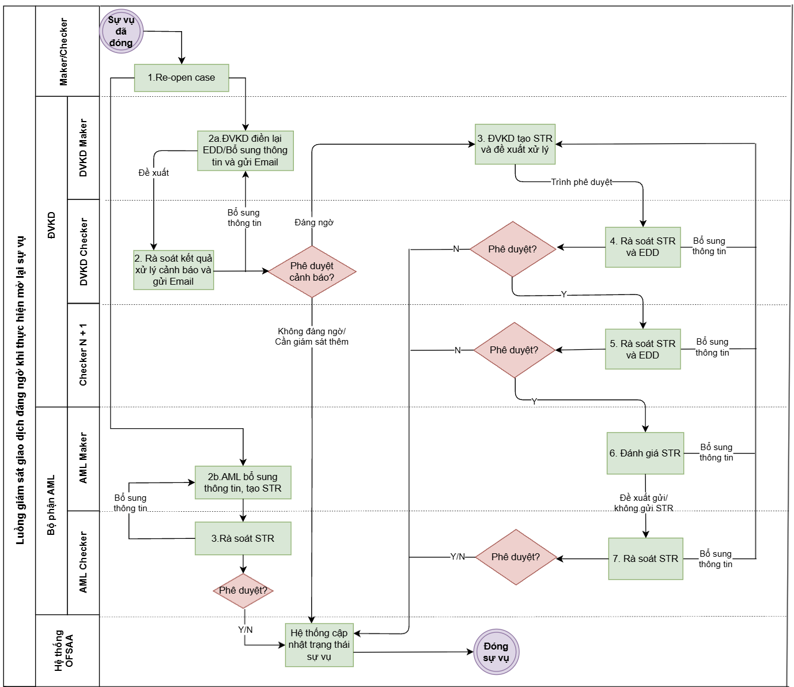

**TÀI LIỆU YÊU CẦU NGHIỆP VỤ BRD**

**MODULE TRANSACTION MONITORING (TM) – GIÁM SÁT GIAO DỊCH**

KHÁI NIỆM VÀ CÁC TỪ NGỮ VIẾT TẮT

| **Khái niệm** | **Mô tả** |
| --- | --- |
| MSB | Ngân hàng Thương Mại Cổ Phần Hàng Hải Việt Nam |
| OFSAA | Oracle Financial Services Analytical Applications – Hệ thống Phân tích dịch vụ tài chính của Oracle |
| SBV (NHNN) | Ngân hàng Nhà nước |
| TM | Transaction monitoring – Giám sát giao dịch |
| AML | Anti-Money Laundering – Phòng chống rửa tiền |
| PCRT | Phòng chống rửa tiền |
| STR | Suspicious Transaction Report – Báo cáo giao dịch đáng ngờ |
| RM | Chuyên viên quan hệ khách hàng |
| EDD | Quy trình thẩm định nâng cao |

**LỊCH SỬ TÀI LIỆU**

|  |  |  |
| --- | --- | --- |
| **Ngày** | **Nội dung** | **Phiên bản** |
| 27/04/2026 | Khởi tạo tài liệu | V1.0 |
| 19/05/2026 | Chỉnh sửa tài liệu | V1.1 |
| 23/06/2026 | Chỉnh sửa tài liệu | V1.2 |
| 27/06/2026 | Chỉnh sửa tài liệu | V1.3 |
| 03/07/2026 | Chỉnh sửa tài liệu | V1.4 |
| 13/07/2026 | Chỉnh sửa tài liệu | V1.5 |
| 23/07/2026 | Chỉnh sửa tài liệu | V1.6 |
| 04/08/2026 | Chỉnh sửa tài liệu | V1.7 |
| 18/08/2026 | Chỉnh sửa tài liệu | V1.8 |
| 30/09/2026 | Chỉnh sửa tài liệu | V1.9 |

# GIỚI THIỆU

## Mục đích và phạm vi tài liệu

Mục đích của tài liệu này là trình bày các yêu cầu nghiệp vụ của module Transaction Monitoring để triển khai trên hệ thống OFSAA tại Ngân hàng thương mại cổ phần Hàng hải Việt Nam.

## Đối tượng người đọc

Tài liệu này hướng tới các đối tượng người đọc sau:

* Trung tâm Công nghệ thông tin
* Đội dự án triển khai hệ thống Phòng chống rửa tiền của MSB
* Nhà thầu cung cấp, triển khai bản quyền phần mềm hệ thống AML mới.

# MÔ TẢ TỔNG QUAN

## Yêu cầu luồng nghiệp vụ

### Luồng hành trình giám sát giao dịch đáng ngờ tự động

* Lưu đồ mô tả luồng

* Diễn giải lưu đồ

| **Bước** | **Mô tả** | **Người thực hiện** | **Hành động** | **Trạng thái sự vụ sau khi hoàn thành tác vụ** |
| --- | --- | --- | --- | --- |
| 1 | **Cảnh báo phát sinh từ hệ thống**  Hệ thống tạo sự vụ và tự động gửi email theo mẫu EM-1 tới group email của Cán bộ quản lý KH (DVKH Maker), chuyển bước 2 | Hệ thống OFSAA | N/A | New |
| 2 | **Đề xuất xử lý cảnh báo**  DVKH Maker thực hiện điền, lưu bộ câu hỏi EDD (ấn “Save”) và đề xuất xử lý cảnh báo là “Đáng ngờ/ Không đáng giờ/ Cần giám sát thêm”, hệ thống tự động gửi email theo mẫu EM-2 tới DVKH Checker, chuyển tiếp bước 3  Thông tin bộ câu hỏi chi tiết tham chiếu *<<IV.Phụ lục - Phụ lục 3. Bộ câu hỏi EDD>>*  ***Lưu ý: đây là bước bắt buộc DVKH Maker phải thực hiện. DVKH Maker chỉ thao tác được khi đã ấn “Save” trên màn hình EDD*** | DVKH Maker | Recommend to Not suspicious/ Recommend to suspicious/ Recommend to Under monitoring  (Nhập thông tin EDD đã thu thập trên màn hình EDD) | Pending Checker Review |
| Trong trường hợp DVKH Maker nhận được yêu cầu bổ sung thông tin từ bước 3, DVKH Maker thực hiện bổ sung thông tin và trình duyệt lên DVKH Checker, chuyển tiếp bước 3 | Maker Add Information | Pending Checker Review |
| 3 | **Rà soát kết quả xử lý cảnh báo**  Sau khi nhận được email, DVKH Checker thực hiện rà soát và phê duyệt kết quả xử lý cảnh báo | DVKH Checker |  |  |
| - Trường hợp 1: Phê duyệt đánh giá sự vụ là “Không đáng ngờ”, hệ thống tự động thực hiện gửi email theo mẫu EM-4.1 đến DVKH Maker và đóng sự vụ, kết thúc luồng | Not suspicious | Closed - No Further Action |
| - Trường hợp 2: Phê duyệt đánh giá sự vụ là “Đáng ngờ”, hệ thống tự động thực hiện gửi email theo mẫu EM-3 đến DVKH Maker và *chuyển tiếp bước 4* | Suspicious | Pending Generate STR |
| - Trường hợp 3: Phê duyệt đánh giá sự vụ là “Cần giám sát thêm”, hệ thống tự động thực hiện gửi email theo mẫu EM-4.2 đến DVKH Maker, đóng sự vụ và kết thúc luồng. | Under monitoring | Closed - Under Monitoring |
| - Trường hợp 4: Yêu cầu bổ sung thông tin, hệ thống tự động thực hiện gửi email theo mẫu EM-5 đến DVKH Maker và quay lại bước 2 | Return to Maker | Pending Maker |
| 4 | **Tạo STR và đề xuất xử lý**  Khi DVKH Maker nhận được email từ DVKH Checker với thông tin đánh giá cảnh báo là “Đáng ngờ”, DVKH Maker sẽ thực hiện tạo STR, lưu thông tin STR (ấn “Save”).  Sau khi “Save” thông tin STR, hệ thống OFSAA sẽ gửi yêu cầu tới hệ thống nguồn thông tin của KH được tạo STR. Hệ thống nguồn nhận thông tin, tạo báo cáo theo yêu cầu và trả lại OFSAA đường dẫn lưu báo cáo. Người dùng ấn vào nút chức năng để tải báo cáo.  Sau khi hoàn thành các bước trên, người dùng thực hiện trình duyệt lên DVKH Checker, chuyển tiếp bước 5  Thông tin chi tiết về nhập màn hình STR tham chiếu *<<VI.Phụ lục - Phụ lục 6.1. Màn hình STR>>* | DVKH Maker | Create STR and Submit to Checker | Pending Checker Review STR |
| Trong trường hợp DVKH Maker nhận được yêu cầu bổ sung thông tin từ bước 5/6/7/8, DVKH Maker thực hiện bổ sung thông tin và trình duyệt lên DVKH Checker, *chuyển tiếp bước 5* | Maker Add Information | Pending Checker Review STR |
| 5 | **Checker rà soát thông tin và phê duyệt tạo STR, EDD**  - Trường hợp 1: Phê duyệt, người dùng bắt buộc phải thực hiện kiểm tra lại và ấn “Save” đối với EDD và STR trước khi thực hiện take action. Sau khi take action, hệ thống tự động <u>gửi tới</u> Checker N+1 <u>thông báo email theo mẫu EM-6,</u> *chuyển tiếp bước 6* | DVKH Checker | Checker Approve STR and EDD | Pending Supervisor Review |
| - Trường hợp 2:Từ chối phê duyệt, hệ thống tự động đóng sự vụ và kết thúc luồng | Close and Reject STR | Rejected sending STR |
| - Trường hợp 3: Yêu cầu bổ sung thông tin, *quay về bước 4* | Return to Maker | Pending Maker |
| 6 | **Checker N+1 rà soát thông tin và phê duyệt STR** | Checker N+1 |  |  |
| - Trường hợp 1: Phê duyệt, Checker N+ 1 bắt buộc phải thực hiện ấn “Submit” đối với EDD và STR trước khi thực hiện take action. Sau khi Take action, hệ thống tự động gửi email theo mẫu EM-7 đến AML Maker, *chuyển tiếp* *bước 7* | Supervisor Approve STR and EDD | Pending AML Maker |
| **-** Trường hợp 2: Từ chối phê duyệt STR, hệ thống tự động đóng sự vụ và kết thúc luồng | Close and Reject STR | Rejected sending STR |
| - Trường hợp 3: Yêu cầu bổ sung thông tin, *quay về bước 4* | Return to Maker | Pending Maker |
| **7** | **AML Maker đánh giá và đề xuất duyệt gửi STR**  Sau khi nhận được thông báo có STR qua email, AML Maker truy cập vào hệ thống để đánh giá và thực hiện: | AML Maker |  |  |
|  | - Trường hợp 1: Đề xuất không gửi STR, *chuyển tiếp bước 8* | Recommend Close and Not Send STR | Pending AML Checker review |
|  | - Trường hợp 2: Đề xuất gửi STR, *chuyển tiếp bước 8* | Recommend Close and send STR | Pending AML Checker review |
|  | - Trường hợp 3: Yêu cầu bổ sung thông tin, hệ thống thực hiện gửi email theo mẫu EM-8 đến DVKH Maker, *quay về bước 4* | Return to Maker | Pending Maker |
| 8 | **AML Checker rà soát và phê duyệt gửi STR** | AML Checker |  |  |
| - Trường hợp 1: Từ chối gửi STR, hệ thống tự động đóng sự vụ và kết thúc luồng | Closed and Not Send STR | Closed - Not Send STR |
| - Trường hợp 2: Phê duyệt gửi STR, hệ thống tự động đóng sự vụ và kết thúc luồng | Approve sending STR | Approved STR |
| - Trường hợp 3: Có nhu cầu bổ sung thông tin, quay về *bước 4* | Return to Maker | Pending Maker |

Note: Các mẫu email tham khảo III.6.  Chức năng Email thông báo tự động gắn với luồng nghiệp vụ

### Luồng nghiệp vụ giao dịch đáng ngờ từ đơn vị nghiệp vụ tạo thủ công

* Lưu đồ mô tả luồng

* Diễn giải lưu đồ chi tiết:

#### Trường hợp Đơn vị nghiệp vụ tạo sự vụ thủ công

| **Bước** | **Mô tả** | **Người thực hiện** | **Hành động** | **Trạng thái sự vụ sau khi hoàn thành tác vụ** |
| --- | --- | --- | --- | --- |
| 1 | **Đơn vị nghiệp vụ tạo sự vụ thủ công:**  DVKH Maker tạo sự vụ thủ công do tự nhận diện và thực hiện điền, lưu bộ câu hỏi EDD (ấn “Save”) , hệ thống gửi email theo mẫu EM-2 đến DVKH Checker, chuyển bước 2  Thông tin bộ câu hỏi chi tiết tham chiếu *<<IV.Phụ lục - Phụ lục 3. Bộ câu hỏi EDD>>*  ***Lưu ý: đây là bước bắt buộc DVKH Maker phải thực hiện. DVKH Maker chỉ thao tác được khi đã ấn “Save” trên màn hình EDD*** | DVKH Maker | Create Case | Pending Checker Review |
|  | Trong trường hợp DVKH Maker nhận được yêu cầu bổ sung thông tin từ bước 2, DVKH Maker thực hiện bổ sung thông tin và trình duyệt lên DVKH Checker, chuyển tiếp bước *2* |  | Maker Add Information | Pending Checker Review |
| 2 | **Rà soát kết quả xử lý cảnh báo**  Sau khi nhận được email, DVKH Checker thực hiện rà soát và phê duyệt kết quả xử lý cảnh báo | DVKH Checker |  |  |
| - Trường hợp 1: Phê duyệt đánh giá sự vụ là Không đáng ngờ, hệ thống tự động gửi email theo mẫu EM-4.1 đến DVKH Maker, đóng sự vụ và kết thúc luồng | Not suspicious | Closed - No Further Action |
| - Trường hợp 2: Phê duyệt đánh giá sự vụ là Đáng ngờ, hệ thống tự động gửi email theo mẫu EM-3 đến DVKH Maker, chuyển tiếp bước 3 | Suspicious | Pending Generate STR |
| - Trường hợp 3: Phê duyệt đánh giá sự vụ là Cần giám sát thêm, hệ thống tự động gửi email theo mẫu EM-4.2 đến DVKH Maker, đóng sự vụ và kết thúc luồng | Under monitoring | Closed - Under Monitoring |
| - Trường hợp 4: Yêu cầu bổ sung thông tin, hệ thống tự động gửi email theo mẫu EM-5 đến DVKH Maker, quay lại bước 1 |  | Return to Maker | Pending Maker |
| 3 | **Tạo STR và đề xuất xử lý**  DVKH Maker thực hiện tạo STR, lưu thông tin STR (ấn “Save”) sau đó trình duyệt lên DVKH Checker, chuyển tiếp *bước 4*  Thông tin chi tiết về nhập màn hình STR tham chiếu *<<VI.Phụ lục - Phụ lục 6.1. Màn hình STR>>*  ***Lưu ý: đây là bước bắt buộc DVKH Maker phải thực hiện. DVKH Maker chỉ thao tác được khi đã ấn “Save” trên màn hình STR*** | DVKH Maker | Create STR and Submit to Checker | Pending Checker Review STR |
| Trong trường hợp DVKH Maker nhận được yêu cầu bổ sung thông tin từ bước 4/5/6/7, DVKH Maker thực hiện bổ sung thông tin và trình duyệt lên DVKH Checker, chuyển tiếp bước 4 | Maker Add Information | Pending Checker Review STR |
| 4 | **Checker rà soát thông tin và phê duyệt tạo STR** | DVKH Checker |  |  |
| - Trường hợp 1: Phê duyệt tạo STR, người dùng bắt buộc phải thực hiện kiểm tra lại và ấn “Save” đối với EDD và STR trước khi thực hiện take action. Sau khi take action, hệ thống tự động <u>gửi email theo mẫu EM-6 đến Checker N+1,</u> chuyển tiếp bước 6 | Checker Approve STR and EDD | Pending Supervisor Review |
| - Trường hợp 2:Từ chối phê duyệt STR, hệ thống đóng sự vụ và kết thúc luồng | Close and Reject STR | Rejected sending STR |
| - Trường hợp 3: Yêu cầu bổ sung thông tin, quay về bước 3 | Return to Maker | Pending Maker |
| 5 | **Checker N+1 rà soát và phê duyệt STR** | Checker N+1 |  |  |
| - Trường hợp 1: Phê duyệt,Checker N+ 1 bắt buộc phải thực hiện ấn “Submit” đối với EDD và STR trước khi thực hiện take action. Sau khi Take action, hệ thống gửi thông báo email theo mẫu EM-7 đến AML Maker, chuyển tiếp bước 6 | Supervisor Approve STR and EDD | Pending AML Maker |
| - Trường hợp 2: Từ chối phê duyệt STR, hệ thống đóng sự vụ và kết thúc luồng | Close and Reject STR | Rejected sending STR |
| - Trường hợp 3: Yêu cầu bổ sung thông tin, quay về bước 3 | Return to Maker | Pending Maker |
| 6 | **AML Maker phân tích và đề xuất duyệt gửi STR**  Sau khi nhận được thông báo có STR qua email, AML maker truy cập vào hệ thống để phân tích và thực hiện: |  |  |  |
| - Trường hợp 1: Đề xuất không gửi STR, chuyển tiếp *bước 7* | AML Maker | Recommend Close and Not Send STR | Pending AML Checker review |
| - Trường hợp 2: Đề xuất gửi STR, chuyển tiếp *bước 7* |  | Recommend Close and send STR | Pending AML Checker review |
| - Trường hợp 3: Yêu cầu bổ sung thông tin, hệ thống gửi thông báo email theo mẫu EM-8 đến DVKH Maker, quay về *bước 3* |  | Return to Maker | Pending Maker |
| 7 | **AML Checker rà soát và phê duyệt gửi STR** | AML Checker |  |  |
| - Trường hợp 1: Từ chối gửi STR, hệ thống đóng sự vụ và kết thúc luồng | Closed and Not Send STR | Closed - Not Send STR |
| - Trường hợp 2: Phê duyệt gửi STR, hệ thống đóng sự vụ và kết thúc luồng | Approve sending STR | Approved STR |
| - Trường hợp 3: Yêu cầu bổ sung thông tin, quay về bước 3 | Return to Maker | Pending Maker |

Note: Các mẫu email tham khảo III.6.  Chức năng Email thông báo tự động gắn với luồng nghiệp vụ

#### Trường hợp Bộ phận AML tạo sự vụ thủ công

| **Bước** | **Mô tả** | **Người thực hiện** | **Hành động** | **Trạng thái sự vụ sau khi hoàn thành tác vụ** |
| --- | --- | --- | --- | --- |
| 1a | **Bộ phận AML tạo sự vụ thủ công:**  Cán bộ tạo sự vụ thủ công do tự nhận diện, chuyển bước 1b | AML Maker | Create Case | Pending Generate STR |
| 1b | Thực hiện tạo STR, bắt buộc phải thực hiện ấn “Save” đối với STR trước khi thực hiện take action. Sau khi Take action, hệ thống chuyển trạng thái, chuyển bước 2  Thông tin chi tiết về nhập màn hình STR tham chiếu *<<VI.Phụ lục - Phụ lục 6.1. Màn hình STR>>* | Create STR and Submit to Checker | Pending AML Checker review |
| 2 | **AML Checker rà soát và phê duyệt gửi STR** | AML Checker |  |  |
| - Trường hợp 1: Từ chối gửi STR, hệ thống đóng sự vụ và kết thúc luồng | Closed and Not Send STR | Closed - Not Send STR |
| - Trường hợp 2: Phê duyệt gửi STR, bắt buộc phải thực hiện ấn “Submit” đối với STR trước khi thực hiện take action. Sau khi Take action, hệ thống đóng sự vụ và kết thúc luồng | Approve sending STR | Approved STR |
| - Trường hợp 3: Yêu cầu bổ sung thông tin, quay về bước 1 | Return to Maker | Pending AML Maker |

### Luồng thực hiện re-open case

* Lưu đồ mô tả luồng

* Diễn giải lưu đồ

| **Bước** | **Mô tả** | **Người thực hiện** | **Hành động** | **Trạng thái sự vụ sau khi hoàn thành tác vụ** |
| --- | --- | --- | --- | --- |
| 1 | Khi có user thực hiện mở lại sự vụ (re-open case) đã được đóng (Case ở các trạng thái: Closed - No Further Action/ Closed - Under Monitoring/ Closed - Not Send STR/ Approved STR/ Rejected sending STR) |  |  |  |
| 1a | *Trường hợp Case ban đầu phát sinh từ hệ thống/Case thủ công được tạo bởi DVKH maker:*  Hệ thống chuyển trạng thái case và tự động gửi email theo mẫu EM-9 tới DVKH maker ban đầu xử lý case và group email của DVKH Checker, chuyển bước 2 | DVKH Checker/DVKH Checker N+1 | Re-open | Pending Maker |
| 1b | *Trường hợp Case thủ công được tạo bởi AML maker:*  Hệ thống chuyển trạng thái case, chuyển bước 2 | AML checker | Re-open | Pending AML Maker |
| 2 | **Đề xuất xử lý cảnh báo** |  |  |  |
| 2a | *Trường hợp Case ban đầu phát sinh từ hệ thống/Case thủ công được tạo bởi DVKH maker*  Khi nhận được thông báo case do DVKH Maker từng xử lý được re-open DVKH Maker thực hiện xử lý cảnh báo theo đúng luồng như ban đầu.  DVKH Maker thực hiện điền lại bộ câu hỏi EDD và/hoặc bổ sung thêm thông tin/tài liệu, người dùng bắt buộc phải ấn “Save” thông tin EDD trước khi take action.  Đề xuất xử lý cảnh báo là “Đáng ngờ/ Không đáng giờ/ Cần giám sát thêm” và gửi thông báo email EM-2 tới DVKH Checker, chuyển tiếp *bước 3*  Thông tin bộ câu hỏi chi tiết tham chiếu *<<IV.Phụ lục - Phụ lục 3. Bộ câu hỏi EDD>>* | DVKH Maker | Recommend to Not suspicious/ Recommend to suspicious/ Recommend to Under monitoring | Pending Checker Review |
| 2b | *Trường hợp Case thủ công được tạo bởi AML maker:*  AML Maker thực hiện tạo STR và bổ sung thêm thông tin/tài liệu, người dùng bắt buộc phải ấn “Save” thông tin STR trước khi take action, chuyển bước 3 | AML maker | Create STR and Submit to Checker | Pending AML Checker review |
| 3 | Các bước tiếp theo thực hiện tương tự luồng giám sát giao dịch ở mục II.1.1 và II.1.2, cụ thể:  - Trường hợp Case ban đầu phát sinh từ hệ thống: thực hiện tương tự các bước từ 3 -> 8 (mục II.1.1)  - Trường hợp Case ban đầu là Case thủ công được tạo bởi DVKH maker: thực hiện tương tự các bước từ 3 -> 7 (mục II.1.2)  - Trường hợp Case ban đầu là Case thủ công được tạo bởi AML maker: thực hiện tương tự bước 2 (mục II.1.2) |  |  |  |

# *Lưu ý: Hiện tại không giới hạn số lần Re-open case.*

# YÊU CẦU CHI TIẾT CHỨC NĂNG

## Quản lý kịch bản (Scenario Management)

Phân hệ cho phép người dùng định nghĩa và duy trì các **kịch bản phát hiện hành vi** dùng để phát sinh cảnh báo AML, đồng thời **cấu hình các tham số và ngưỡng** điều khiển logic phát hiện của từng kịch bản.

### Tạo mới kịch bản

**Hệ thống cho phép người dùng tạo mới kịch bản gồm các thông tin:**

* **Thông tin chung: Mã kịch bản, Tên kịch bản, Loại kịch bản (theo chuỗi hành vi hoặc theo điều kiện ràng buộc), Đối tượng giám sát, Mô tả và mục tiêu kịch bản.**
* **Thông tin chi tiết: Cơ chế tạo cảnh báo, xác định dữ liệu mà kịch bản cần sử dụng để tính toán và hiển thị thông tin, định nghĩa các quy tắc lọc loại trừ/bao gồm dữ liệu.**

### Cấu hình tham số/thông số kịch bản theo khẩu vị rủi ro

* **Mỗi kịch bản đều được gắn với ngưỡng giá trị cụ thể, cho phép định nghĩa tập các tham số ngưỡng như: Giá trị tiền, số lượng giao dịch, phần trăm, tần suất, độ trễ, vùng địa lý;**
* **Có thể cấu hình các mức rủi ro khác nhau như High Risk (HR), Medium Risk (MR), Regular Risk (RR) với các giá trị tham số khác nhau;**
* **Cấu hình vận hành: Thông tin chi tiết hiển thị trong cảnh báo, Tần suất chạy kịch bản, Khoảng thời gian giám sát.**

### Chỉnh sửa kịch bản

* **Hệ thống cho phép chỉnh sửa: các giá trị ngưỡng, Tần suất chạy kịch bản, Khoảng thời gian giám sát, ngưỡng rủi ro.**
* **Không thể chỉnh sửa một số thông tin định** danh: ID, Trạng thái hoạt động, Loại của kịch bản.

## Whitelist

Danh sách trắng (Whitelist) được sử dụng để loại bỏ đối tượng ra khỏi phạm vi quét của một kịch bản bất kì. Khi một đối tượng (Khách hàng/ tài khoản) nằm trong whitelist của một kịch bản, đối tượng đó sẽ không bị quét bởi kịch bản và không tạo case.

Danh sách whitelist được quản trị theo kịch bản mà MSB sử dụng. Theo đó, mỗi whitelist sẽ tương ứng với một kịch bản.

Danh sách whitelist gồm các trường thông tin như sau:

| **Tên trường nhập** | **~~Mô tả trường~~** | **Loại dữ liệu** | **Bắt buộc (M)/Tùy chọn (O)** | **Độ dài** | **Mô tả** |
| --- | --- | --- | --- | --- | --- |
| List Code (\*) | ~~Mã whitelist~~ | String | M |  | Là mã whitelist được sử dụng để nhận biết đối tượng thuộc danh sách whitelist nào trong các danh sách whitelist đang tồn tại trong hệ thống.  Hệ thống sẽ tự sinh theo nguyên tắc: ~~Mã kịch bản +~~ STT tự sinh |
| ID (\*) | ~~Mã perg của KH~~ | String | M | 50 | Là mã định danh của Khách hàng, loại thông tin ở trường này phụ thuộc trường ID type. Ví dụ:  - ID type là Account, thông tin ID là Số tài khoản,  - ID type là Customer, thông tin ID là CIF khách hàng |
| ID Type (\*) | ~~Loại đối tượng~~ | String | M | 50 | Trường phân loại của đối tượng. (gán theo đối tượng giám sát của từng kịch bản được loại trừ, ví dụ: Customer, Account) |
| Application scenario | ~~Mã – tên kịch bản~~ | String | M | 500 | Trường thông tin xác định ID sẽ được loại ra khỏi phạm vi quét của kịch bản nào (drop list theo danh sách mã kịch bản) |
| Status | ~~Hiệu lực của danh sách~~ | String | M |  | Trường thông tin thể hiện trạng thái hiệu lực của đối tượng được loại trừ, gồm 2 trạng thái:  Active: Đối tượng có hiệu lực và được sử dụng để quét.  Deactivated: Đối tượng không có hiệu lực và không được sử dụng để quét. |
| Reason Added | ~~Nguyên nhân tạo mới đối tượng~~ | String | O | 500 | Trường này được nhập free-text, dùng để nhập thông tin nguyên nhân tạo mới đối tượng. |
| Effective date | ~~Ngày hiệu lực~~ | Date | Không cho phép nhập |  | Trường ghi nhận ngày đối tượng được tạo mới trong danh sách (Ngày mà cấp supervisor phê duyệt cho việc tạo đối tượng mới).  Trường thông tin này được hệ thống tự sinh. Format: DD/MM/YYYY |
| Description | ~~Mô tả đối tượng~~ | String | O | 500 | Trường nhập free-text, dùng để mô tả đối tượng |
| Comment | ~~Ghi chú đối với đối tượng~~ | String | O | 500 | Trường nhập free-text, dùng để ghi chú thêm thông tin đối với đối tượng |

Hệ thống hỗ trợ người dùng thực hiện quản trị các đối tượng whitelist theo luồng 2 cấp gồm người thao tác (Analyst) và người phê duyệt (Supervisor). Cụ thể các thao tác người dùng có thể thực hiện bao gồm:

| ~~Thao tác~~ | ~~Mô tả~~ |
| --- | --- |
| ~~Tạo mới~~ | ~~Tạo mới đối tượng trong whitelist~~ |
| ~~Sửa~~ | ~~Chỉnh sửa thông tin của đối tượng trong whitelist~~ |
| ~~Xóa~~ | ~~Xóa đối tượng trong whitelist~~ |

* Hệ thống tạo mới/ chỉnh sửa/xóa đối tượng trong whitelist trên màn hình hoặc bằng cách tải file Excel (theo định dạng yêu cầu cụ thể của hệ thống) chứa thông tin các đối tượng để thêm vào danh sách whitelist.
* Trong trường hợp chỉnh sửa dữ liệu whitelist, nếu bản ghi ở file Excel mới tải lên có thông tin các trường Key không giống với các trường Key của các bản ghi đã tồn tại thì sẽ sinh bản ghi mới. Ngược lại, sẽ cập nhật những trường thông tin còn lại theo bản ghi mới import.
* List code hệ thống tự sinh sẽ gắn duy nhất với một bản ghi. Trong trường hợp bản ghi đã bị xóa nhưng sau được thêm lại vào danh sách whitelist thì vẫn gắn với List code hệ thống sinh lần đầu.
* Hệ thống thực hiện kiểm tra trùng lặp dựa vào các trường (trường Key) của đối tượng trong Whitelist gồm 02 trường: ID, ID Type, Application scenario.
* Khi thực hiện tải dữ liệu đối tượng mới trong Whitelist, trong trường hợp upload file Excel bị lỗi, hệ thống thông báo lỗi (khi không đủ thông tin các trường bắt buộc) và toàn bộ file sẽ không được upload lên và sẽ yêu cầu upload lại file.
* Sau khi thực hiện upload dữ liệu hoặc xóa bản ghi trên màn hình, hệ thống chạy tổng hợp kết quả theo tần suất MSB cập nhật và gửi kết quả cập nhật (thông báo qua email theo mẫu EM-10 ở << *Phụ lục 5. MSB\_Template Email TM* >>) danh sách bao gồm các thông tin so sánh được sự thay đổi giữa từng lần cập nhật: Số lượng bản ghi/đối tượng trước khi thay đổi; Số lượng bản ghi/đối tượng sau khi thay đổi; Số lượng bản ghi thay đổi của danh sách mới so với danh sách cũ (thêm mới (khi upload excel) /xóa (khi xóa bản ghi trên màn hình)).

* ~~Thao tác đơn lẻ với từng bản ghi~~
* ~~Thao tác với nhiều bản ghi cùng lúc~~
* Việc tạo mới/ chỉnh sửa/xóa đối tượng trong whitelist thực hiện bởi người dùng được phân quyền tại bất kì thời điểm nào trong ngày và cần được phê duyệt trước thời điểm chạy batch kịch bản hàng ngày lần tiếp theo.

## Quản lý Case (Case Management)

### CM-1: Khởi tạo case

Mục đích tính năng: Hệ thống sẽ khởi tạo case cho phép người dùng điều tra các trường hợp cần điều tra do HIT qua các kịch bản, hoặc người dùng có thể tạo thêm case để điều tra các đối tượng cần điều tra bổ sung.

Case hiển thị có thể được khởi tạo theo 2 cách:

* + - * Khởi tạo bởi hệ thống sau khi chạy kịch bản;
      * Khởi tạo thủ công bởi người dùng

#### CM – 1.1: Case khởi tạo bởi hệ thống sau khi chạy kịch bản

* + - * Một khách hàng có hành vi giao dịch trùng khớp (HIT) với nguyên tắc và 1 bộ tham số của một kịch bản gọi là 1 Event. Một khách hàng có thể HIT với nhiều kịch bản được thiết lập, tức là một khách hàng có thể tạo ra nhiều Event trên hệ thống.
      * Hệ thống tự động tạo case theo cơ chế tổng hợp các Event của cùng 1 khách hàng sinh ra trong cùng 01 ngày lại thành 01 Case.

#### CM – 1.2: Case khởi tạo thủ công bởi người dùng

~~Ngoài case được tạo từ việc chạy kịch bản theo yêu cầu,~~ Hệ thống cho phép người dùng tạo case thủ công. Cụ thể như sau:

* Case ID được hệ thống sinh tự động: Chỉ các người dùng được phân quyền xử lý case của nghiệp vụ TM mới có thể tạo case thủ công với nhóm case type của TM, trong đó case type của TM là ‘AML’.
* Hệ thống cần cho phép người dùng nhập thông tin cơ bản của case bao gồm:

| **Tên trường** | **Mô tả trường** | **Bắt buộc (M)/Tùy chọn (O)** | **Cách thức nhập** |
| --- | --- | --- | --- |
| **Type** | Loại case | M | Chọn giá trị trong drop-down list bao gồm các giá trị:  AML\_MN |
| **Title** | Tên case | O | Trường free text |
| **Jurisdiction** | Chi nhánh (theo định nghĩa là Oracle) | M | Default: All |
| **Business domain** | Khối/Phòng/Ban | M | Default: All |
| **Priority** | Thứ tự ưu tiên | O | Chọn giá trị trong drop-down list (Bao gồm 3 giá trị: High/Medium/Low) |
| **Due** | Ngày đến hạn case | O | Date (MM/DD/YYYY) |
| **Owner** | User owner của case | M | Chọn giá trị trong drop-down list |
| **Assignee** | User được chỉ định xử lý case | M | Chọn giá trị trong drop-down list |
| **Created By** | User tạo case | M | Chọn giá trị trong drop-down list |
| **Description** | Mô tả case | M | Trường free-text |

* Hệ thống hỗ trợ người dùng tìm kiếm/tạo thông tin của giao dịch để gán với case thủ công. Thông tin giao dịch gồm: Transaction ID, Transaction type, Transaction base amount, Transaction date, Party ID,…

### CM-2: Tìm kiếm case

#### ~~CM - 2.2: Tính năng tìm kiếm cảnh báo~~

Người dùng có thể thực hiện tìm kiếm các case phát sinh thông qua màn hình search theo các tiêu chí sẵn có của hệ thống, ví dụ một số tiêu chí sau:

| **Trường** | **Định dạng** | **Mô tả** |
| --- | --- | --- |
| Case ID |  |  |
| Event ID |  |  |
| Created From, To | Date picker | Khoảng ngày case được tạo |
| Age | Textbox | Tuổi của case  Lựa chọn: “<=”; “=” và “>=”  Sau đó nhập số ngày – khoảng thời gian cần tìm kiếm.  Ví dụ: “<= 3” |
| Class | Droplist | Phân loại case   * AML |
| Type | Droplist | Lựa chọn trong drop-down list cho tiêu chí case thuộc loại nào. Ví dụ:   * AML\_MN (Case thủ công) * AML\_SURV (Case tự động) |
| Jurisdiction | Droplist | Mặc định: All |
| Business Domain | Droplist | Mặc định: All |
| Status | Droplist | Lọc theo trạng thái của case – có thể lọc nhiều tiêu chí cùng lúc |
| Creared by | Droplist |  |
| Entity type | Droplist |  |
| Entity ID | Text box | ID khách hàng |
| Entity Name | Text box | Tên khách hàng |
| Branch | Droplist | Chi nhánh |
| Assignee | Droplist | User đang xử lý case |
| Title | Text box | Điền tên case cần tìm  Hệ thống cho phép tìm kiếm theo ký tự con chứa trong 1 Title dài bằng cách thêm dấu “%”. Ví dụ, nếu người dùng nhập ‘%AML%’, hệ thống sẽ tìm kiếm tất cả các case có tên chứa ‘AML’ như AML123, AMLMSBBANK… |
| Scenario | Droplist | Lựa chọn trong drop-down list bao gồm danh sách các kịch bản  Có thể chọn 1 hoặc nhiều kịch bản từ drop-down list |
| Description | Text box | Điền thông tin mô tả của case. Hệ thống cho phép tìm kiếm theo ký tự đại diện bằng cách thêm dấu “%” (tương tự trường ‘Title’) |
| Identification  number | Text box | Số giấy tờ tùy thân của khách hàng  Khi chọn Type: AML\_MN, AML\_SURV |

Sau khi tìm kiếm sẽ hiển thị chi tiết các case theo kết quả tìm kiếm.

### CM-3: Hiển thị thông tin case

Trên màn hình hiển thị chi tiết cảnh báo có một nút “MSB Guideline” cho phép NSD xem một file tài liệu Hướng dẫn xử lý AML đính kèm.

* Nội dung file Hướng dẫn do MSB cung cấp
* NSD có thể thay đổi file theo quy định của từng thời kì bằng cách upload lên server của hệ thống

#### CM - 3.1: Yêu cầu màn hình thông tin tổng hợp case

* Danh sách cảnh báo liệt kê các trường hợp case phát sinh tự động, case thủ công. Từ đó người dùng truy cập có thể thực hiện các bước xử lý case theo luồng nghiệp vụ.
* Hệ thống hiển thị tối thiểu bao gồm thông tin sau:

| **Trường** | **Mô tả** |
| --- | --- |
| Case ID | Mã định danh duy nhất của case.  Loại Hyperlink điều hướng người dùng đến trang Case Summary để xem thông tin chi tiết của case. |
| Title | Tên của case |
| Type | Loại case: gồm AML\_MN, AML\_SURV |
| Due Date | Thời hạn xử lý case.  **Format:** MM/DD/YYYY |
| Priority | Mức độ ưu tiên của case sau khi đã được tạo(Bao gồm 3 giá trị: High/ Medium/Low) |
| Status | Trạng thái hiện tại của case (gồm các trạng thái được mô tả trong luồng nghiệp vụ) |
| Owner | Tên người dùng hoặc nhóm người dùng sở hữu case |
| Assigned to | Tên người dùng hoặc nhóm người dùng được chỉ định xử lý case |
| Created | Thời gian case được tạo  **Format:** MM/DD/YYYY hh:mm:ss |
| Jurisdiction | Mặc định: All |
| Business Domain | Mặc định: All |

#### CM - 3.2: Yêu cầu hiển thị thông tin chi tiết case

Trong màn hình Case List, khi người dùng click vào 1 Case ID, hệ thống hiển thị màn hình thể hiện thông tin chi tiết case (Case Details). Thông tin chi tiết được hiển thị trên màn hình theo các nhóm sau:

* Thông tin tổng quan của case: Case ID, Title, Status, Priority
* Thông tin chi tiết của Event: hiển thị danh sách các Event (HIT kịch bản). Thông tin chi tiết được chia làm hai phần chính: Event List và Event Details.
* Event list hiển thị tối thiểu bao gồm các trường thông tin: Event ID, Loại đối tượng, Mã khách hàng, tên đối tượng trong event, tên kịch bản, ngày tạo event, Highlight của event (được set up theo kịch bản), Ngày event được promote, Trạng thái của event.
* Event Details: Hiển thị các thông tin chi tiết liên quan đến các event bị HIT trong case.
* Thông tin chi tiết của tài khoản bao gồm: Số tài khoản, tên tài khoản, status, loại chủ sở hữu
* Thông tin chi tiết của khách hàng: Loại khách hàng, tên khách hàng, Số GTTT/ĐKKD, mã khách hàng (CIF), địa chỉ, số điện thoại, email, số tài khoản, điểm rủi ro của khách hàng.
* Thông tin chi tiết các giao dịch: Ngày giao dịch, loại giao dịch, số tiền giao dịch, Đơn vị tiền tệ, thông tin của bên đối ứng,…

### CM-4: Điều phối và phân công xử lý case

* Khi hệ thống phát sinh sự vụ (case), case sẽ được tự động phân công cho nhóm user gán quyền case type của TM. User đầu tiên trong nhóm thực hiện mở case sẽ được gán làm người xử lý của case đó.
* Khi user thực hiện tạo case thủ công, trường thông tin Assign sẽ được gán cho user tạo case.
* Các user thuộc cùng một nhóm quyền sẽ được thực hiện thao tác giống nhau.

### CM-5: Đánh giá và xử lý case

* Để thực hiện đánh giá, người dùng lựa chọn nút chức năng “Take Action” trên màn hình Case ECM.
* Hệ thống cần yêu cầu người dùng nhập Comment trước khi hoàn thành “Take Action”.
* Hệ thống cho phép người dùng đính kèm file không giới hạn trong quá trình đánh giá tổng thể cảnh báo với những File có dung lượng không quá 9 MB và các định dạng attach file gồm word, excel, text, PDF.

### CM-6: Gửi email/ thông báo liên quan đến case thủ công (Send Email/RFI)

* Hệ thống cho phép người dùng thực hiện gửi email để tư vấn xử lý case
* Với tính năng gửi email, hệ thống cho phép gửi email chỉ theo 1 chiều đi và không có chiều nhận phản hồi về
* Khi người dùng chọn tính năng này, hệ thống cần yêu cầu người dùng nhập thông tin cho các trường sau:

| **Tên trường** | **Nội dung** |
| --- | --- |
| From | Mặc định hiển thị 1 email gửi đối với tất cả các case. |
| To | Nhập free-text email người nhận (cho phép người dùng có thể giới hạn domain trong trường hợp có nhu cầu)  Hệ thống cho phép gửi email tới nhiều người nhận, mỗi email được phân cách bằng dấu phẩy “,” và không có dấu cách. |
| Cc | Nhập email người nhận gián tiếp. |
| Subject | Cho phép nhập free-text Tiêu đề liên quan đến case |
| Attach | Cho phép đính kèm file Word, Excel, pdf, hình ảnh hoặc audio |
| Include Case Details | Hệ thống cho phép gửi kèm chi tiết case |
| Email content | Cho phép nhập free-text - nội dung về case muốn gửi email |

* Nội dung email đã gửi sẽ được lưu lại trên hệ thống OFSAA

### CM-7: Ghi chú, bình luận và đính kèm tài liệu

* **Mục đích tính năng:** Trong trường hợp phát sinh nhu cầu đính kèm giấy tờ hoặc hồ sơ cho một hoặc nhiều case, người dùng có thể lựa chọn thêm Ghi chú, bình luận và đính kèm file (Số lượng file ko có giới hạn, phụ thuộc vào hạ tầng cung cấp; dung lượng 1 file tối đa có thể điều chỉnh, hiện hệ thống đang setup 10MB hoặc theo nhu cầu điều chỉnh của MSB từng thời kỳ).
* Hệ thống cần có tối thiểu các trường thông tin: Loại hồ sơ/giấy tờ, Ghi chú tiêu chuẩn (theo mẫu có sẵn), Ghi chú/bình luận nhập thủ công, Ghi chú/bình luận đính kèm cùng file.

### CM-8: Lưu vết kiểm toán (Audit Trail)

* **Mục đích tính năng:** Cho phép người dùng xem lịch sử các hành động đã thực hiện lên case.
* Hệ thống cần có tối thiểu các trường thông tin: Tên người dùng, Thời gian thực hiện (ngày, giờ), Hành động đối với case, Người tạo case, Người xử lý hiện tại, Trạng thái của case, Comment, Thời hạn xử lý case.

## Danh sách kịch bản giám sát

Các kịch bản sử dụng cho nghiệp vụ TM sẽ được trình bày bao gồm các nội dung chính:

* Tên kịch bản
* Mô tả và Mục tiêu kịch bản
* Phạm vi kịch bản:
* Chiều giám sát
* Phạm vi khách hàng
* Loại tài khoản
* Loại giao dịch giám sát
* Điều kiện cảnh báo
* Thời gian thực hiện cảnh báo:
* Tần suất chạy kịch bản
* Khoảng thời gian giám sát
* Các điều kiện của kịch bản

Nội dung chi tiết của từng kịch bản như sau:

### AML-01: Giao dịch có rủi ro cao: Khu vực địa lý có rủi ro cao

| **Mục** | **Nội dung** |
| --- | --- |
| **Mô tả và Mục tiêu kịch bản** | Xác định các khách hàng thực hiện các giao dịch thông qua Tài khoản thanh toán liên quan đến các khu vực địa lý được xác định có mức độ rủi ro cao theo chính sách PCRT từng thời kỳ |
| **Phạm vi kịch bản** | |
| **Chiều giám sát** | Khách hàng |
| **Phạm vi khách hàng** | Khách hàng cá nhân, Khách hàng tổ chức. |
| **Loại tài khoản** | Tài khoản thanh toán |
| **Loại giao dịch giám sát** | Bao gồm các giao dịch được ghi nhận trên Tài khoản thanh toán. Loại trừ:   * Giao dịch trả lãi/phí * Giao dịch bị hủy |
| **Điều kiện cảnh báo** | |
| **Thời gian thực hiện cảnh báo** | |
| **Tần suất chạy kịch bản** | 7 ngày |
| **Khoảng thời gian giám sát** | 14 ngày (từ ngày T-14 đến T-1) |
| **Các điều kiện của kịch bản** | |
| Điều kiện 1: Tổng giá trị giao dịch (ghi Nợ và ghi Có) với khu vực địa lý có rủi ro cao trong chu kỳ ≥ 1 tỷ VND (giá trị quy đổi) VÀ   * **Trường hợp 1:**   + Điều kiện 2: Tổng số lượng giao dịch (ghi Nợ và ghi Có) với khu vực địa lý có rủi ro rất cao ≥ 1 giao dịch VÀ   + Điều kiện 3: Tổng giá trị giao dịch (ghi Nợ và ghi Có) với khu vực địa lý có rủi ro rất cao ≥ 1 tỷ VND (giá trị quy đổi) * **Trường hợp 2:**   + Điều kiện 2: Tổng số lượng giao dịch (ghi Nợ và ghi Có) với khu vực địa lý có rủi ro cao ≥ 3 giao dịch VÀ   + Điều kiện 3: Tổng giá trị giao dịch (ghi Nợ và ghi Có) với khu vực địa lý có rủi ro cao ≥ 2,5 tỷ VND quy đổi * **Trường hợp 3:**   + Điều kiện 2: Tổng số lượng giao dịch (ghi Nợ và ghi Có) với khu vực địa lý có rủi ro cao ≥ 2 giao dịch VÀ   + Điều kiện 3: Tổng giá trị giao dịch (ghi Nợ và ghi Có) với khu vực địa lý có rủi ro cao ≥ 1,5 tỷ VND quy đổi VÀ   + Điều kiện 4: Tỷ lệ tổng giá trị giao dịch (ghi Nợ và ghi Có) HRG/ Tổng giá trị tất cả các giao dịch (ghi Nợ và ghi Có) ≥ 50%   *\* MSB cung cấp thông tin danh sách khu vực địa lý có rủi ro cao*  ***\* Ghi chú:***  *- Danh sách điểm rủi ro của quốc gia, khu vực địa lý tham chiếu đến bảng 01. Country, Phụ lục “PL\_C\_Quy tắc đánh giá rủi ro”, Tài liệu mô tả yêu cầu nghiệp vụ module KYC (BRD v1.18). Thông tin này sẽ được update đồng bộ với module KYC khi có sự thay đổi.*  *- Nguyên tắc quy đổi điểm rủi ro của quốc gia, khu vực địa lý: Các quốc gia/khu vực địa lý có điểm rủi ro ≥ 90 điểm tương ứng với Rủi ro cao (HRG), Các quốc gia/khu vực địa lý có điểm rủi ro ≥ 100 điểm tương ứng với Rủi ro rất cao (VHRG)* | |

### AML-02: Giao dịch có rủi ro cao: Đối tượng có rủi ro cao trọng tâm

| **Mục** | **Nội dung** |
| --- | --- |
| **Mô tả và Mục tiêu kịch bản** | Giám sát Khách hàng có rủi ro cao thực hiện một số loại giao dịch trong một khoảng thời gian nhất định theo các điều kiện của kịch bản. |
| **Phạm vi kịch bản** | |
| **Chiều giám sát** | Khách hàng |
| **Phạm vi khách hàng** | Khách hàng cá nhân, Khách hàng tổ chức. |
| **Loại tài khoản** | Tài khoản thanh toán |
| **Loại giao dịch giám sát** | Bao gồm các giao dịch được ghi nhận trên Tài khoản thanh toán. Loại trừ:   * Giao dịch trả lãi/phí * Giao dịch bị hủy |
| **Điều kiện cảnh báo** | |
| **Thời gian thực hiện cảnh báo** | |
| **Tần suất chạy kịch bản** | 7 ngày |
| **Khoảng thời gian giám sát** | 14 ngày (từ ngày T-14 đến T-1) |
| **Các điều kiện của kịch bản** | |
| *Điều kiện 1: Ngưỡng rủi ro thực tế của Khách hàng thực hiện các giao dịch ≥ Ngưỡng rủi ro hiệu quả (Effctv Risk Lvl) VÀ*  *Điều kiện 2: Tổng giá trị giao dịch ghi Nợ và ghi Có ≥ KHCN: 2 tỷ, KHTC: 5 tỷ VND (giá trị quy đổi) VÀ*  *Điều kiện 3: Tổng số giao dịch ghi Nợ và ghi Có ≥ 15 giao dịch*  *~~\*Ngưỡng rủi ro hiệu quả (Effctv Risk Lvl) được quy đổi từ điểm rủi ro của Khách hàng tại phân hệ KYC theo nguyên tắc: KH có điểm rủi ro > 70 (ví dụ 70,01) khi chuyển sang phân hệ TM sẽ quy đổi thành 10 điểm, KH có điểm rủi ro ≤ 70,00 điểm khi chuyển sang phân hệ TM sẽ quy đổi thành 0 điểm.~~)*  ***\* Ghi chú:***  *- Ngưỡng rủi ro thực tế của Khách hàng: Là điểm rủi ro của khách hàng được chuyển sang từ phân hệ KYC.*  *- Ngưỡng rủi ro hiệu quả (Effctv Risk Lvl): là ngưỡng mà từ ngưỡng đó khách hàng được phân loại là Rủi ro cao, được xác định theo quy định tại mục “II. Nhận biết khách hàng (KYC) và đánh giá mức độ rủi ro với khách hàng mới/ Khách hàng hiện hữu (Thay đổi thông tin)” thuộc Tài liệu mô tả yêu cầu nghiệp vụ module KYC (BRD v1.18). Ngưỡng này được cập nhật tự động khi ngưỡng bên phân hệ KYC thay đổi* | |

### AML-03: Thay đổi đáng kể so với hoạt động trung bình trước đó

| **Mục** | **Nội dung** |
| --- | --- |
| **Mô tả và Mục tiêu kịch bản** | Hệ thống phát hiện các trường hợp hoạt động của khách hàng trong tháng hiện tại tăng đáng kể so với mức hoạt động trung bình của các tháng trước đó. Việc đánh giá được thực hiện dựa trên hồ sơ hành vi, được xây dựng từ dữ liệu hoạt động lịch sử trong một khoảng thời gian xác định trong quá khứ. |
| **Phạm vi kịch bản** | |
| **Chiều giám sát** | Khách hàng |
| **Phạm vi khách hàng** | Khách hàng cá nhân, Khách hàng tổ chức |
| **Loại tài khoản** | Tài khoản thanh toán |
| **Loại giao dịch giám sát** | Bao gồm các giao dịch được ghi nhận trên Tài khoản thanh toán. Loại trừ:   * Giao dịch trả lãi/phí * Giao dịch bị hủy |
| **Điều kiện cảnh báo** | |
| **Thời gian thực hiện cảnh báo** | |
| **Tần suất chạy kịch bản** | 01 tháng – Không bao gồm tháng hiện tại (Tháng T). Chạy ngày đầu tiên của tháng |
| **Khoảng thời gian giám sát** | 06 tháng (Từ tháng T-7 đến tháng T-2) |
| **Các điều kiện của kịch bản** | |
| * **Giám sát theo chiều giao dịch ghi Nợ**   + Điều kiện 1: Khách hàng có Tài khoản thanh toán thỏa mãn điều kiện: (Ngày cuối cùng của tháng (T-1) – Ngày mở tài khoản) ≥ 180 ngày VÀ   + Điều kiện 2: (SD x kmin) ≤ (A – Avg(Bi)) VÀ   Trong đó:  - Tổng giá trị giao dịch ghi Nợ tháng (T-1) của tất cả Tài khoản thanh toán của Khách hàng = A  - Tổng giá trị giao dịch ghi Nợ từng tháng của các tháng thứ i trong kỳ giám sát của tất cả Tài khoản thanh toán của Khách hàng = Bi  - SD là Độ lệch chuẩn  - kmin = 1,5   * + Điều kiện 3: A ≥ KHCN: 5 tỷ VND (quy đổi), KHTC: 1 tỷ VND (quy đổi) VÀ   + Điều kiện 4: (A – Avg(Bi))/Avg(Bi) ≥ 200% * **Giám sát theo chiều giao dịch ghi Có**   + Điều kiện 1: (Ngày cuối cùng của tháng (T-1) – Ngày mở tài khoản) ≥ 180 ngày VÀ   + Điều kiện 2: (SD x kmin) ≤ (C – Avg(Di)) VÀ   - Tổng giá trị giao dịch ghi Có tháng (T-1) của tất cả Tài khoản thanh toán của Khách hàng = C  - Tổng giá trị giao dịch ghi Có từng tháng của các tháng trong kỳ giám sát của tất cả Tài khoản thanh toán của KH = Di  - SD là Độ lệch chuẩn  - kmin = 1,5   * + Điều kiện 3: C ≥ KHCN: 5 tỷ VND (quy đổi), KHTC: 1 tỷ VND (quy đổi) VÀ   + Điều kiện 4: (C – Avg(Di))/Avg(Di) ≥ 200%   ***Lưu ý: Thời gian để tính “Số tiền giao dịch trung bình các tháng trong thời gian lookback” sẽ tính theo “Số tháng quy định trong thời gian lookback”*** | |

### AML-04: Thay đổi đáng kể so với hoạt động đạt mức cao nhất trước đó

| **Mục** | **Nội dung** |
| --- | --- |
| **Mô tả và Mục tiêu kịch bản** | Hệ thống phát hiện các trường hợp hoạt động của khách hàng trong tháng hiện tại tăng đáng kể so với mức hoạt động cao nhất của các tháng trước đó. Việc đánh giá được thực hiện dựa trên hồ sơ hành vi, được xây dựng từ dữ liệu hoạt động lịch sử trong một khoảng thời gian xác định trong quá khứ. |
| **Phạm vi kịch bản** | |
| **Chiều giám sát** | Khách hàng |
| **Phạm vi khách hàng** | Khách hàng cá nhân, Khách hàng tổ chức. |
| **Loại tài khoản** | Tài khoản thanh toán |
| **Loại giao dịch giám sát** | Bao gồm các giao dịch được ghi nhận trên Tài khoản thanh toán. Loại trừ:   * Giao dịch trả lãi/phí * Giao dịch bị hủy |
| **Điều kiện cảnh báo** | |
| **Thời gian thực hiện cảnh báo** | |
| **Tần suất chạy kịch bản** | 01 tháng – Không bao gồm tháng hiện tại (Tháng T). Chạy ngày đầu tiên của tháng |
| **Khoảng thời gian giám sát** | 06 tháng (Từ tháng T-7 đến tháng T-2) |
| **Các điều kiện của kịch bản** | |
| * **Giám sát theo chiều giao dịch ghi Nợ**   + Điều kiện 1: Khách hàng có Tài khoản thanh toán thỏa mãn điều kiện: (Ngày cuối cùng của tháng (T-1) – Ngày mở tài khoản) ≥ 180 ngày VÀ   + Điều kiện 2: (SD x kmin) ≤ (A – Bi max) VÀ   Trong đó:  - Tổng giá trị giao dịch ghi Nợ tháng (T-1) của tất cả Tài khoản thanh toán của Khách hàng = A  - Tổng giá trị giao dịch ghi Nợ từng tháng của các tháng thứ i trong kỳ giám sát của tất cả Tài khoản thanh toán của Khách hàng = Bi  - SD là Độ lệch chuẩn  - kmin = 1,5   * + Điều kiện 3: A ≥ KHCN: 5 tỷ VND (quy đổi), KHTC: 1 tỷ VND (quy đổi) VÀ   + Điều kiện 4: (A – Bi max)/Bi max ≥ 200% * **Giám sát theo chiều giao dịch ghi Có**   + Điều kiện 1: (Ngày cuối cùng của tháng (T-1) – Ngày mở tài khoản) ≥ 180 ngày VÀ   + Điều kiện 2: (S x kmin) ≤ (C – Di max) VÀ   - Tổng giá trị giao dịch ghi Có tháng (T-1) của tất cả Tài khoản thanh toán của Khách hàng = C  - Tổng giá trị giao dịch ghi Có từng tháng của các tháng trong kỳ giám sát của tất cả Tài khoản thanh toán của KH = Di  - SD là Độ lệch chuẩn  - kmin = 1,5   * + Điều kiện 3: C ≥ KHCN: 5 tỷ VND (quy đổi), KHTC: 1 tỷ VND (quy đổi) VÀ   + Điều kiện 4: (C – Di max)/Di max ≥ 200% | |

### AML-05: Sự dịch chuyển nhanh của dòng tiền

| **Mục** | **Nội dung** |
| --- | --- |
| **Mô tả và Mục tiêu kịch bản** | Xác định khách hàng có giao dịch chuyển tiền điện tử đến/đi trong một giai đoạn xác định. Trong đó có xem xét quy mô hoặc tốc độ luân chuyển của dòng tiền qua tài khoản so với số dư tài khoản hoặc giá trị tài sản ròng. |
| **Phạm vi kịch bản** | |
| **Chiều giám sát** | Khách hàng |
| **Phạm vi khách hàng** | Khách hàng cá nhân, Khách hàng tổ chức |
| **Loại tài khoản** | Tài khoản thanh toán |
| **Loại giao dịch giám sát** | Bao gồm các giao dịch được ghi nhận trên Tài khoản thanh toán. Loại trừ:   * Giao dịch trả lãi/phí * Giao dịch bị hủy * Giao dịch chuyển tiền qua lại giữa các tài khoản của chung 1 khách hàng trong nội bộ MSB |
| **Điều kiện cảnh báo** | |
| **Thời gian thực hiện cảnh báo** | |
| **Tần suất chạy kịch bản** | 7 ngày (Được phép tùy chỉnh) |
| **Khoảng thời gian giám sát** | 14 ngày (từ ngày T-14 đến T-1) |
| **Các điều kiện của kịch bản** | |
| * **Đối với Khách hàng mới**   + Điều kiện 1: Khách hàng có Tài khoản thanh toán thỏa mãn điều kiện: (Ngày (T-1) – Ngày mở tài khoản) ≤ 90 ngày VÀ   + Điều kiện 2: Tổng giá trị giao dịch ghi Có của tất cả Tài khoản thanh toán của Khách hàng ≥ KHCN và SME: 700 triệu VND (quy đổi) CIB: 10 tỷ VND (quy đổi) VÀ   + Điều kiện 3: Số giao dịch ghi Có của tất cả Tài khoản thanh toán của Khách hàng ≥ 100 giao dịch VÀ   + Điều kiện 4: Số giao dịch ghi Nợ của tất cả Tài khoản thanh toán của Khách hàng ≥ 100 giao dịchVÀ   + Điều kiện 5: ABS((B-A)/A) ≤ 5%   A = Tổng giá trị ghi Có của tất cả Tài khoản thanh toán của Khách hàng trong khoảng thời gian giám sát  B = Tổng giá trị ghi Nợ của tất cả Tài khoản thanh toán của Khách hàng trong khoảng thời gian giám sát   * **Đối với Khách hàng hiện hữu**   + Điều kiện 1: Khách hàng có Tài khoản thanh toán thỏa mãn điều kiện: (Ngày (T-1) – Ngày mở tài khoản) > 90 ngày VÀ   + Điều kiện 2: Tổng giá trị giao dịch ghi Có của tất cả Tài khoản thanh toán của Khách hàng ≥ KHCN và SME: 700 triệu VND (quy đổi) CIB: 5 tỷ VND (quy đổi) VÀ   + Điều kiện 3: Số giao dịch ghi Có của tất cả Tài khoản thanh toán của Khách hàng ≥ 110 giao dịch VÀ   + Điều kiện 4: Số giao dịch ghi Nợ của tất cả Tài khoản thanh toán của Khách hàng ≥ 110 giao dịch VÀ   + Điều kiện 5: ABS((B-A)/A) ≤ 10%   A = Tổng giá trị ghi Có của tất cả Tài khoản thanh toán của Khách hàng trong khoảng thời gian giám sát  B = Tổng giá trị ghi Nợ của tất cả Tài khoản thanh toán của Khách hàng trong khoảng thời gian giám sát   * + Điều kiện 6: Tổng giá trị ghi Có của tất cả Tài khoản thanh toán của KH/ Tổng số dư cuối cùng của tất cả các Tài khoản thanh toán của Khách hàng ≥ 50% | |

### AML-06: Giao dịch trên tài khoản không hoạt động

| **Mục** | **Nội dung** |
| --- | --- |
| **Mô tả và Mục tiêu kịch bản** | Giám sát các giao dịch tăng đột biến ở tài khoản của khách hàng không hoạt động trong vòng 6 tháng (không phát sinh giao dịch nào trong vòng 6 tháng) |
| **Phạm vi kịch bản** | |
| **Chiều giám sát** | Tài khoản |
| **Phạm vi khách hàng** | Khách hàng cá nhân, Khách hàng tổ chức.  Loại trừ khách hàng:   * Có sản phẩm tiết kiệm, trái phiếu, CCTG * TKTT khác vẫn đang active và phát sinh giao dịch (đối với TKTT) thường xuyên (thường xuyên là tồn tại 1 giao dịch trong vòng 6 tháng) |
| **Loại tài khoản** | Tài khoản thanh toán ở trạng thái không hoạt động trong vòng 6 tháng ở ngày (t-7) (chỉ lấy TKTT ứng với loại tiền tệ là VND) |
| **Loại giao dịch giám sát** | Bao gồm các giao dịch được ghi nhận trên Tài khoản thanh toán. Loại trừ:   * Giao dịch trả lãi/phí * Giao dịch bị hủy |
| **Điều kiện cảnh báo** | |
| **Thời gian thực hiện cảnh báo** | |
| **Tần suất chạy kịch bản** | 1 ngày |
| **Khoảng thời gian giám sát** | 7 ngày (từ ngày T-6 đến T) |
| **Các điều kiện của kịch bản** | |
| Điều kiện 1: Tổng số tiền ghi Nợ ≥ 400 triệu VND quy đổi  HOẶC  Điều kiện 1: Tổng số tiền ghi Có ≥ 400 triệu VND quy đổi | |

### AML-07: Mô hình Hub - Spoke

| **Mục** | **Nội dung** |
| --- | --- |
| **Mô tả và Mục tiêu kịch bản** | Phát hiện các giao dịch có dấu hiệu tập trung (nhiều người gửi tới 1 người nhận) hoặc phân tán (1 người gửi tới nhiều người nhận) trong khoảng thời gian xác định. |
| **Phạm vi kịch bản** | |
| **Chiều giám sát** | Khách hàng |
| **Phạm vi khách hàng** | Khách hàng cá nhân, Khách hàng tổ chức. |
| **Loại tài khoản** | Tài khoản thanh toán |
| **Loại giao dịch giám sát** | Bao gồm các giao dịch được ghi nhận trên Tài khoản thanh toán. Loại trừ:   * Giao dịch trả lãi/phí * Giao dịch bị hủy |
| **Điều kiện cảnh báo** | |
| **Thời gian thực hiện cảnh báo** | |
| **Tần suất chạy kịch bản** | Hàng tháng, chạy ngày đầu tiên của tháng |
| **Khoảng thời gian giám sát** | Tháng liền trước |
| **Các điều kiện của kịch bản** | |
| * **Trường hợp ghi Có:**   + Điều kiện 1: Số lượng đối tác đối ứng không trùng lặp ≥ 25 đối tác VÀ   + Điều kiện 2: Số lượng giao dịch ghi Có ≥ 150 giao dịch VÀ   + Điều kiện 3: Tổng giá trị giao dịch ghi Có ≥ KHCN: 1,5 tỷ VND (quy đổi); KHTC: 5 tỷ VND (quy đổi) * **Trường hợp ghi Nợ:**   + Điều kiện 1: Số lượng đối tác đối ứng không trùng lặp ≥ 25 đối tác VÀ   + Điều kiện 2: Số lượng giao dịch ghi Nợ ≥ 150 giao dịch VÀ   + Điều kiện 3: Tổng giá trị giao dịch ghi Nợ ≥ KHCN: 1,5 tỷ VND (quy đổi); KHTC: 5 tỷ VND (quy đổi)   *Trong đó: Đối tác đối ứng không trùng lặp được xác định dựa trên thông tin: Tên khách hàng + STK.* | |

### AML-08: Giao dịch có IP nước ngoài

| **Mục** | **Nội dung** |
| --- | --- |
| **Mô tả và Mục tiêu kịch bản** | Giám sát các khách hàng của MSB thực hiện đăng nhập có địa chỉ IP nước ngoài mà có sự thay đổi đột biến trong doanh số giao dịch trên tài khoản; tiền vào và rút ra nhanh khỏi tài khoản; doanh số giao dịch lớn trong ngày nhưng số dư tài khoản rất nhỏ hoặc bằng không. |
| **Phạm vi kịch bản** | |
| **Chiều giám sát** | Khách hàng |
| **Phạm vi khách hàng** | Khách hàng cá nhân, Khách hàng tổ chức. |
| **Loại tài khoản** | Tài khoản thanh toán |
| **Loại giao dịch giám sát** | Giao dịch chuyển tiền, nhận tiền trên kênh IB, MB |
| **Điều kiện cảnh báo** | |
| **Thời gian thực hiện cảnh báo** | |
| **Tần suất chạy kịch bản** | 7 ngày |
| **Khoảng thời gian giám**  **sát** | 14 ngày (từ ngày T-14 đến T-1) |
| **Các điều kiện của kịch bản** | |
| Điều kiện 1: Số lần đăng nhập có có IP nước ngoài ≥ 2 lần VÀ  Điều kiện 2: Tổng giá trị ghi Có ≥ 2 tỷ VND (quy đổi) VÀ  Điều kiện 3: Tổng giá trị ghi Có/ Tổng giá trị ghi Nợ ≥ 95% | |

### AML-09: Giao dịch có cùng địa chỉ IP

| **Mục** | **Nội dung** |
| --- | --- |
| **Mô tả và Mục tiêu kịch bản** | Giám sát các khách hàng của MSB thực hiện đăng nhập cùng địa chỉ IP nhằm phát hiện kịp thời các gian lận lừa đảo và PCRT qua các lần đăng nhập cùng địa chỉ IP |
| **Phạm vi kịch bản** | |
| **Chiều giám sát** | Khách hàng |
| **Phạm vi khách hàng** | Khách hàng cá nhân, Khách hàng tổ chức |
| **Loại tài khoản** | Tài khoản thanh toán |
| **Loại giao dịch giám sát** | Giao dịch chuyển tiền, nhận tiền trên kênh IB, MB |
| **Điều kiện cảnh báo** | |
| **Thời gian thực hiện cảnh báo** | |
| **Tần suất chạy kịch bản** | 7 ngày |
| **Khoảng thời gian giám sát** | 14 ngày (từ ngày T-14 đến T-1) |
| **Các điều kiện của kịch bản** | |
| Điều kiện 1: Khách hàng gửi và Khách hàng nhận có cùng địa chỉ IP đăng nhập  Điều kiện 2: Khách hàng gửi và Khách hàng nhận có cùng địa chỉ IP đăng nhập có phát sinh giao dịch với nhau ≥ 1 giao dịch  VÀ  Điều kiện 3: Tổng giá trị ghi Có ≥ 500 triệu VND (quy đổi)  HOẶC  Điều kiện 3: Tổng giá trị ghi Nợ ≥ 500 triệu VND (quy đổi)  VÀ  Điều kiện 4: Tổng giá trị ghi Có/ Tổng giá trị ghi Nợ ≥ 95% | |

### AML-10: Khách hàng cá nhân nhận tiền từ tổ chức nước ngoài

| **Mục** | **Nội dung** |
| --- | --- |
| **Mô tả và Mục tiêu kịch bản** | Giám sát các giao dịch tiền đến tài khoản cá nhân mà người chuyển tiền là tổ chức ở nước ngoài. |
| **Phạm vi kịch bản** | |
| **Chiều giám sát** | Tài khoản |
| **Phạm vi khách hàng** | Khách hàng cá nhân |
| **Loại tài khoản** | Tài khoản thanh toán |
| **Loại giao dịch giám sát** | Bao gồm các giao dịch được ghi nhận trên Tài khoản thanh toán. Loại trừ:   * Giao dịch trả lãi/phí * Giao dịch bị hủy |
| **Điều kiện cảnh báo** | |
| **Thời gian thực hiện cảnh báo** | |
| **Tần suất chạy kịch bản** | 7 ngày |
| **Khoảng thời gian giám sát** | 14 ngày (từ ngày T-14 đến T-1) |
| **Các điều kiện của kịch bản** | |
| Điều kiện 1: Số giao dịch ghi Có từ Tổ chức nước ngoài ≥ 1 giao dịch VÀ  Điều kiện 2: Giá trị ghi Có của mỗi giao dịch từ Tổ chức nước ngoài ≥ 500 triệu VND (quy đổi) VÀ  Điều kiện 3: Tổng giá trị ghi Có/Tổng giá trị ghi Nợ ≥ 95%  (Của tất cả các giao dịch không phân biệt Khách hàng đối ứng) | |

### AML-11: Cá nhân nước ngoài/tổ chức có vốn đầu tư nước ngoài (FDI) chuyển tiền ra nước ngoài

| **Mục** | **Nội dung** |
| --- | --- |
| **Mô tả và Mục tiêu kịch bản** | Nhận biết các KH là người nước ngoài hoặc tổ chức có vốn đầu tư nước ngoài (FDI) chuyển tiền ra nước ngoài ngay sau khi nhận được tiền từ nước ngoài chuyển về (trong thời gian giám sát). |
| **Phạm vi kịch bản** | |
| **Chiều giám sát** | Khách hàng |
| **Phạm vi khách hàng** | Khách hàng cá nhân nước ngoài, Khách hàng tổ chức có vốn đầu tư nước ngoài (FDI) |
| **Loại tài khoản** | Tài khoản thanh toán  Tài khoản DICA |
| **Loại giao dịch giám sát** | Bao gồm các giao dịch Ghi Có quốc tế và Ghi Nợ quốc tế. Loại trừ:   * Giao dịch trả lãi/phí * Giao dịch bị hủy |
| **Điều kiện cảnh báo** | |
| **Thời gian thực hiện cảnh báo** | |
| **Tần suất chạy kịch bản** | 7 ngày |
| **Khoảng thời gian giám sát** | 14 ngày (từ ngày T-14 đến T-1) |
| **Các điều kiện của kịch bản** | |
| Điều kiện 1: Tổng giá trị giao dịch ghi Có từ nước ngoài ≥ KHCN: 1 tỷ (quy đổi), KHTC: 2 tỷ (quy đổi) VÀ  Điều kiện 2: Tổng giá trị giao dịch ghi Nợ đến nước ngoài ≥ KHCN: 1 tỷ (quy đổi), KHTC: 2 tỷ (quy đổi) VÀ  Điều kiện 3: Tổng số tiền ghi nợ đến nước ngoài / Tổng số tiền ghi có từ nước ngoài ≥ 70% | |

### AML-12: Khách hàng thuộc nhóm SSE, MSME và SME thực hiện chuyển tiền quốc tế nhiều và liên tục

| **Mục** | **Nội dung** |
| --- | --- |
| **Mô tả và Mục tiêu kịch bản** | Giám sát các khách hàng có thực hiện chuyển tiền quốc tế nhiều và liên tục trong khoảng thời gian giám sát |
| **Phạm vi kịch bản** | |
| **Chiều giám sát** | Khách hàng |
| **Phạm vi khách hàng** | Khách hàng tổ chức: SSE, MSME và SME |
| **Loại tài khoản** | Tài khoản thanh toán |
| **Loại giao dịch giám sát** | Bao gồm các giao dịch Ghi Nợ quốc tế trên Tài khoản thanh toán. Loại trừ:   * Giao dịch trả lãi/phí * Giao dịch bị hủy |
| **Điều kiện cảnh báo** | |
| **Thời gian thực hiện cảnh báo** | |
| **Tần suất chạy kịch bản** | 7 ngày |
| **Khoảng thời gian giám sát** | 14 ngày (từ ngày T-14 đến T-1) |
| **Các điều kiện của kịch bản** | |
| Điều kiện 1: Thời gian thành lập ≤ 12 tháng VÀ  Điều kiện 2: Tổng giá trị giao dịch ghi Nợ đến nước ngoài ≥ SSE, MSME 10 tỷ (quy đổi), SME: 15 tỷ (quy đổi) VÀ  Điều kiện 3: Tổng số giao dịch ghi Nợ đến nước ngoài ≥ 5 giao dịch | |

### AML-13: Khách hàng thực hiện chuyển tiền quốc tế nhiều và liên tục - CN (AFF, MAFF, Hộ kinh doanh) và MC (SMC, LMC)

| **Mục** | **Nội dung** |
| --- | --- |
| **Mô tả và Mục tiêu kịch bản** | Giám sát các khách hàng có thực hiện chuyển tiền quốc tế nhiều và liên tục trong khoảng thời gian giám sát |
| **Phạm vi kịch bản** | |
| **Chiều giám sát** | Khách hàng |
| **Phạm vi khách hàng** | Khách hàng cá nhân: AFF, MAFF, Hộ kinh doanh;  Khách hàng MC: SMC, LMC |
| **Loại tài khoản** | Tài khoản thanh toán |
| **Loại giao dịch giám sát** | Bao gồm các giao dịch Ghi Nợ quốc tế trên Tài khoản thanh toán. Loại trừ:   * Giao dịch trả lãi/phí * Giao dịch bị hủy |
| **Điều kiện cảnh báo** | |
| **Thời gian thực hiện cảnh báo** | |
| **Tần suất chạy kịch bản** | 7 ngày |
| **Khoảng thời gian giám sát** | 14 ngày (từ ngày T-14 đến T-1) |
| **Các điều kiện của kịch bản** | |
| Điều kiện 1: Tổng giá trị giao dịch ghi Nợ đến nước ngoài ≥ KHCN 3 tỷ (quy đổi), KH MC: 30 tỷ (quy đổi) VÀ  Điều kiện 2: Tổng số giao dịch ghi Nợ đến nước ngoài ≥ 5 giao dịch | |

### AML-14: Nhiều nạp/rút ví điện tử – vòng quay nhanh

| **Mục** | **Nội dung** |
| --- | --- |
| **Mô tả và Mục tiêu kịch bản** | Phát hiện sớm các khách hàng có hành vi nạp và rút tiền qua ví điện tử với tần suất cao, tổng giá trị lớn và thời gian luân chuyển ngắn, có dấu hiệu quay vòng dòng tiền bất thường |
| **Phạm vi kịch bản** | |
| **Chiều giám sát** | Khách hàng |
| **Phạm vi khách hàng** | Khách hàng cá nhân, Khách hàng tổ chức |
| **Loại tài khoản** | Tài khoản thanh toán. Loại trừ tài khoản được định nghĩa là tài khoản chuyên dùng trên T24 |
| **Loại giao dịch giám sát** | Bao gồm tất cả các giao dịch nộp tiền vào ví điện tử (chuyển tiền từ TKTT vào ví điện tử) và rút tiền ra khỏi ví điện tử (chuyển tiền từ ví điện tử vào TKTT). Loại trừ:   * Giao dịch trả phí/trả lãi * Các giao dịch bị hủy |
| **Điều kiện cảnh báo** | |
| **Thời gian thực hiện cảnh báo** | |
| **Tần suất chạy kịch bản** | 1 ngày |
| **Khoảng thời gian giám sát** | 1 ngày (T-1) |
| **Các điều kiện của kịch bản** | |
| Điều kiện 1: Tổng giá trị giao dịch chuyển tiền và rút tiền từ TKTT vào ví điện tử ≥ 200 triệu đồng (quy đổi) VÀ  Điều kiện 2: Tổng số giao dịch chuyển tiền vào ví điện tử và rút tiền ra khỏi ví điện tử ≥ 20 giao dịch VÀ  Điều kiện 3: Tổng số ví được nộp và rút tiền ≥ 5 loại | |

## Chức năng báo cáo (Reporting)

Danh sách báo cáo của cấu phần TM, mô tả chi tiết tham chiếu <<*IV. Phụ lục - 4. Phục lục 4: Báo cáo nội bộ*>>

| **STT** | **Mã yêu cầu** | **Nội dung yêu cầu** |
| --- | --- | --- |
| 1 | [Report TM\_01](#Report%20TM_01!A1) | Báo cáo thống kê số lượng báo cáo giao dịch đáng ngờ đã tạo |
| 2 | [Report TM\_02](#Report%20TM_02!A1) | Báo cáo đánh giá hiệu quả của kịch bản quét sàng lọc giao dịch của khách hàng |
| 3 | [Report TM\_03](#Report%20TM_03!A1) | Báo cáo các cảnh báo chưa được xử lý |
| 4 | [Report TM\_04](#Report%20TM_04!A1) | Báo cáo khách hàng phát sinh cảnh báo theo từng kịch bản |

Việc xem/xuất báo cáo được thực hiện bởi người dùng được phân quyền, chi tiết tham chiếu *<<IV. Phụ lục – 2. Phụ lục 2: Ma trận phân quyền>>.*

Hệ thống có khả năng cho phép chủ động tạo mới báo cáo khi có yêu cầu phát sinh.

## Chức năng Email thông báo tự động gắn với luồng nghiệp vụ

### EM-1: Email thông báo xử lý cảnh báo giám sát giao dịch đáng ngờ tự động

### EM-2: Email thông báo phê duyệt kết quả xử lý cảnh báo giám sát giao dịch đáng ngờ tự động

### EM-3: Email thông báo phê duyệt kết quả rà soát xử lý cảnh báo

### EM-4.1, EM-4.2: Email thông báo kết quả xử lý cảnh báo

### EM-5: Email Yêu cầu bổ sung thêm thông tin

### EM-6: Email thông báo phê duyệt báo cáo STR

### EM-7: Email hỗ trợ phân tích và gửi báo cáo STR

### EM-8: Email Yêu cầu bổ sung thông tin báo cáo STR

### EM-9: Email thông báo có case được mở lại cần xử lý (re-open case)

### EM-10: Email gửi thông báo kết quả cập nhật whitelist

Chi tiết tham chiếu *<<Phụ lục 5. MSB\_Template Email TM>>*

# PHỤ LỤC

## Phụ lục 1: Danh mục dữ liệu yêu cầu

## Phụ lục 2: Ma trận phân quyền

## Phụ lục 3: Bộ câu hỏi EDD

## Phụ lục 4: Báo cáo nội bộ

## Phụ lục 5: Template Email TM

## Phụ lục 6: Màn hình STR và Template STR

### Màn hình STR

### Template STR

Lưu ý: Bản ghi STR và các thông tin liên quan của STR cần được lưu trữ tối đa 5 năm trên hệ thống tùy theo chính sách của Ngân hàng trong từng thời kỳ.