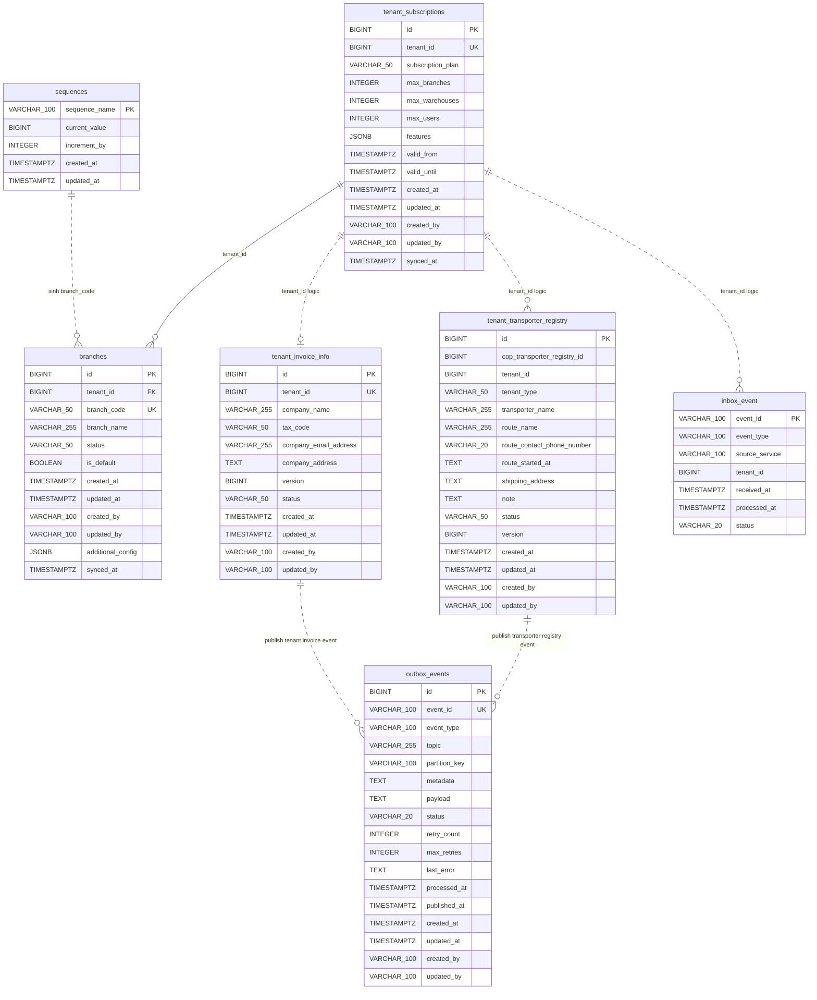

# Data Model — gf-system

> PostgreSQL qua Spring Data JPA và Flyway, schema mặc định `${DB_SCHEMA:dev_gf_system}`. Mô hình này phản ánh source hiện tại của `gf-system` (7 bảng): JPA entity, migration SQL, enum, repository, index và constraint.
>
> **§2bis (DESIGN — W07, EP-PARTNER-LINK)**: 2 bảng mới `partner_link_request` + `tenant_profile` (migration V7/V8) chưa có trong source — xem §2bis.

## 1. ERD Overview



## 2. Entities

### tenant_subscriptions

Projection subscription quota theo tenant, được đổi tên từ `tenant_subscriptions_cache` trong migration V4.

| Column | Type | Nullable | Description |
|---|---|---|---|
| id | BIGSERIAL | NO | Primary key hiện tại sau migration V4 |
| tenant_id | BIGINT | NO | Tenant ID từ control plane; unique index `idx_tenant_subscriptions_tenant_id` |
| subscription_plan | VARCHAR(50) | NO | Gói subscription, lưu dạng string |
| max_branches | INTEGER | NO | Số branch tối đa; default DB còn lại từ V1 là `1` |
| max_warehouses | INTEGER | NO | Số warehouse tối đa; default DB còn lại từ V1 là `1` |
| max_users | INTEGER | NO | Số user tối đa; migration V4 chỉ drop default, không drop `NOT NULL` |
| features | JSONB | YES | Cấu hình feature sau khi V4 gom các cột flag cũ vào JSON |
| valid_from | TIMESTAMP WITH TIME ZONE | NO | Thời điểm subscription bắt đầu hiệu lực |
| valid_until | TIMESTAMP WITH TIME ZONE | YES | Thời điểm hết hiệu lực; `NULL` nghĩa là không giới hạn |
| created_at | TIMESTAMP WITH TIME ZONE | NO | Audit timestamp tạo, từ `AuditableEntity` và migration V1 |
| updated_at | TIMESTAMP WITH TIME ZONE | NO | Audit timestamp cập nhật, từ `AuditableEntity` và migration V1 |
| created_by | VARCHAR(100) | YES | Audit actor tạo |
| updated_by | VARCHAR(100) | YES | Audit actor cập nhật |
| synced_at | TIMESTAMP WITH TIME ZONE | NO | Thời điểm đồng bộ gần nhất từ tenant provisioning event |

**Indexes**: `idx_tenant_subscriptions_tenant_id` unique trên `tenant_id`.

**Constraints**: PK trên `id`; unique vật lý qua index `idx_tenant_subscriptions_tenant_id`; các cột `tenant_code`, `feature_multi_branch`, `feature_inventory_management`, `feature_advanced_reports` đã bị drop trong V4.

### branches

Branch master/support data của `gf-system`, tạo mặc định khi nhận tenant provisioning hợp lệ.

| Column | Type | Nullable | Description |
|---|---|---|---|
| id | BIGSERIAL | NO | Primary key của branch |
| tenant_id | BIGINT | NO | Tenant sở hữu branch; FK tới `tenant_subscriptions(tenant_id)` |
| branch_code | VARCHAR(50) | NO | Mã branch, unique toàn cục |
| branch_name | VARCHAR(255) | NO | Tên branch; migration giữ `NOT NULL`, service lấy từ tenant name |
| status | VARCHAR(50) | NO | Trạng thái branch; default DB sau V4 là `ACTIVE`, JPA dùng `BranchStatusEnum` |
| is_default | BOOLEAN | NO | Cờ branch mặc định; default DB là `false` |
| created_at | TIMESTAMP WITH TIME ZONE | NO | Audit timestamp tạo, từ `AuditableEntity` và migration V1 |
| updated_at | TIMESTAMP WITH TIME ZONE | NO | Audit timestamp cập nhật, từ `AuditableEntity` và migration V1 |
| created_by | VARCHAR(100) | YES | Audit actor tạo |
| updated_by | VARCHAR(100) | YES | Audit actor cập nhật |
| additional_config | JSONB | YES | Cấu hình bổ sung dạng JSONB, thêm trong V4 |
| synced_at | TIMESTAMP WITH TIME ZONE | YES | Thời điểm đồng bộ gần nhất, thêm trong V4 |

**Indexes**: `idx_branches_tenant_id` trên `tenant_id`; `idx_branches_branch_code` trên `branch_code`; `idx_branches_status` trên `status`; JPA entity còn khai báo `idx_branches_branch_type` nhưng migration V4 đã drop cột/index `branch_type`.

**Constraints**: PK trên `id`; unique constraint từ V1 trên `branch_code`; FK `fk_branches_tenant_id` từ `tenant_id` tới `tenant_subscriptions(tenant_id)` với `ON DELETE CASCADE`. Unique partial index một default branch mỗi tenant đã bị drop trong V4 và chưa được tạo lại.

### tenant_invoice_info

Thông tin xuất hóa đơn theo tenant, được cập nhật qua protected API hoặc command Kafka.

| Column | Type | Nullable | Description |
|---|---|---|---|
| id | BIGSERIAL | NO | Primary key của thông tin hóa đơn |
| tenant_id | BIGINT | NO | Tenant ID; unique để mỗi tenant có tối đa một invoice profile |
| company_name | VARCHAR(255) | YES | Tên công ty dùng trên hóa đơn |
| tax_code | VARCHAR(50) | YES | Mã số thuế |
| company_email_address | VARCHAR(255) | YES | Email công ty |
| company_address | TEXT | YES | Địa chỉ công ty |
| version | BIGINT | YES | Optimistic locking field từ `@Version` |
| status | VARCHAR(50) | NO | Trạng thái record; default DB và aggregate là `ACTIVE` |
| created_at | TIMESTAMP WITH TIME ZONE | YES | Audit timestamp tạo; migration V5 không đặt `NOT NULL` |
| updated_at | TIMESTAMP WITH TIME ZONE | YES | Audit timestamp cập nhật; migration V5 không đặt `NOT NULL` |
| created_by | VARCHAR(100) | YES | Audit actor tạo |
| updated_by | VARCHAR(100) | YES | Audit actor cập nhật |

**Indexes**: `idx_tenant_invoice_info_tenant_id` unique trên `tenant_id`.

**Constraints**: PK trên `id`; unique constraint inline trên `tenant_id`; unique index `idx_tenant_invoice_info_tenant_id` trùng mục đích với unique constraint inline.

### tenant_transporter_registry

Dữ liệu đăng ký nhà vận chuyển theo tenant, source-of-truth trong `gf-system`. Được tạo trong migration V6.

| Column | Type | Nullable | Description |
|---|---|---|---|
| id | BIGSERIAL | NO | Primary key |
| cop_transporter_registry_id | BIGINT | YES | ID gốc từ ct-saas-tenant registry, dùng để trace và đối soát |
| tenant_id | BIGINT | NO | Tenant scope; index `idx_tenant_transporter_registry_tenant_id` |
| tenant_type | VARCHAR(50) | YES | Loại tenant, ví dụ `GARAGE` |
| transporter_name | VARCHAR(255) | NO | Tên nhà vận chuyển |
| route_name | VARCHAR(255) | NO | Tên tuyến vận chuyển |
| route_contact_phone_number | VARCHAR(20) | NO | Số điện thoại liên hệ tuyến, unique per tenant qua `uk_tenant_transporter_registry_phone` |
| route_started_at | TEXT | NO | Thời gian khởi hành tuyến, lưu dạng text comma-separated `hh:mm` |
| shipping_address | TEXT | NO | Địa chỉ giao hàng |
| note | TEXT | YES | Ghi chú tùy chọn |
| status | VARCHAR(50) | NO | Trạng thái record; default DB là `ACTIVE`, JPA dùng `TenantTransporterRegistryStatus` |
| version | BIGINT | NO | Monotonic record version cho event ordering; default DB/JPA là `1` |
| created_at | TIMESTAMP WITH TIME ZONE | NO | Audit timestamp tạo; default DB là `CURRENT_TIMESTAMP`, từ `AuditableEntity` |
| updated_at | TIMESTAMP WITH TIME ZONE | NO | Audit timestamp cập nhật; default DB là `CURRENT_TIMESTAMP`, từ `AuditableEntity` |
| created_by | VARCHAR(100) | YES | Audit actor tạo |
| updated_by | VARCHAR(100) | YES | Audit actor cập nhật |

**Indexes**: `idx_tenant_transporter_registry_tenant_id` trên `tenant_id`; `idx_tenant_transporter_registry_status` trên `status`; `idx_tenant_transporter_registry_created_at` trên `created_at`; `idx_tenant_transporter_registry_phone` trên `route_contact_phone_number`; `uk_tenant_transporter_registry_phone` unique trên `(tenant_id, route_contact_phone_number)`.

**Constraints**: PK trên `id`; unique composite index `uk_tenant_transporter_registry_phone` đảm bảo mỗi tenant chỉ có một route contact phone number duy nhất. Không có FK vật lý tới `tenant_subscriptions`.

### inbox_event

Inbox idempotency cho tenant invoice info và tenant transporter registry command.

| Column | Type | Nullable | Description |
|---|---|---|---|
| event_id | VARCHAR(100) | NO | Primary key và message id dùng để chống xử lý trùng |
| event_type | VARCHAR(100) | YES | Loại inbox event; xem enum `InboxEventType` |
| source_service | VARCHAR(100) | YES | Source service lấy từ message, fallback `UNKNOWN` trong listener |
| tenant_id | BIGINT | YES | Tenant liên quan tới command, lấy từ `OriginTenantId` |
| received_at | TIMESTAMP WITH TIME ZONE | YES | Thời điểm nhận command |
| processed_at | TIMESTAMP WITH TIME ZONE | YES | Thời điểm xử lý command |
| status | VARCHAR(20) | YES | Trạng thái inbox; default DB và aggregate là `RECEIVED` |

**Indexes**: `idx_ie_event_id` trên `event_id`; `idx_ie_processed_at` trên `processed_at`; `idx_ie_tenant_id` trên `tenant_id`.

**Constraints**: PK trên `event_id`. Không có FK tới `tenant_subscriptions` hoặc `tenant_invoice_info`.

### outbox_events

Transactional outbox table cho event publish qua Kafka.

| Column | Type | Nullable | Description |
|---|---|---|---|
| id | BIGSERIAL | NO | Primary key của outbox event |
| event_id | VARCHAR(100) | NO | ID event duy nhất do service sinh bằng UUID |
| event_type | VARCHAR(100) | NO | Loại message từ `Message.getType()` |
| topic | VARCHAR(255) | NO | Kafka topic đích |
| partition_key | VARCHAR(100) | NO | Kafka partition key, thường là tenant id dạng string |
| metadata | TEXT | YES | Header/metadata serialized JSON |
| payload | TEXT | NO | Payload serialized JSON |
| status | VARCHAR(20) | NO | Trạng thái xử lý, map enum `EventStatus` |
| retry_count | INTEGER | NO | Số lần retry hiện tại; default DB/JPA là `0` |
| max_retries | INTEGER | NO | Số lần retry tối đa; default DB/JPA là `3` |
| last_error | TEXT | YES | Lỗi cuối cùng khi publish thất bại |
| processed_at | TIMESTAMP WITH TIME ZONE | YES | Thời điểm chuyển sang processing |
| published_at | TIMESTAMP WITH TIME ZONE | YES | Thời điểm publish thành công |
| created_at | TIMESTAMP WITH TIME ZONE | NO | Audit timestamp tạo, từ `AuditableEntity` và migration V2 |
| updated_at | TIMESTAMP WITH TIME ZONE | NO | Audit timestamp cập nhật, từ `AuditableEntity` và migration V2 |
| created_by | VARCHAR(100) | YES | Audit actor tạo |
| updated_by | VARCHAR(100) | YES | Audit actor cập nhật |

**Indexes**: `idx_outbox_events_pending` partial trên `(status, created_at)` khi `status = 'PENDING'`; `idx_outbox_events_event_id` trên `event_id`; `idx_outbox_events_event_type` trên `event_type`.

**Constraints**: PK trên `id`; unique constraint inline trên `event_id`. Repository query pending dùng `FOR UPDATE SKIP LOCKED` để nhiều instance không xử lý trùng batch.

### sequences

Bảng SQL-only phục vụ function sinh số thứ tự.

| Column | Type | Nullable | Description |
|---|---|---|---|
| sequence_name | VARCHAR(100) | NO | Primary key của sequence; branch service hiện truyền `tenantCode` |
| current_value | BIGINT | NO | Giá trị hiện tại; default DB là `0` |
| increment_by | INTEGER | NO | Bước tăng; default DB là `1` |
| created_at | TIMESTAMP WITH TIME ZONE | NO | Thời điểm tạo sequence |
| updated_at | TIMESTAMP WITH TIME ZONE | NO | Thời điểm cập nhật sequence |

**Indexes**: PK index trên `sequence_name`.

**Constraints**: PK trên `sequence_name`. Function `${DB_SCHEMA}.get_next_number(sequenceName VARCHAR(100))` tăng `current_value` atomically, auto-initialize record nếu chưa có.

## 2bis. Partner Link (DESIGN — W07, EP-PARTNER-LINK / FEAT-SYS-DRIVERPLUS-LINK)

> **Status**: DESIGN — 2 bảng dưới đây **chưa có trong source**. Migration Flyway **additive** `V7` + `V8` (KHÔNG rewrite V1..V6 — Gotcha #9). Cite quyết định: [ADR-029](../decisions/ADR-029-driver-plus-kafka-adapter-on-gf-system.md) (giao thức) + [ADR-030](../decisions/ADR-030-tenant-profile-sot-on-gf-system.md) (SoT hồ sơ garage).
>
> Mọi cột đều trace về 1 dòng Product cụ thể (cột **Cite**). Tên cột `snake_case` tương ứng canonical camelCase tại [`gf-system-api.md` §5 Naming Registry](../api/gf-system-api.md).

### 2bis.1 ERD bổ sung

```
  tenant_subscriptions ||..o| tenant_profile          : "tenant_id logic (unique)"
  tenant_subscriptions ||..o{ partner_link_request    : "tenant_id logic"
  tenant_profile       ||..|| partner_link_request    : "đọc real-time lúc render/sync (KHÔNG snapshot — CB-SYS-006)"
  tenant_invoice_info  ||..|| partner_link_request    : "đọc real-time lúc render/sync (KHÔNG snapshot — CB-SYS-006)"
  partner_link_request ||..o{ outbox_events           : "publish PARTNER_LINK.* events"
  partner_link_request ||..o{ inbox_event             : "dedupe inbound D+ theo messageId"

  ┌────────────────────────────┐        ┌────────────────────────────┐
  │ tenant_profile             │        │ partner_link_request       │
  │ ───────────────            │        │ ──────────────────         │
  │ id            BIGSERIAL PK │        │ id            BIGSERIAL PK │
  │ tenant_id     BIGINT  UK   │        │ tenant_id     BIGINT       │
  │ business_name VARCHAR(255) │        │ request_code  VARCHAR(20)  │
  │ contact_phone VARCHAR(20)  │        │ partner_code  VARCHAR(30)  │
  │ address_detail TEXT        │        │ partner_account_name       │
  │ ward          VARCHAR(255) │        │ partner_account_phone      │
  │ city          VARCHAR(255) │        │ requested_at  TIMESTAMPTZ  │
  │ version       BIGINT       │        │ status        VARCHAR(20)  │
  │ audit x4                   │        │ processed_at  TIMESTAMPTZ  │
  └────────────────────────────┘        │ processed_by_label         │
                                        │ reason         TEXT        │
        (không FK vật lý — ADR-009)     │ version       BIGINT       │
                                        │ audit x4                   │
                                        └────────────────────────────┘
```

### 2bis.2 `partner_link_request` (V8)

Yêu cầu liên kết đối tác ngoài (`LKD-YYYY-NNN`). Record **chỉ được tạo từ inbound event Driver Plus** — garage không có endpoint tạo (BR-DPL-CMN-001). Terminal record giữ **vĩnh viễn** trong DB active, không xoá / không archive (BR-DPL-CMN-006).

| Column | Type | Nullable | Description | Cite |
|---|---|---|---|---|
| `id` | BIGSERIAL | NO | Primary key kỹ thuật | — |
| `tenant_id` | BIGINT | NO | Garage sở hữu yêu cầu; mọi query bắt buộc filter | `BR-DPL-LST-001` |
| `request_code` | VARCHAR(20) | NO | Mã yêu cầu `LKD-YYYY-NNN` do **Driver Plus tự sinh** và gửi sang; `gf-system` KHÔNG sinh mã này (khác `branch_code` dùng `sequences`) | `EP-PARTNER-LINK.md` §3 · `FEAT-SYS-DRIVERPLUS-LINK.md` AC-4 |
| `partner_code` | VARCHAR(30) | NO | Đối tác; giai đoạn 1 hard-code duy nhất `DRIVER_PLUS` (default DB) | `FEAT-SYS-DRIVERPLUS-LINK.md` §4 (`partner=DRIVER_PLUS`) · §7 Out of Scope |
| `partner_account_name` | VARCHAR(255) | NO | Tên tài khoản Driver Plus (read-only, từ payload D+) | `FEAT` AC-9 |
| `partner_account_phone` | VARCHAR(20) | NO | Số điện thoại tài khoản Driver Plus | `FEAT` AC-9 |
| `requested_at` | TIMESTAMPTZ | NO | Ngày gửi yêu cầu (do D+ gửi kèm); dùng cho sort mặc định DESC | `FEAT` AC-9 · `BR-DPL-LST-002` |
| `status` | VARCHAR(20) | NO | `PENDING` \| `LINKED` \| `REJECTED` \| `UNLINKED`; default `PENDING` khi tạo | `BR-GF-SYSTEM.md` §3.2 (diagram ghi rõ 4 mã) |
| `processed_at` | TIMESTAMPTZ | YES | Ngày xử lý — NULL khi `PENDING`; ghi khi Duyệt/Từ chối/Hủy/inbound-cancel | `FEAT` AC-10, AC-33, AC-35 |
| `processed_by_label` | VARCHAR(255) | YES | **Snapshot text** người thực hiện — `{Tên nhân viên} ({Tên hiển thị role})` (vd `Đăng Vinh (Chủ garage)`) hoặc hằng `Driver Plus` cho 2 case inbound. KHÔNG phải FK động vào bảng nhân viên | `BR-DPL-CMN-005` · `BR-DPL-CAN-004/005` · `FEAT` AC-30 |
| `reason` | TEXT | YES | Lý do — bắt buộc khi Từ chối/Hủy; system-generated khi cascade auto-reject; từ payload D+ khi inbound cancel | `BR-DPL-REJ-002` · `BR-DPL-CAN-002` · `BR-DPL-APV-004` · `BR-DPL-CAN-005` |
| `version` | BIGINT | NO | Optimistic lock (`@Version`) — phát hiện race 2 user cùng thao tác 1 record → `ERR-DPL-004` | `FEAT` AC-27 · `ERROR-CODE-REGISTRY` §5 |
| `created_at` / `updated_at` | TIMESTAMPTZ | NO | Audit từ `AuditableEntity` | — |
| `created_by` / `updated_by` | VARCHAR(100) | YES | Audit actor | — |

**Indexes** (mọi index đều tenant-prefix — bảng tenant-scoped):

| Index | Cột | Mục đích | Cite |
|---|---|---|---|
| `uk_plr_tenant_request_code` | UNIQUE `(tenant_id, request_code)` | Dedupe khi D+ retry push cùng 1 mã LKD → không tạo record trùng | `FEAT` EC-4 |
| `uk_plr_tenant_active_link` | UNIQUE `(tenant_id) WHERE status = 'LINKED'` (partial) | **Enforce invariant single-active-link ở tầng DB** — atomic dưới concurrent write; request commit sau nhận constraint violation → cascade auto-reject | `BR-DPL-CMN-002` · `FEAT` AC-31 (Product đề xuất đúng cơ chế này) |
| `idx_plr_tenant_status_requested` | `(tenant_id, status, requested_at DESC)` | Cover list + filter đa trạng thái + sort mặc định | `BR-DPL-LST-002` · `BR-DPL-LST-003` |
| `idx_plr_tenant_partner_account` | `(tenant_id, partner_code, partner_account_phone)` | Tra cứu lịch sử re-request theo tài khoản D+ | `FEAT` AC-25 |

**Constraints**: PK `id`. **Không có FK vật lý** tới `tenant_subscriptions` (ADR-009 — chỉ scalar key). Không có hard-delete: terminal record giữ vĩnh viễn (`BR-DPL-CMN-006`).

**Ghi chú invariant**: `uk_plr_tenant_active_link` là **cơ chế chính thức** trả lời `FEAT` AC-31 + EC-3 (`NEED CONFIRMATION Architecture`). Duyệt + cascade auto-reject chạy trong **cùng 1 transaction**: `UPDATE … SET status='LINKED'` cho record đích, rồi `UPDATE … SET status='REJECTED' WHERE tenant_id=? AND status='PENDING' AND id<>?` cho phần còn lại (all-or-nothing, khớp đề xuất `BR-DPL-APV-004`). Record đã terminal trước đó không bị ghi đè vì mệnh đề `status='PENDING'` (thoả AC-28).

### 2bis.3 `tenant_profile` (V7)

Hồ sơ doanh nghiệp + địa chỉ vận hành theo tenant. `gf-system` là **SoT** (ADR-030). Đọc **real-time** khi render form chi tiết và khi bấm "Đồng bộ lại" — KHÔNG snapshot vào `partner_link_request`, KHÔNG cache trung gian (CB-SYS-006, BR-DPL-SYN-002).

| Column | Type | Nullable | Description | Cite |
|---|---|---|---|---|
| `id` | BIGSERIAL | NO | Primary key | — |
| `tenant_id` | BIGINT | NO | Tenant; **unique** — mỗi tenant tối đa 1 hồ sơ (parity `tenant_invoice_info`) | `FEAT` AC-11 |
| `business_name` | VARCHAR(255) | YES | **Tên doanh nghiệp** (block THÔNG TIN DOANH NGHIỆP) — khác `tenant_invoice_info.company_name` (**Tên công ty** trên hoá đơn), AC-11 + AC-12 tách 2 block riêng | `FEAT` AC-11, AC-12 |
| `contact_phone_number` | VARCHAR(20) | YES | **SĐT liên hệ** của garage | `FEAT` AC-11 |
| `address_detail` | TEXT | YES | **Địa chỉ chi tiết** (block ĐỊA CHỈ) — khác `tenant_invoice_info.company_address` (địa chỉ pháp lý trên HĐ, 1 chuỗi đơn) | `FEAT` AC-11 (ghi rõ 2 địa chỉ độc lập) |
| `ward` | VARCHAR(255) | YES | **Xã/Phường** | `FEAT` AC-11 |
| `city` | VARCHAR(255) | YES | **Tỉnh/Thành phố** — dùng canonical `city` theo vocabulary sẵn có của boundary (`TenantProvisioned.city`, `BranchLifecycleChanged.city`), KHÔNG đặt tên `province` | `FEAT` AC-11 · [`gf-system-events.md`](../events/gf-system-events.md) §3.1/§3.2 |
| `version` | BIGINT | NO | Optimistic lock, default `1` | — |
| `created_at` / `updated_at` | TIMESTAMPTZ | NO | Audit | — |
| `created_by` / `updated_by` | VARCHAR(100) | YES | Audit actor | — |

**Indexes**: `uk_tenant_profile_tenant_id` UNIQUE `(tenant_id)`.

**Constraints**: PK `id`; unique `tenant_id`. Không FK vật lý (ADR-009).

**Nguồn dữ liệu (seed)**: consumer `TenantProvisionedEvent` sẵn có (`MessageGroup=TENANT-PROVISIONING`, `MessageStep=TENANT_PROVISIONED.1`, `tenantType=GARAGE`) mở rộng để upsert `tenant_profile` từ payload **đã có sẵn** (`gf-system-events.md` §3.1): `tenantName`→`business_name`, `phone`→`contact_phone_number`, `address`→`address_detail`, `ward`→`ward`, `city`→`city`. Idempotent theo `tenant_id`.

> **Gap đã biết (ADR-030 Consequences)**: W07 KHÔNG có UI/endpoint cho garage tự sửa hồ sơ (thuộc `EP-FOUND`); tenant provisioning trước W07 chưa có row → mọi read phải **null-safe**, trả `null` và render rỗng, **KHÔNG chặn** Duyệt/Đồng bộ.

### 2bis.4 Enum / persistence state bổ sung (W07)

| Enum/constant | Giá trị thêm | Cite |
|---|---|---|
| `PartnerLinkStatus` *(mới)* | `PENDING`, `LINKED`, `REJECTED`, `UNLINKED` | `BR-GF-SYSTEM.md` §3.2 |
| `PartnerCode` *(mới)* | `DRIVER_PLUS` | `FEAT` §4 |
| `InboxEventType` | `+ PARTNER_LINK_REQUEST_CREATE_RECEIVED`, `+ PARTNER_LINK_REQUEST_WITHDRAW_RECEIVED`, `+ PARTNER_LINK_UNLINK_RECEIVED` | ADR-029 |
| `MessageGroup` | `+ PARTNER_LINK` | ADR-029 |
| `MessageStep` | `+ PARTNER_LINK.REQUEST.CREATE`, `+ PARTNER_LINK.REQUEST.WITHDRAW`, `+ PARTNER_LINK.UNLINK`, `+ PARTNER_LINK.REQUEST.RESPONSE`, `+ PARTNER_LINK.PROFILE.SYNC`, `+ PARTNER_LINK.STATUS.CHANGED` | ADR-029 · [`gf-system-events.md`](../events/gf-system-events.md) §3.12 |

## 3. Data Isolation

`gf-system` dùng pooled schema theo service-owned schema, không có schema riêng cho từng tenant. Cô lập tenant được thực hiện bằng khóa tenant trên từng bảng có dữ liệu tenant-scoped:

- `tenant_subscriptions.tenant_id` là unique business key cho projection subscription quota.
- `branches.tenant_id` là FK tới `tenant_subscriptions(tenant_id)`, nhưng unique partial index một default branch mỗi tenant đã bị drop trong V4; hiện idempotency chính nằm ở `JpaBranchRepository.existsByTenantIdAndIsDefaultTrue`.
- `tenant_invoice_info.tenant_id` là unique key để mỗi tenant chỉ có một invoice profile.
- `tenant_transporter_registry.tenant_id` là NOT NULL, index `idx_tenant_transporter_registry_tenant_id`; unique composite `uk_tenant_transporter_registry_phone` trên `(tenant_id, route_contact_phone_number)` đảm bảo không trùng phone number trong cùng tenant.
- `inbox_event.tenant_id` là metadata tenant cho command đã nhận; idempotency thực tế dựa trên PK `event_id`.
- `outbox_events` không có `tenant_id` vật lý; tenant nằm trong `partition_key`, `metadata` hoặc `payload` tùy event.
- `sequences` không có `tenant_id`; branch code dùng `sequence_name = tenantCode`, nên naming convention phải tránh collision.
- **(W07, DESIGN)** `partner_link_request.tenant_id` NOT NULL, mọi index tenant-prefix; invariant single-active-link được enforce **per-tenant** qua partial unique `uk_plr_tenant_active_link (tenant_id) WHERE status='LINKED'` — không thể rò rỉ chéo tenant.
- **(W07, DESIGN)** `tenant_profile.tenant_id` unique — mỗi tenant tối đa 1 hồ sơ, cùng pattern `tenant_invoice_info`.

## 4. Migration

Migration được quản lý bằng Flyway với `spring.jpa.hibernate.ddl-auto=none`, `validate-on-migrate=true`, `baseline-on-migrate=true` và placeholder `${DB_SCHEMA}`. Các migration hiện có:

| Migration | Nội dung |
|---|---|
| V1__initialize.sql | Tạo schema, `tenant_subscriptions_cache`, `branches`, FK/index/comment ban đầu |
| V2__create_outbox_events_table.sql | Tạo `outbox_events`, index pending/event id/event type |
| V3__create_sequence_table.sql | Tạo `sequences` và function `${DB_SCHEMA}.get_next_number` |
| V4__update_schema_for_tenant_subscriptions_and_branches.sql | Đổi `tenant_subscriptions_cache` thành `tenant_subscriptions`, thêm `id`, `features`, cập nhật `branches`, drop các cột contact/branch type cũ |
| V5__create_tenant_invoice_info.sql | Tạo `tenant_invoice_info`, `inbox_event` và các index liên quan |
| V6__create_tenant_transporter_registry_table.sql | Tạo `tenant_transporter_registry`, unique index `uk_tenant_transporter_registry_phone` trên `(tenant_id, route_contact_phone_number)`, các index trên `tenant_id`, `status`, `route_contact_phone_number`, `created_at` |
| **V7__create_tenant_profile.sql** *(DESIGN — W07)* | Tạo `tenant_profile` (§2bis.3) + `uk_tenant_profile_tenant_id` UNIQUE `(tenant_id)`. Additive — KHÔNG đụng V1..V6 |
| **V8__create_partner_link_request.sql** *(DESIGN — W07)* | Tạo `partner_link_request` (§2bis.2) + 4 index: `uk_plr_tenant_request_code` UNIQUE `(tenant_id, request_code)`, `uk_plr_tenant_active_link` UNIQUE `(tenant_id) WHERE status='LINKED'`, `idx_plr_tenant_status_requested (tenant_id, status, requested_at DESC)`, `idx_plr_tenant_partner_account (tenant_id, partner_code, partner_account_phone)`. Additive |

Repository hiện tại gồm `JpaTenantSubscriptionsRepository.findByTenantId`, `JpaBranchRepository.existsByTenantIdAndIsDefaultTrue`, `JpaTenantInvoiceInfoRepository.findByTenantId`, `JpaTenantTransporterRegistryRepository.findByTenantIdAndId/findByTenantIdAndCopTransporterRegistryId/findByTenantIdAndRouteContactPhoneNumber/existsByTenantIdAndRouteContactPhoneNumber/existsByTenantIdAndRouteContactPhoneNumberAndIdNot`, `JpaInboxEventRepository.existsByEventId` và `JpaOutboxEventRepository.findPendingEventsForProcessing/findByEventId/deleteOldPublishedAndFailedEvents`.

Enum/persistence state hiện tại gồm:

| Enum/constant | Giá trị |
|---|---|
| EventStatus | `PENDING`, `PROCESSING`, `PUBLISHED`, `FAILED` |
| BranchStatusEnum | `DRAFT`, `PENDING_APPROVAL`, `ACTIVE`, `SUSPENDED`, `INACTIVE`, `CANCELLED` |
| TenantTransporterRegistryStatus | `ACTIVE`, `INACTIVE` |
| InboxEventType | `TENANT_INVOICE_INFO_UPSERT_REQUESTED`, `TENANT_TRANSPORTER_REGISTRY_UPSERT_REQUESTED`, `TENANT_TRANSPORTER_REGISTRY_DELETE_REQUESTED` |
| MessageGroup | `TENANT-ACTIVATION`, `USER`, `TENANT-PROVISIONING`, `BRANCH-LIFECYCLE`, `TENANT-TRANSPORTER-REGISTRY`, `TENANT_INVOICE_PROFILE_COMMANDS`, `TENANT_INVOICE_PROFILE_EVENTS` |
| MessageStep | `BRANCH_CREATED.1`, `TENANT_PROVISIONED.1`, `TENANT_TRANSPORTER_REGISTRY_UPSERT_REQUESTED`, `TENANT_TRANSPORTER_REGISTRY_DELETE_REQUESTED`, `TENANT_TRANSPORTER_REGISTRY_UPSERTED`, `TENANT_TRANSPORTER_REGISTRY_DELETED`, `TENANT_INVOICE_INFO_UPSERT_REQUESTED`, `TENANT_INVOICE_INFO_UPDATED` |
| FeatureFlags.INVENTORY_INVENTORY_STOCK | `Inventory:InventoryStockV01` |

Rủi ro source/schema đã ghi nhận:

- `BranchEntity` còn khai báo index `idx_branches_branch_type` trên `branch_type`, nhưng migration V4 đã drop cột và index này.
- `branches.branch_name` là `NOT NULL` trong migration, nhưng JPA annotation không khai báo `nullable = false`.
- `tenant_subscriptions.max_users` còn `NOT NULL` trong schema do V4 chỉ drop default, nhưng JPA annotation cho phép nullable.
- `tenant_invoice_info.created_at` và `updated_at` nullable trong V5 dù entity kế thừa audit.
- `tenant_invoice_info.tenant_id` có cả unique constraint inline và unique index riêng, trùng mục đích.

## 5. References

- [gf-system-HLD.md](../hld/gf-system-HLD.md)
- [tenant-system-events.md](../events/tenant-system-events.md)
- [system-tenant-branch-provisioning-flow.md](../workflows/system-tenant-branch-provisioning-flow.md)
- [ADR-006-flyway-per-service-data-ownership.md](../decisions/ADR-006-flyway-per-service-data-ownership.md)
- [ADR-009-jpa-entity-no-relationship-mapping.md](../decisions/ADR-009-jpa-entity-no-relationship-mapping.md)

## Change Log

| Date | Version | Summary |
|---|---|---|
| 2026-08-07 | v3.1 | **ARCH-REVIEW-W07 P2 fix** — §2bis.4 `MessageStep` enum row cite `gf-system-events.md §3.11` → **§3.12**, theo renumber gf-system-events.md v5. |
| 2026-08-05 | v3 | **W07 EP-PARTNER-LINK (DESIGN)** — thêm §2bis với 2 bảng mới: `partner_link_request` (V8, §2bis.2 — 13 cột + 4 index tenant-prefix, trong đó `uk_plr_tenant_active_link` partial UNIQUE `(tenant_id) WHERE status='LINKED'` là **cơ chế chính thức** trả lời `FEAT-SYS-DRIVERPLUS-LINK` AC-31 + EC-3 NEED CONFIRMATION Architecture về atomic invariant `BR-DPL-CMN-002`) và `tenant_profile` (V7, §2bis.3 — SoT hồ sơ garage per ADR-030, seed từ `TenantProvisionedEvent` payload sẵn có). §2bis.1 ERD bổ sung (ASCII). §2bis.4 enum bổ sung: `PartnerLinkStatus`/`PartnerCode` mới + `InboxEventType` +3 + `MessageGroup` +`PARTNER_LINK` + `MessageStep` +6. §3 Data Isolation +2 bullet. §4 migration table +V7/+V8 (additive, không rewrite V1..V6 — Gotcha #9). Frontmatter `depends_on` +ADR-029/+ADR-030. Mọi cột có cột **Cite** trace về dòng Product cụ thể. **KHÔNG đụng**: 7 bảng baseline §2, ERD §1, các mục còn lại của §3/§4. v2 → v3. |
| 2026-05-19 | v2 | Thêm bảng `tenant_transporter_registry` (V6 migration) với đầy đủ columns, indexes, constraints. Cập nhật enum `InboxEventType` (+`TENANT_TRANSPORTER_REGISTRY_UPSERT_REQUESTED`, `TENANT_TRANSPORTER_REGISTRY_DELETE_REQUESTED`), `MessageStep` (+4 giá trị transporter registry), `MessageGroup` (+`TENANT-TRANSPORTER-REGISTRY`), thêm enum `TenantTransporterRegistryStatus`. Cập nhật ERD, data isolation, repository list. |
| 2026-05-07 | v1 | Initial data model cho `gf-system`: PostgreSQL schema `${DB_SCHEMA:dev_gf_system}` với 6 bảng `tenant_subscriptions`, `branches`, `tenant_invoice_info`, `inbox_event`, `outbox_events`, `sequences`, các enum `EventStatus`, `BranchStatusEnum`, `InboxEventType`, `MessageGroup`, `MessageStep`. Pooled multi-tenant qua `tenant_id` ở các bảng tenant-scoped; outbox không có tenant column và sequences là global. Migration bằng Flyway (V1-V5) với JPA `ddl-auto=none`, `validate-on-migrate`. Bao gồm ERD overview, entities, data isolation, migration, references.
